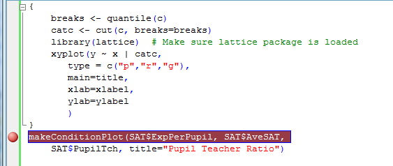

---

# required metadata
title: "R Productivity Environment Getting Started Guide"
description: "Microsoft R Services IDE features and components overview."
keywords: ""
author: "richcalaway"
manager: "mblythe"
ms.date: "03/17/2016"
ms.topic: "get-started-article"
ms.prod: "microsoft-r"
ms.service: ""
ms.assetid: ""

# optional metadata
ROBOTS: ""
audience: ""
ms.devlang: ""
ms.reviewer: ""
ms.suite: ""
ms.tgt_pltfrm: ""
ms.technology: "r-server"
ms.custom: ""

---

# R Productivity Environment Getting Started Guide

>[!IMPORTANT]
> The R Productivity Environment (RPE) is available only for version 8.0.0 of Revolution R Enterprise 2016. It does not apply to Microsoft R Server 8.0.5 or Microsoft R Client.

## Overview

This guide is intended as your introduction to Revolution R Enterprise and its R Productivity Environment. For new users, this interface includes a number of aids to usability including IntelliSense for automatic word completion, code snippets to simplify programming, and an Object Browser with editing and plotting capabilities. For experienced R programmers, this interface includes a full-featured integrated development environment with a built-in visual debugger. This Getting Started Guide walks you through the most useful features of the new interface.

## Getting Help

To get help on the user interface, choose **Revolution R User Interface Help** from the **Help** menu. If you click in any window or dialog box and press F1, you will see help on that interface element.

To obtain help on the R language, do one of the following:

- From the **Help** menu, select **R Help**. You should see an HTML file with a variety of R help options.
- To search through all R package help, select **Search R Help...** from the **Help** menu. This brings up the **Search R Help** dialog box. Type a search term into the **Search for** text box and click **Search R Help**. A list of possible matches is returned. Double-click the desired topic to open the topic in Document Explorer.

## A Tutorial Introduction to Revolution R Enterprise

In this section, you will be introduced to the most important features of the Revolution R Enterprise user interface by performing the following tasks:

1.  Create an R project and its surrounding solution.
2.  Add a data set to your project.
3.  Edit a script within your project.
4.  Use code snippets to add code to your script.
5.  Run the script.
6.  Use the Object Browser to explore your R objects.
7.  Create a conditioning plot using code snippets.
8.  Create a function to create similar conditioning plots from arbitrary numeric input.

### Create a Simple Solution: *SATscores*

In Revolution R Enterprise, solutions are a way of organizing your work. When you first start Revolution R Enterprise, a default solution is created for you, so you are always working inside a solution. When you open or create a new solution, you are essentially starting a new R session. Existing R objects are cleared from memory, and the R working directory is reset to your solution directory. Solutions contain one or more projects. When you open or close a solution you are prompted to save the objects in your R workspace for future use.

In this example, you will do a quick analysis of the relationship between average SAT scores across states and the level of per student expenditure on education.

To create a project

1.  On the **File** menu, point to **New**, and then click **Project**. The New Project dialog appears, with an R Project as the default.
2.  Near the bottom of the form, in the **Name** text box, enter **SATscores**. The **Solution Name** is automatically changed to match the project name.
3.  Click **OK**.

You may be prompted about changing your R Solution. Press **OK** to accept the default settings.

The **SATscores** solution, which contains the **SATscores** project, appears in the Solution Explorer. By default, the project contains one R script. Right click on **Script.R** in the Solution Explorer, and rename it **SATscores.R**.

A solution can contain more than one project, and projects can contain one or more scripts.

### Add a Data Set to Your Solution

In addition to projects, a solution can also contain other documents you would like associated with your solution. In this example, you will add a comma separated text file containing a data set: sat.csv. To add this file to your solution:

1.  In Windows Explorer, navigate to the **IDE64\\doc\\examples\\SATanalysis** subfolder of your installation directory, typically **C:\\Program Files\\Microsoft\\RRE\\x.x**, where **x.x** is the version number.
2.  Copy the file sat.csv from this folder to your new **SATscores** solution directory, which is typically in a **Revolution** subdirectory of your documents directory (**Documents** in Windows Vista and Windows 7).
3.  In the Solution Explorer, right-click on the top node that says **Solution ‘SATscores’ (1 project)** and choose to **Add** an **Existing Item**. Navigate to your SATscores solution directory, select the new sat.csv file, and click **Add**. The file appears in the Solution Explorer under a new folder named Solution Items.

If the file does not appear in a text editor, double-click on its name in the Solution Explorer so that you can see the contents. Notice that the first line is a series of variable names, starting with State, and that the first column contains state names. Close the .csv file.

### Use the Script Editor

#### Edit a script

In the Solution Explorer, double-click on **SATscores.R** to open the R script file in the editor.

The easiest way to edit a script is to simply type. At the top of **SATscores.R** add a comment:

	# Analyzing SAT data

Notice that the text is green, indicating that the text is a comment.

Also notice the yellow highlight in the left margin of the script, indicating that that line of the script has been changed. When the change is saved, the highlight changes to green.

#### Use a code snippet to import the data into R

Code snippets are “fill-in-the-blanks” pieces of R code that can be used to guide and speed up writing scripts.

To get started with Code Snippets, right-click in your script, and then click Insert Snippet.... A dropdown menu of available snippets appears. The snippets may be organized into folders; double-click a folder to view the snippets within.

As an example, let's use snippets to create an R data frame.

1.  Right-click on the first empty line of your script, click **Insert Snippet...**, and then double-click on the folder **data sets**.
2.  Click **import data**. A tooltip appears describing what the snippet does.
3.  Double-click **import data**. A snippet for the read.table() R function is inserted, with placeholders for you to insert information. You can move the mouse over the placeholders to view ToolTip descriptions of the fields.
    
4.  The first field is the name of the data frame to create. Type SAT to replace the default myDataFrame.
5.  Move to the next placeholder name by pressing TAB. (You can use Shift+TAB to move to the previous placeholder.) The placeholder for the file to import is now highlighted in blue.
6.  Replace the default file name myfile with sat.csv. Since you have copied the file into your current solution directory, you do not need to specify any path information.
7.  TAB to the next field. The tooltip tells us to set header to TRUE if the first row contains the names of the variables, so change the value from FALSE to TRUE.
8.  TAB twice, leaving the separating character set to “,”. We noticed that the first variable, State, contained the names of the states. So, set the row.names value to State.
9.  Press ENTER to accept your changes and exit the code snippet

#### Run the script

To run the script, click the **Run** button  on the standard toolbar. The commands and output are printed in the Console window. If you have the Output window open, you can also see your results there.

Note that when a script is run, it is first automatically saved to disk. The yellow line in the left margin of your edited code turns green when the script has been saved.

### See Your Objects in the Object Browser

Objects you create in an R session (whether by running a script or at the console prompt) are stored during the session in R’s *global environment*.

If the Object Browser is not open, you can open it by pressing CTRL+ALT+J or clicking on **Object Browser** in the **View** menu.

In the left pane, click on **.GlobalEnv**. In the upper right pane you should see the new object, **SAT**. Click on it, and in the lower right pane you will see information about the object. It is a data frame, and has 50 observations of 4 variables.

If you click on the + next to SAT in the upper right pane, it expands to show you all of the variables in the data frame in the format *data frame name $ variable name.*

To start, we will be using two variables from the data frame:

**AveSAT** – the average total SAT score for students taking the test from that state

**ExpPerPupil** – the state’s expenditure per pupil on education

### Create a Plot

We will use another code snippet to create a plot showing the relationship between expenditure on education and the average SAT score. We will use the **lattice** library of graphics functions that is included with R.

1.  In your script, below your call to read.table, right-click and then click **Insert Snippet...**. Select **graphics – lattice**, then **XY plot**.
2.  For your y variable, type AveSAT.
3.  TAB, and for your x variable type ExpPerPupil.
4.  TAB twice, since we will not specify a grouping variable. Looking at the tooltip for type, we see that we can plot both the points and a regression line if we specify ″r″, ″p″—so type this into the field.
5.  TAB, then type SAT for the data frame name.
6.  Press Enter to exit the snippet.

### Run Selected Text

When developing a script, it is often useful to run just a selected portion. You can select text from the Script Window by using the mouse or by holding the Shift key down and using arrow keys.

In the script window, select the new lines at the end of your script beginning with library(lattice):

To run the selected text, do one of the following:

- Right-click and click **Run Line or Selection**
- Press the **Run Line or Selection** button  on the main toolbar
- On the **Edit** menu, click **Run Line or Selection**.
- Press **Alt-E-E** to access the menu shortcut keys.

You should see a graphics window displaying your plot. The regression line suggests that as expenditure per pupil increases, SAT scores drop.

Close the graphics window.

### Use Summary Statistics 

Another variable in the data set, PctSAT, contains the percentage of eligible students in the state who take the SATs.

First, let’s compute summary statistics for the data to see the characteristics of the variables. Right-click the object **SAT** in the Object Browser, and then click **Summary**. The following summary of the data appears:

	     AveSAT      ExpPerPupil        PctSAT          PupilTch    
	 Min.   :1388   Min.   : 6629   Min.   :  3.00   Min.   :10.80  
	 1st Qu.:1490   1st Qu.: 9359   1st Qu.:  8.00   1st Qu.:13.47  
	 median :1561   median : 9881   median : 30.00   median :14.90  
	 Mean   :1599   Mean   :10544   Mean   : 38.56   Mean   :15.25  
	 3rd Qu.:1700   3rd Qu.:11539   3rd Qu.: 67.75   3rd Qu.:16.55  
	 Max.   :1807   Max.   :16587   Max.   :100.00   Max.   :22.10  

### Create a Categorical Variable

Next, insert a snippet into your script to create a categorical variable. Choose **data sets**, then **categorical variable from numeric.** The output and input data frames can both be set to SAT, since we will be adding a variable to this data frame.

Replace myNewCol with catPctSAT, and numericVar with PctSAT. We will use the quartiles shown in the summary statistics to determine the breakpoints for the categories. Your new expression should look like:

	SAT <- transform(SAT, catPctSAT = cut(PctSAT, breaks =
 		c(3, 8, 30, 67.8, 100)))

Select the text and run the expression. The new variable is added to the SAT data frame.

### Create a Conditioning Plot

We can now create a new set of plots examining the relationship between average SATs and expenditures, this time conditioned on the category of the percentage of elgible students who take the SATs. To so do, insert the **graphics – lattice**, **XY plot with conditioning** code snippet, and set the following values:

	library(lattice) \# Make sure lattice package is loaded
	xyplot(AveSAT ~ ExpPerPupil | catPctSAT,
		groups= ,
		type = c("p","r","g"),
		data=SAT,
		main="Conditioned on Percent of Students Taking SAT",
		sub=" ",
		xlab="Expenditures Per Pupil",
		ylab="Average SAT Score",
		auto.key=FALSE,
		#layout=c(1, 1),
		#xlim=c(min(x), max(x)),
		#ylim=c(min(y), max(y)),
		)

Run the new command to view your plot. You will see that within each category, as Expenditures Per Pupil increase, so do the Average SAT scores. Close the graphics window.

### Create Another Script and Write a Function

It would be useful to be able to easily create conditioned plots like this using other variables. To do so, let’s write a function in a new script.

In the Solution Explorer, right click on the **SATscores** Project (not Solution), and choose **Add**, then **New Item**. Name your new script **myfunctions.R** .

Select, copy and paste the code from your original script beginning with SAT &lt;- transform into your new script.

Now, in your new script, select all of the code and from the right-click context menu choose **Surround with**, then **function**. This will surround your code with a function definition. Let’s name the function makeConditionPlot. It will take six arguments: three numeric columns of data and three strings to use for labels in the plot:

	makeConditionPlot <- function(x, y, c, title="", xlabel="", ylabel="")

Inside the function, use the quantile function on the first line to calculate the quartile breakpoints.

	breaks <- quantile(c)

Now we replace the original SAT &lt;- transform… line in our function with the following, which creates a new categorical variable (not contained in a data frame):

	catc <- cut(c, breaks = breaks)

We will keep the line that makes sure the lattice library is loaded, and then simplify our call to xyplot, so that our final function looks as follows:

	makeConditionPlot <- function(x, y, c, title="", xlabel="", ylabel="")
	{
		breaks <- quantile(c)
		catc <- cut(c, breaks=breaks)
		library(lattice) # Make sure lattice package is loaded
		xyplot(y ~ x | catc,
			type = c("p","r","g"),
			main=title,
			xlab=xlabel,
			ylab=ylabel
			)
	}

Run the script. You will see your function appear in the Object Browser as a new object.

To call this function from your script, add the following line:

	makeConditionPlot(SAT$ExpPerPupil, SAT$AveSAT,
		SAT$PupilTch, title="Pupil Teacher Ratio")

### Open and Run an Existing Script

If you have been using R for any time at all, you probably have existing R scripts that you will want to run in the R Productivity Environment. This is easy to do.

To run an existing script:

1.  On the **File** menu, point to **Open** and then click **File...**.
2.  In the **Open File** dialog, navigate to the file containing the script you want to run, and click **Open**.
3.  A dialog appears asking if you want to add the file to the current project. Click **Yes** to add the file to the project, click **No** to open the file without adding it to the current project. If you click **Yes**, the script will be copied into the current project directory before being opened in the Script window; any changes you make will be made to that copy.
4.  The script opens in the Script window. Click  to run the script.

## Using the Debugger

The makeConditionPlot introduced in the previous section should work correctly, but as an example of using the visual debugger, we will set a breakpoint and step through the function.

### Switch to Debug Configuration

Because breakpoints are a debugging feature, you need to switch from Release to Debug mode before your breakpoints are observed. To do this, choose **Debug** from the **Solution Configurations** dropdown menu in the standard toolbar.

The Revolution R Enterprise debugger is a visual debugger, similar to the visual debugger provided by Microsoft Visual Studio for languages such as C\#, C++, and Visual Basic.

>**Warning:** When using the visual debugger, use the commands documented here rather than the commands associated with the R debugging functions browser and debug. Using those R commands may put the visual debugger in an unstable state.

### Set a Breakpoint

Set a breakpoint on the line of your script that calls makeConditionPlot by doing one of the following:

- Put the cursor in the grey strip on the left of the script window, and click on the line on which you want a breakpoint.
- Put your cursor on the line, and press F9 to set the breakpoint
- Right-click on the line, point to **Breakpoint**, and then click **Insert Breakpoint.**

The breakpoint appears as a circle in the grey strip, and the associated line is highlighted, as shown below:

Now click  to begin running the script. A yellow arrow appears on the breakpoint in your script window, and the script stops running before the function is run.

### Step In the Debugger

When stopped at a breakpoint, you may choose to step through your code.  Three stepping commands are available for this and can be accessed from the **Debug** menu, the **Debug** toolbar, or using accelerator key combinations.

- **Step Into**  **(F11):** Stops at the next breakable point.  If your point of execution (the yellow arrow) is on a call to a function defined in the current folder, then Step Into will stop in front of the first executable line inside that function.  Note that if you are not stopped before a function defined within the current project, 'Step Into' will function identically to 'Step Over'
- **Step Over**  **(F10)** Stops at the next breakable point within the currently executing function (or top-level script).  If you are at the last statement of a currently executing function, then 'Step Over' works just like 'Step Out'.
- **Step Out ** **(Shift-F11)** Stops at the next breakable point after the currently executing function has completed. 

You should still hit any breakpoints encountered while stepping, and at any point, you should be able to choose Continue (F5) to end stepping and continue execution normally.

>[!TIP]
>Although ‘Step Into’ fully supports only functions defined in your current project, you can easily add the function definition of any R function in your search path to your script by opening the function from the R Console window with the fix() function, then copying and pasting the function definition into your script.

&nbsp;

>[!WARNING]
>The Step functions described here should be used only after you have reached a breakpoint. They may be visible at the top-level, but should not be used to start script execution.

### Examine Local Values 

Step into makeConditionPlot by choosing **Step Into** from the Debug menu, pressing **F11**, or clicking the **Step Into** button  on the debug toolbar. Then execute the first and second lines of the function by clicking the **Step Over** button  twice.

When inside the function, you can see the values of variables by hovering over them in your script. For example, if you hover over breaks, you see a balloon pop up with the current value of the variable, as shown:

You can also see local variables in the Object Browser by clicking **_Browser_Call**.

You can continue to step using the F10 key to see additional objects created in your function. Press F5 to run your script to completion.

Remove the breakpoint by clicking on the breakpoint red circle.

>[!NOTE]
>When you are finished working with breakpoints, return to "normal" release mode by choosing **Release** from the **Solution Configuration** dropdown menu in the standard toolbar.

## Enhanced Script Editing Capabilities

Revolution R Enterprise offers a full-featured script editor with many enhanced script editing capabilities.

### Automatic Syntax Checking

As you're typing in the script window, you can have syntax errors automatically checked and reported in the Error List window. To open the Error List window, select **Error List** from the **View** menu. It can be tabbed with the R Console window by dragging it on top.

At the bottom of your script, type:

	plot(x~y]

The argument list and closing bracket are underscored with a red squiggly line.

You can obtain additional information about the error by viewing the Error List. The Error List tells you that the closing parenthesis is missing and that the closing bracket was unexpected, as well as the line number where the error occurs. You can double click on the error message to be taken to that location of your script.

Edit your text to:

	plot(x~y)

The errors are removed from the list. Close the Error List.

### Use IntelliSense to Type Object Names

IntelliSense is Microsoft’s implementation of auto-completion. If you can't remember the exact name of an object, or you have created long object names in order to make your code more readable, IntelliSense can speed up your programming. For example, type into your script:

	SAT$

A list pops up containing the column names in the data frame. Double-click ExpPerPupil to complete the column name specification:

	SAT$ExpPerPupil

When this line of code is run, the values in the ExpPerPupil column of the SAT data frame are printed.

### Use IntelliSense to Complete Function Arguments

As you type in the Script window, whenever you type a function name followed by an opening parenthesis, you will see a list of the function’s arguments pop up near your cursor. When you type a comma after entering an argument, you will see the argument information update, as Revolution R Enterprise matches your actual arguments with the function’s formal arguments. For example, you have used the rnorm function several times to generate random normal variates, using just the first argument, n, which specifies the number of observations. Now you use IntelliSense to help complete another argument to rnorm.

1.  On a blank line of your script, type rnorm(. A tooltip appears with the function arguments, as shown.

	> 

2.  Type 20 followed by a comma. The highlighting within the tooltip changes to show you that you are now specifying the mean argument:

	> 

3.  Type 2 to specify a mean of 2, and then type a closing parenthesis and press Enter.

### Use IntelliSense to See Object Information

When word completion has been invoked, object information is available when you click on an item in the list.

The information provided depends on the type of object. The following information is now supported:

| **Object Type**                                                                    | **Information Shown**                          |
|------------------------------------------------------------------------------------|------------------------------------------------|
| functions                                                                          | function usage                                 |
| lists                                                                              | number of elements                             |
| matrix or array                                                                    | dimensions and the first few values            |
| vectors (including integer, numeric, character, logical vectors) and named vectors | length of a vector and the first few values    |
| factors                                                                            | factor levels                                  |
| data.frame                                                                         | number of observations and number of variables |
| dendrogram                                                                         | information up-to the top 2 levels             |
| call, expression                                                                   | syntax                                         |
| Time series                                                                        | length and starting, ending points             |

Other objects will show the type as unimplemented and provide default R information. Currently, object information is shown for objects in your global environment, objects in the packages in your R search path, and R keywords and constants.

### Comment and Uncomment Sections of Code

You can easily comment out a section of code using the comment toolbar buttons. For example, select the last three lines of your script that you just added. Then press the **Comment out selected lines** button on the Text toolbar. Each of the lines now contains a \# at the beginning and the lines are colored green to indicate that they are comments.

### Hide and Show Sections of Code

You can use the outlining features to hide sections of code. For example, if you are developing a script consisting of many function definitions, you may want to hide the function definitions while keeping the function names visible.

By default, all braced blocks (including function bodies) are outlined, so that they can be hidden simply by clicking the expansion box that appears to the left of the opening brace.

To hide an arbitrary section of code, simply select the code you want to hide, then right-click, point to **Outlining**, and then click **Hide Selection**. The selected code is replaced with a boxed ellipsis, and an expansion box appears in the left margin. To show the hidden code, simply click the expansion box. Click the box a second time to hide the code again.

### Record and Run a Simple Macro

If you are repeating actions when writing a script, you can record a macro on the fly and rerun it to repeat the action. For example, suppose that you plan to write a number of functions which have no arguments. Begin your function by typing its name in the script editor:

	myfun1

Now begin recording your macro, by pressing **Ctrl+Shift+R** or by choosing **Macros**, then **Record Temporary Macro** from the **Tools** menu. You will see a small Recorder toolbar appear.

Now in the script editor, type the following (omitting the myfun1 which is already in your script):

	myfun1 <- function()
	{

	}

Then position your cursor on the line after the opening brace, indented four spaces.

Now click on the **Stop** button on the Recorder toolbar. Now you can enter the contents of your function. For example:

	myfun1 <- function()
	{
		"This is a test"
	}

For your next function, place the cursor below your completed function and type:

	myfun2

Now play the temporary macro by pressing CTRL+SHIFT+P or by choosing **Macros**, then **Run Temporary Macro** from the **Tools** menu. Your second function now looks like:

	myfun2 <- function()
	{

	}

Your cursor is positioned to enter the contents of the function.

## Editing Data

R includes a simple cell-based data editor for editing tabular data such as data frames and matrices. For example, create a simple matrix by typing the following in the Console window:

	myMat <- matrix(1:25, ncol=5)

To edit the matrix, choose **Edit Object....** from the **Data** menu, and type **myMat** in the dialog box that appears. The data editor appears as shown:

Click in any cell to edit the value in the cell. Click on a column heading to bring up the **Variable Editor** dialog box, which allows you to specify the name of the variable and the type (character or numeric) of the variable.

## Installing and Loading R Packages

All R functions and data sets are stored in *packages**. ***Every R distribution comes with a number of packages, and thousands more are available online via repositories such as CRAN (the Comprehensive R Archive Network) and BioConductor. Revolution R Enterprise includes a packages menu to help you install and load packages.

To load an installed package:

1.  On the **Packages** menu, click **Load Package...**.
2.  Select a package from the list of installed packages that appears, and then click **OK**.

To install a package:

1.  On the **Packages** menu, click **Install Packages...**. If you have not specified a CRAN mirror, you are prompted to select one.
2.  Select one or more packages from the list that appears, and then click **OK**.

Once a package is installed, you can load it as described above.

By default, R searches for packages in the CRAN and CRAN (extras) repositories. CRAN has mirrors around the world; use the **Set CRAN Mirror…** option to select one near you, or to choose a different mirror if the one you have chosen is unavailable or slow for some reason. Use the **Select Repositories…** option to choose different or additional repositories.

**Warning:** Because of a bug in R, do not try to close any of the dialog boxes launched from the **Packages** menu using the keyboard shortcut ALT+F4. This will freeze the interface, requiring you to stop RevoIDE.exe from the Task Manager.

## Working With Multiple Scripts

### Use Find in Files

Click on the **Find in Files** button in the right portion of the main toolbar, and search for xyplot in the "Entire Solution". This finds all instances for xyplot regardless of case and regardless of whether it is part of another word. You can select "Match case" and "Match whole word" to restrict the search to the exact word.

The results appear in a Find Results window. It can be tabbed with the R Console window by dragging it on top.

Double-click on the line in the **Find Results** dialog to go to the corresponding line of code.

### Use Quick Replace

Tabbed with the **Find in Files** dialog is the **Quick Replace** dialog. You can easily rename variables in a specific script or throughout your solution.

1.  With your new script file active, click on the **Find in Files** button, then click on **Quick Replace**.
2.  For **Find what:,** specify myfun.
3.  For **Replace with:,** specify myFun.
4.  For **Look in:,** choose **Current Document**.
5.  Click **Replace All** to have all the function names changed.

### Use Bookmarks

Put the cursor on a line in one file, and click the Bookmark button on the Text Editor toolbar. Then go to another line, in the same or a different file and put another bookmark. Then you can go from one bookmark to another using the **Move the caret to the next bookmark** and **Move the caret to the previous bookmark** buttons in the **Text** toolbar.

### Use the Navigate Buttons

The **Navigate Forward** and **Navigate Backward** buttons on the main toolbar allow you to jump from where you are to where you have been, within and between files. To go to the last edit location, press the **Navigate Backward** button. Press the **Navigate Forward** button to return to the original location. You can also access a drop-down menu of files and locations to choose from on the **Navigate Backward** button.

## Macros: Associating with Keyboard Shortcuts and Saving

### Save a Temporary Macro 

In Section 5.7, you defined a macro to create empty functions.

To save a macro for more permanent use

1.  On the **Tools** menu, point to **Macros**-and then click **Save Temporary Macro**. The Macro Explorer will appear, with the TemporaryMacro highlighted.
2.  Right-click and select **Rename**.
3.  Enter the name you would like to give your macro, for example: **function1**.

### Associate a New Macro with a Keyboard Shortcut

To associate a macro with a keyboard shortcut

1.  On the **Tools** menu, click **Options...**. The Options dialog box appears.
2.  Expand **Environment** if it is not already expanded, and then click **Keyboard**.
3.  In the **Show commands containing** combo box, type **macros**.
4.  Select the macro ending in **.function1**
5.  In the **Press shortcut keys** box, press Ctrl+Alt+F. Click **Assign**, and ten **OK**.
6.  Return to the script window and enter Ctrl+Alt+F. Your pre-defined text should appear. You can also right click on the macro in the Macro Explorer, and select Run to run the macro.

### Assign a Macro to a Toolbar Button

To assign your macro to a toolbar button:

1.  From the **Tools** menu choose **Customize**
2.  Choose the **Commands** tab.
3.  Select **Macros** in the **Categories** list.
4.  Find the macro name ending in **function1**, and drag it to the position on the toolbar where you'd like a new button on the Standard toolbar.
5.  Click **Modify Selection** and choose **Change button image** to select a button for your macro.
6.  Check **Text Only (in Menus)** to have just the button appear on the toolbar.
7.  Close the dialogs.
8.  Return to the script editor and press your new toolbar button. The macro text should be written to your script.

If you want to remove the button:

1.  From the **Tools** menu choose **Customize**
2.  Choose **Rearrange Commands...**
3.  Select **Toolbar**, and then choose **Standard**.
4.  Click on the name of your toolbar button and then click **Delete**.
5.  Close the dialogs.

To return to the original configuration, you can always select **Import and Export Settings...** from the **Tools** menu and **Reset all Settings.**

## Using the R Console

The Revolution R Enterprise Console window allows you to try out R code interactively, seeing the results of each line of complete code in the same window.

If the Console window is not visible, select **R Console** from the **View** menu item or click on the R Console toolbar button on the main toolbar.

If you are familiar with the RGui for Windows Console, the behavior is very similar.

### Clear the Console Window

If you would like to clear the Console window, right click in the window and choose **Clear All**.

### Enter Commands

For example, type the following lines pressing *Enter* after each one:

	x <- 1:20
	x
	y <- 2 + .2*x + rnorm(20)
	y
	plot(y~x)

When you type the opening parenthesis after rnorm, you will see a tooltip appear with the arguments to rnorm and their default values. The arguments to plot appear when you type the left parenthesis after plot. When you need to make more complicated function calls, this can be of great assistance.

When you have completed entering these commands, you should see the values for x and y printed, and in a separate graphics window, a plot of y versus x.

### Retrieve a Previous Command

If you want to retrieve a previous command, simply press UP ARROW. For example, press UP ARROW to retrieve the command: plot(y~x). You can edit it to plot(x~y), then press ENTER to run the edited command and update your plot.

You can close the graphics window.

## Finding More Information

This *Getting Started Guide* has introduced the main features of the Revolution R Enterprise R Productivity Environment. More information on the RPE can be found in the [R Productivity Environment User’s Guide](RevoRPE_Users_Guide.md). A basic introduction to the R language can be found [here](microsoft-r-getting-started.md).

## Keyboard Navigation Among Windows

You can navigate from window to window using keyboard shortcut keys:

| Alt+F7        | Brings up a list of open document and tool windows to choose from                                      |
|---------------|--------------------------------------------------------------------------------------------------------|
| Ctrl+F6       | Go to the next document (i.e., script) window                                                          |
| Shift+Ctrl+F6 | Go to the previous document (i.e., script) window                                                      |
| Alt+F6        | Go to the next tool window.  This includes the R console, the Solution Explorer, and the Output window |
| Shift+Alt+F6  | Go to the previous tool window.                                                                        |

You can navigate (and open) specific windows with the following shortcut keys:

| Ctrl+Alt+R | Go to the R Console                |
|------------|------------------------------------|
| Ctrl+Alt+L | Go to the Solution Explorer        |
| Ctrl+Alt+H | Go to the R Session History dialog |
| Ctrl+Alt+O | Go to the Output Window            |
| Ctrl+Alt+J | Go to the Object Browser           |

## Bibliography

U.S. Department of Education. (2008). Digest of Education Statistics. Retrieved from National Center for Education Statistics: http://nces.ed.gov/programs/digest
