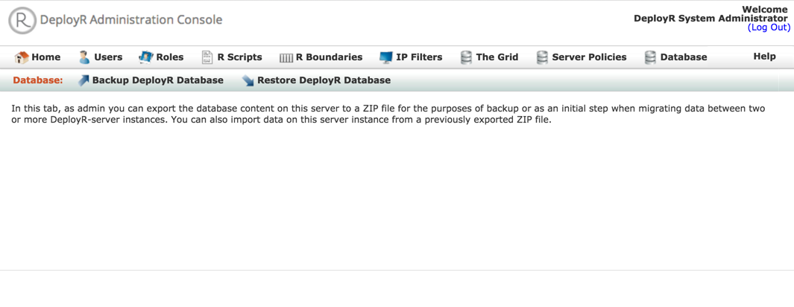

---

# required metadata
title: "DeployR Administration Console Help"
description: "Database Back and Restore in DeployR Administration Console"
keywords: ""
author: "j-martens"
manager: "jhubbard"
ms.date: "05/05/2016"
ms.topic: "article"
ms.prod: "microsoft-r"
ms.service: ""
ms.assetid: ""

# optional metadata
ROBOTS: ""
audience: ""
ms.devlang: ""
ms.reviewer: ""
ms.suite: ""
ms.tgt_pltfrm: ""
ms.technology: "deployr"
ms.custom: ""

---

# Restoring & Backing Up the Database

You can back up and restore the DeployR database through the **Database** tab in the Administration Console.

In this tab, you can export the contents of the database used by DeployR into a ZIP file as a way to backup data or as the first step in migrating data between two or more DeployR-server instances. You can also import this content into the repository on this server instance from a previously exported ZIP file. 

_Figure: Database page_

  

**To back up the database data:**

1.  From the main menu, click **Database**.

1. In that tab, click **Backup DeployR Database**. A zip file is created and downloaded to your local machine.

 
**To restore the database data**

1.  From the main menu, click **Database**.

1. In that tab, click **Restore DeployR Database**. The **Database restore** page appears.

	_Figure: Database restore page_
	
	

1. In the **Database restore** page, select the backup file.

1. Click **Restore** to restore the database.