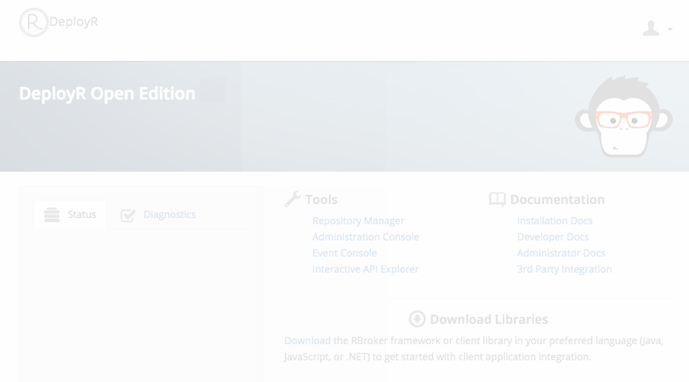

---

# required metadata
title: "Diagnostics & Troubleshooting"
description: "Diagnostic Testing and Troubleshooting FAQS for DeployR"
keywords: ""
author: "j-martens"
manager: "Paulette.McKay"
ms.date: "05/06/2016"
ms.topic: "article"
ms.prod: "microsoft-r"
ms.service: ""
ms.assetid: ""

# optional metadata
ROBOTS: ""
audience: ""
ms.devlang: ""
ms.reviewer: ""
ms.suite: ""
ms.tgt_pltfrm: ""
ms.technology: "deployr"
ms.custom: ""

---

# Diagnostics & Troubleshooting

## Introduction

This document describes how to run and interpret the DeployR diagnostic test. Additionally, this document offers solutions to issues that you might be [troubleshooting](#troubleshooting) after installing or during your use of DeployR.

## Diagnostic Testing

You can assess the state and health of your DeployR environment by running the diagnostic test described in this document. The diagnostic script:

-   Outputs basic details about your environment

-   Identifies unresponsive components, such as the server, grid nodes, or the database

-   Gathers all relevant [log and configuration files](#inspecting-diagnostic-log-files)

Armed with this information, you will be able to investigate and resolve most issues. And, in the event that you need additional support, you can send the diagnostics tar/zip file to the Microsoft Corporation technical support team.

Behind the scenes, the script evaluates the system and creates the `logs` subdirectory to store:

-   The resulting log file (`diagnostics.log`), which provides details, including the state of all components, plus pertinent configuration and environment information.

-   Copies of each [log and configuration file](#inspecting-diagnostic-log-files)

The results are also printed to the screen.

### Running the Diagnostic Check

The easiest way to run diagnostics is to launch it from the **Diagnostics** tab on the DeployR landing page.  After installing, you can log into the DeployR landing page at `http://<DEPLOYR_SERVER_IP>:<PORT>/deployr/landing`. `<DEPLOYR_SERVER_IP>` is the IP address of the DeployR main server machine. If you do not have a username or password, please contact your administrator.

However, if you cannot reach the landing page, the `admin` can log into the server and manually run it using the following commands:

#### For DeployR for Microsoft R Server 2016
+ **On Windows**: 
    1. Launch the DeployR administrator utility script with administrator privileges:
       ```
       cd C:\Program Files\Microsoft\DeployR-8.0.5\deployr\tools\ 
       adminUtilities.bat
       ```       
    
    1. From the main menu, run the DeployR diagnostic tests.  If there are any issues, you must solve them before continuing. Consult the Troubleshooting section of this document for additional help or post questions to our <a href="https://social.msdn.microsoft.com/Forums/en-US/home?forum=microsoftr" target="_blank">forum</a>.

   >All output from the diagnostic test are stored in `C:\Program Files\Microsoft\DeployR-<VERSION>\deployr\tmp\logs\diagnostics.zip`.

+ **On Linux**:
    1. Launch the DeployR administrator utility script as `root` or a user with `sudo` permissions:
       ```
       cd $DEPLOYR_HOME/deployr/tools/ 
       ./adminUtilities.sh
       ```       
    
    1. From the main menu, run the DeployR diagnostic tests.  If there are any issues, you must solve them before continuing. Consult the Troubleshooting section of this document for additional help or post questions to our <a href="https://social.msdn.microsoft.com/Forums/en-US/home?forum=microsoftr" target="_blank">forum</a>.

   >All output from the diagnostic test are stored into `$DEPLOYR_HOME/deployr/tmp/logs/diagnostics.zip`.

#### For DeployR 8.0.0
+ **On Windows**: Run the following commands. All output from the diagnostic test are stored in `C:\Program Files\Microsoft\DeployR-<VERSION>\deployr\logs\diagnostics.zip`.
   ```
   cd C:\Program Files\Microsoft\DeployR-8.0\deployr\diagnostics 
   diagnostics.bat
   ```

   > If the server log, `catalina.[YYYY-MM-DD].log`, contains information you do not wish to share with technical support, you can exclude that file. To do so, add `--exclude-server-log`, such as:`diagnostics.bat --exclude-server-log`

+ **On Linux / OS X**: Run the following commands. All output from the diagnostic test are stored in the `$DEPLOYR_HOME/deployr/logs/diagnostics.tar.gz`.
   ```
   cd $DEPLOYR_HOME/deployr/diagnostics 
   ./diagnostics.sh
   ```

   > If the server log, `catalina.out`, contains information you do not wish to share with technical support, you can exclude that file. To do so, add `--exclude-server-log`, such as:`./diagnostics.sh --exclude-server-log`

### Inspecting Diagnostic Log Files

A copy of the following log and configuration files are bundled together during the diagnostic check. Review the log and configuration files for any component that was identified as experiencing issues.

**For Windows**

The following log files can be found in the resulting `diagnostics.zip` file as well as under `C:\Program Files\Microsoft\DeployR-<VERSION>\deployr\tmp\logs` directly on the DeployR host.

| Component| Log&nbsp;&&nbsp;Configuration&nbsp;Files                | Description|
|----------|---------------------------------------------------|------------------------------------------------------------------------|
| Diagnostic Results |- `diagnostics.log`                 | The DeployR diagnostic log provides details, including the state of all components, plus pertinent configuration and environment information. |
| DeployR            | - `deployr.groovy`<br />- `Stacktrace.log`<br />- `catalina.out`                     | `deployr.groovy` is the DeployR external configuration file. Tomcat's `catalina.out` serves as the main [DeployR log](deployr-common-administration-tasks.md#inspecting-server-logs). [Learn more](deployr-common-administration-tasks.md#inspecting-server-logs) about this file. |
| Tomcat             |-  `catalina.out`<br />- `localhost_access_log.[DATE].txt`<br />- `server.xml`                       | The log and configuration files for Tomcat.|
| MongoDB  <br><small>(DeployR 8.0.0 only)</small>          | - `mongo.cfg`<br />- `mongod.log`                       | The log and configuration files for the database used by DeployR. The IP address is added to the filename for your convenience. |
| DeployR RServe             | - `Rserv.cfg`                       | The configuration file for the DeployR RServe component. The IP address is added to the filename for your convenience.<br /><br />**DeployR Enterprise Only**: The RServe files for remote grid nodes are not bundled. If you suspect an issue on a node, please log onto that machine to retrieve its RServe log file.                                                                                                             |

**For Linux / OS X**

The following log files can be found under `$DEPLOYR_HOME/deployr/tmp/logs` directly on the DeployR host.

| Component          | Log&nbsp;&&nbsp;Configuration&nbsp;Files                | Description |
|---------------------------------------------------------------------------|---------------------------------------------------------------------------------------------------------------------------------------------|------------------------------------------------------------------------|
| Diagnostic Results | - `diagnostics.log`                 | The DeployR diagnostic log provides details, including the state of all components, plus pertinent configuration and environment information. |
| DeployR            | - `deployr.groovy`<br />- `catalina.out`                     | `deployr.groovy` is the DeployR external configuration file. Tomcat's `catalina.out` serves as the main [DeployR log](deployr-common-administration-tasks.md#inspecting-server-logs). [Learn more](deployr-common-administration-tasks.md#inspecting-server-logs) about this file. |
| Tomcat             | - `catalina.out`<br />- `catalina.sh`<br />- `localhost_access_log.[DATE].txt`<br />- `server.xml`| The log and configuration files for Tomcat.|
| MongoDB<br><small>(DeployR 8.0.0 only)</small> |-  `mongod.conf`<br />- `mongod-<IP_ADDRESS>.log`| The log and configuration files for the database used by DeployR. The IP address of the host of the MongoDB database is added to the filename for your convenience.                                                                                                                              |
| DeployR RServe             | - `Rserv.conf`<br />- `Rserv-localhost.log`              | The log and configuration files for RServe.<br /><br />**DeployR Enterprise Only**: The RServe files for remote grid nodes are not bundled. If you suspect an issue on a node, please log onto that machine to retrieve its RServe log file.                                                                                                             |

### Resolving Issues

Use the following instructions if you have [run the diagnostic test](#running-the-diagnostic-check) and a problem was indicated.

**To resolve component issues:**

1.  Look through the [log and configuration files](#inspecting-diagnostic-log-files) for each component that was identified in the diagnostic report.

1.  If the log file indicates an error, then fix it.

1.  If Server Web Context points to the wrong IP, [update it now](#set-context).

1.  After making your corrections, [restart the component](deployr-common-administration-tasks.md#startstop) in question. It may take a few minutes for a component to restart.

1.  [Re-run the diagnostic test](#running-the-diagnostic-check) again to make sure all is running smoothly now.
     If problem persists:

    + After trying the first time, repeat steps 1-4.

    + Review the other [Troubleshooting](#troubleshooting) topics.

    + Post your questions to our [DeployR Forum](https://social.msdn.microsoft.com/Forums/en-US/home?forum=microsoftr).

    + After the second time, send the diagnostics tar/zip file to the Microsoft Corporation technical support team.

## Troubleshooting

This section contains pointers to help you troubleshoot some problems that can occur with DeployR.

<br>
### Windows Installation Errors

<br>
####DeployR RServe Package Download Failed

During the installation of DeployR on Windows, if you get the error `DeployR RServe package download failed`, this may be due to several potential issues, including:
+ Unavailable or poor network connectivity
+ The package zip could not be found in Github
+ Download is disabled on machine for reasons such as corporate policy

If this should occur, do the following:

1. Check your connectivity and firewall rules, and click **Try Again** in the DeployR setup installer.

1. If this does not fix the issue, then manually install the supported DeployR Rserve package as follows: <a name="manual-package-install"></a>

   1. Download zip from https://github.com/deployr/deployr-rserve/releases/download/v8.0.5/deployrRserve_8.0.5.zip

   1. Open a Command Window with **“Run as Administrator”** and run the following:
      ```
      cd “C:\Program Files\Microsoft SQL Server\130\R_SERVER\bin\x64”
      R.exe CMD INSTALL -l "C:\Program Files\Microsoft SQL Server\130\R_SERVER\library"   <PATH-TO-deployrRserve-ZIP>
      ```

   1. Confirm the package was installed by verifying that `C:\Program Files\Microsoft SQL Server\130\R_SERVER\library\deployrRserve\Rserve.exe` is present.

   1. Click **Try Again** in installer or re-run the installer.

<br>
####DeployR RServe Package Installation Failed

During the installation of DeployR on Windows, if you get the error `DeployR RServe package installation failed`, this may be due to several potential issues, including:

+ The package could not be installed in the correct location due to insufficient privileges.
+ The package download was corrupted or interrupted.

Manually install DeployR RServe package as [described here](#manual-package-install).

<br>
####Could Not Stop the Service Apache-Tomcat-for-DeployR-&lt;version&gt;

During the installation of DeployR on Windows, you may get the error `Could not stop the service Apache-Tomcat-for-DeployR-<version>` if Windows could not stop the service completely.

If this should occur, do the following:

1. Open a Command Window with **“Run as Administrator”** and run the following:
   ```
   sc delete Apache-Tomcat-for-DeployR-<version> 
   ```
   where &lt;version&gt; is the package version number such as, Apache-Tomcat-for-DeployR-8.0.5.

1. If the installer is still open, click **Try Again** in installer. If the installer was canceled, try to install again.

1. If the error persists, reboot the Windows machine on which you are installing and launch the installer again.

<br>
####Could Not Stop the Service RServe&lt;version&gt;

During the installation of DeployR on Windows, the error `Could not stop the service RServe<version>` can appear if Windows could not stop the service completely.

If this should occur, do the following:

1. Open a Command Window with **“Run as Administrator”** and run the following:
   ```
   sc delete RServe<version>
   ```
   where &lt;version&gt; is the package version number such as, RServe8.0.5.
   
1. If the installer is still open, click ‘Try Again’ in installer. If the installer was canceled, try to install again.

1. If the error persists, reboot the Windows machine on which you are installing and launch the installer again.

<br>
####Other Errors During Installation

If you should encounter any other errors while running the DeployR Windows installer, we recommend that you:
+ Contact Microsoft support (DeployR Enterprise users only)

+ Provide the installation logs `DeployR-*.log` found in the `%temp%` directory.
 
 
<br>
### Landing Page Cannot Be Reached

If you cannot access the DeployR landing page or if the landing page looks disabled and you can't log in, we recommend that you first verify that the server is, in fact, running using [this diagnostic test](#running-the-diagnostic-check). If the diagnostic logs reveal nothing and the DeployR landing page still isn't loading properly, then it is likely that the IP address in the Server Web Context is incorrectly defined. For more on the Server Web Context, refer to the [Administration Console Help](deployr-admin-console/deployr-admin-managing-server-policies.md#basic-settings).



This problem can arise for various reasons, including:
-   When an internal IP address was automatically assigned instead of an external address. This is most common with Azure or an Amazon Web Services (AWS) EC2 instances, but can occur with other configurations.
-   When the underlying IP address of your DeployR server has changed. This is most common when you have installed the DeployR server on a portable laptop and have since changed networks (for example, between your office and your home).

It can be solved by updating the IP address in the DeployR Server Web Context.

<br />
<a id="set-context"></a>
#### DeployR for Microsoft R Server 2016: Update DeployR Web Context

To fix this issue, update the IP address in the DeployR Server Web Context as follows:

1. Launch the DeployR administrator utility script with administrator privileges:
    + On Windows, run:
    ```
    cd $DEPLOYR_HOME\deployr\tools\ 
    adminUtilities.bat 
    ```        
    + On Linux, run:
    ```
    cd $DEPLOYR_HOME/deployr/tools/
    ./adminUtilities.sh
    ```         

1. From the main menu, choose option **Run Diagnostics**.   Make sure that the database is running. The database must be running before you can proceed to the next step.

1. Return to the main menu, choose option **Web Context and Security**. 

1. From the sub-menu, choose option **Specify New IP or Fully Qualified Domain Name (FQDN)**.

1. When prompted to specify a new IP or FQDN, enter the new IP or FQDN.

1. When prompted to confirm the new value, enter `Y`. This change will also disable Automatic IP detection to prevent the new value you just assigned from being overwritten. 

1. Return to the main menu and choose option **Start/Stop Server**.  You must restart DeployR so that the changes can take effect. 

1. When prompted whether you want to stop (S) or restart (R) the DeployR server, enter `R`. It may take some time for the Tomcat process to terminate and restart.

1. Exit the utility.  

<br />   
<a id="set-context-800"></a>
#### DeployR 8.0.0: Update DeployR Web Context

Run the `setWebContext` script to update the IP address in the DeployR Server Web Context.

Usage tips for the `setWebContext` script arguments:

|Arguments|Description|
|---------|---------------------------------|
|`query`| To see which IP is currently defined as the Server Web Context.|
|`ip <ip_address>`|To  specify a new IP address or DNS name for the DeployR Server Web Context.|
|`disableauto`|To turn off the automatic IP detection. You can [turn this back on](deployr-admin-console/deployr-admin-managing-server-policies.md#basic-settings) in the Administration Console.|
|`aws`|To detect the external IP used for your AWS EC2 instance. From there you can choose to use that IP as the DeployR Server Web Context.|
|`https true` or<br /> `html false`|To enable or disable HTTPS in the server policies, including the Server Web Context. This change requires other changes to complete SSL/HTTPS process as described in [these instructions](deployr-admin-security/deployr-security-https.md).|

 
**On Windows:**

1. Make sure that the MongoDB database is running. The database must be running before you can proceed to the next step before you update the Web Context.

1. Open a Command Window with **“Run as Administrator”**.

1. Set the appropriate public IP where `<ip_address>` is the public IP address of the machine. 
   ```
   cd $DEPLOYR_HOME\deployr\tools\
   setWebContext -ip <ip_address>
   ```

1. Confirm the IP address you entered.

1. Disable any automatic IP detection that might overwrite the IP you just assigned.
   ```
   setWebContext -disableauto
   ```           

**On Linux:**

1. Set the IP using the `setWebContext.sh` script where `<ip_address>` is the public IP address of the machine. 
   ```
   cd $DEPLOYR_HOME/deployr/tools/
   ./setWebContext.sh -ip <ip_address>
   ```

1. Confirm the IP address you entered.

1. Disable any automatic IP detection that might overwrite the IP you just assigned.
   ```
   ./setWebContext.sh -disableauto
   ```

>For this change to take effect, [restart the DeployR 8.0.0 service](deployr-common-administration-tasks.md#startstop). Between stopping and starting, be sure to pause long enough for the Tomcat process to terminate.

If this doesn't resolve the issue and you have Internet Explorer 11 on Windows, [try this](#landing-page-blocked-in-i-e-11).

### Landing Page Blocked in Internet Explorer 11 (Windows Only)

If you are attempting to access the DeployR landing page using `http://localhost:<PORT>/deployr/landing` in Internet Explorer (I.E.) 11 and the [diagnostic tests](#diagnostic-testing) have turned up nothing, you may find that the landing page is blocked. This may be due to some default settings in I.E. 11.

**To solve this issue:**

1.  In Internet Explorer 11, go to the **Security** tab in the **Internet Options** dialog box.

    

2.  Add `http://localhost:<PORT>/deployr` to the **Trusted Sites** list.

3.  In the **Connections** tab in the same **Internet Options** dialog box, click **LAN settings**.

    

4.  Deselect the **Automatically detect settings** checkbox to enable custom entries in the HOSTS file.

5.  Click **OK** to apply the changes.

<br />
### Cannot Access DeployR (Windows Only)

During the installation of DeployR on Windows, the 'Domain' profile is used to create inbound exceptions for the ports used by DeployR. These settings may need to be adjusted after installing to meet the needs of your deployment.

<br />
### Multiple User Sign-ins

You cannot log into DeployR from two different accounts within the same brand of browser program. To use two or more different accounts, you'll need to log into each one in a separate brand of browser.

<br />
### Issues After Reinstalling Microsoft R or R

If you want to upgrade or reinstall R, Microsoft R Server, or Revolution R Open or need help troubleshooting, then follow [these instructions precisely](deployr-admin-configure-reinstall-r.md).

<br />
### Upping R Session Memory Limits (Windows only)

By default, the maximum memory available to an R session under DeployR on Windows Rserve is 2 GB. If this is insufficient for your purposes, then you can increase the memory allocated for your R sessions by executing the `memory.limit()` R function on the R session. This function allows you to specify a higher memory allocation for your R session. The size parameter on that function call determines the final memory allocation for the R session. In general:

    memory.limit(size = <MAX_MEM_LIMIT>)

It is often convenient to add this function call to the start of any R script that requires runtime memory resources in excess of the default 2 GB on Windows.

For example, the following line will raise the maximum memory limit to 10 GB for your R session:

    memory.limit(size = 10240)

>[!NOTE]
>-   The increase in the memory allocation takes place only once the line is executed.
>-   The memory allocated during a session can only be increased, and not decreased.
>-   The value for `memory.limit` is not applied system wide. Instead, it applies only to the R >session where the `memory.limit` function has been executed.

&nbsp;


>Grid nodes have finite memory resources. Keep these resource limits in mind when adjusting memory allocations for individual R sessions.

<br />
### Access Denied to Tomcat (Windows only)

If you reboot after installing and get an access error message for Tomcat, you can specify that Tomcat should be run “as an administrator” to stop the message from appearing. The error is related to `tomcat7w.exe`, which is an application for monitoring and configuring Tomcat services. The error message is: *“Access is denied. Unable to open the service Tomcat”*

**To set Tomcat program to run as an administrator, do the following:**

1.  Right-click `tomcat7w.exe` and choose **Properties** from the shortcut menu. `tomcat7w.exe` is a GUI application for monitoring and configuring Tomcat services.

2.  In the Properties dialog, select the checkbox *Run this program as an administrator checkbox* in the **Privilege Level** area.

3.  Click **OK**.

4.  Launch DeployR again.

<br />
### Inactive Grid Node (Windows 7 only)

If the **DeployR Default Node** appears **Inactive** in the DeployR landing page directly after having installed DeployR on a Windows 7 machine, then the `R_HOME` variable may not be set.


**To correct this issue:**

1.  Check the status of the **DeployR Default Node** in the DeployR landing page at `http://<DEPLOYR_SERVER_IP>:<PORT>/deployr/landing`. If it appears **Inactive**, continue to the next step.

2.  Verify the status of the DeployR Rserve service in the **Services** dialog box. If it appears as `Started`, continue to the next step. If not, start it now and go back to step 1.  
    **Tip:** Go to **Start &gt; Control Panel**. Search for `admin` and select **Administrative Tools** from the results. Choose **Services** to open the **Services** dialog box.

3.  At a DOS command prompt, go to the `bin\x64` directory for R and start RServe. Pay particular attention to the messages printed to the window. For example:

        cd C:\Program Files\Microsoft SQL Server\130\R_SERVER\bin\x64
        Rserve8.0.5

4.  If you see the message "R\_HOME must be set in the environment or Registry", then you must define that environment variable as follows:

    1.  Go to **Start &gt; Control Panel**.
    
    2.  Search for `sys` and select **Edit the system environment variables** from the results.
    
    3.  Click the **Environment Variables...** button to open the **Environment Variables** dialog box.
    
    4.  Click **New...** and enter `R_HOME` as the **Variable name** and the path to R (such as `C:\Program Files\Microsoft SQL Server\130\R_SERVER\bin\x64`) as the **Variable value**.
    
    5.  Click **OK** to create the variable.

5.  Reboot your machine.

6.  Go back to landing page and verify that the grid node is now active.

<br />
### Cannot See API Explorer Tool

1.  Ensure Adobe Flash Player is installed and configured to work with your browser.

2.  Clear your browser’s cache before launching the API Explorer tool. This is particularly important if you are upgrading from a previous version of DeployR.

<br />
### Port Conflicts with Other Applications

If you run into conflicts with other applications, consider changing the port numbers. You only need to change the port numbers of those applications that are actively conflicting. Consequently, not all of the following steps may apply to your situation.

**For Windows:**

1. In the `C:\Program Files\Microsoft\DeployR-<DEPLOYR_VERSION>\Apache_Tomcat` directory, open the file `server.xml`.

1. Find: 
    + For DeployR for Microsoft R Server 2016: `port="8050"`
    + For DeployR 8.0.0: `port="8000"`
    <br />
1. Replace the port value with a new, unique port number.

1. Save the file.

1. Restart Tomcat for the changes to take effect.
    + For DeployR for Microsoft R Server 2016:
      ```
      net stop Apache-Tomcat-for-DeployR-8.0.5
      net start Apache-Tomcat-for-DeployR-8.0.5
      ```
      
    + For DeployR 8.0.0:
      ```
      net stop Apache-Tomcat-for-DeployR-8.0
      net start Apache-Tomcat-for-DeployR-8.0
      ```

**For Linux / OS X**

1. Edit the file `<DeployR_Install_Dir>/tomcat/tomcat7/conf/server.xml`.

1. Find the port number value by searching for:
   + For DeployR for Microsoft R Server 2016: `<Connector port="8050"`
   + For DeployR 8.0.0: `<Connector port="8000"`
   <br />
1. Replace the port value with a new, unique port number.

1. Save the file.

1. Restart Tomcat for the changes to take effect. At the prompt, type:
   ```
   /home/deployr-user/deployr/<DEPLOYR_VERSION>/tomcat/tomcat7.sh stop
   /home/deployr-user/deployr/<DEPLOYR_VERSION>/tomcat/tomcat7.sh start
   ```
   
1.  Verify that the port changes are working as expected. At the prompt, type:
   ```
   netstat -p --listening --numeric-ports --numeric-hosts | grep -i java
   ``` 