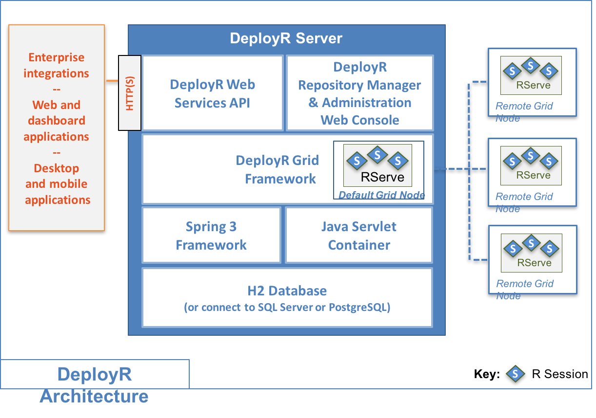

---

# required metadata
title: "DeployR API Reference Guide"
description: "DeployR API Reference Guide"
keywords: ""
author: "j-martens"
manager: "Paulette.McKay"
ms.date: "06/09/2016"
ms.topic: "article"
ms.prod: "microsoft-r"
ms.service: ""
ms.assetid: ""

# optional metadata
ROBOTS: ""
audience: ""
ms.devlang: ""
ms.reviewer: ""
ms.suite: ""
ms.tgt_pltfrm: ""
ms.technology: "deployr"
ms.custom: ""

---
# DeployR API Reference Guide

The DeployR API exposes the R platform as a service allowing the integration of R statistics, analytics, and visualizations inside Web, desktop and mobile applications. This API is exposed by the DeployR server, a standards-based server technology capable of scaling to meet the needs of enterprise-grade deployments.

With the advent of DeployR, the full statistics, analytics and visualization capabilities of R can now be directly leveraged inside Web, desktop and mobile applications.

##R for Application Developers

While data scientists can work with R directly in a console window or IDE, application developers need a different set of tools to leverage R inside applications. The DeployR API exposes **R analytics Web services**, making the full capabilities of R available to application developers on a simple yet powerful Web services API.

As an application developer integrating with **DeployR-managed analytics Web services**, typically your interest is in executing R code, not writing it. Data scientists with R programming skills write R code. With one-click in the [DeployR Repository Manager](deployr-repository-manager/deployr-repository-manager-about.md), this R code can be turned into a DeployR-managed analytics Web service. Once R code is exposed by DeployR as a service, an application can make API calls to pass inputs to the service, execute the service and retrieve outputs from the service. Those outputs can include R object data, R graphics output such as plots and charts, and any file data written to the working directory associated the current R session.

Each time a service is executed on the API, the service makes use of an R session that is managed by DeployR as a **project** on behalf of the application. Depending on the nature and requirements of your application you can choose to execute services on [*anonymous* or *authenticated* projects](#projects).

To simplify integration of R analytics Web services using the DeployR API, we provide [several client libraries](deployr-tools-and-samples.md), which are currently available for Java, JavaScript and .NET developers. A major benefit of using these client libraries is that they simplify making calls, encoding data, and handling response markup on the API.

##Users on the API

The User APIs exist principally to facilitate user authentication with the DeployR server. Additionally, the `/r/user/autosave` call can be used to enable or disable autosave semantics on persistent projects for the duration of the users HTTP session.

**Authenticated Users**

One of the first steps for most typical applications using this API is to provide a mechanism for users to authenticate with the DeployR server by signing-in and signing-out of the application.

To sign-in a user must provide username and password credentials. These credentials then need to be verified by the DeployR server using the [`/r/user/login`](https://deployr.revolutionanalytics.com/documents/dev/api-doc/guide/single.html#userlogin) call. Credentials are matched against user account data stored in the DeployR database or against user account data stored in LDAP, Active Directory or PAM directory services.

If these credentials are verified by the DeployR server, then we say that the user is an *authenticated* user. An *authenticated* user is granted access to the full API, allowing the user to work on [projects](#projects-on-the-api), submit or schedule [jobs](#jobs-on-the-api) and work with [repository-managed](#repository-on-the-api) files and scripts.

**Pre-Authenticated Users**

There are situations where a user may have been reliably authenticated by some external system such as Siteminder prior to accessing a DeployR-enabled Web application. These types of pre-authentication scenarios are now supported by the server. Consequently, DeployR-enabled Web applications should omit sign-in and sign-out logic when *pre-authenticated* users are expected.

**Anonymous Users**

While many applications require the security and controls associated with *authenticated* users there are cases when an application may want to offer specific services to users without ever establishing a formal verification of the user's identity.

In such situations we say that the user is an *anonymous* user. Typically an *anonymous* user is an unauthenticated visitor to a DeployR-enabled Web application.

*Anonymous* users are only granted access to a single API call, [`/r/repository/script/execute`](https://deployr.revolutionanalytics.com/documents/dev/api-doc/guide/single.html#repositoryscriptexecute). 

<br /><a name="projects"></a>
##Projects on the API

A *project* on the DeployR API represents an R session.  

Most R users are accustomed to working with R interactively in an R console window. In this environment, users can input commands to manipulate, analyze, visualize and interpret object and file data in the R session. The set of objects in the R session are collectively known as the *workspace*. The set of files in the R session are collectively known as the *working directory*. The R session environment also supports libraries, which allows the functionality found in R packages to be loaded by the user on-demand.

The DeployR environment supports these same set of functionalities by introducing the concept of *projects* on the API. As with working in an R console window, all operations on project APIs are synchronous, where requests are processed serially and blocked until completion. The project management APIs facilitate basic lifecycle management for projects.

DeployR supports a number of different types of projects, each of which is designed to support distinct workflows within client applications. 


The following sections discuss the different types of projects available:

###Anonymous Projects

An *anonymous project* is a project created by an *anonymous user*. There are two types of anonymous project: **stateless projects** and **HTTP blackbox projects**. The types of projects can be created using the following API calls:


|API Call                          |Description                                                     |
|----------------------------------|----------------------------------------------------------------|
|[`/r/repository/script/execute`]()|Executes a repository-managed script on an anonymous project    |
|[`/r/repository/script/render`]() |Executes a repository-managed script on an anonymous project and renders outputs to HTML |

*Anonymous* users are not permitted to work directly with the Project APIs. Those APIs are only available to *authenticated* users.

**Stateless Projects**

Stateless projects are useful when an application needs to make a one-off request on an R session. It may help to think of a stateless project as a disposable R session, that is used once and then discarded.  Once the service request has responded with the results of the execution the R session is shutdown and permanently deleted by the server.  There are many types of application workflows that can benefit from working with stateless projects.

**HTTP Blackbox Projects**

With the introduction of HTTP *blackbox* projects, stateful R sessions are now available to *anonymous* users. HTTP blackbox projects are useful when an application needs to maintain the same R session for the duration of an *anonymous* user's HTTP session. Once the HTTP session expires or the server detects that the *anonymous* user has been idle (default: 15 minutes idle timeout) the HTTP blackbox project and all associated state are permanently deleted by the server. There can only be one HTTP blackbox project live on a HTTP session at any given time.

To execute an R script on a HTTP blackbox project, enable the ***blackbox*** parameter on the following calls: `/r/repository/script/execute` and `/r/repository/script/render`

There are two types of data that can be returned when executing an R script on a HTTP blackbox project:

+ Unnamed plots generated by the R graphics device on the execution are returned as results
+ Named workspace objects identified on the *robjects* parameter can be returned as DeployR-encoded R objects

All files in a HTTP blackbox project's working directory are completely hidden from the user.

These calls also support a ***recycle*** parameter that can be used when working with HTTP blackbox projects. When this parameter is enabled the underlying R session is recycled before the execution occurs. Recycling an R session deletes all R objects from the workspace and all files from the working directory. The ability to *recycle* a HTTP blackbox project gives an *anonymous* user control over the R session lifecycle.

To interrupt an execution on the HTTP blackbox project on the current HTTP session use the `/r/repository/script/interrupt`.

###Authenticated Projects

An *authenticated project* is a project created by an authenticated user. There are three types of authenticated project:

+ Temporary Project
+ User Blackbox Project
+ Persistent Project

*Authenticated projects* can be created using the following API calls:


|API Call               |Description                                                     |
|-----------------------|----------------------------------------------------------------|
|[`/r/project/create`]()|Creates a new temporary, user blackbox or persistent project    |
|[`/r/project/pool`]()  |Creates a pool of temporary projects                            |

*Authenticated* users own projects. Each *authenticated* user can create zero, one or more projects. Each project is allocated its own workspace and working directory on the server and maintains its own set of R package dependencies along with a full R command history. A user can execute R code on a project using the [`/r/project/execute/code`](https://deployr.revolutionanalytics.com/documents/dev/api-doc/guide/single.html#projectexecutecode) and [/r/project/execute/script](https://deployr.revolutionanalytics.com/documents/dev/api-doc/guide/single.html#projectexecutescript) calls and retrieve the R command history for the project using the [`/r/project/execute/history`](https://deployr.revolutionanalytics.com/documents/dev/api-doc/guide/single.html#projectexecutehistory) call.

>Given an *authenticated* user can do everything an *anonymous* user can do on the API, it is possible for an *authenticated* user to create and work with *anonymous* projects as described in the section [Anonymous Projects](#anonymous-projects).

**Temporary Projects**

Temporary projects are useful when an application needs to maintain the same R session for the duration of an *authenticated* user's session within the application. Once the user makes an explicit call on [`/r/project/close`](https://deployr.revolutionanalytics.com/documents/dev/api-doc/guide/single.html#projectclose) or simply signs-out of the application the temporary project and all associated state are permanently deleted by the server.

A user can create a temporary project by omitting the name parameter on the [`/r/project/create`](https://deployr.revolutionanalytics.com/documents/dev/api-doc/guide/single.html#projectcreate) call or they can create a pool of temporary projects using the [`/r/project/pool` call](https://deployr.revolutionanalytics.com/documents/dev/api-doc/guide/single.html#projectpool).

All unnamed projects are temporary projects.

**User Blackbox Projects**

A user blackbox project is a special type of temporary project that limits API access on the underlying R session. User blackbox projects are most useful when an application developer wants to associate a temporary project with a user without granting that user unfettered access to the underlying R session.

There are two types of data that can be returned when executing an R script on a user blackbox project:

+ _Unnamed plots_ generated by the R graphics device on the execution are returned as results
+ _Named workspace objects_ identified on the robjects parameter can be returned as DeployR-encoded R objects

All files in a user blackbox project's working directory are completely hidden from the user.

User blackbox projects can be created using the `blackbox` parameter on the following API calls:

|API Call                  |Description                                                     |
|--------------------------|----------------------------------------------------------------|
|[`/r/project/create`]()   |Creates a new project                                           |
|[`/r/project/pool`]()     |Creates a pool of temporary projects                            |

User blackbox projects permit only the following subset of project-related API calls:

|API Call                          |Description                                                     |
|----------------------------------|----------------------------------------------------------------|
|[`/r/project/execute/script`]()   |Executes a script on project|
|[`/r/project/execute/interrupt`]()|Interrupts a code execution on project|
|[`/r/project/ping`]()             |Pings a project|
|[`/r/project/recycle`]()          |Recycles a project R session|
|[`/r/project/close`]()            |Closes a project|

This set of API calls on user blackbox projects are collectively known as the *User Blackbox API Controls*.

A user blackbox project also ensure that none of the R code from the R scripts that are executed on that project is ever returned in the response markup.

**Persistent Projects**

Persistent projects are useful when an application needs to maintain the same R session across multiple user sessions within the application. A persistent project is stored indefinitely in the server unless it is explicitly deleted by the user. 

Each time a user executes R code on their persistent project, the accumulated R objects in the workspace and files in the working directory from previous service executions remain available.

Whenever users return to the server, their own persistent projects are available so that users can pick up where they last left off. In this way, persistent projects can be developed over days, weeks, months even years.

The server stores the following state for each persistent project:

- Project workspace
- Project working directory
- Project package dependencies
- Project R command history and associated results

An *authenticated* user can create a persistent project by specifying a value for the *name* parameter on the /r/project/create call. Alternatively, if a user is working on a temporary project then that project can become persistent once the user makes a call on [/r/project/save](https://deployr.revolutionanalytics.com/documents/dev/api-doc/guide/single.html#projectsave) which has the effect of naming the project.

All *named* projects are *persistent* projects.

###Live Projects on the Grid

A  **live project**  is any project, temporary or persistent, that is actively in use on the [DeployR grid](#architecture). By definition, all temporary projects are live projects. A user can have zero, one or more projects live on the grid at any one time. 

To ensure a fair distribution of server runtime resources across all users, the DeployR administrator can limit the number of live projects permitted for a given user at any one time. When a user reaches his or her live project limit all further API calls on new projects are rejected until one or more of that user's current live projects are closed using the `/r/project/close` call. Calls that are rejected due to live project limits will indicate an appropriate [Grid Resource Error](#codes) on the response code.

###Working with Project Management APIs

**Creating Projects**

There are a number of ways to create projects on the API, including the following:

|API Call             |Description                                                     |
|---------------------|----------------------------------------------------------------|
|[`/r/project/create`]()|Create a new project|
|[`/r/project/saveas`]()|Clone an existing project|
|[`/r/project/import`]()|Import a project archive|

**Saving Projects**

There are a number of ways to save projects on the API, including the following:

|API Call             |Description                                                     |
|---------------------|----------------------------------------------------------------|
|[`/r/project/save`]()|Save an existing project|
|[`/r/project/saveas`]()|Clone an existing project|
|[`/r/project/export`]()|Export a project archive|


**Closing Projects**

To close a live project use the  [`/r/project/close`]() API call. Closing a live project (temporary or persistent) deactivates the project, which in turn removes it from the grid and releases all associated server runtime resources. Remember, that closing a temporary project will permanently delete that project.

**Deleting Projects**

To delete a persistent project, use the [`/r/project/delete`]() API call.

**Project Archives**

A project archive is generated by exporting the entire state of a persistent project into a compressed archive file using the [`/r/project/export`]() API call. Once exported, this file resides outside of the DeployR server. Project archives are useful both as a general backup mechanism and as a means of sharing work between colleagues, particularly colleagues working on different DeployR installations.

A user can import a project archive back into any compatible DeployR server in order to produce a new, persistent project using the [`/r/project/import`]() API call.

###Project Ownership & Collaboration

As noted, each *authenticated* user can create zero, one or more projects. Each newly created project is by default privately owned, and visible only to it's creator. Such user-based privacy is a central aspect of the DeployR security model. However, there are scenarios in which a more flexible access model for projects would benefit users by facilitating collaboration among them.

**Persistent Project Read-Only Collaboration**

A project owner may wish to share a project by granting read-only access to fellow *authenticated* users on the same DeployR server. Once read-only access has been granted it facilitates discussions, demonstrations and so on.

To facilitate these kinds of workflows the [/r/project/about/update](https://deployr.revolutionanalytics.com/documents/dev/api-doc/guide/single.html#projectaboutupdate) call allows users to toggle the read-only "shared" access controls on any of their private projects. Using this call to enable shared/read-only access on a project makes the project visible to all authenticated users. Using this call to disable shared/read-only access on a project makes the project invisible to all but the project owner(s).

**Persistent Project Read-Write Collaboration**

At times a project owner may also wish to grant read-write access on a project to fellow *authenticated* users sharing the same DeployR server so they can actively collaborate on the development of a project. This type of project collaboration would be beneficial, for example, as part of a planned multistage development or simply to permit work on the project to continue when the original project owner goes on vacation.

To facilitate these kinds of workflows a project owner can now grant authorship rights on a project to one or more *authenticated* users using the [/r/project/grant](https://deployr.revolutionanalytics.com/documents/dev/api-doc/guide/single.html#projectgrant) call. Once a user has been granted authorship rights on a project they effectively co-own the project and can view, modify and even delete the project. Where mutiple users have been granted authorship rights on a project the server ensures that only one user can be actively working on the project at any one time.

>Deleting a project with multiple authors simply revokes authorship rights to the project for the caller. After the call, all other authors on the project still have full access to the project. If the last remaining author deletes a project, then the project is permanently deleted.

## Jobs on the API

Working with R interactively in an R console window or working with projects on the API are both examples of synchronous working environments where a user can make a request that will be blocked until processing completes and an appropriate response is generated and returned. When working with R interactively, the response is displayed as output in the R console window. When working with projects on the API, the response is well-formed markup on the response stream.

However, there are times when it can be advantageous to permit users to make requests without requiring that they wait for responses. For example, consider long-running operations that could take hours or even days to complete.

The DeployR environment supports these types of long-running operations by introducing the concept of *jobs* on the API. DeployR managed jobs support the execution of commands in the background on behalf of users.

The Job APIs facilitate working with DeployR managed jobs. Jobs support the execution of commands in the background on behalf of users.

####Submitting Versus Scheduling Jobs

Jobs can be submitted for immediate background execution using the `/r/job/submit` call. Jobs can be scheduled for execution at some later date or on a recurring basis using the `/r/job/schedule` call.

####Job Scheduling Priority
When a user submits or schedules a job they can identify a high, medium or low (default) priority for their job. Each priority level has it's own dedicated jobs queue managed by the jobs scheduler.

Jobs in higher priority job queues are guaranteed to be executed on the grid ahead of jobs in lower priority job queues. Put another way, jobs in higher priority job queues are assigned free slots on the grid ahead of jobs on lower priority queues. Jobs on the same jobs queue are executed on the grid in the order in which they were submitted.

High, medium and low priority job queues allow users to expedite higher priority jobs by 'jumping the queue', and to expedite jobs to best fit specific scheduling needs.

####Retrieving Job Results
Users can query the status of their jobs using the `/r/job/query` call which returns the current status for a given job. Users can cancel a scheduled job or an actively running job using the `/r/job/cancel` call.

Regardless of whether a job runs to completion or whether a job is interrupted or aborted by the user the DeployR server will create a new project for the user by default. This project will be named after the job that created it and will contain a complete workspace, working directory, package dependencies, command history and associated results generated by that job. The user can then work with the full set of Project APIs to manipulate, analyze, visualize and interpret all of the objects, files and generated plots resulting from the job.

However, if the `storenoproject` parameter is set to true when submitting the job then a project is not created when the job completes. Using the `storenoproject` parameter can be very resource efficient and improve throughput when the only data you care about has already been stored in the repository using the storeobjects and/or storefiles parameters.

If the `storenoproject` parameter is not set to true then a project is always created to hold the results of a job unless the job experiences a runtime error during execution, for example, the R code being executed on the job has syntax errors or attempts to reference undefined objects. In such cases, see the `statusMsg` property on a failed job for an indication of the underlying cause of the problem.

>All completed, interrupted and aborted jobs result in new projects for users.

####Understanding the Jobs Lifecycle
The following diagram provides an overview of the full set of Job APIs and indicates the lifecycle of jobs managed by those APIs:


## Repository on the API

The DeployR environment offers each *authenticated* user their own versioned file storage by introducing the concept of a repository on the API. The repository provides a persistent store for user files of any type, including binary object files, plot image files, data files, simple text files and files containing blocks of R code which are referred to as [repository-managed scripts](#reposcripts).

Because the repository supports a versioned file system a full version history for each file is maintained and any version of a file can be retrieved upon request.

By default, each private repository store exposes a single repository directory, known as the root directory.

Users can store files in and retrieve files from their root directory. In addition, users can manage their own set of custom and archived directories. Working with the root, custom and archived directories is detailed in the following section.

###Repository Directories
The Repository Directory APIs facilitate working with repository-managed directories. Repository-managed directories fall into two distinct categories:
+ User Directories
+ System Directories

####User Directories
Each authenticated user maintains their own set of private user directories. The set of user directories can be further divided into the following user directory types:

+ Root directory
+ Custom directories
+ Archived directories

By default, each authenticated user has access to their own root directory in the repository. When working with repository Files, all API calls default to operating on the root directory if a specific custom or archived directory is not specified on the directory parameter.

Each authenticated user can also create zero, one or more custom directories. Each custom directory becomes a sub-directory of the root directory. Custom directories can be very useful to help manage logical groups of files across multiple projects, customers, applications etc.

Users can also archive the contents of their root directory or the contents of any of their custom directories within archived directories. This can be a very useful way to preserve old but valuable files over time while reducing day-to-day directory clutter.

By default, archived directories do not appear in the response markup when a user makes a call to `/r/repository/directory/list`. However, when the `archived` parameter is enabled on that call, any archived directories belonging to the user will appear in the response markup.

####System Directories

System directories are virtual directories that exist only in the context of the response markup on the `/r/repository/directory/list` call. These directories are provided as a convenient way for a user working with the Repository Directory APIs to get access to repository-managed files that are shared or made public by other users.

There are just three system directories:

+ Restricted directory. The Restricted system directory maintains a list of files that have been shared-with-restrictions by other authenticated users. These files will have had their access controls set to restricted access.

+ Shared directory. The Shared system directory maintains a list of files that have been shared by other authenticated users. These files will have had their access controls set to shared access.

+ Public directory. The Public system directory maintains a list of files that have been published by other authenticated users. These files will have had their access controls set to public access.

>Important: As all files appearing in the system directories belong to other users, these files can not be copied, moved, modified, archived or deleted using the Repository Directory APIs.

###Repository-Managed Files

Each user has access to a private repository store. Each file placed in that store will be maintained indefinitely by the server unless it is explicitly deleted by the user.

Repository-managed files can be easily loaded by users directly into [anonymous projects](#anonymous projects), [authenticated projects](#authenticated-projects) as well as into jobs. For example, a binary object file in the repository can be loaded directly into a project workspace using the [/r/project/workspace/load](https://deployr.revolutionanalytics.com/documents/dev/api-doc/guide/single.html#projectworkspaceload) call. A data file can be loaded directly into a project working directory using the [/r/project/directory/load](https://deployr.revolutionanalytics.com/documents/dev/api-doc/guide/single.html#projectdirectoryload) call.

Conversely, objects in a project workspace and files in a project working directory can be stored directly to the repository using the [/r/project/workspace/store](https://deployr.revolutionanalytics.com/documents/dev/api-doc/guide/single.html#projectworkspacestore) and [/r/project/directory/store](https://deployr.revolutionanalytics.com/documents/dev/api-doc/guide/single.html#projectdirectorystore) calls respectively.

Repository-managed files can also be loaded directly into the workspace or working directory ahead of executing code on [anonymous projects](#anonymous-projects) or an *asynchronous job*.

Refer to the section [Working with Repository Files](https://deployr.revolutionanalytics.com/documents/dev/api-doc/guide/single.html#repositoryfiles) for further details.

**Repository File Ownership & Collaboration**

By default, files in a user's private repository are visible only to that user. Such user-based privacy is a central aspect of the DeployR security model. However, there are situations that can benefit from a more flexible access model for repository-managed files.

**Repository File Read-Only Collaboration**

A user may wish to share a file in their private repository by granting read-only access to fellow *authenticated* and/or *anonymous* users. Once read-only access has been granted to users they can download and view the file. In the case of a repository-managed script users can also execute the file.

To facilitate these kinds of workflows the [/r/repository/file/update](https://deployr.revolutionanalytics.com/documents/dev/api-doc/guide/single.html#repositoryfileupdate) call allows users to toggle the read-only access controls on any of their repository-managed files.

Using this call to enable *shared* access on a file makes the file visible to *authenticated* users. Using this call to enable *published* access on a file makes the file visible to *authenticated* and *anonymous* users.

**Repository File Read-Write Collaboration**

At times the owner of a repository-managed file may also wish to grant read-write access on a file so that fellow *authenticated* users who are sharing the same DeployR server can actively collaborate on the development of a file. For example, consider a situation where the owner of a repository-managed script wishes to collaborate more closely on it's design and implementation with a select group of *authenticated* users.

To facilitate this kind of collaborative workflow a user can now grant authorship rights on a repository file to one or more *authenticated* users using the [/r/repository/file/grant](https://deployr.revolutionanalytics.com/documents/dev/api-doc/guide/single.html#repositoryfilegrant) call. Once a user has been granted authorship rights on a repository-managed file the user now co-owns the file and has the ability to download, modify and even delete the file.

>[!IMPORTANT]
>When modifying a repository-managed file with multiple authors it is the responsibility of the users in the collaborative workflow to ensure the overall consistency of the file.
>Deleting a repository-managed file with multiple authors simply revokes authorship rights to the file for the caller. After the call all other authors on the file will still have full access to the file. If the last remaining author deletes a repository-managed file, then the file is permanently deleted.

####Working with the Repository File APIs

The Repository File APIs facilitate working with repository-managed files. Because the repository supports versioned file storage, multiple versions of any file can exist at any one time and any version can be retrieved upon request.

Each repository-managed file is uniquely identified on the API by the following parameters:
+ filename - repository file name
+ author - repository file author
+ directory - (optional) repository directory name, if omitted, defaults to root directory.
+ version - (optional) repository file version

Access to each repository-managed file is controlled by a set of properties on the file: restricted , shared and published respectively. These properties can be used to control the visibility of the file to other users, both authenticated and anonymous users. There are four distinct access control levels:

+ Private - the default access level, the file is visible to it's author(s) only.
+ Restricted - the file is visible to authenticated users that have been granted one or more of the roles indicated on the restricted property of the file.
+ Shared - the file is visible to all authenticated users when the shared property is true.
+ Public - the file is visible to all authenticated and all anonymous users when the published property is true.

**Repository File Retrieval**

|API Call                              |Description                                                     |
|--------------------------------------|----------------------------------------------------------------|
|[`/r/repository/file/list`]()         |Retrieve a list of the files in the repository|
|[`/r/repository/file/download`]()     |Retrieve individual files in the repository|
|[`/r/repository/directory/list`]()    |Retrieve a list of files per repository-managed directory|
|[`/r/repository/directory/download`]()|Retrieve one or more files from a repository-managed directory|

**Repository File Creation**

|API Call                          |Description                                                     |
|----------------------------------|----------------------------------------------------------------|
|[`/r/repository/file/upload`]()   |Upload a file into the repository from the users computer|
|[`/r/repository/file/transfer`]() |Transfer a file into the repository from a URL|
|[`/r/repository/file/write`]()    |Write a text file into the repository|

**Repository File Version Control**

|API Call                              |Description                                                     |
|--------------------------------------|----------------------------------------------------------------|
|[`/r/repository/file/list`]()         |Retrieve a list of the files in the repository|
|[`/r/repository/file/diff`]()         |Retrieve a generated diff between any version of a text-based file and the latest version of that file|
|[`/r/repository/file/revert`]()       |Revert to an older version of specific file in the repository|


<a name="reposcripts"></a>
###Repository-Managed Scripts

Repository-managed scripts are a special type of repository-managed file. Any file with a .r or a .R extension will be identified by the server as a repository-managed script.

These scripts are essentially blocks of R code with well-defined inputs and outputs. While scripts are technically also repository-managed files, they are designed to be exposed as an executable on the API.

Scripts can be created, managed and deployed using the standard Repository APIs or directly within the* DeployR Repository Manager*. Refer to the [Repository Manager Help](deployr-repository-manager/deployr-repository-manager-about.md) for further details.

*Authenticated* users can execute scripts within the context of any project using the /r/project/execute/script call. Both *authenticated* and *anonymous* users can execute scripts within the context of [anonymous projects](#anonymous-projects) using the [/r/repository/script/execute](https://deployr.revolutionanalytics.com/documents/dev/api-doc/guide/single.html#repositoryscriptexecute) and [/r/repository/script/render](https://deployr.revolutionanalytics.com/documents/dev/api-doc/guide/single.html#repositoryscriptrender) calls.

Refer to the section [Working with Repository Scripts](https://deployr.revolutionanalytics.com/documents/dev/api-doc/guide/single.html#repositoryscripts) for a detailed description of repository-managed script-specific APIs.

>Repository-managed scripts are files in the repository so all API calls described in the section [Working with Repository Files](https://deployr.revolutionanalytics.com/documents/dev/api-doc/guide/single.html#repositoryfiles) are available to create and manage repository-managed scripts.

####Working with the Repository Script APIs

The Repository Script APIs provide some script-specific functionality for repository-managed scripts.
Scripts are blocks of R code with well-defined inputs and outputs. While scripts are technically also repository-managed files, scripts differ from other repository-managed files as they perform a very specific function that can be exposed as an executable on the API.

>Important! Repository-managed scripts are files in the repository so all API calls described in the section Working with Repository Files are available to create and manage repository-managed scripts.


## Event Stream

The event stream API is unique within the DeployR API as it supports push notifications from the DeployR server to client applications. Notifications correspond to discrete events that occur within the DeployR server. Rather than periodically polling the server for updates a client application can simply subscribe once to the event stream and then receive event notifications pushed by the server.

There are four distinct event categories:
+ Stream Lifecycle events
+ Execution events
+ Job Lifecycle events
+ Management events

###Stream Lifecycle Events
Stream lifecycle events occur when a client application successfully connects to or disconnects from an event stream on the server. There are two stream lifecycle events:

+ `streamConnectEvent`. The data passed on the streamConnectEvent allows the client application to determine the type of event stream connection established with the server: authenticated, anonymous, or management event stream. The nature of an event stream connection determines the nature of the events that can be delivered on that stream. More details can be found on event stream types below.

+ `streamDisconnectEvent`. The streamDisconnectEvent informs a client application that the event stream has been disconnected by the server. Following a streamDisconnectEvent no further events will arrive at the client on that event stream.

###Execution Events
Execution events occur when an R session is executing R code (on behalf of an anonymous project, authenticated project or on behalf of a job) or when an execute API call fails. There are three distinct types of Execution events:

+ `executionConsoleEvent`. An executionConsoleEvent pushes R console output generated by an R session to the event stream. Console events are automatically pushed to the event stream each time you execute R code.

+ `executionRevoEvent`. An executionRevoEvent pushes DeployR-encoded R object data generated by an R session to the event stream. These events require an explicit call to a DeployR-specific R function called revoEvent(). To retrieve the DeployR-encoded value of any R object in your workspace as a executionRevoEvent , add a call to the revoEvent() function in your R code or script and pass the object name as a parameter to this function, for example:
   ```
   x <- rnorm(10)
   revoEvent(x)
   ```
   
+ `executionErrorEvent`. An executionErrorEvent pushes an error message when an execute API call fails for any reason. These events occur when the caller attempts to execute R code that is syntactically invalid or when parameters such as inputs or preloads passed on the call are invalid.

###Job Lifecycle Events
Job lifecycle events occur each time a Job transitions to a new state in its lifecycle, for example when moving from QUEUED to RUNNING state or when moving from RUNNING to COMPLETED or FAILED state. 

There is just one type of lifecycle event, `jobLifecycleEvent`. Job lifecycle events make it simple for client applications to track the progress of background jobs without having to continuously poll the server for status updates.

###Management Events
Management events occur when important runtime conditions are detected by the server. These are the distinct types of Management events:

+ `gridActivityEvent`. A gridActivityEvent is pushed to the event stream when a slot on the grid is either activated or deactivated on behalf of an anonymous project, authenticated project or on behalf of a job. This type of event provides realtime visibility onto grid activity at runtime.

+ `gridWarningEvent`. A gridWarningEvent is pushed to the event stream when activity on the grid runs up against limits defined by the Concurrent Operation Policies under Server Policies in the DeployR Administration Console or whenever demands on the grid exceed available grid resources. This type of event signals resource contention and possibly even resource exhaustion and should therefore be of particular interest to the administrator for a DeployR instance.

+ `gridHeartbeatEvent`. A gridHeartbeatEvent is pushed periodically by the server. This type of event provides a detailed summary of slot activity across all nodes on the grid. This event when used in conjunction with gridActivityEvent and gridWarningEvent provides 100% visibility across all live grid activity at runtime.

+ `securityLoginEvent`. The securityLoginEvent is pushed to the event stream when users  logs in to the server.

+ `securityLogoutEvent`. The securityLogoutEvent is pushed to the event stream when users log out of the server.

###Authenticated, Anonymous and Management Event Streams
The nature of an event stream connection determines the nature of the events that can be delivered on that stream. Both the current authenticated status of the caller on the `/r/event/stream` API call and the parameters passed on that call determine the ultimate nature of the event stream connection. The following event stream connection types exist:

+ Authenticated event stream
+ Anonymous event stream
+ Management event stream

All streams push a streamHandshakeEvent event when a connection if first established. The Authenticated event stream pushes execution and job lifecycle events related to a specific authenticated user . The Anonymous event stream pushes only execution events within the anonymous HTTP Session. The Management event stream pushes server-wide management events .


<a name="architecture"></a>
## DeployR Web Services API Overview

While it is not necessary to understand the internal architecture of the DeployR server in order to use this API the following overview is provided in order to lend context to server administrators intending to support the API and to client application developers intending to use the API.



**R User Web, Desktop, Mobile Apps**

The R user web, desktop and mobile apps represent client applications built using the DeployR API. The API is a fully standardized Web services interface using JSON over HTTP. This means that any piece of software that is both capable of connecting to the server and parsing either JSON can become a client.

To make life easier for the client developers using this API, DeployR also provides several client libraries. These client libraries, currently available for Java, JavaScript and .NET developers, simplify making calls, encoding data and handling response markup on the API.

**DeployR Public API**

This document describes the DeployR Public API and the complete set of API services provided for [users](#users-on-the-api), [projects](#projects-on-the-api), [jobs](#jobs-on-the-api), [repository-managed](#repository-on-the-api) files and scripts and the [event stream](https://deployr.revolutionanalytics.com/documents/dev/api-doc/guide/single.html#workingeventstream). Using this API directly or by taking advantage of the DeployR client libraries developers can integrate R-based analytics into their client applications.

**DeployR Administration Console**

The DeployR Administration Console is a browser-based administrators tool used to customize the deployment configuration for the server, tune server runtime behaviors, and facilitate the integration of client applications on the API. Refer to the [Administration Console documentation](deployr-admin-console/deployr-admin-console-about.md) for further details.

**DeployR Grid Management Framework**

The grid management framework provides load balancing capabilities for intensive R-compute environments. This framework manages a scalable network of collaborating nodes where each node on the grid contributes its own resources (processor, memory and disk). Each node can be leveraged by the server to execute R analyses on behalf of client applications.  For further details, refer to section [Managing the Grid](deployr-admin-console/deployr-admin-managing-the-grid.md).

**Spring 3 Framework & J2EE Container**

The Spring Framework is a lightweight, modular framework for building enterprise Java applications. The DeployR server builds on top of the Spring Framework in order to deliver advanced R-based analytics services on-demand in a secure, robust manner.

**Database**

The DeployR server leverages a database to manage the reliable persistence of all user, project and repository data. 

### Architecture Overview

The DeployR API exposes a set of services via a Web service interface using HTTP(S). You can send HTTP GET and POST requests to invoke services on the API. In a nutshell:

- HTTP GET method is expected when retrieving data on the API

- HTTP POST method is required when submitting, updating or deleting data on the API

Most API calls respond with well-formed markup. On such calls you can request the response markup in JSON format. Some API calls return binary data such as image plots, structured data like CSV files or gzip compressed archives. In all cases the type of data being returned will always be indicated by the *Content-Type* header on the response.

Additionally, each request will return a meaningful HTTP status code on the response. For a list of response codes that can be indicated on this API and that should be handled by all applications, refer to section [API Response Codes](#api-response-code-overview).

### API Parameter Overview

For each service call, there is a documented list of required and optional parameters. Parameter values are expected to be UTF-8 compliant and URL-encoded.

The DeployR API currently supports the JSON format for data exchange. Consequently, each method requires the use of the ***format*** parameter in order to specify how the request and response data on the call will be encoded.

>In the next release, the XML format will no longer be supported. 

While all parameters are specified as a name/value pair, some parameter values require complex data. Whenever complex data is required, a JSON schema defines how these values are to be encoded. For more information on the schema definitions and specific examples of relevant service calls, refer to section [Web Service API Data Encodings](#encode-r-object-data-for-use-on-the-api).

<a name="codes"></a>
### API Response Code Overview

Each DeployR API call will respond with a meaningful HTTP status code. Applications using this API should be implemented to handle each of these status codes as appropriate.

**HTTP Success Codes**

-  **200** OK

**HTTP Error Codes**

-  **400** Bad Request: invalid data on call

-  **401** Unauthorized Access: caller has insufficient privileges

-  **403** Forbidden Access: caller is unauthorized

-  **405** HTTP Method Disallowed: disallowed HTTP method on call

-  **409** Conflict: project is currently busy on call, concurrent call rejected

-  **503** Service Temporarily Unavailable: HTTP session temporarily invalidated

**API Call Status & Error Codes**

When an API call returns an HTTP 200 status code the application should still test the ***success*** property in the response markup on each call to determine whether the DeployR server was able to successfully execute the service on behalf of the caller.

If the ***success*** property in the response markup indicates failure (with a value of **false**), then the application can inspect the ***error*** and ***errorCode*** properties in the response markup to determine the underlying cause of that failure.

The ***error*** property provides a plain text message describing the underlying failure. The ***errorCode*** property indicates the nature of the underlying error. Possible values for the ***errorCode*** property are shown here:

-  **900** General Server Error: runtime error.

-  **910** Grid Resource Error: maximum number of concurrent live projects exceeded for authenticated user

-  **911** Grid Resource Error: maximum number of concurrent live projects exceeded for anonymous user

-  **912** Grid Resource Error: maximum number of concurrent live jobs exceeded for authenticated user

-  **913** Grid Resource Error: grid resources temporarily at exhaustion.

-  **914** Grid Resource Error: grid runtime boundary limit exceeded.

-  **915** Grid Resource Error: grid node unresponsive.

-  **916** Grid Resource Error: grid node R session unresponsive.

-  **917** Grid Resource Error: grid node version incompatible with server.

-  **940** Authentication Error: username/password credentials provided are invalid.

-  **941** Authentication Error: user has insufficient privileges to login on the API.

-  **942** Authentication Error: another user has already authentciated on the current HTTP session.

-  **943** Authentication Error: user account has been disabled by the system administrator

-  **944** Authentication Error: user account has been temporarily locked by the system administrator

-  **945** Authentication Error: user account password has expired, requires reset

To understand how grid resource errors occur, refer to the sections [Managing the Grid](deployr-admin-console/deployr-admin-managing-the-grid.md) and [Managing Server Policies](deployr-admin-console/deployr-admin-managing-server-policies.md).

*Sample API (JSON) response markup indicating error on call:*

	{
	    "deployr": {
	        "response": {
	            "call": "/r/user/login",
	            "success": false,
	            "error": "Bad credentials",
	            "errorCode": 900,
	            "httpcookie": "2606B516198D7B2F62B43ADBA15F29C2"
	        }
	    }
	}

### Explore the API

To help developers familiarize themselves with the full set of APIs DeployR ships with a Web-based API Explorer tool. This tool allows developers to explore the DeployR API in an interactive manner.

Refer to the documentation on the [API Explorer Tool](deployr-api-explorer-tool.md) for more details.

### API Call Overview

Each of the following *"Working with"* sections in the API Reference detail the individual API calls by category. For each call described in this reference guide, you can review the following information:

-  Call REST Endpoint

-  Call Description

-  Call HTTP Method

-  Call Request Format

-  Call Parameter List

-  Example Call Parameters

-  Example Call Response Markup (JSON)

## Encode R Object Data for use on the API

DeployR-specific encodings are used to encode R object data for use on the API.

Encoded object data can be returned from the server in the response markup on the following calls:

-  [/r/project/workspace/list](https://deployr.revolutionanalytics.com/documents/dev/api-doc/guide/single.html#projectworkspacelist)

-  [/r/project/workspace/get](https://deployr.revolutionanalytics.com/documents/dev/api-doc/guide/single.html#projectworkspaceget)

-  [/r/project/execute/code](https://deployr.revolutionanalytics.com/documents/dev/api-doc/guide/single.html#projectexecutecode)

-  [/r/project/execute/script](https://deployr.revolutionanalytics.com/documents/dev/api-doc/guide/single.html#projectexecutescript)

-  [/r/repository/script/execute](https://deployr.revolutionanalytics.com/documents/dev/api-doc/guide/single.html#repositoryscriptexecute)

Encoded object data can also be sent to the server as parameter values on the following calls:

-  [/r/project/workspace/push](https://deployr.revolutionanalytics.com/documents/dev/api-doc/guide/single.html#projectworkspacepush)

-  [/r/project/execute/script](https://deployr.revolutionanalytics.com/documents/dev/api-doc/guide/single.html#projectexecutescript)

-  [/r/repository/script/execute](https://deployr.revolutionanalytics.com/documents/dev/api-doc/guide/single.html#repositoryscriptexecute)

Each encoded object is defined by the following properties:

- *name* - the name of the encoded object

- *type* - the DeployR-specific encoding type for the encoded object

- *rclass* - the underlying R class for the encoded object

- *value* - the data encapsulated by the encoded object

When encoded objects are returned from the server in the response markup the purpose of the type property is to indicate to developers how to decode the encapsulated data for use within a client application. For example, an encoded vector object returned on the [/r/project/workspace/get](https://deployr.revolutionanalytics.com/documents/dev/api-doc/guide/single.html#projectworkspaceget) call will appear in the response markup as follows:

	{
		"name": "sample_vector",
		"type": "vector",
		"rclass": "character",
		"value": [
			"a",
			"b",
			"c"
		]
	}

In the preceding example, the encoded vector, named *sample_vector* , indicates a *type* property with a value of *vector*. This informs the client application that the *value* property on this encoded object will contain an array of values. Those values will match the values found in the vector object in the workspace.

When encoded objects are sent as parameters to the server, the client must name each object, and then provide values for the *type* and *value* properties for each of those objects. The *rclass* property is determined automatically by the server and need not be specified by the client application. For example, passing both an encoded logical and an encoded matrix as *inputs* on the [/r/project/workspace/push](https://deployr.revolutionanalytics.com/documents/dev/api-doc/guide/single.html#projectworkspacepush) call is achieved as follows:

	{
		"sample_logical" : {
			"type": "primitive",
			"value" : true
		},
		"sample_matrix": {
			"type": "matrix",
			"value": [
				[
					1,
					3,
					12
				],
				[
					2,
					11,
					13
				]
			]
		}
	}

>In the case of primitive encodings the type property is optional and can therefore be omitted from the markup being sent to the server.

**DeployR Encoding Types**

The complete list of supported DeployR-encoding types is shown here. As indicated, these encodings can encode a wide range of different classes of R object:

- ***primitive*** type encodes R objects with class: character, integer, numeric and logical.

- ***date*** type encodes R objects with class: Date, POSIXct and POSIXlt.

- ***vector*** type encodes R objects with class: vector.

- ***matrix*** type encodes R objects with class: matrix.

- ***factor*** type encodes R objects with class: ordered and factor.

- ***list*** type encodes R objects with class: list.

- ***dataframe*** type encodes R objects with class: data.frame.

**Sample DeployR Encodings**

The following R code is provided for demonstration purposes. The code creates a wide range of R objects. After the following code, you will find sample JSON response markup that demonstrates how each of the objects generated here is encoded on the API.

	# primitive character
	x_character <- "c"
	# primitive integer
	x_integer <- as.integer(10)

	# primitive numeric (double)
	x_numeric <- 5

	# logical
	x_logical <- T

	# Date
	x_date <- Sys.Date()

	# "POSIXct" "POSIXt"
	x_posixct <- Sys.time()

	# vector (character)
	x_character_vector <- c("a","b","c")

	# vector (integer)
	x_integer_vector <- as.integer(c(10:25))

	# vector (numeric)
	x_numeric_vector <- as.double(c(10:25))

	# matrix
	x_matrix <-  matrix(c(1,2,3, 11,12,13), nrow = 2, ncol=3)

	# ordered factor
	x_ordered_factor <- ordered(substring("statistics", 1:10, 1:10), levels=c("s","t","a","c","i"))

	# unordered factor
	x_unordered_factor <- factor(substring("statistics", 1:10, 1:10), levels=c("s","t","a","c","i"))

	#list
	x_list <- list(c(10:15),c(40:45))

	# data frame
	x_dataframe <- data.frame(c(10:15),c(40:45))

**JSON Encodings on API Response Markup**

The following response markup contains annotations that describe each of the supported DeployR R object encodings:

	{
		"deployr": {
			"response": {
				"success": true,
				"workspace": {
			  "objects" : [
			//
			//  DeployR Primitive Encodings 
			//

					{
						"name": "x_character",
						"type": "primitive",
						"rclass": "character",
						"value": "c"
					},

					{
						"name": "x_integer",
						"type": "primitive",
						"rclass": "integer",
						"value": 10
					},

					{
						"name": "x_numeric",
						"type": "primitive",
						"rclass": "numeric",
						"value": 5
					},

					{
						"name": "x_logical",
						"type": "primitive",
						"rclass": "logical",
						"value": true
					},


			//
			//  DeployR Date Encodings 
			//

					{
						"name": "x_date",
						"type": "date",
						"rclass": "date",
						"value": "2011-10-04",
						"format": "yyyy-MM-dd"
					},

					{
						"name": "x_posixct",
						"type": "date",
						"rclass": "POSIXct",
						"value": "2011-10-05",
						"format": "yyyy-MM-dd HH:mm:ss Z"
					},


			//
			//  DeployR Vector Encodings 
			//

					{
						"name": "x_character_vector",
						"type": "vector",
						"rclass": "character",
						"value": [
							"a",
							"b",
							"c"
						]
					},

					{
						"name": "x_integer_vector",
						"type": "vector",
						"rclass": "integer",
						"value": [
							10,
							11,
							12,
							13,
							14,
							15
						]
					},

					{
						"name": "x_numeric_vector",
						"type": "vector",
						"rclass": "numeric",
						"value": [
							10,
							11,
							12,
							13,
							14,
							15
						]
					},


			//
			//  DeployR Matrix Encodings 
			//

					{
						"name": "x_matrix",
						"type": "matrix",
						"rclass": "matrix",
						"value": [
							[
								1,
								3,
								12
							],
							[
								2,
								11,
								13
							]
						]
					},


			//
			//  DeployR Factor Encodings 
			//

					{
						"name": "x_ordered_factor",
						"type": "factor",
						"rclass": "ordered",
						"value": [
							"s",
							"t",
							"a",
							"t",
							"i",
							"s",
							"t",
							"i",
							"c",
							"s"
						],
						"labels": [
							"s",
							"t",
							"a",
							"c",
							"i"
						],
						"ordered": true
					},

					{
						"name": "x_unordered_factor",
						"type": "factor",
						"rclass": "factor",
						"value": [
							"s",
							"t",
							"a",
							"t",
							"i",
							"s",
							"t",
							"i",
							"c",
							"s"
						],
						"labels": [
							"s",
							"t",
							"a",
							"c",
							"i"
						],
						"ordered": false
					},


			//
			//  DeployR List Encodings 
			//

					{
						"name": "x_list",
						"type": "list",
						"rclass": "list",
						"value": [
							{   "name" : "1",
								"value": [
									10,
									11,
									12,
									13,
									14,
									15
								],
								"type": "vector",
								"rclass": "numeric"
							},
							{   "name" : "2",
								"value": [
									40,
									41,
									42,
									43,
									44,
									45
								],
								"type": "vector",
								"rclass": "numeric"
							}
						]
					},


			//
			//  DeployR Dataframe Encodings 
			//

					{
						"name": "x_dataframe",
						"type": "dataframe",
						"rclass": "data.frame",
						"value": [
							{
								"type": "vector",
								"name": "c.10.15.",
								"rclass": "numeric",
								"value": [
									10,
									11,
									12,
									13,
									14,
									15
								]
							},
							{
								"type": "vector",
								"name": "c.40.45.",
								"rclass": "numeric",
								"value": [
									40,
									41,
									42,
									43,
									44,
									45
								]
							}
						]
					}

				  ]
			},
				"call": "/r/project/workspace/get",
				"project": {
					"project": "PROJECT-00c512b6-84a4-45ff-b94a-134cca8e0584",
					"descr": null,
					"owner": "testuser",
					"live": true,
					"origin": "Project original.",
					"name": null,
					"projectcookie": null,
					"longdescr": null,
					"ispublic": false,
					"lastmodified": "Wed, 5 Oct 2011 06:31:37 +0000"
				}
			}
		}
	}


**Sample JSON Encodings for Input Parameters on API**

	{
		"x_character": {
			"type": "primitive",
			"value": "c"
		},
		"x_integer": {
			"type": "primitive",
			"value": 10
		},
		"x_double": {
			"type": "primitive",
			"value": 5.5
		},
		"x_logical": {
			"type": "primitive",
			"value": true
		},
		"x_date": {
			"type": "date",
			"value": "2011-10-04",
			"format": "yyyy-MM-dd"
		},
		"x_posixct": {
			"type": "date",
			"value": "2011-10-05 12:13:14 -0800",
			"format": "yyyy-MM-dd HH:mm:ss Z"
		},
		"x_character_vector": {
			"type": "vector",
			"value": [
				"a",
				"b",
				"c"
			]
		},
		"x_integer_vector": {
			"type": "vector",
			"value": [
				10,
				11,
				12
			]
		},
		"x_double_vector": {
			"type": "vector",
			"value": [
				10,
				11.1,
				12.2
			]
		},
		"x_matrix": {
			"type": "matrix",
			"value": [
				[
					1,
					3,
					12
				],
				[
					2,
					11,
					13
				]
			]
		},
		"x_ordered_factor": {
			"type": "factor",
			"ordered": true,
			"value": [
				"s",
				"t",
				"a",
				"t",
				"i",
				"s",
				"t",
				"i",
				"c",
				"s"
			],
			"labels": [
				"s",
				"t",
				"a",
				"c",
				"i"
			]
		},
		"x_unordered_factor": {
			"type": "factor",
			"ordered": false,
			"value": [
				"s",
				"t",
				"a",
				"t",
				"i",
				"s",
				"t",
				"i",
				"c",
				"s"
			],
			"labels": [
				"s",
				"t",
				"a",
				"c",
				"i"
			]
		},
		"x_list": {
			"type": "list",
			"value": [
				{
					"name": "first",
					"value": [
						10,
						11,
						12
					],
					"type": "vector"
				},
				{
					"name": "second",
					"value": [
						40,
						41,
						42
					],
					"type": "vector"
				}
			]
		},
		"x_dataframe": {
			"type": "dataframe",
			"value": [
				{
					"name": "first",
					"value": [
						10,
						11,
						12
					],
					"type": "vector"
				},
				{
					"name": "second",
					"value": [
						40,
						41,
						42
					],
					"type": "vector"
				}
			]
		}
	}


**DeployR Encodings Made Easy**

To simplify life for those client developers using The DeployR API, we provide several client libraries for Java, JavaScript and .NET developers. A major benefit of using these client libraries is that they greatly simplify the creation of DeployR-encoded object data inputs to the server and the parsing of DeployR-encoded object data as outputs from the server.

## API Change History

### DeployR for Microsoft R Server 2016

+ Repository Shell Script APIs are no longer supported. `/r/repository/shell/execute` has been deprecated.

 
### DeployR 7.4.1

**Standard Execution Model Changes**

The DeployR API standard execution model has been updated. A new on-execution parameter has been added:

-  artifactsoff - (optional) when enabled, artfiacts generated in the working directory are neither cached to the database nor reported in the response markup

This change applies across all execution APIs:

-  [/r/project/execute/code](https://deployr.revolutionanalytics.com/documents/dev/api-doc/guide/single.html#projectexecutecode)

-  [/r/project/execute/script](https://deployr.revolutionanalytics.com/documents/dev/api-doc/guide/single.html#projectexecutescript)

-  [/r/repository/script/execute](https://deployr.revolutionanalytics.com/documents/dev/api-doc/guide/single.html#repositoryscriptexecute)

-  [/r/repository/script/render](https://deployr.revolutionanalytics.com/documents/dev/api-doc/guide/single.html#repositoryscriptrender)

-  [/r/job/submit](https://deployr.revolutionanalytics.com/documents/dev/api-doc/guide/single.html#jobsubmit)

-  [/r/job/schedule](https://deployr.revolutionanalytics.com/documents/dev/api-doc/guide/single.html#jobschedule)

### DeployR 7.4

#### Grid Cluster Targeted Executions

Grid node "cluster" names, used to denote the runtime characteristics of a node, can be assigned by the DeployR admin, using the [Administration Console](deployr-admin-console/deployr-admin-console-about.md), to individual nodes or groups of nodes on the DeployR grid, for example, "hi-mem" or "hi-cpu". This feature is **DeployR Enterprise** only.

By identifying a value on a new *cluster* parameter client applications can request tasks be executed on nodes within a specific cluster on the grid on the following calls:

-  [/r/project/create](https://deployr.revolutionanalytics.com/documents/dev/api-doc/guide/single.html#projectcreate)

-  [/r/project/pool](https://deployr.revolutionanalytics.com/documents/dev/api-doc/guide/single.html#projectpool)

-  [/r/repository/script/execute](https://deployr.revolutionanalytics.com/documents/dev/api-doc/guide/single.html#repositoryscriptexecute)

-  [/r/repository/script/render](https://deployr.revolutionanalytics.com/documents/dev/api-doc/guide/single.html#repositoryscriptrender)

-  [/r/job/submit](https://deployr.revolutionanalytics.com/documents/dev/api-doc/guide/single.html#jobsubmit)

-  [/r/job/schedule](https://deployr.revolutionanalytics.com/documents/dev/api-doc/guide/single.html#jobschedule)

Cluster names are case-inssensitive so "Hi-Mem" and "hi-mem" indicate the same cluster. If the cluster indicated on any of these calls fails to match a actual cluster name assigned by the admin on the DeployR grid the call will be rejected.


#### Project Phantom Executions

Phantom executions are a special type of execution on a project that avoid per-execution meta-data being created by the server in the database. This helps avoid database resource exhaustion on the server when high-throughput, long-lived project pools are in use, such as pools used by the RBroker Framework.
Client applications can request tasks be executed as phantom executions by enabling the value of the new phantom parameter on the following calls:

-  [/r/project/execute/code](https://deployr.revolutionanalytics.com/documents/dev/api-doc/guide/single.html#projectexecutecode)

-  [/r/project/execute/script](https://deployr.revolutionanalytics.com/documents/dev/api-doc/guide/single.html#projectexecutescript)

> A phantom execution will not appear in the project history returned by the /r/project/execute/history call.

#### External Repository Support

DeployR has always provided [API support](https://deployr.revolutionanalytics.com/documents/dev/api-doc/guide/single.html#workingrepository) for working with repository-managed files and scripts that have been uploaded into the DeployR Default Repository . DeployR 7.4 server introduces support for a new repository store known as the DeployR External Repository .

Unlike the default repository which is backed by the MongoDB database, the new external repository is simply a directory on disk from where the DeployR server can list and load files and execute scripts.

Managing files in the external repository is as simple as creating, editing, copying, moving and deleting files on disk. All interactions with the external repository on the API are read-only, so files and scripts can be listed, loaded and even executed but not modified in any way on the API.

>The DeployR External Repository can be used to provide a seamless bridge between existing file control systems, such as git and svn, and the DeployR server.

Listing external repository-managed files and scripts is supported using a new external parameter on the following set of APIs:

-  [/r/repository/file/list](https://deployr.revolutionanalytics.com/documents/dev/api-doc/guide/single.html#repositoryfilelist)

-  [/r/repository/script/list](https://deployr.revolutionanalytics.com/documents/dev/api-doc/guide/single.html#repositoryscriptlist)

-  [/r/repository/directory/list](https://deployr.revolutionanalytics.com/documents/dev/api-doc/guide/single.html#repositorydirectorylist)

Loading and executing external repository-managed files and scripts use the existing set of filename , directory , and author parameters on the following calls:

-  [/r/project/execute/code](https://deployr.revolutionanalytics.com/documents/dev/api-doc/guide/single.html#projectexecutecode)

-  [/r/project/execute/script](https://deployr.revolutionanalytics.com/documents/dev/api-doc/guide/single.html#projectexecutescript)

-  [/r/project/directory/load](https://deployr.revolutionanalytics.com/documents/dev/api-doc/guide/single.html#projectdirectoryload)

-  [/r/project/workspace/load](https://deployr.revolutionanalytics.com/documents/dev/api-doc/guide/single.html#projectworkspaceload)

-  [/r/repository/script/execute](https://deployr.revolutionanalytics.com/documents/dev/api-doc/guide/single.html#repositoryscriptexecute)

-  [/r/repository/script/render](https://deployr.revolutionanalytics.com/documents/dev/api-doc/guide/single.html#repositoryscriptrender)

-  [/r/job/submit](https://deployr.revolutionanalytics.com/documents/dev/api-doc/guide/single.html#jobsubmit)

-  [/r/job/schedule](https://deployr.revolutionanalytics.com/documents/dev/api-doc/guide/single.html#jobschedule)

The base directory for the external repository can be found here on DeployR server:

	$DEPLOYR_HOME/deployr/external/repository

Each user can maintain private, shared and public files in the external repository at the following locations respectively:

	// Private external repository files.
	$DEPLOYR_HOME/deployr/external/repository/{username}
	// Shared external repository files.
	$DEPLOYR_HOME/deployr/external/repository/shared/{username}
	
	// Public external repository files.
	$DEPLOYR_HOME/deployr/external/repository/public/{username}
	
	// Note, sub-directories are supported by the external repository,
	// for example, the following files are all privately owned by testuser:
	$DEPLOYR_HOME/deployr/external/repository/testuser/plot.R
	$DEPLOYR_HOME/deployr/external/repository/testuser/demo/score.R
	$DEPLOYR_HOME/deployr/external/repository/testuser/demo/model.rData

A small number of sample files are deployed to the external repository following each new DeployR 7.4 installation and you may try out the external repository using new support found in the latest [API Explorer](https://deployr.revolutionanalytics.com/documents/dev/api-doc/guide/single.html#explorer).

For more information about working with the new DeployR External Repository please post your questions to the [forum](https://social.msdn.microsoft.com/Forums/en-US/home?forum=microsoftr).

#### Default and External Repository Filters

Each of the following APIs have been updated to support more sophisticated filters on results:

-  [/r/repository/file/list](https://deployr.revolutionanalytics.com/documents/dev/api-doc/guide/single.html#repositoryfilelist)

-  [/r/repository/directory/list](https://deployr.revolutionanalytics.com/documents/dev/api-doc/guide/single.html#repositorydirectorylist)

Using the *directory* and *categoryFilter* independently or together the results returned on these calls can be filtered to specific subsets of available files, for example:

**(1) Show me all of the data files across all of my directories in the default repository**

	categoryFilter=data

**(2) Show me all of the files in the tutorial directory in the default repository**

	directory=tutorial

**(3) Show me just binary R files within the example-fraud-score directory in the default repository**
	
	directory=example-fraud-score
	categoryFilter=R

**(4) Show me just R scripts within my private demo directory in the external repository**

	directory=external:root:demo
	categoryFilter=script

**(5) Show me just R scripts within testuser's public plot directory in the external repository**

	directory=external:public:testuser:plot
	categoryFilter=script


#### Repository Shell Script Execution

The following new Repository Shell API has been added:

1.  [/r/repository/shell/execute](https://deployr.revolutionanalytics.com/documents/dev/api-doc/guide/single.html#repositoryshellexecute) | Executes a repository-managed shell script on the DeployR server.

For more information about working with this new API please post your questions to the [forum](https://social.msdn.microsoft.com/Forums/en-US/home?forum=microsoftr).


### DeployR 7.3

#### User Grid Resource Release API

The following new User API has been added:

1.  [/r/user/release](https://deployr.revolutionanalytics.com/documents/dev/api-doc/guide/single.html#userrelease) | Releases server-wide grid resources held by the currently autheneticated user

#### Standard Execution Model Changes

The DeployR API [standard execution model](https://deployr.revolutionanalytics.com/documents/dev/api-doc/guide/single.html#standardexecutionmodel) has been updated. A new pre-execution parameter has been added:

-  preloadbydirectory - (optional) comma-separated list of repository directory names from which to load the complete set of files in each directory into the working directory prior to execution

Also, a new on-execution parameter has been added:

-  enableConsoleEvents - (optional) when enabled R console events are delivered on the event stream for the current execution

The introduction of the enableConsoleEvents is a breaking change for those using the [event stream](#event-stream). Prior versions of DeployR enabled R console events by default and there was no way on the API to disable these events. As of 7.3, R console events on the event stream are disabled by default and if required, must be explicitely requested by enabling this new parameter.

These two changes apply across all execution APIs:

-  [/r/project/execute/code](https://deployr.revolutionanalytics.com/documents/dev/api-doc/guide/single.html#projectexecutecode)

-  [/r/project/execute/script](https://deployr.revolutionanalytics.com/documents/dev/api-doc/guide/single.html#projectexecutescript)

-  [/r/repository/script/execute](https://deployr.revolutionanalytics.com/documents/dev/api-doc/guide/single.html#repositoryscriptexecute)

-  [/r/repository/script/render](https://deployr.revolutionanalytics.com/documents/dev/api-doc/guide/single.html#repositoryscriptrender)

-  [/r/job/submit](https://deployr.revolutionanalytics.com/documents/dev/api-doc/guide/single.html#jobsubmit)

-  [/r/job/schedule](https://deployr.revolutionanalytics.com/documents/dev/api-doc/guide/single.html#jobschedule)

The new *preloadbydirectory* parameter is also supported on the following APIs:

-  [/r/project/create](https://deployr.revolutionanalytics.com/documents/dev/api-doc/guide/single.html#projectcreate)

-  [/r/project/pool](https://deployr.revolutionanalytics.com/documents/dev/api-doc/guide/single.html#projectpool)
