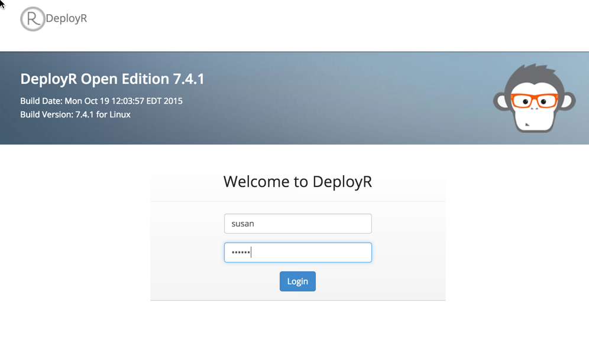

---

# required metadata
title: "Getting Started with DeployR for Data Scientists | DeployR 8.x"
description: "Getting started for Data Scientists: high level introduction to DeployR for Data Scientists"
keywords: "Data Scientists, r programmer, DeployR"
author: "j-martens"
manager: "jhubbard"
ms.date: "03/17/2016"
ms.topic: "get-started-article"
ms.prod: "microsoft-r"
ms.service: ""
ms.assetid: ""

# optional metadata
ROBOTS: ""
audience: ""
ms.devlang: ""
ms.reviewer: ""
ms.suite: ""
ms.tgt_pltfrm: ""
ms.technology: "deployr"
ms.custom: ""

---

# Getting Started - Data Scientists

**Applies to: DeployR 8.x**   (See [comparison between 8.x and 9.x](rserver-whats-new.md#8vs9))

>Looking for docs for Microsoft R Server 9? [Start here](operationalize/about.md).

This guide for data scientists offers a high-level introduction to DeployR. It helps you understand, as a data scientist, how best to work with the product tools to deliver compelling R analytics solutions in collaboration with [application developers](deployr-application-developer-getting-started.md).

In a nutshell, DeployR makes your R analytics (R scripts, models, and data files) easily consumable by any application. The sections that follow explain the steps you'll take to prepare those analytics and make them available to those who need them. They are:

1.  [Develop](#develop-analytics) your R scripts and other analytics with portability in mind
2.  [Test](#test-analytics) those analytics inside and outside of DeployR
3.  [Collaborate](#collaborate) with application developers to deliver powerful R analytic solutions

>For a general introduction to DeployR, read the [About DeployR](deployr-about.md) document.

## Develop Analytics

With DeployR, you can remain focused on creating the R code, models, and data files necessary to drive your analytics solutions without having to concern yourself with how these outputs are eventually [used by application developers](deployr-application-developer-getting-started.md) in their software solutions. That also means that, with minimal change in your current workflow, you can continue developing your analytics with your preferred R integrated development environment (IDE).

All it takes to prepare your R code for use in DeployR is a few simple portability enhancements, which you can make with your existing tool chain. Use the following functions from the `deployrUtils` R package to [make your R code portable](deployr-data-scientist-write-portable-r-code.md):

-   [The `deployrPackage` function](deployr-data-scientist-write-portable-r-code.md#package-portability) guarantees package portability from your local environment to the DeployR server environment when you use it to declare all of the package dependencies in your R script. Packages declared using this function are automatically loaded at runtime, either in your local environment or on the DeployR server. If the packages declared are not yet installed, then they're automatically installed before being loaded.

-   [The `deployrInput` function](deployr-data-scientist-write-portable-r-code.md#input-portability) guarantees script input portability when you use it to define the inputs required by your scripts along with their default values.

-   [The `deployrExternal` function](deployr-data-scientist-write-portable-r-code.md#portable-access-to-data-files) guarantees portability from your local environment to the DeployR server environment when you use it to reference the big data files from within your R scripts.

You can install `deployrUtils` locally [from GitHub](https://github.com/Microsoft/deployrUtils/releases) using your IDE, R console, or terminal window with the following commands:

    library(devtools)
    install_github('Microsoft/deployrUtils')

Learn more on how to [write portable R code using these functions](deployr-data-scientist-write-portable-r-code.md).

Once your R code, models, and data files are ready, you can [verify](#Test-Analytics) their behavior in a DeployR server environment.
 

>**Reproducibility Tip:** Use [the `checkpoint` package](https://mran.microsoft.com/package/checkpoint/) to make sure your script always has the same package dependency versions from a specific date across environments and users by pointing to the same fixed CRAN repository snapshot. When the exact same package dependencies are used, you get reproducible results. This package is installed with Microsoft R Open (and Revolution R Open). [Learn more...](http://mran.microsoft.com/documents/rro/reproducibility/#timemachine)

## Test Analytics

Perhaps not surprisingly, the next step after developing your analytics is to test them. The first step is to test your analytics in your local environment. Then, when you are ready, upload those analytics to the DeployR server environment so you can test your R scripts in a live debugging environment.

### Testing Locally

Testing locally involves running your R code within your local R integrated development environment as you always have. If you encounter issues during your tests, simply refine your analytics and retest them. When satisfied with your results, the next step is to verify that you obtain the same results when testing remotely.

### Testing Remotely

Testing remotely involves executing your R scripts in the DeployR server environment. Doing so is easy when you use the web-based [Repository Manager](deployr-repository-manager/deployr-repository-manager-about.md) that ships with DeployR. In just a few clicks, you can upload and test your R scripts, models, and data files via the Repository Manager. Here's how:

1.  [Log into](deployr-repository-manager/deployr-repository-manager-about.md#logging-in-and-out) the web-based DeployR landing page.

    

2.  Open the Repository Manager tool.

3.  [Create a directory](deployr-repository-manager/deployr-repository-manager-directories.md#creating-directories) that you can use to store your development copies of your R analytics. In our example, we'll call this directory you'll use for development and testing in DeployR, `fraud-score-dev`. These copies of your R analytics won't be shared with the application developers. We'll do that in a later step in the [Collaboration](#collaborate) section.

    

4.  [Upload](deployr-repository-manager/deployr-repository-manager-files.md#uploading-files) your R scripts, models, and data files into that development directory. Those files are now [Analytics Web Services](deployr-application-developer-getting-started.md#analytics-web-services) that, with the proper permissions, can be consumed by any application.

    

5.  [Open the R script](deployr-repository-manager/deployr-repository-manager-files.md#opening-files) you want to test.

    

6.  [Click **Test**](deployr-repository-manager/deployr-repository-manager-testing-debugging-scripts.md) on the right of the **File Properties** page to open the **Test** page. The **Test** page acts as a live debugging environment.

7.  [Click **Run**](deployr-repository-manager/deployr-repository-manager-testing-debugging-scripts.md#running-scripts-in-test-page) in the upper-right hand pane to execute the R script. As the script executes, you'll see the [console output](deployr-repository-manager/deployr-repository-manager-testing-debugging-scripts.md#reviewing-debug-console-output) in the bottom left pane. After execution, you can review the [response markup](deployr-repository-manager/deployr-repository-manager-testing-debugging-scripts.md#reviewing-execution-artifacts) in the bottom right pane.

    

8.  Verify that you experience the same R script behavior in the DeployR server environment as you did when you tested your R scripts locally.

    -   If you encounter issues or want to make further changes to your analytics, then you can refine and test your analytics locally before returning to the Repository Manager to upload and retest remotely again.

    -   If you are ready to start [collaborating with your application developers](#collaborate), you can make your R scripts and other analytics available to them.

## Collaborate

Collaboration with the application developers on your team makes it possible to deliver sophisticated software solutions powered by R analytics. Whenever you develop new analytics or improve existing ones, you must inform the application developers on your team and hand off those analytics as described in this section.

How you share and collaborate on these R analytics depends on whether you plan to do so [on-server](#On-Server-Collaboration), which requires access to a common DeployR server instance, or [off-server](#Off-Server-Collaboration).

This document focuses on the roles and responsibilities of the data scientist. To learn more about the role of the application developer, read the [Getting Started](deployr-application-developer-getting-started.md) guide for application developers.

### Guidance

We strongly recommend the following approach to collaboration:

1.  Share only stable, tested snapshots of your R analytic files with application developers.
2.  Provide the application developers with all necessary details regarding your R analytic files.

### Share Stable, Tested Snapsots

We recommend sharing your R analytic files with application developers prior to their final iteration. By releasing early versions or prototypes of your work, you make it possible for the application developers to begin their integration work. You can then continue refining, adding, and testing your R analytics in tandem.

However, you don't want to share every iteration of your files either. As you develop and update your R analytics, certain modifications might result in code-breaking changes in an R script’s runtime behavior. For this reason, we strongly recommend sharing file snapshots only if they have been **fully tested by you** to minimize the chances of introducing errors when the application developers try them out.

In practice, each snapshot of your R analytics should include completed functionality and/or changes that affects the application interface for which the application developers will need to accommodate.

We also recommend, when working in DeployR, that you keep the development copies of your R analytics in a private and distinct directory from the directory where you'll share your stable snapshots with application developers.

### Provide Complete Details to Application Developers

Once you share a snapshot with application developers, you must let them know that this the snapshot is available and also provide them with **any information that will help them integrate your R analytics** into their application code. Rather than leave the developer guessing as to why their code no longer works, we strongly recommend that you not only to tell them which files are available, but perhaps more importantly, what has changed. Be sure to include:

-   The list of new/updated filenames and their respective directories
-   Any new/updated inputs required by your R script
-   Any new/updated outputs generated by your R scripts

### On-Server Collaboration

When the application developers have access to the same DeployR server instance as you, you can share stable, tested R analytics snapshots there.

1.  [Log into](deployr-repository-manager/deployr-repository-manager-about.md#logging-in-and-out) the web-based [Repository Manager](deployr-repository-manager/deployr-repository-manager-about.md).

    

2.  Open the Repository Manager tool.

3.  [Create a snapshot directory](deployr-repository-manager/deployr-repository-manager-directories.md#creating-directories) for collaboration in which you'll share the snapshots of your R analytics with application developers. Keep in mind that each snapshot should be a stable and tested version of your R analytics.

    >[!TIP]
    >We recommend that you follow a convention when naming your project directories that enables those directories to be easily associated. In our example, the directory we used to upload and test these R analytics in DeployR before sharing them is called `fraud-score-dev`. And here, we'll name the snapshot directory `fraud-score`.

    

4.  Create a copy of each file from your development directory to the newly created project directory:

    1.  [Open each file](deployr-repository-manager/deployr-repository-manager-files.md#opening-files). The **File Properties** page appears.

    	

    2.  In the **File Properties** page, choose **Copy** from the **Manage** menu. The **Copy File** dialog opens.

    	

    3.  Enter a name for the file in the **Name** field. We recommend you use the same name as you have in your development directory. If a file by that name already exists, this will become the new Latest version of that file. The version history is available to file owners.

    4.  Select the new directory you've just created from the **Directory** drop down list.

    5.  Click **Copy** to make the copy. The dialog closes and the **Files** tab appears on the screen.

    6.  Repeat steps a - e for each file you are ready to share.

5.  Add any application developers who will work with these files as owners of those files in the new directory so they can access, test, and download them:

    1.  From the **Files** tab, click the name of the new directory under the **My Files** tree on the left side of the page.

    	

    2.  [Open each file](deployr-repository-manager/deployr-repository-manager-files.md#opening-files) in the new directory. The **File Properties** page appears.

    3.  Optionally, add notes to the application developers in the **Description** field. For example, you could let them know which values should be retrieved.

    4.  Click **Add/Remove** to [add application developers as owners](deployr-repository-manager/deployr-repository-manager-files.md#adding-and-removing-owners) of the file.

    	

    5.  Repeat steps a - d for each file you've just copied to the new directory.

6.  Inform your application developers that new or updated analytics are available for integration. Be sure to provide them with any details that can help them integrate those analytics.

Now the application developer(s) can review the files in the Repository Manager. They can also test the R scripts in the Test page and explore the artifacts. Application developers can use the files in this instance of DeployR as they are, make copies of the files, set permissions on those files, or even download the files to use in a separate instance of DeployR.

### Off-Server Collaboration

If [application developers](deployr-application-developer-getting-started.md) on your project do not have access to the same instance of DeployR as you, then you can share stable snapshots of your R analytics by:

-   Sending the files directly to application developers via email, or
-   Putting them on a secure shared resource such as shared NFS drive, OneDrive, or Dropbox.

Keep in mind that:

-   It is critical that you provide the application developers with any details that can help them integrate those analytics.
-   The files you share should be stable and tested snapshots of your R analytics.

Once you've shared those files, the application developers can upload the files into their DeployR server any way they want including through the [Repository Manager](deployr-repository-manager/deployr-repository-manager-about.md), using client libraries, or via the [raw API](deployr-api-reference.md).

## More Resources

Use the table of contents to find all of the guides and documentation needed by the data scientist, administrator, or application developer.

**Key Documents**
-   [About DeployR](deployr-about.md)
-   [How to Write Portable R Code with deployrUtils](deployr-data-scientist-write-portable-r-code.md) ~ `deployrUtils` package documentation
-   [Repository Manager Help](deployr-repository-manager/deployr-repository-manager-about.md) ~ Online help for the DeployR Repository Manager.
-   [About Throughput](deployr-admin-scale-and-throughput.md#about-throughput) ~ Learn how to optimize your throughput
-   [Getting Started For Application Developers](deployr-application-developer-getting-started.md)
-   [Getting Started For Administrators](deployr-administrator-getting-started.md)

**Support Channel**
-   [Microsoft R Server (and DeployR) Forum](https://social.msdn.microsoft.com/Forums/en-US/home?forum=microsoftr)