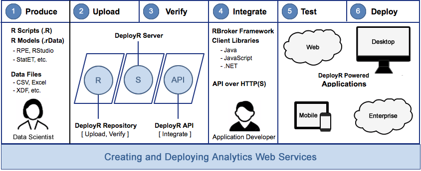

# About DeployR

## Overview

DeployR is an integration technology for deploying R analytics inside web, desktop, mobile, and dashboard applications as well as backend systems. DeployR turns your R scripts into [analytics web services](#g_analyticswebservice), so R code can be easily executed by applications running on a secure server.

Using analytics web services, DeployR also solves key integration problems faced by those adopting R-based analytics alongside existing IT infrastructure. These services make it easy for application developers to collaborate with data scientists to integrate R analytics into their applications without any R programming knowledge.

DeployR is available in two editions: DeployR Open and DeployR Enterprise. DeployR Open is a free, open source solution that is ideal for prototyping, building, and deploying non-critical business applications. DeployR Enterprise scales for business-critical applications and offers support for production-grade workloads, as well as seamless integration with popular [enterprise security solutions](https://deployr.revolutionanalytics.com/documents/admin/security) such as single sign-on (SSO), Lightweight Directory Access Protocol (LDAP), Active Directory, or Pluggable Authentication Modules (PAM).

### Basic Workflow

This diagram captures the basic workflow used by data scientists and application developers when collaborating on the delivery of solutions powered by analytics Web services.

### Workflow In Action

The workflow is simple. A data scientist develops an R script (using standard R tools) and publishes that script to the DeployR server, where it becomes available for execution as an analytics web service. Once published, R scripts can be executed by any authorized application using the DeployR [(API)](https://deployr.revolutionanalytics.com/documents/dev/api-doc/guide/).

The following real-world scenario demonstrates the key concepts introduced in preceding workflow diagram.

While this scenario is provided as an example only, it highlights how DeployR acts as a effective bridge between data scientist and application developer workflows. By supporting a clean separation of concerns, DeployR delivers arbitrarily sophisticated R analytics to any network-enabled application, system or software solution.

>[!IMPORTANT]
>**The Scenario:** As a solutions provider at an insurance company, you have been tasked with enhancing an existing customer support system to deliver real-time, high-quality policy quotes to customers who contact your customer support center. 
>
>**The Plan:** To deliver this solution, you decide to leverage the power of R-based predictive analytics with DeployR. The solution relies on a real-time scoring engine architecture to rapidly generate and return accurate scores to your existing customer support system. These scores can then be used to drive the customer experience to a successful conclusion. At a high-level, such a DeployR-powered solution can be realized as follows: 
>
>1. **Produce:** Data scientists begin by building an appropriate predictive model and scoring function for insurance policy quotes using their existing analytics tools and data sets. 
>
>2. **Upload:** Once the model and scoring function are ready, the data scientist uploads these files to the DeployR repository via the Repository Manager. Uploading the scoring function as an R script will automatically turn it into an analytics Web service. 
>
>3. **Verify:** As a final step, the data scientist should test and verify the scoring function against a live DeployR server via the Repository Manager. 
>
>	>Handoff From Data Scientist to Application Developer  
>
>4. **Integrate:** Application developers choose and download their preferred client application integration tool: RBroker framework, client library or working with the raw API. 
>
>5. **Test:** With their tool selected, application developers implement the integration between the customer support system and the DeployR-powered analytics Web service. This can be an iterative process with testing at each stage of development. 
>
>6. **Deploy:** Once application developers are confident their integration is completed, tested, and verified, it is time to deploy your enhanced customer support system to your live production environment.

## Roles & Responsibilities

In this section, you will find a description of the roles and responsibilities of each actor in DeployR:

-   [Data scientists](#rprogrammers)
-   [Application developers](#appdevelopers)
-   [System administrators](#administrators)

This diagram depicts how data scientists and application developers collaborate when working with DeployR.

### Data Scientists

#### Role

Data scientists, sometimes referred to as R programmers, typically focus on developing analytics solutions using their existing analytics tool chain—the R Productivity Environment (RPE), RStudio, StatET, and others. To maximize the impact of these data scientists, DeployR is designed to encourage minimal change in this workflow. Therefore, data scientists can remain focused on creating the R code, models, and data files necessary to drive your analytics solutions without having to concern themselves with how these outputs are eventually used by application developers in their software solutions.

In DeployR, there is but one tool for the data scientists -- the [Repository Manager](#g_repoman). The Repository Manager is a web-based tool that serves as a bridge between the data scientist’s work and the deployment of that work into the DeployR repository. When the data scientist uploads his or her R scripts, models, and data files into the Repository Manager, they turn into [analytics Web services](#g_analyticswebservice) that can be consumed by any software solution. Once deployed, application developers can create DeployR-powered client applications and integrations.

#### Responsibilities

With DeployR, the recommended steps for a data scientist are both simple and familiar:

1.  Develop your analytics
2.  Test those analytics
3.  Collaborate with the application developers

Get more details in the [Getting Started Guide Data Scientists](https://deployr.revolutionanalytics.com/documents/getting-started/data-scientist).

### Application Developers

#### Role

Unlike the data scientist who focuses solely on developing the R scripts, models and data files, the application developer does not need to know any R. Instead, this role is focused solely on integrating the output of the data scientists' work, [analytics Web services](#g_analyticswebservice) into their applications. The hand-off occurs in the [Repository Manager](#g_repoman). The separation of responsibilities between the data scientists and application developers is key to working effectively in the DeployR environment.

There are several client application integration tools available to application developers in DeployR. The [RBroker framework and the client libraries](https://deployr.revolutionanalytics.com/dev/), which are provided in Java, JavaScript or .NET, greatly simplify the integration for those working in those languages. However, to integrate analytics Web services using other programming languages, the [API Reference](https://deployr.revolutionanalytics.com/documents/dev/api-doc/guide/) guide details everything you'd need to know.

#### Responsibilities

Regardless of the integration tool you choose, or whether you are building a new application, system or solution versus enhancing an existing one, the basic steps to leveraging DeployR-powered analytics Web services inside any application remain simple and consistent:

1.  Consult with the data scientists responsible for developing the R analytics outputs in order to determine your application's analytics dependencies (inputs and outputs).

2.  Verify these dependencies in the Repository Manager by [testing](https://deployr.revolutionanalytics.com/documents/help/repo-man/index.html#j-script-test.htm) the R scripts live on DeployR. For each script, you can inspect the API request and API response in the Artifacts pane to learn how your application needs to interact with that script. Note: Once the dependencies are in the DeployR repository, they become [analytics Web services](#g_analyticswebservice).

3.  Begin your integration by choosing a client application integration tool. [Download the RBroker framework or a client library](https://deployr.revolutionanalytics.com/docanddown/) in either Java, JavaScript, or .NET. Or, if working in another language, read the [API Reference](https://deployr.revolutionanalytics.com/documents/dev/api-doc/guide/) guide. To help you familiarize yourself with these tools, check out the tutorials and documentation provided on this site.

4.  Build or extend your application to take full advantage of DeployR-powered analytics Web services.

Learn more in the [Getting Started Guide for Application Developers](https://deployr.revolutionanalytics.com/documents/getting-started/application-developer).

### System Administrators

Not unlike the responsibilities typically associated with managing and maintaining other server software, DeployR system administrators are responsible for:

1.  [Provisioning suitable hardware](https://deployr.revolutionanalytics.com/documents/admin/install/#sysreq) in preparation for a DeployR install.
2.  Installing DeployR using [these instructions](https://deployr.revolutionanalytics.com/documents/admin/install/).
3.  Customizing DeployR [server policies](https://deployr.revolutionanalytics.com/documents/help/admin-console/#Topics/policies-intro.htm).
4.  Creating and managing DeployR [user accounts](https://deployr.revolutionanalytics.com/documents/help/admin-console/#Topics/user-intro.htm).
5.  Customizing DeployR [security policies](https://deployr.revolutionanalytics.com/documents/admin/security/).
6.  Monitoring and [maintaining](https://deployr.revolutionanalytics.com/documents/admin/troubleshoot/#health) your DeployR deployment.

[Consult the administration documentation](https://deployr.revolutionanalytics.com/admin/) that details the various DeployR tools made available to administrators. These tools simplify common and advanced administrative tasks.

**DeployR Security**  
DeployR supports a highly flexible, enterprise-grade security framework that verifies identity, enforces permissions, and ensures privacy.

Identity is established and verified using many well-known authentication solutions. Basic authentication, using username and password credentials, is available to all DeployR installations by default. The DeployR Enterprise extends support for authentication by providing a seamless integration with established enterprise security solutions including CA Single Sign-On, PAM authentication, LDAP authentication, and Active Directory authentication.

Learn more about authentication, access controls, and privacy with DeployR in our [Security](https://deployr.revolutionanalytics.com/documents/admin/security) guide.

Learn more in the [Getting Started Guide for Administrators](https://deployr.revolutionanalytics.com/documents/getting-started/administrator).

## Architecture

DeployR is a standalone server product, potentially sitting alongside but never directly connected with other systems, that can be deployed on-site as well as in private, public, or hybrid cloud environments.

Behaving like an on-demand R analytics engine, DeployR exposes a wide range of related analytics services via a [Web services API](https://deployr.revolutionanalytics.com/documents/dev/api-doc).

The fact that DeployR is a standalone product means that any software solution, whether it's a backend enterprise messaging system or a client application running on a mobile phone, can [leverage DeployR-powered analytics services](https://deployr.revolutionanalytics.com/dev).

DeployR Enterprise supports a scalable grid framework, providing load balancing capabilities across a network of node resources. On the other hand, DeployR Open supports a static grid framework of a single, local grid node with a fixed slot limit. For more on planning and provisioning your grid framework, see the [Scale & Throughput](https://deployr.revolutionanalytics.com/documents/admin/throughput) guide.

## Glossary Of Terms

#### Analytics Web Service

In DeployR, we refer to any web service that exposes R analytics capabilities over the network as an analytics web service. While “web services” is commonly used in the context of browser-based web applications, these services—in particular, analytics web services—can just as easily be integrated inside desktop, mobile, and dashboard applications, as well as backend systems. For example, when you upload an R script into the DeployR Repository Manager, the script may then be executed as an analytics web service by any application with appropriate permissions.

*Note*: When you upload an R script into the [Repository Manager](#g_repoman), it becomes an analytics Web service that, with the appropriate access control, can be consumed by any application.

#### DeployR Administration Console

The Administration Console is a tool, delivered as an easy-to-use Web interface, that facilitates the management of users, roles, IP filters, the grid and runtime policies on the DeployR server. Learn more [here](https://deployr.revolutionanalytics.com/documents/help/admin-console/).

#### DeployR Repository Manager

The Repository Manager is a Web-based tool that serves as a bridge between the data scientist's scripts, models, & data and the deployment of that work into the DeployR repository to enable application developers to create DeployR-powered client applications and integrations. Learn more [here](https://deployr.revolutionanalytics.com/documents/help/repo-man/).

