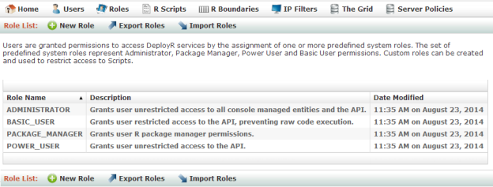
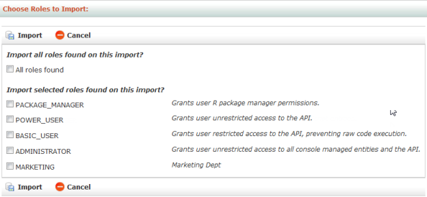

---

# required metadata
title: "DeployR Administration Console Help | DeployR 8.x"
description: "Managing Roles in the DeployR Administration Console"
keywords: ""
author: "j-martens"
ms.author: "jmartens"
manager: "jhubbard"
ms.date: "03/17/2016"
ms.topic: "article"
ms.prod: "microsoft-r"

# optional metadata
#ROBOTS: ""
#audience: ""
#ms.devlang: ""
#ms.reviewer: ""
#ms.suite: ""
#ms.tgt_pltfrm: ""
ms.technology: "deployr"
#ms.custom: ""

---

# Managing Permissions with Roles

Users are granted permissions to perform operations on the DeployR Web services API by the role(s) assigned to them. Having clearly defined roles in this console simplifies the process of granting permissions to new or existing users.

DeployR is delivered with predefined system roles you can assign to users. These predefined system roles determine user permissions within DeployR by granting individual users access to the console or programmatic access on the API.

You can also create custom roles to constrain access to certain scripts. Once you have created a custom role for that purpose, a script author can set a script’s access rights to **Restricted** and specify one or more new custom roles. Then, only those users assigned to at least one of the roles specified for that script are permitted to execute the script. You can manage the access rights to a file in the [DeployR Repository Manager](../what-is-operationalization.md). 

You can view the available roles by clicking **Roles** in the main menu. Clicking a role in the list reveals the list of users assigned to this role.

_Figure: Role List page_

  

## Predefined System Roles

The following DeployR system roles are shipped with DeployR and can be assigned to user accounts.

|Role Name|Role&nbsp;Description|
|---------|---------------------|
|`ADMINISTRATOR`|The `ADMINISTRATOR` role identifies the user as an administrator. [There is only one administrator for the console](deployr-admin-console-user-accounts.md#preconfigured-user-accounts), and that is the user `admin`.|
|`POWER_USER`|Users with this role are granted permissions to access the full API and to install R packages. Full access includes the ability to execute scripts and arbitrary blocks of R code.|
|`BASIC_USER`|Users with this role are granted permissions to access the full API with the exception of being able to execute arbitrary blocks of R code on the API. However, they can execute R scripts.|
|`PACKAGE_MANAGER`|Users with this role are granted permissions to install R packages using the `install.packages()` command. By default, `ADMINISTRATOR` and `POWER_USER` have implicit `PACKAGE_MANAGER` rights, while `BASIC_USER` does not.|

## Viewing, Editing, and Assigning Roles

You can review, edit, and assign custom roles. System roles cannot be edited.

**To view and edit a role:**

1.  From the main menu, click **Roles**. The **Role List** page appears.

2.  In the **Role List** table, click the role you want to review or edit. The **Role Details** page displays the role’s name and description as well as the names of any users to which the role is assigned.

	>The list of scripts to which a role may be assigned does not appear on this page.
	
	_Figure: Role Details page_
	
	  

3.  To edit a custom role, do the following:
    1.  Click **Edit**.

    2.  Change the name or description as needed. If you change the name of role, it is updated throughout the console.
    
        >You cannot edit a system role delivered with the product. 
        
    3.  Click **Update** to save the changes.

**To assign a role to a user:**

1.  From the main menu, click **Users**. The **User List** page appears.

2.  Click the account name you want to edit. The **User Details** page appears.
 
3.  Click **Edit**. The **Edit User** page appears.

4.  Select all applicable roles.

5.  Click **Update** to save the changes.

## Creating Custom Roles

While the system roles will suffice in many cases, there are times when it might be beneficial to create custom roles to constrain access to certain scripts according to a specific organizational, departmental, or functional need.

Any script author can set the access rights to his or her script to **Restricted** and specify one or more roles. Then, only the users assigned to one of the specified roles are permitted to execute that script. For more details on defining access rights for scripts, refer the [DeployR Repository Manager](../what-is-operationalization.md) documentation. 

**To create a custom role:**

1.  From the main menu, click **Roles**. The **Role List** page appears.

2.  From the **Role List** page, click **New Role** in the menu. The **New Role** page appears.

	_Figure: New Role page_
        
	  

3. Enter a **Role name** and **Description** for the new role.

4. Click **Create** to save the new role. You can now assign this role to users or scripts in the console. To assign a role, edit the user or script and select the role(s).
 
## Deleting Custom Roles

While you cannot delete any of the system roles, you can delete a custom role. If you delete a custom role that is assigned to users, then that association between user and role is automatically removed upon deletion.
To delete a custom role:

1. From the main menu, click **Roles**. The **Role List** page appears.

2. Click name of the custom role you want to delete. The **Role Details** page appears.

3. Click **Delete**.

4. Click **OK** to confirm that you want to delete.

## Exporting Roles

You can export roles in a CSV file. Exporting can be useful when you want to copy the roles to another machine or to preserve them as a backup, for example. You can later import the contents of this file to this server or across multiple server deployments.

_Figure: Export Roles page_

  

**To export:**

1. From the main menu, click **Roles**.

2. From the **Role List**, click **Export Roles**.

3. Select the role(s) to be exported.

4. Click **Export to File** and save the file.

## Importing Roles

Importing into the server database allows you to retrieve all of the roles from a previously exported CSV file. Alternately, you can also import a CSV file you have created yourself using the proper format.

_Figure: Import Roles page_

  

**To import:**

1. From the main menu, click **Roles**.

2. From the **Role List**, click **Import Roles**.

3. Click **Browse** and select the file to be imported. By default, the file has the CSV extension.

4. Click **Load**.

5. Choose which role(s) to import.

6. Click **Import**. If a role by the same name already exists, a message appears to inform you that the incoming role was rejected.
