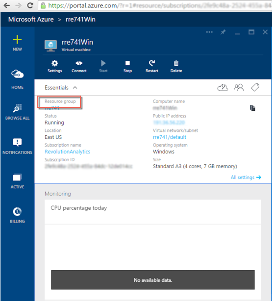
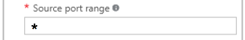

---

# required metadata
title: "Enabling DeployR on the Cloud (Azure, AWS) | DeployR 8.x"
description: "How to Enable DeployR on Azure and AWS (Cloud)"
keywords: ""
author: "j-martens"
manager: "jhubbard"
ms.date: "05/06/2016"
ms.topic: "article"
ms.prod: "microsoft-r"
ms.service: ""
ms.assetid: ""

# optional metadata
ROBOTS: ""
audience: ""
ms.devlang: ""
ms.reviewer: ""
ms.suite: ""
ms.tgt_pltfrm: ""
ms.technology: "deployr"
ms.custom: ""

---

# Enabling DeployR on the Cloud

**Applies to: DeployR 8.x**   (See [comparison between 8.x and 9.x](../rserver-whats-new.md#8vs9))

>Looking for docs for Microsoft R Server 9? [Start here](../deployr-repository-manager/about.md).

You can set up DeployR on **Microsoft Azure** or **AWS**. For each instance, be sure to:
1. Set the server Web context to an external, public IP address and disable IP autodetection.

1. Open three DeployR external ports by adding [Azure endpoints](#configuring-azure-endpoints) or opening the ports through the AWS console to set the appropriate permissions.

1. Update the [firewall](#updating-the-firewall) to set the appropriate security permissions on the internal and external ports used by DeployR.

1. Have the minimum required disk space (or more) for the installation of DeployR. Refer to the installation guide for your DeployR version and operating system. 

>We highly recommended that you also [enable HTTPS support](../deployr-admin-security/deployr-security-https.md) for DeployR to secure the communications to the server.

## Enabling DeployR on Azure

You can set up DeployR on **Microsoft Azure**. For each Azure instance, be sure to:
1. Set the [server Web context](#setting-the-server-web-context) to an external, public IP address.

1. Open three DeployR external ports by adding [Azure endpoints](#configuring-azure-endpoints) to set the appropriate permissions.

1. Update the [firewall](#updating-the-firewall) to set the appropriate security permissions on the internal and external ports used by DeployR.

<br>
### Setting the Server Web Context

The DeployR server Web context must be updated to the Public IP address of the virtual machine.

**To update the DeployR server Web context:**

You must update the server Web context or else you will not be able to access to the DeployR landing page or other DeployR components after installation.

1. Log into the Azure portal and take note of the **Public IP address**.

   
   
1. If DeployR was installed on a virtual machine, remote desktop or SSH into that machine.

1. For **DeployR for Microsoft R Server 8.0.5**:

   1. Launch the DeployR administrator utility script with administrator privileges:

      + On Windows, run:
        ```
        cd %REVODEPLOYR8_1_HOME%\deployr\tools\ 
        adminUtilities.bat 
        ```        

      + On Linux, run:
        ```
        cd $DEPLOYR_HOME/deployr/tools/
        sudo ./adminUtilities.sh 
        ```         

   1. From the main menu, choose option **Run Diagnostics**.   Make sure that the database is running. The database must be running before you can proceed to the next step.

   1. Return to the main menu, choose option **Web Context and Security**. 

   1. From the sub-menu, choose option **Specify New IP or Fully Qualified Domain Name (FQDN)**.

   1. When prompted to specify a new IP or FQDN, enter the new IP or FQDN.

   1. When prompted to confirm the new value, enter `Y`. This change will also disable Automatic IP detection to prevent the new value you just assigned from being overwritten. 

   1. Return to the main menu, choose the option to set a password for the local DeployR admin account.
   
   1. Enter a password for this account. Passwords must be 8-16 characters long and contain at least 1 or more uppercase character(s), 1 or more lowercase character(s), 1 or more number(s), and 1 or more special character(s).
   
   1. Confirm the password.

   1. Return to the main menu and choose option **Start/Stop Server**.  You must restart DeployR so that the changes can take effect. 

   1. When prompted whether you want to stop (S) or restart (R) the DeployR server, enter `R`. It may take some time for the Tomcat process to terminate and restart.

   1. Exit the utility.  
         
1. For **DeployR 8.0.0**:
    
   + On Windows:
    
     1. Make sure that the MongoDB database is running. The database must be running before you can proceed to the next step before you update the Web Context.
    
     1. Open a Command Window with **“Run as Administrator”**.
    
     1. Set the appropriate public IP where `<ip_address>` is the public IP address of the machine. [Learn more about this script](deployr-admin-diagnostics-troubleshooting.md#set-context-800).
        ```
        cd $DEPLOYR_HOME\deployr\tools\
        setWebContext -ip <ip_address>  -disableauto
        ```
    
     1. Confirm the IP address you entered.
    
     1. Disable any automatic IP detection that might overwrite the IP you just assigned.
        ```
        setWebContext -disableauto
        ```           
    
   + On Linux:
    
     1. Set the IP using the `setWebContext.sh` script where `<ip_address>` is the public IP address of the machine. [Learn more about the script arguments](deployr-admin-diagnostics-troubleshooting.md#set-context-800).
        ```
        cd $DEPLOYR_HOME/deployr/tools/
        ./setWebContext.sh -ip <ip_address>
        ```
    
     1. Confirm the IP address you entered.
    
     1. Disable any automatic IP detection that might overwrite the IP you just assigned.
        ```
        ./setWebContext.sh -disableauto
        ```

   >For this change to take effect [restart the DeployR 8.0.0 service](../deployr-common-administration-tasks.md#startstop). Between stopping and starting, be sure to pause long enough for the Tomcat process to terminate.

>We highly recommended that you also [enable HTTPS support](../deployr-admin-security/deployr-security-https.md) for DeployR to secure the communications to the server.

<br>
### Configuring Azure Endpoints

When provisioning your DeployR server on Azure, you must open Azure endpoints for several [DeployR ports](../deployr-installing-configuring.md#updating-your-firewall). 

If custom ports were defined during installation, enable those instead.

_Table: Default Ports by Version_

|Port Number|DeployR for Microsoft R Server 8.0.5|DeployR 8.0.0|
|----------|:--------------:|:--------------:|
|DeployR HTTP port|8050|8000|
|DeployR HTTPS port|8051|8001|
|DeployR event console port|8056|8006|
<br>

**To configure Azure endpoints for DeployR:**

1.  Go to the main Microsoft Azure portal page.

2.  Click the **Resource Group** name.

    

3.  In the table in the **Resource Group** page, click the **Network Security Group**.

4.  In the **Network Security Group** page, click **All Settings** option.

5.  Choose **Inbound security rules**.

6.  Click the **Add** button to create an inbound security rule for each DeployR port as follows:

1.  In the **Add inbound security rule** page, enter a unique name the rule.

2.  Set the protocol to `Any`.

3.  Set the **Source Port Range** to the `*` character.

    

4.  Enter the port number to the **Destination port range** for the DeployR HTTP port, HTTPS port, and event console port.
    > See the bullets at the beginning of this section for these default ports for your version of DeployR.

5.  Click **OK** to save your changes.

6.  Repeat step 6 to add inbound rules for the other DeployR ports.
    

>Don't forget to update the firewall as [described below](#updating-the-firewall).


## Enabling DeployR on AWS

You can set up DeployR on **Amazon Web Services** (AWS).  For each [Amazon EC2 instance](http://docs.aws.amazon.com/general/latest/gr/rande.html), be sure to:

### Set the Web Context for DeployR on AWS

You must update the server Web context or else you will not be able to access to the DeployR landing page or other DeployR components after installation.

1. Take note of the correct **Public IP address**.   

   + On Linux, run the following command  and take note of the IP returned:
     ```
     curl -s checkip.dyndns.org | sed -e 's/.*Current IP Address: //' -e 's/<.*$//
     ```

   + On Windows, visit this URL in your browser (http://checkip.dyndns.org/) and take note of the IP returned.

1. If DeployR was installed on a virtual machine, remote desktop or SSH into that machine.

1. Set the Web context:

    + For **DeployR for Microsoft R Server 8.0.5**:
    
        1. Launch the DeployR administrator utility script with administrator privileges:

            + On Windows, run:
               ```
               cd %REVODEPLOYR8_1_HOME%\deployr\tools\ 
               adminUtilities.bat 
               ```        

            + On Linux, run:
               ```
               cd $DEPLOYR_HOME/deployr/tools/
               ./adminUtilities.sh 
               ```         

        1. From the main menu, choose option **Run Diagnostics**.   Make sure that the database is running. The database must be running before you can proceed to the next step.

        1. Return to the main menu, choose option **Web Context and Security**. 

        1. From the sub-menu, choose option **Specify New IP or Fully Qualified Domain Name (FQDN)**.

        1. When prompted to specify a new IP or FQDN, enter the new IP or FQDN.

        1. When prompted to confirm the new value, enter `Y`. This change will also disable Automatic IP detection to prevent the new value you just assigned from being overwritten. 

        1. Return to the main menu and choose option **Start/Stop Server**.  You must restart DeployR so that the changes can take effect. 

        1. When prompted whether you want to stop (S) or restart (R) the DeployR server, enter `R`. It may take some time for the Tomcat process to terminate and restart.

        1. Exit the utility.  
         
    + For **DeployR 8.0.0**:

        + On Windows:
        
            1. Make sure that the MongoDB database is running. The database must be running before you can proceed to the next step before you update the Web Context.
            
            1. Open a Command Window with **“Run as Administrator”**.
            
            1. Detect the appropriate external IP used for your AWS EC2 instance. 
                ```
                cd $DEPLOYR_HOME\deployr\tools\
                setWebContext -aws
                ```
                
            1. Set the appropriate public IP where `<ip_address>` is the public IP address of the machine. [Learn more about this script](deployr-admin-diagnostics-troubleshooting.md#set-context-800).
                ```
                setWebContext -ip <ip_address> 
                ```
                
            1. Confirm the IP address you entered.
            
            1. Disable any automatic IP detection that might overwrite the IP you just assigned.
                ```
                setWebContext -disableauto
                ```           
                
        + On Linux:
        
            1. Detect the appropriate external IP used for your AWS EC2 instance. 
                ```
                cd $DEPLOYR_HOME/deployr/tools/
                setWebContext -aws
                ```
                
            1. Set the IP using the `setWebContext.sh` script where `<ip_address>` is the public IP address of the machine. [Learn more about the script arguments](deployr-admin-diagnostics-troubleshooting.md#set-context-800).
                ```
               ./setWebContext.sh -ip <ip_address>
                ```
                
            1.  Confirm the IP address you entered.
            
            1.  Disable any automatic IP detection that might overwrite the IP you just assigned.
                ```
                ./setWebContext.sh -disableauto
                ```
                
         >For this change to take effect [restart the DeployR 8.0.0 service](../deployr-common-administration-tasks.md#startstop). Between stopping and starting, be sure to pause long enough for the Tomcat process to terminate.

### Configuring Ports for AWS

When provisioning your DeployR server on AWS, you must set the appropriate security permissions on both the **internal** and **external** ports used by DeployR.

If custom ports were defined during installation, enable those instead.

_Table: Default Ports by Version_
   
|Port Number|DeployR for Microsoft R Server 8.0.5|DeployR 8.0.0|
|----------|:--------------:|:--------------:|
|DeployR HTTP port|8050|8000|
|DeployR HTTPS port|8051|8001|
|DeployR event console port|8056|8006|
<br>

>Don't forget to update the firewall as [described below](#updating-the-firewall).

## Updating the Firewall

Updating your firewall is the last step. 

>We highly recommended that you also [enable HTTPS support](../deployr-admin-security/deployr-security-https.md) for DeployR to secure the communications to the server.

**To update your firewall on Linux:**

On Linux, you must disable `iptables` firewall or equivalent.

<br>

**To update your firewall on Windows:**

In Windows Firewall, you must open the same DeployR ports as you configured as Azure endpoints or in the AWS console.

1. From the **Control Panel**, open the Window Firewall.

1. Click **Advanced Settings**. The **Windows Firewall with Advanced Security** dialog appears.

1. Choose **Inbound Rules**. The list of inbound rules appears.

1. For each port in the table below for your version of DeployR, open the associated rule, such as `RevoDeployR-Enterprise <VERSION> Tomcat - <PORT NUMBER>`.

1. Go to the **Advanced** tab.

1. Select the **Public** checkbox to enable public for this rule.

1. Click **OK**.

1. Repeat 4-7 for all three rules.   

<br>
    
_Table: Inbound Rules for DeployR for Microsoft R Server 8.0.5_
   
|Port Number|Inbound Rule Name|
|----------|--------------|
|8050|`RevoDeployR-Enterprise 8.0.5 Tomcat SSL - 8050`|
|8051|`RevoDeployR-Enterprise 8.0.5 Tomcat SSL - 8051`|
|8056|`RevoDeployR-Enterprise 8.0.5 Tomcat SSL - 8056`|

<br>

_Table: Inbound Rules for DeployR 8.0.0_
   
|Port Number|Inbound Rule Name|
|----------|--------------|
|8000|`RevoDeployR-Enterprise 8.0.0 Tomcat SSL - 8000`|
|8001|`RevoDeployR-Enterprise 8.0.0 Tomcat SSL - 8001`|
|8006|`RevoDeployR-Enterprise 8.0.0 Tomcat SSL - 8006`|

