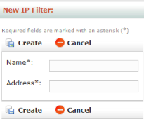
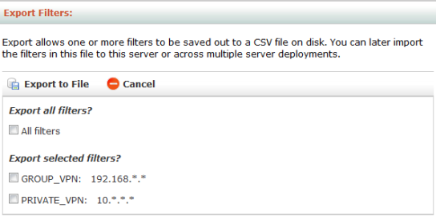

---

# required metadata
title: "DeployR Administration Console Help - DeployR 8.x "
description: "Managing Access with IP Filters in the DeployR Administration Console"
keywords: ""
author: "j-martens"
ms.author: "jmartens"
manager: "cgronlun"
ms.date: "11/10/2017"
ms.topic: "article"
ms.prod: "mlserver"

# optional metadata
#ROBOTS: ""
#audience: ""
#ms.devlang: ""
#ms.reviewer: ""
ms.suite: "machine-learning"
#ms.tgt_pltfrm: ""
#ms.technology: ""
#ms.custom: ""

---

# Managing Access with IP Filters

Access to most DeployR services requires that the user be authenticated and have the proper permissions, which are determined by the system role(s) granted to that user. Access can be further restricted with an IP filter, which are managed in the **IP Filters** tab in this console.

Once you create an IP filter, you can specify and assign the filter to authenticated, asynchronous, and anonymous grid operation modes in the [Server Policies](deployr-admin-managing-server-policies.md) page.

_Figure: IP Filter list_

  

>When entering an IP address, use the dot decimal notation format such as `255.255.1.1`.  Use the asterisk character as a wildcard such as `255.*.*.*`.

## Creating New Filters

**To create a new filter:**

1.  From the main menu, click **IP Filters**.

2.  In the **IP Filter List** page, click **New IP Filter** in the menu. The **New IP Filter** page appears.

	_Figure: New IP Filter page_
	
	  

3.  In the **Name** field, enter a unique name made up of alphanumeric characters and underscores but not spaces nor any other punctuation. 

4.  In the **Address** field, enter the IP address using the Ant-style patterns, such as `10.**`, or masked patterns, such as `192.168.1.0/24` or `202.24.0.0/14`, specifying either IPV4 or IPV6 patterns. Do not enter http:// before the IP sequence.

5.  Click **Create** to save the new filter.

## Deleting Filters

**To delete a filter:**

1. In the **IP Filter List**, click the filter name in the table. The **Edit IP Filter** page appears.

2.  Click **Delete** and confirm the removal of the filter.

## Viewing and Editing Filters

**To view and edit a filter:**

1. From the main menu, click **IP Filters**.

2. From the **IP Filter List** page, click the name of the filter you want to view or edit in the table. The **Edit IP Filter** page appears.

3. Make changes to the name or address as needed.

4. Click **Update** to save the changes.

## Applying Filters

You can apply a filter to a specific [node operating type](deployr-admin-managing-the-grid.md#node-operation-types) in the [**Server Policies**](deployr-admin-managing-server-policies.md) tab in this console so that all nodes designated for that type of operation inherit this IP filter automatically.

## Exporting Filters

You can export one or more IP filters into one `CSV` file. Exporting can be used to copy the IP filters to another machine or to preserve them as a backup. You can later import the contents of this file to this server or across multiple server deployments.

_Figure: Export Filters page_

  

**To export:**

1. From the main menu, click **R Filters**.

2. From the **R Filter List**, click **Export Filters**.

3. Select the R filter(s) you want to export. You can choose to export all of them or individually select the filters to be exported

4. Click **Export to File** and save the CSV file.
 
## Importing Filters

You can import IP filters from a CSV file into the server. This file can come from a previous export or might be a file you created manually using the proper format.

_Figure: Import Filters page_

  

**To import:**

1.  From the main menu, click **R Filters**.

2.  From the **R Filter List**, click **Import Filters**.

3.  Click **Browse** and select the `CSV` file to import.

4.  Click **Load**.

5.  Choose to import all filters or individually select the filter(s) to import.

6.  Click **Import**. If a filter by the same name exists, then a message appears to inform you that the incoming filter was rejected.
