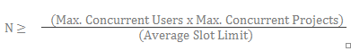
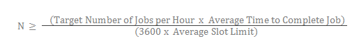

---

# required metadata
title: " Scale & Throughput - DeployR 8.x "
description: "Understanding Scale and Throughput in DeployR"
keywords: "scalability, throughput, DeployR"
author: "j-martens"
ms.author: "jmartens"
manager: "cgronlun"
ms.date: "11/10/2017"
ms.topic: "article"
ms.prod: "mlserver"

# optional metadata
#ROBOTS: ""
#audience: ""
#ms.devlang: ""
#ms.reviewer: ""
ms.suite: "machine-learning"
#ms.tgt_pltfrm: ""
#ms.technology: ""
#ms.custom: ""

---

# Scale & Throughput

**Applies to: DeployR 8.x**   (See [comparison between 8.x and 9.x](../whats-new-in-r-server.md#8vs9))

>Looking to deploy with Machine Learning Server? [Start here](../what-is-operationalization.md).

## Introduction

DeployR is a server framework that exposes the R platform as a service allowing the integration of R statistics, analytics, and visualizations inside Web, desktop, and mobile applications. Within the server, a grid framework provides sophisticated load balancing capabilities for a single DeployR server instance. The overall capacity of your server and grid, in conjunction with the nature and volume of your anticipated workload, determines the runtime characteristics for the tasks that are executing within the DeployR environment.

Some of the most common questions that arise when planning the configuration and provisioning of the DeployR server and grid are:

-   How many users can I support?
-   How many grid nodes do I need?
-   What throughput can I expect?

The answer to these questions will depend on the configuration and size of the server and grid resources allocated to your deployment.

The information in this document will help you familiarize yourself with the central issues related to deployment, and also offers specific recommendations you can use to tailor your DeployR environment.

While this document is primarily intended for DeployR administrators, the section [About Throughput](#about-throughput) also helps application and R script developers optimize their throughput.

>**Get More DeployR Power:** Multiple grid node support is available for DeployR Enterprise only.

## Tuning Server Capacity

DeployR offers the ability to expand and contract server capacity to effectively handle increasing workloads comprised of user sessions, live projects, and background jobs.

When a single DeployR server instance is working with an arbitrarily large number of grid nodes, this server acts as the sole gatekeeper to the grid and all of its resources. It is for this reason that the server has the potential, under a certain load, to become a bottleneck at runtime.

Whenever you increase the resources allocated to the DeployR server, thereby increasing its capacity, this server can handle a higher workload. The act of increasing or even decreasing the resources that are allocated to the server is referred to as *vertically scaling* the server.

In theory, the more memory you allocate to a server, the more work it can perform. However, increasing the amount of allocated memory only works to a point, and part of the configuration process is to tune the system to your particular needs.

By default, the DeployR server instance should be able to comfortably accommodate hundreds of concurrent users, each performing a moderate number of tasks. At runtime, each task consumes server resources regardless of whether that task is an authenticated operation running as a persistent project, an asynchronous operation running as a background job, or an anonymous operation running as a stateless project.

All server resources are allocated on the Java Virtual Machine (JVM) heap, which is a finite block of dedicated memory. By default, DeployR attempts to allocate a JVM heap size of 1024MB, which is a required minimum system requirement in production environments.

>**Take Action!**  
>If you expect or encounter a server load that exceeds the resources provided by the default DeployR configuration, use the JVM command line options `-Xms` and `-Xmx` to increase JVM heap space, and `-Xss` to reduce Java thread stack size used by the server. You can allocate a JVM heap size of up to one fourth of the physical memory size of your server computer. For example, if your server computer has 8 GB of physical memory, allocate a heap size of no more than 2 GB.

## Tuning Grid Capacity

DeployR Enterprise offers the ability to expand and contract grid capacity to effectively handle increasing workloads comprised of user sessions, live projects, and background jobs.  With DeployR Enterprise, not only can you point this default grid node to a remote location and customize its slot limit, but you can also install and configure additional grid nodes to scale for increasing load.

Each node on the grid contributes its own processor, memory, and disk resources. These resources can be leveraged by the DeployR server to run R code as part of user authenticated, asynchronous, and anonymous operations.

Whenever you increase the number of nodes on your DeployR grid, you effectively increase the grid’s capacity. Increasing or even decreasing the number of nodes on your grid is referred to as *horizontally scaling* the grid. An increased grid capacity enables the grid to perform more tasks on behalf of the server. Additionally, increasing or decreasing the resources allocated to the nodes on the grid further contributes to the grid’s horizontal scaling since those resources determine the slot limits. And, slot limits directly impact the overall grid capacity.

By tuning settings under the **Grid** tab in the DeployR Enterprise Administration Console, a server administrator can horizontally scale the capacity of the grid at runtime. The server will automatically distribute the workload across all grid nodes.

A well-configured grid maximizes throughput while minimizing resource contention. The best way to start planning the provisioning of your grid is to gain an understanding of the anticipated workload for this grid. With that workload in mind, you can then scale the grid to handle this load.

The DeployR Enterprise server and grid deployment model can be described as follows, where N is defined as the optimal number of nodes on the grid: `Server[1] -> Node[1..N]` Based on this deployment model, the appropriate value for `N`, when horizontally scaling the grid, will always be a function of the nature and the volume of the anticipated workload.

The following scenarios demonstrate different deployment configurations based on specific workload expectations. These configurations are not mutually exclusive.

### Project Workloads

When tuning your DeployR Enterprise grid’s capacity for the anticipated project workload, use the following formula to determine the optimal number of nodes (N) to have on your grid that can handle authenticated operations:

Where:

-   `N` is the optimal number of nodes required to handle the anticipated workload. For project workloads, these nodes must be configured to support authenticated operations. The system administrator can specify a node’s operating mode when creating or editing that node in the **Grid** tab of the DeployR Administration Console.

-   `Max. Concurrent Users` is the maximum number of DeployR users you anticipate will work concurrently.

-   `Max. Concurrent Projects` is the maximum number of projects a single user can work on concurrently. The system administrator can control the concurrent project limit using the Per-user authenticated limit setting in the **Server Policies** tab of the DeployR Administration Console.
-   `Average Slot Limit` is the average value for the **Slot Limit** setting for each of the grid nodes. The system administrator can set the value for each node’s **Slot Limit** in the **Grid** tab of the DeployR Administration Console.

For more on managing your grid, see the [Administration Console Help](deployr-admin-managing-the-grid.md).

**Recommended Number of Cores**

To prevent resource exhaustion when provisioning the grid, carefully consider the processor, memory, and disk resources available on the node as you define the slot limit. 

For optimal throughput, the slot limit on a given node should equal the number of CPU cores on the node.  

**Example**

Let’s say that we have a DeployR Enterprise deployment with `50` authenticated users, each of which is actively working on their own projects. During the working day, each user may work on up to `3` different projects simultaneously. With as many as 50 users working on as many as three projects, the grid’s capacity must support `150` simultaneous, live projects in order to be capable of handling peak workloads. In this example, if each grid node is configured with sufficient resources for `30` slots, the appropriate value of `N` is at least `5` nodes dedicated to authenticated operations.

### Asynchronous Job Workloads

When tuning your DeployR Enterprise grid’s capacity for your anticipated asynchronous job workload, use the following formula to determine the optimal number of nodes (N) capable of handling asynchronous operations to have on your grid:

Where:

-   `N` is the optimal number of nodes required to handle the anticipated workload. For job workloads, these nodes must be configured to support asynchronous operations. The system administrator can define a node’s operating mode when creating or editing that node in the **Grid** tab of the DeployR Administration Console.

-   `Target Number of Jobs per Hour` is the average number of jobs to execute per hour.

-   `Average Time to Complete Job` is an estimate of the average amount of time it should take to complete each job in the anticipated workload.
-   `3600` is the number of seconds in an hour.

-   `Average Slot Limit` is the average value for the **Slot Limit** setting for each of the grid nodes. The system administrator can set the value for each node’s **Slot Limit** in the **Grid** tab of the DeployR Administration Console.

For more on managing your grid, see the [Administration Console Help](deployr-admin-managing-the-grid.md).

>To prevent resource exhaustion when provisioning the grid, carefully consider the processor, memory, and disk resources available on the node as you define the slot limit. For optimal throughput, the slot limit on a given node should equal the number of CPU cores on the node.

**Example**

Let’s say that we have a DeployR Enterprise deployment where `1000` asynchronous jobs execute per hour (`3600` seconds). Let’s assume that given the nature of these jobs, the total execution time per job is an average of ten minutes (`600` seconds).

If each grid node is configured with sufficient resources for `30` slots, then the optimal value of `N` is at least `6` nodes dedicated to asynchronous operations.

## Considering & Configuring for Throughput

In this section, we present you with a description and some examples to help you understand throughput and the impact that DeployR artifacts have on this throughput. Additionally, we highlight the settings needed to optimize DeployR for high-volume throughput.

**Artifacts** are workspace objects and working directory files that are generated during R code execution. 

In practical terms, the **throughput** for your system is determined by your server and grid capacity in conjunction with the nature and volume of the tasks being processed. DeployR throughput measures the number of tasks processed on the DeployR grid in a fixed time period. 

###Understanding the Nature of Tasks

To illustrate the nature of a task, let’s begin with a summary of the basic workflow for an asynchronous job.

1.  A DeployR user submits an asynchronous job.

2.  The DeployR server queues the job for execution.

3.  The server’s internal job scheduler sees a job queued for execution and attempts to locate an available slot on the grid in which to execute that job. Once located, the scheduler reserves the slot and dispatches the job onto that slot for execution.

4.  When the job execution completes, the server captures a complete snapshot of the R session associated with that slot. Then, the server saves the snapshot as a persistent project in the server database and releases the slot so it is available for further tasks.

> By default, a snapshot of the R session is saved as a persistent DeployR project once a job has finished executing. As an alternative, use the `storenoproject` parameter when scheduling a job to instruct the server not to save a persistent project. If you specify that no project should be saved using the `storenoproject` parameter, you can still store specific artifacts to the repository. In certain scenarios, storing these artifacts to the repository rather than creating a persistent project can result in greatly improved throughput.

### Example of How Tasks Affects Throughput

To demonstrate how throughput is highly dependent on the nature of the tasks, see the following table for a side-by-side comparison of two jobs with very different natures that are executing on the grid. These jobs are contrived to clearly show how the nature of the task itself has significant impact on the observed throughput.

| Sample R Code for Job                            | Sample R Code for Job | rnorm(1:300000) |
|--------------------------------------------------|-----------------------|-----------------|
| 1. Time needed to execute R code                 | 1178 ms               | 1180 ms         |
| 2. Resulting size of R workspace                 | 0.003 Mb              | 2.5 Mb          |
| 3. Time needed to save artifacts to the database | 177 ms                | 1435 ms         |
| 4. Total job time1                    | 1580 ms               | 2850 ms         |

1 The time needed to spin up the job on its slot, execute the job, persist the data, spin down, and release the slot.

From the data in this table, we can learn a lot about the nature of jobs:

1.  Almost the same amount of time was needed to execute the R code in both jobs.

2.  The size of the R workspace generated by the second job is more than 500 times larger than the R workspace generated by the first job.

3.  Due to the significant differences in the size of the artifacts generated by these jobs, it took eight times longer to save the artifacts (R workspace and directory data) from the second job to the DeployR database than it took to save the artifacts for the first job.

4.  As a consequence of the artifacts generated and persisted, the total time taken to handle the second job from start to finish was nearly twice as much as the total time taken to handle the first job.

Beyond the time it takes to execute the R code for a job, we can see that if you are going to save a persistent project after your job finishes executing, then the size of the resulting artifacts have a big impact on the total job time. This simple and somewhat contrived example demonstrates a key point when trying to understand the nature of your persistent tasks and DeployR throughput: **artifacts matter**.

Whether those artifacts are objects in the R workspace or files in the working directory, if the code you execute on a job leaves unnecessary artifacts behind, there can be very real consequences on the overall throughput of your grid. An unnecessary artifact is any workspace object or working directory file that is not required later when evaluating the final result of the job.

### Guideline for Responsible Usage

There are guidelines for responsible task usage to help you maximize throughput. Whenever tasks are performance-sensitive, the most effective step a user can take towards optimizing throughput for his or her own tasks is to ensure that the R code leaves no unnecessary artifacts behind. 

Minimal artifacts ensure minimal data is stored in the resulting persistent project. In some cases, it may be best to use the `storenoproject` parameter to skip the saving of a persistent project altogether, and instead, selectively store only specific workspace and directory data in the repository.

### Configuring DeployR for High-Volume Throughput

For most DeployR deployments, the default configuration delivers adequate server runtime performance and resource usage. However, in some deployments, where the workload is anticipated to be significantly high-volumed, a specialized DeployR configuration may be required.

The default runtime behavior of the DeployR server is determined by the settings in:

+ The [**Server Policies** tab](deployr-admin-managing-server-policies.md) in the Administration Console

+ The DeployR external configuration file, `$DEPLOYR_HOME/deployr/deployr.groovy`

Typically, high-volume throughput deployments are characterized by a very large number of short-lived tasks that need to be executed as transactions without direct end-user participation or intervention. 

For such high-volume throughput deployments, you may need to enable the following properties in the `deployr.groovy` file:

    deployr.node.validation.on.execution.disabled=true
    deployr.node.validation.on.heartbeat.disabled=true

Enabling these configuration properties will result in the following direct consequences on the runtime behavior of the DeployR server:

+ The DeployR server becomes capable of executing hundreds of thousands of short-lived tasks without risking resource exhaustion.

+ Grid node validation at runtime is disabled, which means the grid's ability to self-heal when grid nodes fail and recover is no longer supported.
  >Without self-healing, node failures on the grid may interfere with the future scheduling and execution of tasks on the grid. Therefore, we recommend that you enable these `deployr.groovy` file properties only if you determine that the default DeployR configuration fails under the anticipated loads.