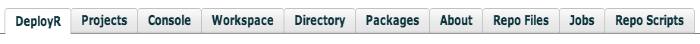

---

# required metadata
title: "DeployR API Explorer Tool - DeployR 8.x "
description: "DeployR API Reference Guide"
keywords: ""
author: "j-martens"
ms.author: "jmartens"
manager: "jhubbard"
ms.date: "11/10/2017"
ms.topic: "article"
ms.prod: "microsoft-r"

# optional metadata
#ROBOTS: ""
#audience: ""
#ms.devlang: ""
#ms.reviewer: ""
#ms.suite: ""
#ms.tgt_pltfrm: ""
ms.technology: "deployr"
#ms.custom: ""

---

#  The API Explorer Tool

**Applies to: DeployR 8.x**   (See [comparison between 8.x and 9.x](../whats-new-in-r-server.md#8vs9))

>Looking for docs for Microsoft R Server 9? [Start here](../what-is-operationalization.md).

The DeployR API is extensive, providing a wide range of services related to [users](deployr-api-reference.md#users-on-the-api), [projects](deployr-api-reference.md#projects-on-the-api), [jobs](deployr-api-reference.md#jobs-on-the-api) and the [repository](deployr-api-reference.md#repository-on-the-api). To help developers familiarize themselves with the full set of APIs DeployR ships with a Web-based API Explorer tool. This tool allows developers to explore the DeployR API in an interactive manner.

>You cannot log in to DeployR from two different accounts within the same brand of browser program. To use two or more different accounts, you need to log in to each one in a separate brand of browser. 

>[!NOTE]
>Hovering your mouse over most UI elements in the API Explorer reveals helpful tooltips.

##Accessing the API Explorer

The API Explorer is accessible after auto-installing DeployR. With a manual installation on Linux, make sure you install the API Explorer software. For more information, see the DeployR Installation Guide for your OS.

+ Visit the DeployR home page at `http://<DEPLOYR-SERVER-IP-ADDRESS-AND-PORT>/deployr/landing/`. From there, you can launch the API Explorer in your Web browser by clicking the API Explorer link near the top of the page.

+ Or, access the API Explorer directly here: `http://<DEPLOYR-SERVER-IP-ADDRESS-AND-PORT>/deployr/test/drive/deployr/api.html`.

>This tool requires that the Adobe Flash Player plug-in is installed and enabled in your Web browser.

## Overview of the API Explorer Interface 

The interface to the API Explorer consists of four main panels:

###Panel 1: Preferences 

At the top of the API Explorer window, you can find the Preferences Panel. Preference controls are on the right side of this panel. You can use these controls to set global preferences for all of the API calls you make within this tool.

These global preferences are described as follows:

-  ***API*** : this preference specifies whether JSON encodings should be used on API calls.
-  ***DEV*** : this preference specifies the default device for rendering plots in R: PNG or SVG
-  ***DLD*** : this preference specifies whether file downloads are saved as attachments or rendered directly in the Web browser.

###Panel 2: The API Tabs

The center section of the API Explorer window contains the API tabs panel:

Use the functionality found under each tab in API Explorer to interact with and invoke a subset of the full API. Each of these tabs is described in the following sections:

**DeployR Tab**

The DeployR tab is the starting point in the API Explorer. This tab gives the user access to the full set of [User APIs](deployr-api-reference.md#users).

When a user first launches the API Explorer the DeployR tab and the Repo Scripts tab are the only tabs enabled in the API Tabs Panel. In order to gain access to additional tabs, you must first sign in to DeployR.

Once you successfully authenticate with DeployR the following tabs are activated:

- DeployR
- Projects
- Repo Files
- Jobs

>When you sign out of DeployR, most tabs are automatically disabled except the default DeployR tab and the Repo Scripts tab, which are always enabled.

**Projects Tab**

The Projects tab provides access to the full set of [Project Management APIs](deployr-api-reference.md#projects).

Once you select a specific project from the list of projects displayed under this tab, the following set of additional project-specific tabs are enabled in addition to those enabled earlier:

- Console
- Workspace
- Directory
- Packages
- About

The functionality found under these tabs allows you to interact with APIs on the selected project.

>Clearing the active selection in the list of projects displayed under the Projects tab will automatically disable the complete set of project-specific tabs.

**Console Tab**

The Console tab offers access to the full set of [Project Execution APIs](deployr-api-reference.md#projexec).

** Workspace Tab**

The Workspace tab offers access to the full set of [Project Workspace APIs](deployr-api-reference.md#project-workspace).

**Directory Tab**

The Directory tab offers access to the full set of [Project Directory APIs](deployr-api-reference.md#projdir).

**Packages Tab**

The Packages tab offers access to the full set of [Project Package APIs](deployr-api-reference.md#projpkg).

**About Tab**

The About tab offers access to the [/r/project/about](https://microsoft.github.io/deployr-api-docs/8.0.5/#r-project-about) and [/r/project/about/update](https://microsoft.github.io/deployr-api-docs/8.0.5/#r-project-about-update) APIs. These APIs appear in their own tab due to space constraints in the UI.

**Repo Files Tab**

The Repo Files tab offers access to the full set of [Repository File APIs](deployr-api-reference.md#repofiles).

**Jobs Tab**

The Jobs tab offers access to the full set of [Job APIs](deployr-api-reference.md#jobs).

**Repo Scripts Tab**

The Repo Scripts tab offers access to the full set of [Repository Script APIs](deployr-api-reference.md#reposcripts).

###Panel 3: API Request

The lower left area of the API Explorer window contains the API Request Panel. Each time you make an API call, this panel automatically displays details of that call, including the following:

-  API call parameters
-  API call method
-  API call endpoint

###Panel 4: API Response Markup

The lower right area of the API Explorer window contains the API Response Markup Panel. Each time an API call sees a response from the server, the complete response markup for the call is displayed in this panel.

