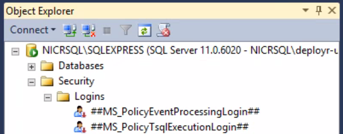

---

# required metadata
title: "Install DeployR for Microsoft R Server 2016 on Windows | DeployR 8.x"
description: "How to install, migrate, and configure DeployR"
keywords: "install, installation, DeployR, configuration, configure"
author: "j-martens"
manager: "jhubbard"
ms.date: "06/20/2016"
ms.topic: "article"
ms.prod: "microsoft-r"
ms.service: ""
ms.assetid: ""

# optional metadata
ROBOTS: ""
audience: ""
ms.devlang: ""
ms.reviewer: ""
ms.suite: ""
ms.tgt_pltfrm: ""
ms.technology: "deployr"
ms.custom: ""

---

# Installing DeployR for Microsoft R Server 2016 (8.0.5) on Windows

**Applies to: DeployR 8.x**   (See [comparison between 8.x and 9.x](../whats-new-in-r-server.md#8vs9))

>Looking for docs for Microsoft R Server 9? [Start here](../what-is-operationalization.md).

##Before You Begin

Read and follow these points before you begin the installation process.

>[!IMPORTANT]
>-   If you already have a version of DeployR installed, follow the [migration instructions](#migrate) first.
>
>-   We highly recommend installing DeployR on a dedicated machine. Always install the DeployR main server first before any grid nodes.
>
>-   While it is technically possible to run instances of two different versions of DeployR side-by-side on a single machine, we strongly recommend that you dedicate one machine for each server instance that is *in production* so as to avoid resource contention.
>

<a name="system-requirements"></a>
## System Requirements

Verify that the computer meets the following minimum hardware and software requirements.

_Table: System Requirements_

|System&nbsp;Requirement|Value  | 
|-------------------|--------------------------|
|Operating Systems| Windows Server 2012, Windows Server 2016<br><small>(64-bit processor only)</small>|
|Hardware|Intel Pentium®-class processor; 3.0 GHz recommended|
|Free disk space|250+ GB recommended|
|RAM|4+ GB recommended|
|Java JVM heap size|1+ GB in production|
|Swap space|8+ GB for larger data sets|
|Internet access|To download DeployR and any dependencies, interact with the Repository Manager, Administration Console, API Explorer Tool.|

<a name="depend"></a>
## Installing Dependencies

The following dependencies are required before you can install the DeployR main server machine or any additional grid node.

DeployR Enterprise depends on the manual installation and configuration of these dependencies.

| Dependency Name                              | DeployR Server | DeployR Grid Node |
|----------------------------------------------|----------------|-------------------|
| Microsoft R Server 2016 and its dependencies | Yes            | Yes               |
| DeployR Rserve 8.0.5 (installed for you)     | Yes            | Yes               |
| Java™ Runtime Environment 8 (64-bit)         | Yes            | No                |

.

**To install the required dependencies for DeployR Enterprise:**

1. On the DeployR server, [download](http://go.microsoft.com/fwlink/?LinkId=789397) and install **Java™ Runtime Environment 8**, `jre-8u<NUMBER>-windows-x64.exe`. Java is only required on the DeployR server, not on any grid node machines.

1. Download **[SQL Server 2016 and R Server (standalone)](https://aka.ms/eval-sql-server-2016 )**, which includes ScaleR for multi-processor and big data support. Then, follow [the instructions](https://msdn.microsoft.com/en-us/library/mt695941.aspx) provided with R Server to install it as well as any of its dependencies. 

1. _If you have internet access_ while installing DeployR, the DeployR installation setup will attempt to install the DeployR Rserve dependency for you. 

   _If you are installing while offline_, you will have to [download and install DeployR Rserve 8.0.5](https://github.com/Microsoft/deployr-rserve/releases) manually as [described here](deployr-admin-diagnostics-troubleshooting.md#manual-package-install).

<a name="installserver"></a> 
## Installing DeployR Server

The basic installation of DeployR will install the DeployR main server after which you can also install additional [grid nodes](#gridnodes) for optimized workload distribution.

After installing the [prerequisites](#depend) above, install DeployR as follows:

**To install the DeployR Server:**

>If you need to disable your anti-virus software to complete the DeployR installation process, then turn it back on as soon as you are finished.

1. Log in as a user with administrator rights.

1. Get the DeployR installer file.
   + From Microsoft Volume Licensing Service Center (VLSC): 
     1. Once you've signed the license purchase agreement with Microsoft, you'll get your credentials. 
     1. Log in and search for **SQL Server 2016 Enterprise Edition**. 
     1. In the product page, click **Continue**.  
     1. Download the **SQL Server Enterprise Edition 2016 DeployR 64 Bit** ISO file. 
     1. Double-click the ISO file to mount it as a DVD drive. 
     1. Then, select and run `DeployR-Enterprise-8.0.5.exe`.

   + From MSDN:
     1. Log into [MSDN subscriptions](http://msdn.microsoft.com/subscriptions/downloads) or [Technet]( 
     http://technet.microsoft.com/subscriptions/downloads). 
     1. Search for **DeployR**.
     1. Download the ZIP file.
     1. Extract the files.

   + From Visual Studio Dev Essentials:
     1. Log into [Visual Studio Dev Essentials](https://myprodscussu1.app.vssubscriptions.visualstudio.com/Downloads). 
     1. Search for **Microsoft R Server**.
     1. Download the DeployR for SQL Server Enterprise Edition ZIP file.
     1. Extract the files.

1. Launch the `DeployR-Enterprise-8.0.5.exe` installer and follow the onscreen prompts to complete the installation. 

   >**Troubleshooting:** During installation, certain details (and/or errors) are written to the following log files under the `%temp%` directory: `DeployR-configuration.log`, `DeployR-dependencies.log`, and `DeployR-Enterprise-8.0.5.log`. You can also learn about other diagnostic and troubleshooting topics [here](deployr-admin-diagnostics-troubleshooting.md#troubleshooting).

1. Review and follow these critical [post-installation steps](#postinstall). You will not be able to log into the server until you set a password.

<a name="postinstall"></a>
##Post Installation Steps

The following steps outline what you need to do after running the DeployR installer. 

1.  **Set the administrator's password** so you can log into the server and its landing page.

    1. Launch the DeployR Administrator Utility script with **administrator privileges**:
       ```
       cd C:\Program Files\Microsoft\DeployR-8.0.5\deployr\tools\ 
       adminUtilities.bat
       ```
       
    1. From the main menu, choose the option to set a password for the local DeployR `admin` account.
    
    1. Enter a password for this account. Passwords must be **8-16 characters** long and contain at least 1 or more uppercase character(s), 1 or more lowercase character(s), 1 or more number(s), **and** 1 or more special character(s).
    
    1. Confirm the password.

1. **Log into the DeployR landing page** as `admin` to test your newly defined password at `http://<DEPLOYR_SERVER_IP>:8050/deployr/landing`.

   >[!IMPORTANT]
   >At this point, you will only be able to login locally using `localhost`. You will be able to login remotely only once you've [configure public access](#configuring-public-access) in a later step in this section.

1. [Optional] **Set up any grid nodes.** If desired, install and configure any [additional grid nodes](#gridnodes).

1. [Optional] If you want to [use non-default port numbers for DeployR](deployr-admin-diagnostics-troubleshooting.md#changeport), manually update them now.

1. [Optional] If you want to **use a SQL Server database** locally or remotely instead of the default local H2 database, configure that as [described here](#sqlserver).

1. [Optional] If you need to **provision DeployR on Azure or AWS** as described in [these steps](deployr-admin-install-in-cloud.md).

1. To **make DeployR accessible to remote users**, [update the inbound firewall rules](#updating-your-firewall). 

1. **Run diagnostic tests**. Test the install by running the full [DeployR diagnostic tests](deployr-admin-diagnostics-troubleshooting.md#diagnostic-testing). If there are any issues, you must solve them before continuing. Consult the [Troubleshooting section](deployr-admin-diagnostics-troubleshooting.md) for additional help or post questions to our [DeployR Forum](http://go.microsoft.com/fwlink/?LinkID=708535).

1. **Review security documentation** and consider **enabling HTTPs**. Learn more by reading the [Security Introduction](deployr-security.md) and the [Enabling HTTPs](../operationalize/configure-https.md) topic.

   >We strongly recommended that SSL/HTTPS be enabled in **_all production environments_**.

1. **Check the web context**. If the wrong IP was detected during installation, [update that Web context](#configuring-public-access) now.

1. **Get DeployR client-side developer tools**, including the [RBroker framework and client libraries](deployr-tools-and-samples.md).

1. **Create accounts for your users** in the [Administration Console](../deployr-admin-console/deployr-admin-console-user-accounts.md). Then, provide each user with their username and password as well as the address of the DeployR landing page.

1. **Learn more**. Read the [Administrator Getting Started](deployr-administrator-getting-started.md) guide. You can also read and share the [Data Scientist Getting Started](deployr-data-scientist-getting-started.md) and the [Application Developer Getting Started](deployr-application-developer-getting-started.md) guides.    

<br>

## Configuring DeployR

For the best results, complete these configuration topics in the order in which they are presented.

<a name="firewall"></a>
### Updating Your Firewall

During installation, the Windows firewall was automatically updated with several new inbound rules for  inbound communications to DeployR. For your security, those inbound rules are disabled by default and set to a `Private` profile. 

**To make DeployR accessible to remote users:**

1. Edit the inbound rules in the Windows Firewall.

1. In the Properties dialog, enable each rule.

1. In the Advanced tab of that dialog, set the profile to `Public` or `Domain`. 

| Machine                   | Default Ports                         | Open Ports                                                                          |
|---------------------------|---------------------------------------|-------------------------------------------------------------------------------------|
| DeployR server machine    | Tomcat ports:<br />- `8050` (Tomcat default port)<br />- `8051` (Tomcat HTTPS port)           | To the outside|
| DeployR server machine    | Event Console port:<br />- `8056` (DeployR event console port) | To the public IP of DeployR server AND to the public IP of *each* grid node machine |
| Remote grid node machines | RServe ports:<br />- `8054` (RServe connection port)<br />- `8055` (RServe cancel port)          | To the public IP of the DeployR server |


If any of the following cases exist, update your firewall manually:

-   Whenever you want DeployR to be accessible from another machine, edit the rules as described above in this topic.

-   Whenever you use **non-default port numbers** for communications between DeployR and its dependencies, add those port numbers instead of those in the table above.

-   If connecting to a **remote database**, be sure to open the database port to the public IP of the DeployR server.

-   If defining NFS ports for **external directory support**, see the Configuration section of the [Managing External Directories for Big Data](deployr-admin-manage-big-data.md#setting-up-nfs-setup) guide.

>If provisioning DeployR on a **cloud service**, configure endpoints for these ports on your [Azure or AWS EC2 instance](deployr-admin-install-in-cloud.md), or enable port-forwarding for VirtualBox.
>[You can change any DeployR ports](deployr-admin-diagnostics-troubleshooting.md#changeport).                               

### Configuring Public Access

When the wrong IP is defined, you will not be able to access to the DeployR landing page or other DeployR components after installation or reboot. In some cases, the wrong IP address may be automatically assigned during installation or when the machine is rebooted, and that address may not be the only IP address for this machine or may not be publicly accessible. If this case, you must update the server Web context address.

To fix this issue, you must define the appropriate external server IP address and port number for the **Server web context** and disable the autodetection of the IP address.

**To make changes to the IP address:**

1.  Launch the DeployR administrator utility script with administrator privileges:

           cd C:\Program Files\Microsoft\DeployR-8.0.5\deployr\tools\ 
           adminUtilities.bat

2.  From the main menu, choose the option to configure the Web Context and Security options for DeployR.

3.  From the sub-menu, enter `A` to specify a different IP or fully qualified domain name (FQDN).

4.  Specify the new IP or FQDN. For [Azure or AWS EC2 instances](deployr-admin-install-in-cloud.md) services, set it to the external **Public IP**.

5.  Confirm the new value. Note that the IP autodetection will be turned off when you update the IP/FQDN.

6.  Return to the main menu.

7.  To apply the changes, restart the DeployR server using option `2` from the main menu.

<a name="gridnodes"></a>
###Installing DeployR Grid Nodes

When you install the DeployR server, one local grid node is installed automatically for you. DeployR Enterprise offers the ability to expand your Grid framework for load distribution by installing and configuring additional grid nodes.

>[!TIP]
>-   For help in determining the right number of grid nodes for you, refer to the [Scale & Throughput](deployr-admin-scale-and-throughput.md#tuning-grid-capacity) document.
>-   Once you have installed and configured one grid node, you can copy the files over from the server that has already been set up over to the next one.
>-   Always install the main DeployR server first.
>-   Install each grid node on a separate host machine.

**To install DeployR grid nodes:**

_After installing_ the [main DeployR Enterprise server](#installserver), install each grid node on a separate machine as follows:

1.  Log into the machine on which you will install the grid node with administrator rights.

2.  Install Microsoft R Server 2016 [as described here](#depend) on the grid node machine.

3.  Download the DeployR node installer file, `DeployR-Enterprise-Node-8.0.5.exe`, which can be found in the Microsoft R Server 2016 package. [Contact technical support](https://support.microsoft.com/) if you cannot find this file.

4.  Launch the installer, `DeployR-Enterprise-Node-8.0.5.exe`.

5.  If a message appears onscreen during installation asking whether you want to *“allow the following program to make changes to this computer”*, click **Continue**.

6.  When the script is complete, press the **Enter** key to exit the window.

7.  Repeat these steps on each machine that will host a remote grid node.

<br>
<br>
**To configure & validate nodes:**

After installing DeployR Enterprise server and any grid node machines, you must configure these grid nodes as follows:

1. [Set the proper firewall rules](#firewall) to open the RServe ports ONLY to the public IP of the DeployR server.

1. Log into the DeployR landing page as `admin` at `http://<DEPLOYR_SERVER_IP>:8050/deployr/landing` where `<DEPLOYR_SERVER_IP>` is the IP of the main DeployR server.

2. Go to the **Administration Console**.

3. Click **The Grid** in the main menu.

4. For each remote grid node you installed earlier, do the following: (You do not need to configure the DeployR Default Node.)

    1. Click **New Grid Node**.

    2. Configure the **Name**, **Host**, **Operating Type** and **External Directory** &nbsp;[using these instructions](deployr-admin-managing-the-grid.md#creating-new-nodes). 
    
    3. When you try to add that new grid node configuration, DeployR will attempt to validate your settings. [Learn more...](deployr-admin-managing-the-grid.md#node-validation-and-errors)

    4. Run a diagnostic test of each grid node individually as follows:

        1. Enable **only** that node in the main **The Grid** tab.

        2. Return to the landing page to run the [diagnostic check](deployr-admin-diagnostics-troubleshooting.md#diagnostic-testing). Consult the [Troubleshooting section](deployr-admin-diagnostics-troubleshooting.md) for help.

    5. Repeat these steps for each grid node.

    6. Remember to go back and enable all the grid nodes you want to use when you are done testing.

<a name="sqlserver"></a>
### Using a SQL Server Database

During the installation of DeployR, a local H2 database is automatically installed and configured for you. After installing DeployR, **but before using it**, you can configure DeployR to use a database in **SQL Server Professional, Standard, or Express Version 2012 or greater**.

If you want to use a local or remote SQL Server database for DeployR instead of the default local H2 database, you'll need to:

1. Install and configure SQL Server as described for that product.

1. Log into the SQL Server Management Studio.

1. Create a database with the name `deployr` and an instance called `DEPLOYREXPRESS`. For help creating that database, visit: https://technet.microsoft.com/en-us/library/ms186312(v=sql.130).aspx

    >The JDBC drivers are installed with DeployR. 

1.  If you are using Windows Authentication for login:

    1. In SQL Server Management Studio and grant permissions to the user `NT SERVICE\Apache-Tomcat-for-DeployR-<X.Y.Z._VERSION_NUMBER>`.
    
    1.  In the Object Explorer pane, right click **Security &gt; Logins**.
    
        

    1.  In the **Login - New** dialog, enter `NT SERVICE\Apache-Tomcat-for-DeployR-<X.Y.Z._VERSION_NUMBER>`, where `<X.Y.Z._VERSION_NUMBER>` is the three digit number DeployR version number, such as `NT SERVICE\Apache-Tomcat-for-DeployR-8.0.5` into the **Login name** field.
    
        

    1.  Choose the **Server Roles** page on the left and select the checkboxes for `public`.
    
    6.  Choose the **User Mapping** page on the left and select the checkbox for the database for DeployR, which in our example is called `deployr` and for the Database role member, select `db_owner` and `public`.
    
    7.  Choose the **Status** page on the left and **Grant** permission to connect to database engine and choose **Enabled** login.
    
    8.  Click **OK** to create the new login.

5.  [Stop the DeployR server](deployr-common-administration-tasks.md#startstop).

6.  Update the database properties to point to the new database as follows:

    1.  Open the `$DEPLOYR_HOME\deployr\deployr.groovy` file, which is the DeployR server external configuration file.

    2.  Locate the `dataSource` property block.

    3.  Replace **the entire contents** of the `dataSource` block with these for your authentication method:

        For Windows authentication:

              dataSource {
                   dbCreate = "update"
                   driverClassName = "com.microsoft.sqlserver.jdbc.SQLServerDriver"
                   url = "jdbc:sqlserver://localhost;instanceName=<PUT_INSTANCE_NAME_HERE>;database=deployr;integratedSecurity=true;"
              }

        For basic authentication:

              dataSource {
                   dbCreate = "update"
                   driverClassName = "com.microsoft.sqlserver.jdbc.SQLServerDriver"
                   username = “<PUT_DB_USERNAME_HERE>”
                   password = “<PUT_DB_PASSWORD_HERE>”
                   url = "jdbc:sqlserver://localhost;instanceName=<PUT_INSTANCE_NAME_HERE>;database=deployr;"
              }

        >If you are unsure of your SQL instance name, please consult with your SQL administrator. The default instance name for:
        >    -   SQL Server Express is `SQLEXPRESS`
        >    -   SQL Server Standard or Professional is `MSSQLEXPRESS`
        >
        >If you are using a remote database, use the IP address or FQDN of the remote machine rather than `localhost`.

7.  If you are connecting to a remote SQL Server database, be sure to [open the database port to the public IP of the DeployR server](#firewall).

8.  Test the connection to the database and restart the server as follows:

    1.  Launch the DeployR administrator utility script with administrator privileges:

            cd $DEPLOYR_HOME\deployr\tools\ 
            adminUtilities.bat

    2.  From the main menu, choose the option **Test Database Connection**.

        -   If there are any issues, you must solve them before continuing.

        -   Once the connection test passes, return the main menu.

    3.  From the main menu, choose the option **Start/Stop Server** to restart DeployR-related services.

    4.  Once the DeployR server has been successfully restarted, return the main menu.

    5.  From the main menu, choose option to run the [DeployR diagnostic tests](deployr-admin-diagnostics-troubleshooting.md#diagnostic-testing). If there are any issues, you must solve them before continuing. Consult the [Troubleshooting section](deployr-admin-diagnostics-troubleshooting.md) for additional help or post questions to our [DeployR Forum](http://go.microsoft.com/fwlink/?LinkID=708535).

    6.  Exit the utility.


### Setting Password on Testuser Account

In addition to the `admin` account, DeployR is delivered with the `testuser` account you can use to interact with our examples. This account is disabled by default.

1.  Log in as `admin` to the DeployR landing page. If you haven't set a password for `admin` user yet, [do so now](#installserver).

    After installing DeployR for Microsoft R Server 2016  and setting the password for the `admin` user account, you can log into the DeployR landing page. The landing page is accessible at `http://<DEPLOYR_SERVER_IP>:8050/deployr/landing`, where `<DEPLOYR_SERVER_IP>` is the IP address of the DeployR main server machine.

2.  Go to the **Administration Console**.

3.  Go to the **Users** tab and [use these instructions](../deployr-admin-console/deployr-admin-console-user-accounts.md) to:

    -   Enable the `testuser` account.

    -   Set a new password for this account.


<a name="migrate"></a>
## Migrating to DeployR for Microsoft R Server 2016 

Please carefully follow these migration instructions to migrate users, R Scripts, projects, other DeployR data as well as to learn how to update/preserve client application files.

>If you want to upgrade or reinstall your version or R or Microsoft R Server 2016, please [follow these instructions](deployr-admin-configure-reinstall-r.md).

### From Previous DeployR Version to DeployR for Microsoft R Server 2016 

The following instructions will walk you through a migration of DeployR 8.0.0 or earlier to DeployR for Microsoft R Server 2016.

1.  **Do not uninstall** your older version of DeployR until you have backed up the data you want to keep and completed the data migration.

2.  Ensure your previous version of DeployR is running and that all users are logged out of the version.

3.  [Install and configure](#installserver) DeployR for Microsoft R Server 2016 and all its dependencies.

4.  Ensure that all users are logged out of DeployR for Microsoft R Server 2016 as well.

5.  _If the MongoDB database is on a different machine than the one on which you installed DeployR for Microsoft R Server 2016_, then you must copy both `MongoMigration.jar` and the MongoDB migration tool, `exportMongoDB.bat`:  
    *from*: &nbsp; `C:\Program Files\Microsoft\DeployR-8.0.5\deployr\tools\mongoMigration`  
    *to*: &nbsp; `$DEPLOYR_HOME_OLD_VERSION\deployr\tools\mongoMigration` on the machine running MongoDB

6.  On the **machine running MongoDB**, run `exportMongoDB.bat`, the DeployR MongoDB migration tool:

        cd $DEPLOYR_HOME\deployr\tools\mongoMigration    
        exportMongoDB.bat -m "<OLD_VERSION_INSTALL_DIR>\mongo\bin\mongoexport.exe" -p <MongoDB_Database_Password> -o db_backup.zip
    Where `<MongoDB_Database_Password>` is the password defined in the `grails/mongo/password` parameter in the `deployr.groovy` file. 

7.  Download `db_backup.zip`.

8.  Restore that data into the DeployR for Microsoft R Server 2016 Administration Console.

    1.  Log into the DeployR for Microsoft R Server 2016 landing page, `http://<DEPLOYR_SERVER_IP>:8050/deployr/landing`.

    2.  From the landing page, open the Administration Console.

    3.  In the **Database** tab, click **Restore DeployR Database**.

    4.  In the **Database restore** window, select `db_backup.zip`, the backup file you created a few steps back.

    5.  Click **Restore** to restore the database.

    6.  Click **The Grid** tab in the console menu.

    7.  Delete any of the old node configurations since those are version-specific and cannot be reused.

        >[!WARNING]
        >Grid node configurations will not work after migration due to their dependence on a specific version of DeployR. After migrating, you will notice that the old grid configuration has been carried over to the newly installed DeployR version. However, since those grid nodes are not compatible with the DeployR server, they appear highlighted in the Administration Console when you first start the server. This highlighting indicates that a node is unresponsive. We recommend deleting these old grid nodes in the Administration Console the first time you log into the console.

9.  Preserve and update any JavaScript client application files. Before you deploy any JavaScript client application files to DeployR for Microsoft R Server 2016, update the client files so that they use the current version of `jsDeployR` [client library](deployr-tools-and-samples.md). After installation, update your application files to use the latest [JavaScript API calls](https://microsoft.github.io/js-client-library).

### From DeployR for Microsoft R Server 2016 to Another Instance of This Version

1.  Log into the landing page for the DeployR instance containing the data you wish to migrate. After installing DeployR for Microsoft R Server 2016 and setting the password for the `admin` user account, you can log into the DeployR landing page. The landing page is accessible at `http://<DEPLOYR_SERVER_IP>:8050/deployr/landing`, where `<DEPLOYR_SERVER_IP>` is the IP address of the DeployR main server machine.

1.  From the landing page, open the Administration Console.

2.  In the **Database** tab, click **Backup DeployR Database**. A zip file is created and downloaded to your local machine.

3.  Then, log into the landing page for the DeployR instance to which you want to migrate the data.

4.  From the landing page, open the Administration Console.

5.  In the **Database** tab, click **Restore DeployR Database**.

6.  In the **Database restore** window, select the backup file you created and downloaded a few steps back.

7.  Click **Restore** to restore the database.

## Uninstalling DeployR

The following instructions describe how to uninstall DeployR on Windows.

>Remember to uninstall DeployR on both the main server and any other grid node machines.

1.  Stop the Tomcat and RServe services as [described here](deployr-common-administration-tasks.md#startstop).

2.  If you are using a SQL Server database for DeployR, then stop the process as described in the documentation for that database.

3.  Remove DeployR using the Windows instructions for uninstalling a program specific to your version of Windows. For example, on Windows 8, choose **Control Panel &gt; Programs & Features &gt; Uninstall**.  Look for **DeployR for Microsoft R Server 2016** on the main server  and **DeployR Node for Microsoft R Server 2016** on the grid node machine.

4.  **Manually remove the DeployR install directory**, by default `C:\Program Files\Microsoft\DeployR-8.0.5\`.
