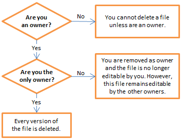

---

# required metadata
title: "DeployR Repository Manager Help | DeployR 8.x"
description: "Working with Files in the DeployR Repository Manager"
keywords: ""
author: "j-martens"
ms.author: "jmartens"
manager: "jhubbard"
ms.date: "03/17/2016"
ms.topic: "article"
ms.prod: "microsoft-r"

# optional metadata
#ROBOTS: ""
#audience: ""
#ms.devlang: ""
#ms.reviewer: ""
#ms.suite: ""
#ms.tgt_pltfrm: ""
ms.technology: "deployr"
#ms.custom: ""

---

# Working with Files

The Files tab is the main tab in the Repository Manager and where all work begins. This tab gives you access to all of the repository-managed files you own as well as any other users' repository-managed files to which you have [access rights](deployr-repository-manager-files.md#about-file-properties).

The set of file management tasks and interactions available to you depend not only on whether you [own](deployr-repository-manager-files.md#adding-and-removing-owners) the file or whether you have [access rights](deployr-repository-manager-files.md#about-file-properties), but also on the [policies](../what-is-operationalization.md) governing the server.

## About File Properties

Each repository-managed file has a set of file properties. While the following file properties are available for each version of a file in the Repository Manager, only the *Latest* version of a file can be edited by its owners.

File properties can be broken down into three categories: basic file properties, ownership properties, and access control properties.

**Basic file properties** 

These properties identify the file:

-  **Name.** The path and name of the file. This name was defined when it was created and is not editable.

-  **Keywords.** Words used to tag a file.

-  **Description.** An optional annotation that describes this particular version of the file. This description can make it easier to identify the file in the Files list and useful to developers when they are trying to learn about the file.

-  **Version.** The version ID, latest modified date for that version, the user that initiated that version, and any comment specific to that version.

 
**Access Rights properties** 

These properties allow a file owner to determine how a file is deployed by controlling who can access or interact with the file. Script files are deployed for execution. All other files, such as models and data files, are deployed for usage and download.

-  **Private** allows only the file owners to see the file. And in the case of scripts, only the owner(s) can execute the script on the API.

-  **Restricted** constrains access to the file using roles. By associating one or more roles with a file, you can constrain access and allow only those users who were granted at least one of the associated roles the ability to view the file in the Repository Manager and on the API. And, in the case of scripts, execute that script on the API. For example, if you associate a custom role called *Marketing Dept* with your script, then all users with the *Marketing Dept* role can access that script. If none of the existing roles fit your needs, the DeployR administrator can create a new custom role for this purpose. If you choose this access right, you must enter one or more role(s).

-  **Shared** allows authenticated users to view the file in the Repository Manager and on the API. And, in the case of scripts, execute that script on the API.

-  **Public** allows both authenticated users and anonymous users to view the file on the API. And, in the case of scripts, execute that script on the API. We recommend that you use careful consideration before exposing an R script to truly anonymous users. Note that you can only view the contents of R scripts in the Repository Manager interface.

 
**Ownership properties** 

These properties support collaborative development. The **Owners** field lists the owners that can collaborate on that particular version of a file. You can [add or remove owners](#adding-and-removing-owners) to the Latest version of your file. Adding an owner does more than just allow a user to view a file or execute a script; it also allows that new owner to edit the file's content as well as add or remove owners from the file. If your objective is to permit other users and/or applications to execute a script, we recommend setting the appropriate access rights as a means of controlling that access. In general, we do not recommend having multiple owners when a file is in production.

>Only a file's owners can [edit its file properties](#editing-file-properties). Changes are saved automatically.

## The Files You Own

When you own a file you are permitted to do almost anything to that file, including:

- [Download](deployr-repository-manager-files.md#downloading-files) files from directories
- [Copy](deployr-repository-manager-files.md#copying-files) and [move](deployr-repository-manager-files.md#moving-files) files across directories
- [Open](deployr-repository-manager-files.md#opening-files) files for viewing or [editing](deployr-repository-manager-files.md#editing-file-properties)
- [Share files and collaborate](deployr-repository-manager-files.md#sharing-files-with-others) with others
- [View](deployr-repository-manager-files.md#working-with-historical-versions), [compare](deployr-repository-manager-files.md#comparing-version-differences), and [revert](deployr-repository-manager-files.md#reverting-a-past-version-to-the-latest-version) versions in the file's history
- [Test scripts](deployr-repository-manager-testing-debugging-scripts.md) in a live debugging environment (R scripts only)
- [Close](deployr-repository-manager-files.md#closing-files) files
- [Delete](deployr-repository-manager-files.md#deleting-files) files from directories

## The Files You Don't Own

If you do not own a file and do not have [access rights](deployr-repository-manager-files.md#about-file-properties) to it either, then you will never be able to see or interact with that file.

If you have [access rights](deployr-repository-manager-files.md#about-file-properties) to a particular file you don't own, then you will see that file in one of directories under Other Files in the Files tab. Despite the fact that you do not own the file, you can still access the file in read-only mode. Possible operations include:

- [Open](deployr-repository-manager-files.md#opening-files) files and [review the file properties](deployr-repository-manager-files.md#about-file-properties) of the Latest version
- [Test R scripts](deployr-repository-manager-testing-debugging-scripts.md), including the review of [source code*](deployr-repository-manager-testing-debugging-scripts.md#inspecting-the-source-code), [loading*](deployr-repository-manager-testing-debugging-scripts.md#loading-data-into-the-r-session) of files into the R session, and testing of [modified input values*](deployr-repository-manager-testing-debugging-scripts.md#supplying-input-values) in a debug environment (R scripts only)*
- [Close](deployr-repository-manager-files.md#closing-files) files

*Certain [server policies ](../what-is-operationalization.md)can affect your ability to see, download, and load files that aren't yours.

## Uploading Files

>See the [Writing Portable R Code](deployr-data-scientist-write-portable-r-code.md) guide on to learn how to make your code run consistently both locally and on the DeployR server.

While small revisions are possible through the Repository Manager, the bulk of your script development should take place outside of DeployR prior to uploading. Once ready, you can use the Repository Manager to upload the files needed for your applications to the DeployR server repository. To upload several files, first put them in a zip file and then upload the zip.

If you attempt to upload a file into a directory containing a file by the same name, then a new version of the file will be created in the repository. For example, let's say you decide to upload file test.R from your local file system to the directory Samples, but the directory Samples already has a file by that same name, test.R. In that case, upon upload the contents of your local test.R becomes the new [*Latest*](deployr-repository-manager-files.md#working-with-historical-versions) version of test.R in the directory Samples. The owners, keywords, and description of the file test.R remain unchanged. To see the contents of file test.R as they were before the upload, look in the [version history](deployr-repository-manager-files.md#working-with-historical-versions).

>Since you cannot rename a file upon upload, make any changes to the name of a file before uploading.

**To upload a file:**

1. Go to the **Files** tab.

2. Click the **Actions** menu drop list.

3. From the menus, choose **Upload File**. The **Upload** dialog appears.

4. Select the file you want to upload from your local machine using the **Browse** button. Choose an individual file or a zip of several files.

5. Select the directory under **My Files** in which you want to store your file. If that directory doesn't exist yet, then [create the directory](deployr-repository-manager-directories.md#creating-directories) before coming back here to upload the file.

6. If you are uploading a zip file, choose whether to extract files upon upload. Choices are:
	-  **Extract files into directory**. All files, regardless of the directory structure in the zip file, will be extracted into a single directory.
	-  **Upload the zip file without extracting files**. The zip file will be uploaded as a zip file.

7. Click **Upload**.

## Downloading Files

You can download any [version](deployr-repository-manager-files.md#working-with-historical-versions) of a file you own. When you download a file, whether it is the Latest version or previous version, a file is created on your local file system with a copy of the contents of the selected file version.

>The [properties of the file](deployr-repository-manager-files.md#about-file-properties) (access rights, keywords, and so on), which are managed by the repository, are not included in the download.

**To download the Latest version of a file you own:**

1. In the **Files** tab of the Repository Manager, select the checkbox to the left of the filename(s) you want to download. The **Manage** dropdown menu appears.

2. Select any other files you want to download.

3. From the **Manage** menu, choose **Download**. A file is downloaded to your local file system through your default browser settings. If multiple files were selected, a zipped file of those files is downloaded.

**To download a prior version of a file you own:**

1. In the **Files** tab of the Repository Manager, identify the file whose version you want to download.

2. Click the icon in the **History** column for that file. The **Version History** table appears in the **Files** tab.

3. Click the number to the left of the version you want to download. A new file tab opens.

4. In the **Manage** dropdown menu on the far right, choose **Download**.

## Copying Files

You can make a copy of any file you own. When you copy a file, whether it is the [*Latest*](deployr-repository-manager-files.md#working-with-historical-versions) version or previous version, a new file is created in the specified user directory in the repository. You can then see that file in the **Files** tab. The contents of your new file is a duplicate of the contents of the version of the file you copied. Your new file will have the same file properties as the version of the file being copied except you will be its sole owner. And, since this is a new file, the file will not have any previous versions.

If you copy a file into a directory in which a file by the same name already exists, then a copy of the *Latest* version of the selected file becomes the Latest version of the file in the destination directory. For example, let's say you own two files of the same name in different directories (directory X and directory Y). You decide to copy the file from directory X and save it in directory Y, but directory Y already has a file by that same name. In that case, the contents and file properties (access rights, keyword, description) of the Latest version of the file from directory X become the new Latest version of the file by the same name in directory Y. The file is directory X remains unchanged. If you want to see the contents of the file in directory Y before the move, you would now need to look in the [version history](deployr-repository-manager-files.md#working-with-historical-versions) to find it. In this case, all of the history for the file that was originally in directory X is also kept in the history of the file in directory Y.

**To copy a file:**

1. [Open](deployr-repository-manager-files.md#opening-files) the file in the Repository Manager.

2. In the **File Properties** page, choose **Copy** from the **File** menu. The **Copy File** dialog opens.

3. Enter a name for the file in the **Name** field. If a file by that name already exists, this will become the new *Latest* version of that file.

4. Select a directory in the repository in which the file should be stored from the **Directory** drop down list.

5. Click **Copy** to make the copy. The dialog closes and the **Files** tab appears on the screen.

## Moving Files

You can move the files under **My Files** for which you are the sole owner from one user directory to another. If there are multiple users on a file, it cannot be moved.

If you move a file into a directory in which a file by the same name already exists, then the Latest version of the moved file becomes the [*Latest version*](deployr-repository-manager-files.md#working-with-historical-versions) of the file in the destination directory and the file histories are merged. For example, let's say you own two files of the same name in different directories (directory X and directory Y). You decide to move the file from directory X to directory Y, but directory Y already has a file by that same name. In that case, the contents and file properties (access rights, keyword, description) of the Latest version of the file from directory X become the new Latest version of the file by the same name in directory Y. If you want to see the contents of the file in directory Y before the move, you would now need to look in the [version history](deployr-repository-manager-files.md#working-with-historical-versions) to find it. In this case, all of the history for the file that was originally in directory X is also kept in the history of the file in directory Y.

>You cannot change the directory of files you co-own with other users. Files for which you are the sole owner can be moved to another directory; however, files owned by multiple users must remain under the original directory for as long as there are multiple owners.

**To move a file to another directory:**

1. From the **Files** tab, select the file in the table.The **Manage** dropdown menu appears.

1. In the **Manage** dropdown menu, choose **Move**. The **Move File** dialog appears.

1. In the dialog, select the user directory into which you want to move the file(s). If you are not the sole owner, then you cannot move the file.

1. Click **Move**. The dialog closes and the file is moved.

## Opening Files

If you see a file in the Files tab, you can open it. Your right to access, edit, and interact with files is determined in part by [ownership and access rights](deployr-repository-manager-files.md#about-file-properties) and also by [server policies](../what-is-operationalization.md).

>If two owners are editing a file at the same time, you will be writing over each other's work. It is essential to coordinate with the [other owners](deployr-repository-manager-files.md#adding-and-removing-owners).

**To open the Latest version of a file:**

1. In the **Files** tab of the Repository Manager, navigate to the directory containing the file you want to open.

1. Click the name of the file. A new file tab opens and displays the [file properties](deployr-repository-manager-files.md#about-file-properties).

**To open a prior version of a file:**

1. In the **Files** tab of the Repository Manager, navigate to the directory containing the file whose version you want to open.

1. In the table, identify the file whose version you want to open.

1. Click the icon in the **History** column for that file. The **Version History** table appears in the **Files** tab.

1. Click the number to the left of the version you want to open. A new file tab opens and displays the [file properties](deployr-repository-manager-files.md#about-file-properties).

>To learn more about a version without opening a file, you can also [compare](deployr-repository-manager-files.md#comparing-version-differences) a historical version to the Latest version of a file.

## Editing File Properties

Only the [file properties](deployr-repository-manager-files.md#about-file-properties) of the [*Latest*](deployr-repository-manager-files.md#working-with-historical-versions) version of a file can be edited since all others in the file history are read-only. Furthermore, only an owner can edit a file.

**To edit file properties:**

1. [Open](deployr-repository-manager-files.md#opening-files) the *Latest* version of a file you own.

1. Make any desired changes to the following [file properties](deployr-repository-manager-files.md#about-file-properties). Changes are automatically saved. Note that you cannot change a file's name or version information.
	1.  Edit the keywords or file description.

	1.  Update the list of [owners](deployr-repository-manager-files.md#adding-and-removing-owners) collaborating on this file.

	1.  Change the [access rights](deployr-repository-manager-files.md#about-file-properties) on the file to control how the file is deployed.

## Sharing Files with Others

By default, an R Script or any other repository-managed file is visible on the API only to the owners, referred to as authors in API calls, of that file. However, you can make files visible to other authenticated and/or anonymous users on the API and in the Repository Manager in the following ways.

1.  **Grant ownership to others**. You can [grant (or revoke) ownership](deployr-repository-manager-files.md#adding-and-removing-owners) to other authenticated users so that they can edit and manage that file. 

	>An R script is always available for execution on the API to all of its owners.

1.  **Specify access rights on a file**. You can set the [access level](deployr-repository-manager-files.md#about-file-properties) (**Private**, **Restricted**, **Shared**, or **Public**) on a file to control who can access it or, in the case of a script, execute the script.
 
	>To learn more about other file properties, [read here](deployr-repository-manager-files.md#about-file-properties).

## Adding and Removing Owners

If you are an owner of a file, you can add additional owners to *support collaboration* during the file's development.

Granting ownership does more than just allow a user to view or download a file, or even to execute a script; it also allows the user to edit the file, grant others ownership or revoke those rights, and even delete the file. For example, you might want add someone else as an owner so they can provide feedback on your script.  Or, as another example, you might grant ownership of an R script or any other file to permit development to continue while you are away on vacation.

If your objective is to permit other users and/or applications to see files and/or execute scripts, we recommend setting the appropriate [access rights](#about-file-properties) using the **Restricted**, **Shared** or **Public** access rights as a means of controlling that access.

>**Important!** Owners are also referred to as authors on API calls.
>
>Also, we do not generally recommend having multiple owners for a script when it is in production, since calling applications are required to reference scripts using the file name, its directory, and its owner (author).

To add or remove owners:

1.  [Open](#opening-files) the *Latest* version of a file you own.

2.  In the **File Properties** page, click **Add/Remove**. To learn more about other properties, [read here](#about-file-properties).

3.  In the **Add/Remove Owners** dialog, edit the list of owners as appropriate.

	-  To add owners, type the username(s) to which you want to grant ownership into the field.

		>If you attempt to add an owner that already has a file by the same name in the same directory, then you will not be permitted to add that owner.

	-  To remove owners from a file, click the **x** next to the name. The name disappears from the list of owners. If that user was an owner before you started this task, the file will no longer be in any of his or her directories under **My Files**.

4.  Once the list reflect the owners who should be able to collaborate on this file, click **OK**. The dialog closes.
 
 
## Working with Historical Versions

The DeployR repository supports a versioned file system, thereby offering you a full version history for each of your repository files and access to any version upon request pending proper authentication. The Repository Manager simplifies certain interactions with each version of the file you have had over time.

>You can only see the history for the files you own.

The current working version of a file is referred to as the ***Latest* version**. You can edit the Latest version of a file you own, but all historical version are read-only.

For any file you own, you can access the file's version history. From this version history, you can:

- [Open](deployr-repository-manager-files.md#opening-files) a version
- [Compare](deployr-repository-manager-files.md#comparing-version-differences) one past version to the Latest version of the file
- [Revert](deployr-repository-manager-files.md#reverting-a-past-version-to-the-latest-version) a past version to the *Latest* version of the file

>You cannot delete an individual version from the version history. If you [delete a file](deployr-repository-manager-files.md#deleting-files), all of its version history is also deleted.

**To see the version history of a file you own:**

1. In the **Files** tab of the Repository Manager, click the name of the user directory under **My Files** containing the file in which you are interested.

1. Identify the file whose version history you want to see.

1. Click the icon in the **History** column for that file. The **Version History** table appears in the **Files** tab.
 
 
### Comparing Version Differences

When a file has two or more versions, you can compare the differences between one previous version and the Latest version of that file.

- **For scripts**, you can compare the R code itself. The differences are highlighted in color to help you identify what is in the previous version and what is from the *Latest* version of that script.
- **For other files**, you can compare the version dates, comments, and file sizes.
 
**To compare two file versions:**

1. In the **Files** tab of the Repository Manager, click the name of the directory under **My Files** that contains the file that interests you.

1. Identify the file whose version history you want to see.

1. Click the icon in the **History** column for that file. The **Version History** table appears in the Files tab.

1. In the **Version History**, click the **Compare** icon in the row of the previous version you want to compare to the Latest version. The **Compare Differences** dialog opens.

1. Review the differences between the past version, which is referenced by its ID, and the Latest version.

1. If desired, you can click **Revert** to [revert](deployr-repository-manager-files.md#reverting-a-past-version-to-the-latest-version) the past version to *Latest*.

 
 
### Reverting a Past Version to the Latest Version

If you want to restore a historical version to Latest version of a file, you can [revert that version](deployr-repository-manager-files.md#comparing-version-differences). Reverting will copy the contents of the selected past version and make that copy the Latest version of the file. What was previously the Latest version is now preserved in the file's version history with a version ID.

 
_Figure: Workflow for Restoring Files_

 
 
## Deleting Files

Only the sole owner of a file can delete the file (and all of its previous versions) permanently.

When you attempt to delete a file you own, DeployR checks to see if there are other owners. If there are other owners, then you are removed as an owner and the file is no longer editable by you; however the file and its version history remain available in the repository to the other owners. But, if you are the sole owner at the time you attempt to delete this file, the file and all its versions will be permanently deleted from the repository.

After you delete a file, you may see that file under **Other Files** in the Files tab. If so, this is due to the fact that the file had multiple owners and the file's [access rights](deployr-repository-manager-files.md#about-file-properties) were set to **Restricted**, **Shared**, or **Public**. In this case, you might be able to see the file in your **Files** tab, but you will not be able to edit that file since you are no longer its owner.

 
_Figure: Workflow for Deleting Files_

  

>You cannot delete a previous version of a file without deleting the entire file history.

**To delete a file or yourself as its owner:**

1. From the **Files** tab, select the file in the table. The **Manage** dropdown menu appears.

1. In the **Manage** dropdown menu, choose **Delete**.

1. Confirm that you want to delete the file(s). If you are not the sole owner, then you will be stripped of your ownership rights and the file(s) will no longer appear in any directory under **My Files**.

 
 
## Closing Files

You can close one file at any time.

**To close a file:**

1. Go to the tab of the file you would like to close.

1. From the **Manage** menu on the right, choose **Close**. If there are any unsaved code changes, you will be prompted to [save](deployr-repository-manager-testing-debugging-scripts.md#saving-script-changes) or discard those changes. The tab disappears and the **Files** tab appears onscreen.

>Alternately, hover over the filename in the tab at the top of the screen and click the **x**.
 
