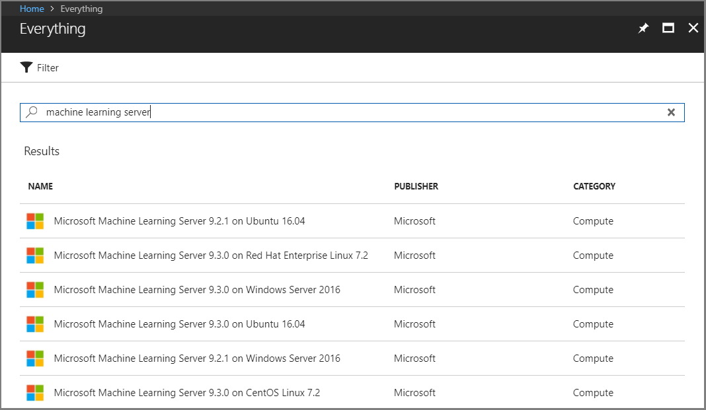
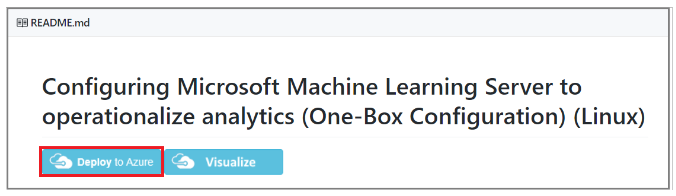

---

# required metadata
title: "How to use Machine Learning Server on Linux VM in Azure (Virtual Machine) - Machine Learning Server "
description: "Learn how to work with Machine Learning Server / R Server on Linux by using a virtual machine in Azure."
keywords: "Machine Learning Server, R Server, linux, virtual machine"
author: "HeidiSteen"
ms.author: "heidist"
manager: "cgronlun"
ms.date: "3/01/2018"
ms.topic: "article"
ms.prod: "mlserver"

# optional metadata
#ROBOTS: ""
#audience: ""
#ms.devlang: ""
#ms.reviewer: ""
#ms.suite: ""
#ms.tgt_pltfrm: ""
#ms.technology: ""
#ms.custom: ""

---

# Machine Learning Server on Azure Virtual Machines

Machine Learning Server, formerly known as R Server, is pre-installed on Azure virtual machines (VM) images running either a Windows or Linux operating system. 

An excellent alternative to selecting an existing VM image is to provision a VM yourself using a resource template. The template includes extra configuration steps for both the VM and Machine Learning Server itself, resulting in a VM that is ready-to-use with no additional work on your part.

## VM images on Azure 

The following procedure explains how to use the Azure portal to view the full range of VM images that provide Machine Learning Server.

1. Sign in to the [Azure portal](https://portal.azure.com).

2. Click **Create a resource**.

3. Search for *Machine Learning Server*. The following list shows partial search results. VM images include current and previous versions of Machine Learning Server on several common Linux operating systems as well as Windows Server 2016.

  

VM images include the custom [R packages](../r-reference/introducing-r-server-r-package-reference.md) and [Python libraries](../python-reference/introducing-python-package-reference.md) from Machine Learning Server that offer machine learning algorithms, R and Python helpers for deploying analytics, and portable, scalable, and distributable data analysis functions.

> [!Note]
> If you require a specific previous version, search the portal for *R Server* and use these links for installation instructions: [R Server 9.1-9.2.1](r-server-vm-azure-linux.md), [ R Server 9.0.1](r-server-vm-azure-linux-9-0-1.md), or [R Server 8.0.5](r-server-vm-azure-linux-8-0-5.md). 

## How to provision with templates

The easiest approach is to use an ARM template that both installs and configures the VM and Machine Learning Server. The template defines a resource group, the virtual network, a DNS name. 

ARM templates are available on Github, with options for a single-server install or distributed installation that places web nodes and compute nodes on different VMs within the same virtual network. There are also template options for data Science VMs, which include a broader selection of tools and technologies, of which Machine Learning Server is just one.

When you use a template, the server is operationalized for remote connections, web service deployment, logging, and so forth. For more information, see [Operationalize analytics with Machine Learning Server](../what-is-operationalization.md).

1. Go to the Github repo containing the templates: [https://github.com/Microsoft/microsoft-r/tree/master/mlserver-arm-templates](https://github.com/Microsoft/microsoft-r/tree/master/mlserver-arm-templates)

1. Choose your configuration. Click **one-box configuration** to install all packages and features on a single VM, or click **enterprise-configuration** if you need a cluster.

1. Choose the operating system: Windows, Linux, Windows Data Science VM, or Linux Data Science VM.

1. On the readme page for the option you selected, click **Deploy to Azure**. You are prompted for input values necessary to complete the deployment, including passwords and the level of physical resources used by the VM.

   

## How to provision in the portal

If you are new to using Azure VMs, we recommend that you review [this article](https://azure.microsoft.com/documentation/services/virtual-machines/linux/) for more information about using the portal and configuring a virtual machine.


1. Sign in to the [Azure portal](https://portal.azure.com).

1. Click **Create a resource**.

1. Search for *Machine Learning Server*.

1. From the list of virtual machines, choose the VM image providing the operating system and version of Machine Learning Server you want to install. 

1. Accept the terms and get started by clicking **Create**. 

1. Follow the onscreen prompts to provision the VM. 

1. After the VM is deployed and running, [connect](#connect) to the VM to begin interacting with Machine Learning Server. 

1. At this point, you can also: 
    + [Install an R IDE](#ride) or a Python interpreter.

    + Configure Machine Learning Server to [operationalize your analytics](#o16n) so it acts as a deployment server and host analytic web services. 

<a name="connect"></a>

## Connect to the Virtual Machine

Once the VM is deployed, you can open the portal page for that VM and click **Connect** to obtain connection information in the form of the IP address and port. You can further configure the VM to use a domain name or static IP, but for an initial connection, the dynamic IP is sufficient.

Many people have success connecting using an open-source SSH client. A few examples include [PuTTY](https://www.putty.org/), [SmarTTY](http://smartty.sysprogs.com/download/), and [WinCP](https://winscp.net/eng/download.php).


## Launch R Server

On Linux, simple type `R` at the command prompt to invoke the R interpreter, or `Revo64` to run R Server in a console session.

On Windows, open an R console session by entering *RGUI* in the Cortana search bar.

<a name="ride"></a>

## Configure an R IDE

With Machine Learning Server installed, you can configure your favorite R integrated development environment (IDE) to point to the Machine Learning Server R executable. This way, whenever you execute your R code, you do so using Machine Learning Server and benefit from its proprietary packages.  Machine Learning Server works well with popular IDEs such as [RStudio](https://www.rstudio.com) Desktop or Server. 

#### Configure RStudio for Machine Learning Server
  1. Launch RStudio.
  1. [Update the path to R](https://support.rstudio.com/hc/en-us/articles/200486138-Using-Different-Versions-of-R).
  1. When you launch RStudio, Machine Learning Server is now the default R engine.

#### Open Ports needed to Use RStudio Server

RStudio Server uses port 8787. The default configuration for the Azure VM does not open this port. To do that, you must go to the Azure portal and elect the proper Network Security Group. Select the **All Settings** option and choose **Inbound security rules**. Add a new rule for RStudio. Name the rule, choose **Any** for the Protocol, and add port 8787 to the destination port range. Click **OK** to save your changes. You should now be able to access RStudio using a browser.

#### Assign a Fully Qualified Domain Name to the VM for Accessing RStudio Server

No cloud service is created to contain the public resources for the VM so there is no fully qualified domain name assigned to the dynamic public IP by default. One can be created and added to the image after deployment using the Azure PowerShell. The format of the hostname is ````domainnamelabel; region;.cloudapp.azure.com````. 

For example, to add a public hostname using PowerShell for a VM named `rservercloudvm` with resource group `rservercloudrg` and desired hostname of `rservercloud`.

```
PS C:\\Users\\juser> Select-AzureSubscription -SubscriptionName "Visual Studio Ultimate with MSDN" –Current

PS C:\\Users\\juser> Switch-AzureMode -Name AzureResourceManager

PS C:\\Users\\juser> New-AzurePublicIpAddress -Name rservercloudvm -ResourceGroupName rservercloudrg -Location "South Central US" -DomainNameLabel rservercloud -AllocationMethod Dynamic
```

After adding access to port TCP/8787 to the inbound security rules, RStudio Server can be accessed at <http://rservercloud.southcentralus.cloudapp.azure.com:8787/>

Some related articles are:

+ [Azure Compute, Network, and Storage Providers for Windows applications under Azure Resource Manager deployment model](https://azure.microsoft.com/en-gb/documentation/articles/virtual-machines-azurerm-versus-azuresm/)
+ [Creating Azure VMs with Azure Resource Manager PowerShell cmdlets](http://blogs.msdn.com/b/cloud_solution_architect/archive/2015/05/05/creating-azure-vms-with-arm-powershell-cmdlets.aspx)

<a name="o16n"></a>

## Operationalize R and Python Analytics with Machine Learning Server on the VM

In order to operationalize your analytics with Machine Learning Server, you can [configure Machine Learning Server](operationalize-r-server-one-box-config.md) after installation to act as a deployment server and host analytic web services. 


## Access Data in an Azure Storage Account

When you need to use data from your Azure storage account, there are several options for accessing or moving the data:

+ Copy the data from your storage account to the local file system using a utility, such as [AzCopy.](https://azure.microsoft.com/en-us/documentation/articles/storage-use-azcopy/)

+ Add the files to a file share on your storage account and then mount the file share as a network drive on your VM. For more information, see [Mounting Azure files.](https://azure.microsoft.com/en-us/documentation/articles/storage-how-to-use-files-linux/)


## Resources & Documentation

Additional documentation about Machine Learning can be found on this documentation site using the table of contents on your left.

See these additional resources to learn about R in general:
+ [DataCamp](http://www.datacamp.com/): A free introductory and intermediate course in R, and a course on working with big data using Revolution R

+ [Stack Overflow](http://www.stackoverflow.com/): A good resource for R and Python programming and ML tools questions

+ [Cross Validated](https://stats.stackexchange.com/): A site for questions about statistical issues in machine learning

+ [R Help mailing list](https://www.r-project.org/mail.html): The list and its archives offer a good resource of historical information

+ [MRAN website](https://mran.microsoft.com/documents/getting-started/): Many other R resources.