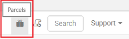
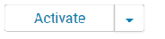

---
# required metadata
title: "Install Machine Learning Server on Cloudera"
description: "How to install, connect to, and use Machine Learning Server on a Cloudera Hadoop disribution."
keywords: ""
author: "HeidiSteen"
ms.author: "heidist"
manager: "jhubbard"
ms.date: "09/15/2017"
ms.topic: "article"
ms.prod: "microsoft-r"

# optional metadata
#ROBOTS: ""
#audience: ""
#ms.devlang: ""
#ms.reviewer: ""
#ms.suite: ""
#ms.tgt_pltfrm: ""
ms.technology: "r-server"
#ms.custom: ""

---

# Install Machine Learning Server using Cloudera Manager

This article explains how to generate, deploy, and activate an installation parcel for Machine Learning Server 9.2.1 on a Cloudera distribution of Apache Hadoop (CDH). 

Cloudera offers a parcel installation methodology for adding services and features to a cluster. On a Hadoop cluster, Machine Learning Server is installed on all data nodes. You can use a parcel to distribute and activate the service on all nodes within your CDH cluster.

If your operating system is not 7.0, or if you want to add [operationalization features](../operationalize/concept-operationalize-deploy-consume.md) on edge nodes, use the regular [Hadoop installation instuctions](machine-learning-server-hadoop-install.md) instead.

## Prepare for installation

This section explains how to obtain the parcel generation script and simulate parcel creation.

### Download a Machine Learning Server distribution

A package manager installation used for Linux or Hadoop won't provide the parcel generation scripts. To get the scripts, obtain a gzipped distribution of Machine Learning Server from [Visual Studio Subscriptions](https://msdn.microsoft.com/subscriptions/downloads/hh442898.aspx) or [Volume licensing](http://go.microsoft.com/fwlink/?LinkId=717966&clcid=0x409):

+ Search for "SQL Server" to list features licensed through SQL Server. For licensing purposes, Machine Learning Server is a supplemental feature to SQL Server.
+ Download **Machine Learning Server 9.2.1 for Hadoop** to a writable directory, such as **/tmp/**, on one of the data nodes.

### Unpack the distribution

1. Log on as root or a user with super user privileges:`sudo su`
2. Switch to the **/tmp/** directory (assuming it's the download location): `cd /tmp/`
3. Unpack the file: `tar zxvf en_microsoft_ml_server_921_for_hadoop_x64_<some-number>.tar.gz`

The distribution is unpacked into an **Hadoop** folder at the download location. The distribution includes the following files:

| File or folder | Description |
|------|-------------|
|`install.sh` | Script for installing Machine Learning Server. Do not use this for a parcel install. |
|`generate_mlserver_parcel.sh` | Script for generating a parcel used for installing Machine Learning Server on CDH. |
| `EULA.txt` | End user license agreements for each separately licensed component. |
| DEB folder | Contains Machine Learning packages for deployment on Ubuntu. |
| RPM folder | Contains Machine Learning packages for deployment on CentOS/RHEL and SUSE |
| Parcel folder | Contains files used to generate a parcel for installation on CDH. |

### Test with a dry run

The script includes a **-n** flag that simulates parcel generation. Start with a dry run to review the prompts.

The script downloads Microsoft R Open and builds a parcel by extracting information from RPM packages. You can [append flags](#flags) to run unattended setup or customize feature selections.

1. Switch to the Hadoop directory: `cd /Hadoop`

2. Run the script with **-n** to simulate parcel generation: `bash generate_mlserver_parcel.sh -n`

You are prompted to read and accept license agreements. 
  
You are also asked to specify the underlying operating system. If the platform supports it, the parcel generator adds installation instructions for features having a dependency on .NET Core, such as Microsoft machine learning and [operationalization features](../operationalize/concept-operationalize-deploy-consume.md). 

When the script is finished, the location of the parcel, checksum, and CSD is printed to the console. Remember the files do not yet exist. This is just a dry run. Running the script without **-n** generates the files.

## Flags used for parcel generation

You can run parcel generator with the following flags to suppress prompts or choose components.

flag | Option | Description
-----|--------|------------
 -m | --distro-name [DISTRO]| Target Linux distribution for this parcel, one of: el6 el7 sles11
 -l | --add-mml  | Add Python and microsoftml to the Parcel regardless of the target system.
 -a | --accept-eula | Accept all end user license agreements.
 -d | --download-mro | Download Microsoft r open for distribution to an offline system.
 -s | --silent | Perform a silent, unattended install.
 -u | --unattended | Perform an unattended install.
 -n | --dry-run | Don't do anything, just show what would be done.
 -h | --help | Print this help text.

## Run the script

Repeat the command without **-n** parameter to create the files: `bash generate_mlserver_parcel.sh`

+ The parcel generator file name is **MLServer-9.2.1**
+ The CSD file name is **MLServer**

## Distribute parcels and CSDs

This section explains how to place parcel generator script and CSD files in CDH.

### Copy to the parcel repository

By default, Cloudera Manager finds parcels in the Cloudera parcel repository. In this step, copy the parcel you generated to the repository.

1. Copy **MLServer-9.2.1** and **MLServer-9.2.1.sha** to the Cloudera parcel repository, typically /opt/cloudera/parcels.

    `cp ./MLServer-9.2.1.parcel /opt/cloudera/parcel-repo/`

    `cp ./MLServer-9.2.1.parcel.sha /opt/cloudera/parcel-repo/`

### Copy to the CSD repository

The Custom Service Descriptor (CSD) enables monitoring and administration from within Cloudera Manager. In this step, copy the CSD (a .jar file) to the Cloudera repository for CSD files. 

1. Copy the CSD file **MLServer-9.2.1-CONFIG.jar** to the Cloudera CSD directory, typically /opt/cloudera/csd.

    `cp ./MLServer-9.2.1-CONFIG.jar /opt/cloudera/csd/`

2. Modify the permissions of CSD file as follows: 

    `sudo chmod 644 /opt/cloudera/csd/MLServer-9.2.1-CONFIG.jar`

    `sudo chown cloudera-scm:cloudera-scm /opt/cloudera/csd/MLServer-9.2.1-CONFIG.jar`

3.	Restart the cloudera-scm-server service:

    `sudo service cloudera-scm-server restart`

## Activate in Cloudera Manager

1. In Cloudera Manager, click the parcel icon on the top right menu bar.

   

2. On the left, find and select **MLServer-9.2.1** in the parcel list. If you don't see it, check the parcel-repo folder. 

3. On the right, in the parcel details page, **MLServer-9.2.1** should have a status of *Downloaded* with an option to *Distribute*. Click **Distribute** to roll out Machine Learning Server on available data nodes.

4. Status changes to *distributed*. Click **Activate** on the button to make Machine Learning Server operational in the cluster.

   

You are finished with this task when status is "distributed, activated" and the next available action is *Deactivate*.

## Add MLServer-9.2.1 as a service

1. In Cloudera Manager home page, click the down arrow by the cluster name and choose **Add Service**.

   

2. Find and select **MLServer-9.2.1** and click **Continue** to start a wizard for adding services.

3. In the next page, add role assignments on all nodes used to run the service, both edge and data nodes. Click **Continue**.

4. On the last page, click **Finish** to start the service.

Machine Learning Server should now be deployed in the cluster.

## Rollback a deployment

You have the option of rolling back the active deployment in Cloudera Manager, perhaps to use an older version. You can have multiple versions in Cloudera, but only can be active at any given time. 

1. In Cloudera Manager, click the Parcel icon to open the parcel list.

2. Find MLServer-9.2.1 and click **Deactivate**.

The parcel still exists, but Machine Learning Server is not operational in the cluster.

The above steps apply to 9.2.1. If you have R Server 9.1 or 9.0.1, see [Install R Server 9.1 on CDH](r-server-install-cloudera.md) and [Install R Server 9.0.1 on CDH](r-server-install-cloudera-901.md) for release-specific documentation.

## Next steps

We recommend starting with [How to use RevoScaleR with Spark](../r/how-to-revoscaler-spark.md) or [How to use RevoScaleR with Hadoop MapReduce](../r/how-to-revoscaler-hadoop.md). 

For a list of functions that utilize Yarn and Hadoop infrastructure to process in parallel across the cluster, see [Distributed computing > Function list](../r/how-to-revoscaler-distributed-computing.md#distributed-computing-overview).

## See also

+ [Install on Linux](machine-learning-server-linux-install.md)
+ [Install Machine Learning Server](r-server-install.md)
+ [What's new in Machine Learning Server](../whats-new-in-machine-learning-server.md)
+ [Supported platforms](r-server-install-supported-platforms.md)  
+ [Known Issues](../resources-known-issues.md)  
+ [Configure Machine Learning Server to operationalize your analytics](../what-is-operationalization.md)