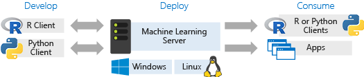
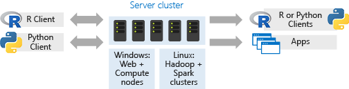

---
# required metadata
title: "How to install Machine Learning Server "
description: "How to install Machine Learning Server."
keywords: ""
author: "HeidiSteen"
author: "j-martens"
ms.author: "jmartens"
ms.date: "09/25/2017"
ms.topic: "article"
ms.prod: "microsoft-r"

# optional metadata
#ROBOTS: ""
#audience: ""
#ms.devlang: ""
#ms.reviewer: ""
#ms.suite: ""
#ms.tgt_pltfrm: ""
ms.technology: "r-server"
#ms.custom: ""

---

# Install and configure Machine Learning Server

Machine Learning Server is available on a number of [platforms](r-server-install-supported-platforms.md). There are also several add-ons and tools you can also use.  Looking for earlier versions? See [Installation guides for earlier releases](r-server-install.md) for links.

## Common configurations

Standalone servers describe a working experience where script development and execution occur on the same Windows or Linux machine. If you install the free developer edition, a standalone server is the likely configuration. You could also install the server on a virtual machine accessed by multiple users in turn. 

   

### Client and server multi-user topology

A client-server configuration is more common in a team environment. You can install free Python client libraries or R Client on any workstation, write script on the workstation, and then deploy script as a [web service](~/operationalize/concept-what-are-web-services.md) to an [operationalized](~/what-is-operationalization.md) Machine Learning Server, thus extending your options for interacting with and consuming script on a server. 

For R development only, you can also use [remote execution](~/r/how-to-execute-code-remotely.md) in this configuration: switch from local to remote server within a session to write and run script interactively. 

On the consumption side, you can write custom apps or consume an R or Python solution as a web service.

   

### Large scale multi-user topologies

Scale-out topologies are available in two forms: a distributed platform like Hadoop and Spark (Linux), or on clustered Windows machines (network-load-balanced clusters of web nodes and compute nodes). For Hadoop and Spark, you can write and run script locally and then [push the compute context](~/r/concept-what-is-compute-context.md) to the Hadoop or Spark cluster. For Windows, use the [operationalization capabilities](~/what-is-operationalization.md) in Machine Learning Server to distribute workloads on appropriate nodes.

   

## Installation Guides 

+ [Supported platforms](r-server-install-supported-platforms.md)    
+ [Install on Windows](machine-learning-server-windows-install.md)    
+ [Install on Linux](machine-learning-server-linux-install.md)    
+ [Install on Hadoop](machine-learning-server-hadoop-install.md)    
+ [Configure server to operationalize (deploy/consume) analytics](../operationalize/configure-start-for-administrators.md)    
+ [Add pre-trained models](microsoftml-install-pretrained-models.md)    
+ [Provision on the cloud](machine-learning-server-in-the-cloud.md)    

## Local Tools

+ [Microsoft R Client](../r-client/what-is-microsoft-r-client.md)    
+ [Python interpreter & libraries on Windows](python-libraries-interpreter.md)    