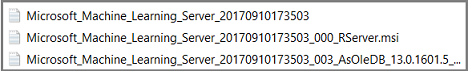

---
# required metadata
title: "Install Machine Learning Server for Windows"
description: "How to install, connect to, and use Machine Learning Server on computers running the Windows operating system."
keywords: ""
author: "HeidiSteen"
ms.author: "heidist"
manager: "jhubbard"
ms.date: "09/15/2017"
ms.topic: "article"
ms.prod: "microsoft-r"

# optional metadata
#ROBOTS: ""
#audience: ""
#ms.devlang: ""
#ms.reviewer: ""
#ms.suite: ""
#ms.tgt_pltfrm: ""
ms.technology: "r-server"
#ms.custom: ""

---

# Install Machine Learning Server for Windows

Machine Learning Server runs machine learning and data mining solutions written in R and Python in standalone and clustered topologies.

This article explains how to install Machine Learning Server 9.2.1 on a standalone Windows server that has an internet connection. If your server has restrictions on internet access, see [offline installation](machine-learning-server-windows-offline.md). 

The installation path for Machine Learning Server is new. If R Server 9.x is present, Machine Learning 9.2.1 is installed side-by-side. We recommend uninstalling the previous version. Because 9.2.1 is backward compatible, it is not necessary to have both.

## System requirements

+ Operating system must be a [supported version of Windows](r-server-install-supported-platforms.md) on a 64-bit with x86-compatible architecture (variously known as AMD64, Intel64, x86-64, IA-32e, EM64T, or x64 chips). Itanium chips (also known as IA-64) are not supported. Multiple-core chips are recommended. 

+ Memory must be a minimum of 2 GB of RAM is required; 8 GB or more are recommended.

+ Disk space must be a minimum of 500 MB.

+ .NET Framework 4.5.2 or later. The installer checks for this version of the .NET Framework and provides a download link if it's missing. A computer restart is required after a .NET Framework installation.

The following additional components are included in Setup and required for Machine Learning Server on Windows.

* Microsoft .NET Core 1.1
* Microsoft MPI 7.1
* AS OLE DB (SQL Server 2016) provider
* Microsoft Visual C++ 2015 Redistributable
* Microsoft R Open 3.3.4 (if you install R Server)

## How to install

This section walks you through aMachine Learning Server 9.2.1 deployment using the standalone Windows installer. Under these instructions, your installation will be licensed and serviced as a SQL Server 2017 feature.

### 1. Download Machine Learning Server installer

You can get the zipped installation file from one of the following download sites.

| Site | Edition | Details |
|------|---------|---------|
| [Visual Studio Dev Essentials](https://www.visualstudio.com/dev-essentials/) | Developer (free) | This option provides a zipped file, free when you sign up for Visual Studio Dev Essentials. Developer edition has the same features as Enterprise, except it is licensed for development scenarios.   1. Click **Join or Access Now** and enter your account information. 2. Make sure you're in the right place: *my.visualstudio.com*. 3. Click **Downloads**, and then search for *Machine Learning Server*. |
| [Volume Licensing Service Center (VLSC)](http://go.microsoft.com/fwlink/?LinkId=717966&clcid=0x409) | Enterprise | Sign in, search for "SQL Server 2017 Enterprise edition" 1, and then choose a per-core or CAL licensing option. A selection for **Machine Learning Server 9.2.1** is provided on this site. |
| [MSDN subscription downloads](https://msdn.microsoft.com/subscriptions/downloads/hh442898.aspx) | Developer or Enterprise | Subscribers can download software at given subscription levels. Depending on your subscription, you can get either edition. |

1 Machine Learning Server for Windows is licensed as a SQL Server enterprise feature, even though it's installed independently of SQL Server on a Windows operating system.

### 2. Run Setup

1. In the Downloads folder, right-click to extract the contents of zipped executable.
2. Double-click **ServerSetup.exe** to start the wizard.
3. In Configure installation, choose optional components. Required components are listed, but not configurable. Optional components include:
    + R Server (Standalone)
    + [Pre-trained Models](microsoftml-install-pretrained-models.md) used for image detection and sentiment analysis.
    + Python
4. Accept the SQL Server license agreement for Machine Learning Server, as well as the license agreements for Microsoft R Open, Anaconda, and Python.
5. Optionally, change the home directory for Machine Learning Server.
6. At the end of the wizard, click **Install** to run setup.

> [!NOTE]
> By default, telemetry data is collected during your usage of Machine Learning Server. To turn this feature off, use the RevoScaleR package function `rxPrivacyControl(FALSE)`. To turn it back on, change the setting to `TRUE`.

### 3. Check log files

Post-installation, you can check the log files located in the system temp directory. An easy way to get there is typing `%temp%` as a Run command or search operation in Windows. If you installed all components, your log file list looks similar to this screenshot:

  

### 4. Connect and validate

Machine Learning Server executes on demand as R Server or as a Python application:
 
+ Python runs when you execute a .py script. 
+ R Server runs as a background process, as **Microsoft R Server Engine** in Task Manager. Server startup occurs when a client application like [R Tools for Visual Studio](https://docs.microsoft.com/visualstudio/rtvs/installation) or Rgui.exe connects to the server.

As a verification step, connect to each application and run a script or function.

**For Python**

1. Go to C:\Program Files\Microsoft\ML Server\PYTHON_SERVER.
2. Double-click **Python**.
3. At the command line, type `help()` to open interactive help.
4. Type `modules revoscalepy`, followed by `modules microsoftml` to print the function list for each module.

**For R**

1. Go to C:\Program Files\Microsoft\ML Server\R_SERVER\bin\x64.
2. Double-click Rgui.exe to start the R Console application.
3. At the command line, type `search()` to show preloaded objects, including the `RevoScaleR` package. 
4. Type `print(Revo.version)` to show the software version.
5. Type `rxSummary(~., iris)` to return summary statistics on the built-in iris sample dataset. The `rxSummary` function is from `RevoScaleR`. 

### 5. Enable server to host analytic web services and accept remote connections

Machine Learning Server can be used as-is if you install and use an R IDE on the same box, but enable the server to host web services  

On a Windows installation, we recommend that you run the [Administrator Utility](../operationalize/configure-use-admin-utility.md) to configure the server for remote access and execution, web service deployment, or cluster topologies. 

[Remote execution](../r/how-to-execute-code-remotely.md) makes the server accessible to client workstations running R Client or the Python client libraries on your network. Configuration steps are few and the benefit is big, so please take a few minutes to complete this task.

## What's Installed with Machine Learning Server

An installation of Machine Learning Server includes some or all of the following components.

| Component | Description |
|-----------|-------------|
| Microsoft R Open (MRO) | An open source distribution of the base R language, plus the Intel Math Kernel library (int-mkl). The distribution includes standard libraries, documentation, and tools like R.exe and RGui.exe.   Tools for the standard base R (RTerm, Rgui.exe, and RScript) are under `<install-directory>\bin`. Documentation is under `<install-directory>\doc` and in `<install-directory>\doc\manual`. One easy way to open these files is to open `RGui`, click **Help**, and select one of the options. |
| Microsoft R Server proprietary libraries and script engine | MRS packages provide libraries of functions. MRS libraries are co-located with R libraries in the `<install-directory>\library` folder. Libraries include RevoScaleR, MicrosoftML, mrsdeploy, olapR, RevoPemaR, and others listed in [Package Reference](../r-reference/introducing-r-server-r-package-reference.md).   On Windows, the default R Server installation directory is `C:\Program Files\Microsoft\ML Server\R_SERVER`.   R Server is engineered for distributed and parallel processing for all multi-threaded functions, utilizing available cores and disk storage of the local machine. R Server also supports the ability to transfer computations to other R Server instances on other platforms through compute context instructions. |
| Python proprietary libraries | Propietary packages provide modules of class objects and static functions. Python libraries are in the `<install-directory>\lib\site-packages` folder. Libraries include revoscalepy, microsoftml, and azureml-model-management-sdk.   On Windows, the default installation directory is `C:\Program Files\Microsoft\ML Server\PYTHON_SERVER`.  |
| Anaconda 4.2 with Python 3.5.2 | An open source distribution of Python.|
| [Admin tool](../operationalize/configure-use-admin-utility.md) | Used for enabling remote execution and web service deployment, operationalizing analytics, and configuring web and compute nodes.| 
| [Pretrained models](microsoftml-install-pretrained-models.md) | Used for sentiment analysis and image detection. |

Consider adding a development tool on the server to build script or solutions using R Server features:

+ [Visual Studio 2017](https://www.visualstudio.com/downloads/) followed by the [R Tools for Visual Studio (RTVS) add-in](https://docs.microsoft.com/visualstudio/rtvs/installation) and the [Python for Visual Studio (PTVS)](https://www.visualstudio.com/vs/python/).

## Next steps

We recommend starting with any Quickstart tutorial listed in the contents pane. 

**See also**

+ [Install Machine Learning Server](r-server-install.md)
+ [What's new in Machine Learning Server](../whats-new-in-machine-learning-server.md)