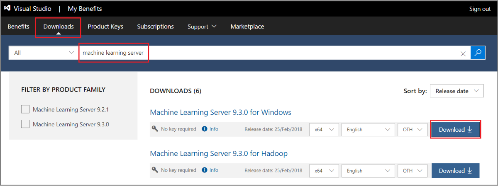

---

# required metadata
title: "Install Machine Learning Server for Windows"
description: "How to install, connect to, and use Machine Learning Server on computers running the Windows operating system."
keywords: 
author: "dphansen"
ms.author: "davidph"
manager: "cgronlun"
ms.date: 07/15/2019
ms.topic: "how-to"
ms.prod: "mlserver"

# optional metadata
#ROBOTS: ""
#audience: ""
#ms.devlang: ""
#ms.reviewer: ""
#ms.suite: ""
#ms.tgt_pltfrm: ""
#ms.technology: ""
#ms.custom: ""
---

# Install Machine Learning Server for Windows

**Applies to:  Machine Learning Server 9.2.1 | 9.3 | 9.4**

Machine Learning Server for Windows runs machine learning and data mining solutions written in R or Python in standalone and clustered topologies. 

This article explains how to install Machine Learning Server on a standalone Windows server with an internet connection. If your server has restrictions on internet access, see [offline installation](machine-learning-server-windows-offline.md). 

## System requirements

+ Operating system must be a [supported version of 64-bit Windows](r-server-install-supported-platforms.md). 

+ [Operationalization features](../what-is-operationalization.md) (administrator utility, web service deployment, remote sessions (R), web and compute node designations) are supported on Windows Server 2012 R2 or 2016. This functionality is not available on Windows 10 or on Windows Server 2019.

+ Memory must be a minimum of 2 GB of RAM is required; 8 GB or more are recommended. Disk space must be a minimum of 500 MB.

+ .NET Framework 4.5.2 or later. The installer checks for this version of the .NET Framework and provides a download link if it's missing. A computer restart is required after a .NET Framework installation.

The following additional components are included in Setup and required for Machine Learning Server on Windows.

* Microsoft R Open 3.5.2 (if you add R)
* Miniconda 4.5.12 with Python 3.7.1 (if you add Python)
* Microsoft Visual C++ 2015 Redistributable
* Azure CLI
* Microsoft MPI 10.1
* AS OLE DB (SQL Server 2016) provider

## Licensing

Machine Learning Server is licensed as a SQL Server supplemental feature, even though SQL Server itself is not installed or required on a standalone Machine Learning Server installation. 

On development workstations, you can install the developer edition at no charge. For example, if you are learning how to use the RevoScaleR libraries, or developing a solution that is not in production, you would use this edition. 

On production servers where code supports ongoing business operations or is part of a solution you are selling commercially, you will need the enterprise edition. The enterprise edition of Machine Learning Server for Windows is licensed by the core. Enterprise licenses are sold in 2-core packs, and you must have a license for every core on the machine. For example, on an 8-core server, you would need four 2-core packs.

If you have questions, [review the pricing page or contact Microsoft](https://www.microsoft.com/sql-server/sql-server-2017-pricing) for more information.

> [!Note]
> When you purchase an enterprise license of Machine Learning Server for Windows, you can install [Machine Learning Server for Hadoop](machine-learning-server-hadoop-install.md) for free (5 nodes for each core licensed under enterprise licensing).

## Upgrade existing installations

If your existing server was configured for [operationalization](../what-is-operationalization.md), follow these alternative steps for upgrade: 

+ [Configure Machine Learning Server to operationalize analytics (One-box) > How to upgrade](../operationalize/configure-machine-learning-server-one-box.md#how-to-upgrade)
+ [Configure Machine Learning Server to operationalize analytics (Enterprise) > How to upgrade](../operationalize/configure-machine-learning-server-enterprise.md#how-to-upgrade).

For all other configurations, Setup performs an in-place upgrade over existing installations. Although the installation path is new (\Program Files\Microsoft\ML Server), when R Server 9.x is present, setup finds R Server at the old path and upgrades it to the new version. 

There is no support for side-by-side installations of older and newer versions, nor is there support for hybrid versions (such as R Server 9.1 and Machine Learning Server 9.4). An installation is either entirely 9.4 or an earlier version.

## Download Machine Learning Server installer

You can get the zipped installation file from one of the following download sites.

| Site | Edition | Details |
|------|---------|---------|
| [Volume Licensing Service Center (VLSC)](https://go.microsoft.com/fwlink/?LinkId=717966&clcid=0x409) | Enterprise | Sign in, search for "SQL Server 2017", and then choose a per-core licensing option. A selection for **Machine Learning Server 9.4** is provided on this site. |
| [Visual Studio Dev Essentials](https://www.visualstudio.com/dev-essentials/) | Developer (free) | This option provides a zipped file, free when you sign up for Visual Studio Dev Essentials. Developer edition has the same features as Enterprise, except it is licensed for development scenarios. |

  For downloads from [Visual Studio Dev Essentials](https://www.visualstudio.com/dev-essentials/):

1. Click **Join or access now** to sign up for download benefits. The Visual Studio page title should include "My Benefits". The URL should be changed to *https://my.visualstudio.com/*.

2. Click **Downloads** and search for *Machine Learning Server*.

3. Find the version and click **Download** to get the Machine Learning Server installer for Windows.

   

## How to install

This section walks you through a Machine Learning Server deployment using the standalone Windows installer.

### Run Setup

The setup wizard installs, upgrades, and uninstalls all in one workflow.

1. Extract the contents of the zipped file. On your computer, go to the Downloads folder, right-click **en_machine_learning_server_for_windows_x64_.zip** to extract the contents.

2. Double-click **ServerSetup.exe** to start the wizard.

3. In Configure installation, choose components to install. Clearing a checkbox removes the component. Selecting a checkbox adds or upgrades a component. 

    + **Core components** are listed for visibility, but are not configurable. Core components are required.
    + **R** adds R Open and the R libraries.  
    + **Python** adds the Python libraries. 
    + [**Pre-trained Models**](microsoftml-install-pretrained-models.md) are used for image classification and sentiment detection. You can install the models with R or Python, but not as a standalone component.

4. Accept the license agreement for Machine Learning Server, as well as the license agreements for Microsoft R Open and Anaconda.

5. At the end of the wizard, click **Install** to run setup.

> [!NOTE]
> By default, telemetry data is collected during your usage of Machine Learning Server. To turn this feature on or off, see [Opting out of data collection](../resources-opting-out.md).

### Check log files

If there were errors during Setup, check the log files located in the system temp directory. An easy way to get there is typing `%temp%` as a Run command or search operation in Windows. If you installed all components, your log file list looks similar to this screenshot:

  

### Set environment variables

Create an **MKL_CBWR** environment variable to [ensure consistent output](https://software.intel.com/articles/introduction-to-the-conditional-numerical-reproducibility-cnr) from Intel Math Kernel Library (MKL) calculations.

1. In Control Panel, click **System and Security** > **System** > **Advanced System Settings** > **Environment Variables**.

2. Create a new User or System variable. 

  + Set variable name to `MKL_CBWR`
  + Set the variable value to `AUTO`

This step requires a server restart. 

## Connect and validate

Machine Learning Server executes on demand as R Server or as a Python application. As a verification step, connect to each application and run a script or function.

**For R**

R Server runs as a background process, as **Microsoft ML Server Engine** in Task Manager. Server startup occurs when a client application like Rgui.exe connects to the server.

1. Go to C:\Program Files\Microsoft\ML Server\R_SERVER\bin\x64.
2. Double-click **Rgui.exe** to start the R Console application.
3. At the command line, type `search()` to show preloaded objects, including the [RevoScaleR package](../r-reference/revoscaler/revoscaler.md). 
4. Type `print(Revo.version)` to show the software version.
5. Type `rxSummary(~., iris)` to return summary statistics on the built-in iris sample dataset. The `rxSummary` function is from RevoScaleR. 

**For Python**

Python runs when you execute a .py script or run commands in a Python console window. 

1. Go to C:\Program Files\Microsoft\ML Server\PYTHON_SERVER.
2. Double-click **Python.exe**.
3. At the command line, type `help()` to open interactive help.
4. Type ` revoscalepy` at the help prompt to print the package contents. 
5. Paste in the following revoscalepy script to return summary statistics from the built-in AirlineDemo demo data:

    ~~~~
    import os
    import revoscalepy 
    sample_data_path = revoscalepy.RxOptions.get_option("sampleDataDir")
    ds = revoscalepy.RxXdfData(os.path.join(sample_data_path, "AirlineDemoSmall.xdf"))
    summary = revoscalepy.rx_summary("ArrDelay+DayOfWeek", ds)  
    print(summary)
    ~~~~

   Output from the sample dataset should look similar to the following:

    ~~~~ 
    Summary Statistics Results for: ArrDelay+DayOfWeek
    File name: ... AirlineDemoSmall.xdf
    Number of valid observations: 600000.0
    
            Name       Mean     StdDev   Min     Max  ValidObs  MissingObs
    0  ArrDelay  11.317935  40.688536 -86.0  1490.0  582628.0     17372.0
    
    Category Counts for DayOfWeek
    Number of categories: 7
    
                Counts
    DayOfWeek         
    1          97975.0
    2          77725.0
    3          78875.0
    4          81304.0
    5          82987.0
    6          86159.0
    7          94975.0
    ~~~~

To quit the program, type `quit()` at the command line with no arguments.

**Verify CLI**

> [!Note]
> Before you continue, reboot the machine.

1. Open an Administrator command prompt.

2. Enter the following command to check availability of the CLI: `az mlserver admin --help` (use `az ml admin --help` for version 9.3). If you receive the following error: `az: error argument _command_package: invalid choice: mlserver` (`ml` for 9.3), follow the [instructions to re-add the extension to the CLI](https://docs.microsoft.com/machine-learning-server/resources-known-issues#1-missing-azure-ml-admin-cli-extension-on-dsvm-environments
). 

## Enable web service deployment and remote connections

If you installed Machine Learning Server on Windows Server 2012 R2 or Windows Server 2016, [configure the server for operationalization](../operationalize/configure-start-for-administrators.md#configure-server-for-operationalization) to enable additional functionality, including logging, diagnostics, and web service hosting.

You can use the `bootstrap` command for this step. This command enables operationalization features on a standalone server. It creates and starts a web node and compute node, and runs a series of diagnostic tests against the configuration to confirm the internal data storage is functional and that web services can be successfully deployed.

If you have multiple servers, you can designate each one as either a web node or compute node, and then link them up. For instructions, see [Configure Machine Learning Server (Enterprise)](../operationalize/configure-machine-learning-server-enterprise.md).

1. Open an Administrator command prompt.

2. Enter the following command to configure the server: `az mlserver admin bootstrap` (use `az ml admin bootstrap` for 9.3)

   This command invokes the Administrator Command Line Interface (CLI), installed by Machine Learning Server and added as a system environment variable to your path so that you can run it anywhere.

3. Set a password used to protect your configuration settings. Later, after configuration is finished, anyone who wants to use the CLI to modify a configuration must provide this password to gain access to settings and operations.  

   The password must meet these requirements: 8-16 characters long, with at least one upper-case letter, one lower-case letter, one number, and one special character.

After you provide the password, the tool does the rest. Your server is fully operationalized once the process is complete. For more information about the benefits of operationalization:

+ [Deploy Python and R script as a web service](../operationalize/concept-what-are-web-services.md) 
+ [Connect to a remote R server for code execution](../r/how-to-execute-code-remotely.md). Remote execution makes the server accessible to client workstations running [R Client](../r-client/install-on-linux.md) or other Machine Learning Server nodes on your network. 

> [!Note]
> Python support is new and there are a few limitations in remote computing scenarios. Remote execution is not supported on Windows or Linux in Python code. Additionally, you cannot set a [remote compute context](../r/concept-what-is-compute-context.md) to HadoopMR in Python. 

## What's installed

An installation of Machine Learning Server includes some or all of the following components.

| Component | Description |
|-----------|-------------|
| Microsoft R Open (MRO) | An open-source distribution of the base R language, plus the Intel Math Kernel library (int-mkl). The distribution includes standard libraries, documentation, and tools like R.exe and RGui.exe.   Tools for the standard base R (RTerm, Rgui.exe, and RScript) are under `<install-directory>\bin`. Documentation is under `<install-directory>\doc` and in `<install-directory>\doc\manual`. One easy way to open these files is to open `RGui`, click **Help**, and select one of the options. |
| R proprietary libraries and script engine | Proprietary libraries are co-located with R base libraries in the `<install-directory>\library` folder. Libraries include RevoScaleR, MicrosoftML, mrsdeploy, olapR, RevoPemaR, and others listed in [R Package Reference](../r-reference/introducing-r-server-r-package-reference.md).   On Windows, the default R installation directory is `C:\Program Files\Microsoft\ML Server\R_SERVER`.   RevoScaleR is engineered for distributed and parallel processing of all multi-threaded functions, utilizing available cores and disk storage of the local machine. RevoScaleR also supports the ability to transfer computations to other RevoScaleR instances on other platforms and computers through compute context instructions. |
| Python proprietary libraries | Proprietary packages provide modules of class objects and static functions. Python libraries are in the `<install-directory>\lib\site-packages` folder. Libraries include revoscalepy, microsoftml, and azureml-model-management-sdk.   On Windows, the default installation directory is `C:\Program Files\Microsoft\ML Server\PYTHON_SERVER`.  |
| Miniconda 4.5.12 with Python 3.7.1 | An open-source distribution of Python.|
| [Admin CLI](../operationalize/configure-admin-cli-launch.md) | Used for enabling remote execution and web service deployment, operationalizing analytics, and configuring web and compute nodes.| 
| [Pre-trained models](microsoftml-install-pretrained-models.md) | Used for sentiment analysis and image detection. |

## Next steps

We recommend starting with any Quickstart tutorial listed in the contents pane. 

## See also

+ [Install Machine Learning Server](r-server-install.md)
+ [What's new in Machine Learning Server](../whats-new-in-machine-learning-server.md)
+ [Supported platforms](r-server-install-supported-platforms.md)  
+ [Known Issues](../resources-known-issues.md)  
+ [Configure Machine Learning Server to operationalize your analytics](../what-is-operationalization.md) 
+ [R Function Reference](../r-reference/introducing-r-server-r-package-reference.md)
+ [Python Function Reference](../python-reference/introducing-python-package-reference.md)
