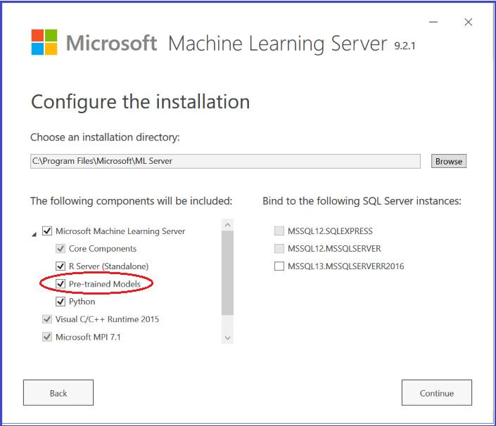

---

# required metadata
title: "How to install and deploy pretrained models with MicrosoftML"
keywords: ""
author: "bradsev"
manager: "jhubbard"
ms.date: "05/05/2017"
ms.topic: "get-started-article"
ms.prod: "microsoft-r"
ms.service: ""
ms.assetid: ""

# optional metadata
ROBOTS: ""
audience: ""
ms.devlang: ""
ms.reviewer: ""
ms.suite: ""
ms.tgt_pltfrm: ""
ms.technology: "r-server"
ms.custom: ""

---

# How to install and deploy pre-trained machine learning models with MicrosoftML

Pre-trained deep neural network models for sentiment analysis and image featurization are available to use with MicrosoftML. These models require large databases and are time-consuming to train. Using pre-trained models allow users to efficiently extract relevant features from text and images.

## Installation

The **MicrosoftML** package is installed by default with **Microsoft R Client**, **Microsoft R Server** and with the **SQL Server Machine Learning Services** on the supported platforms. For a list of these platforms, see the [Platform availability](../r/concept-what-is-the-microsoftml-package.md#platform-availability) section in the getting started topic.

But the pretrained ML models are not installed by default. To install them, you must check the **ML Models** checkbox on the **Configure the installation** page. To see this box you must click the dropdown menu for **Microsoft R Client** or **Microsoft R Server** in **The following components will be included** section. If these models are not installed, you will get an error if you use the `getSentiment()` or `featurizeImage()` functions.

For quickstarts that show how to use pretrained models for sentiment analysis and image featurization, see [Quickstarts for MicrosoftML](../r/sample-microsoftml.md).

## Error when Ensembling with pre-trained algorithms

"Transform pipeline 0 contains transforms that do not implement IRowToRowMapper"

*Applies to: MicrosoftML package > Ensembling*

Certain machine learning transforms that don’t implement the **IRowToRowMapper** interface will fail during Ensembling. Examples include getSentiment() and featurizeImage().

For more information on this error and the possible workarounds and other known issues, see [Known issues in Microsoft R Server 9.1](../resources-known-issues.md#ml-ensembling).

