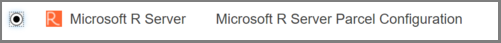

---

# required metadata
title: "Deploy and activate MRS parcels and CSDs on CDH"
description: "Deploy and activate Microsoft R Server parcels and CSDs on the Cloudera distribution of Apache Hadoop (CDH)."
keywords: ""
author: "HeidiSteen"
manager: "jhubbard"
ms.date: "04/11/2017"
ms.topic: "article"
ms.prod: "microsoft-r"
ms.service: ""
ms.assetid: ""

# optional metadata
ROBOTS: ""
audience: ""
ms.devlang: ""
ms.reviewer: ""
ms.suite: ""
ms.tgt_pltfrm: ""
ms.technology: "r-server"
ms.custom: ""
---

# Deploy and activate the MRS parcel and custom service descriptor (CSD)

**Applies to:** R Server 9.1 on the Cloudera distribution of Apache Hadoop (CDH)

A parcel installation of Microsoft R Server on CDH is a 2-part process. In part 1, you [generated a parcel and Custom Service Descriptor (CSD) for Microsoft R Server (MRS) 9.1](r-server-install-cloudera-generate-parcel.md). This article is part 2. Because you copied the parcel and CSD to the Cloudera repositories, you can now use Cloudera Manager to deploy the parcel, activate and roll out R Server, and add MRS as a service administered within Cloudera Manager.

## Step 1: Distribute the MRS parcel

1. In Cloudera Manager, click the parcel icon on the top right menu bar.

   

2. Find **MRS** in the parcel list. If you don't see it, check the parcel-repo folder (by default, /opt/cloudera/parcel-repo) for `MRS-9.1.0-el7.parcel` and `MRS-9.1.0-el7.parcel.sha`. The machine should be the master node of the cluster. 

   

3. In the parcel details page, **MRS** should have a status of *Downloaded* with an option to *Distribute*. Click **Distribute** to roll out MRS on available data nodes.

   

4. Status changes to *distributed*. Click **Activate** on the button to make MRS operational in the cluster.

   

You are finished with this task when status is "distributed, activated" and the next available action is *Deactivate*.

## Step 2: Add MRS as a service

1. In Cloudera Manager home page, click the down arrow by the cluster name and choose **Add Service**.

   

2. Find and select **Microsoft R Server** and click **Continue** to start a wizard for adding services.

   

3. In the next page, add role assignments on all nodes used to run the service, both edge and data nodes. Click **Continue**.

4. On the last page, click **Finish** to start the service.

R Server should now be available to use.

## Next Steps

Review the following walkthroughs to move forward with using R Server and the RevoScaleR package in Spark and MapReduce processing models.

+ [Practice data import and exploration on Spark](../scaler-spark-getting-started.md)
+ [Practice data import and exploration on MapReduce](../scaler-hadoop-getting-started.md)

## See Also

[R Server installation on Hadoop overview](r-server-install-hadoop.md)
