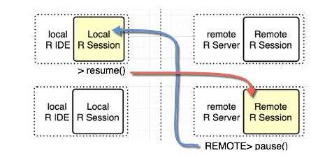
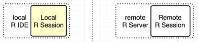

---

# required metadata
title: "mrsdeploy Functions"
description: "mrsdeploy Functions"
keywords: "mrsdeploy package reference"
author: "j-martens"
manager: "jhubbard"
ms.date: "2/02/2017"
ms.topic: "reference"
ms.prod: "microsoft-r"
ms.service: ""
ms.assetid: ""

# optional metadata
ROBOTS: ""
audience: ""
ms.devlang: ""
ms.reviewer: ""
ms.suite: ""
ms.tgt_pltfrm: ""
ms.technology: "r-server"
ms.custom: ""

---

# Connecting to R Server with mrsdeploy

The `mrsdeploy` package, delivered with Microsoft R Client and R Server, provides functions for:
+ Establishing a remote session in a console application for the purposes of executing code on that server
+ Publishing and managing a web service backed by an R code block or script that you provide.  

Each feature can be used independently but the greatest value is achieved when you can leverage both to produce various, creative R development and analytic deployment solutions.

Since every API call must be authenticated in R Server, the `mrsdeploy` functions, which place API calls on your behalf, are no different. For R Server, authentication of a user identity is handled via Active Directory. R Server will never store or manage usernames and passwords.

This article explains the authentication functions, the arguments they accept, and how to switch between remote and local sessions. 

## Authentication

`mrsdeploy` provides two functions for authentication against R Server: `remoteLogin()` and `remoteLoginAAD()`. With these functions, you can not only authenticate, but also use their arguments to create a remote R session on the R Server if desired, and even place yourself in the remote command line upon login. 

In general, all `mrsdeploy` operations are available to authenticated users. There is currently no role-based authorization model that specifically allows or denies specific operations. Destructive tasks, such as deleting a web service from a remote execution command line, are available only to the user who initially created the service.

The function you use depends on the type of authentication and deployment in your organization. If authenticating with:

+ A **on-premises Active Directory server on your network**, use the `remoteLogin` function. This function calls `/user/login` API, which requires a username and password. For example:

  ```R
  > remoteLogin(
            endpoint, 
            session = TRUE, 
            diff = TRUE,
            commandline = TRUE
            username = NULL,
            password = NULL,
    )
  ```

+ **Azure Active Directory in the cloud**, use the `remoteLoginAAD` function. For example:

  ```R
  > remoteLoginAAD(
            endpoint,
            authuri = https://login.windows.net,
            tenantid = myMRSServer.contoso.com,
            clientid = 00000000-0000-0000-0000-000000000000,
            resource = 00000000-0000-0000-0000-000000000000,
            session = TRUE,
            diff = TRUE,
            commandline = TRUE
    )
  ```


Once you authenticate with Active Directory or Azure Active Directory, an [access token](../operationalize/security-access-tokens.md) is returned. This access token is then passed in the request header of every subsequent `mrsdeploy` request. If the user does not provide a valid login, an HTTP 401 status code is returned.

Take special note of the arguments `session` and `commandline` as these influence the state of your command line.

|Argument|Description|
| --- | --- |
|`session`|If TRUE, create a remote session in R Server. <br>If FALSE, do not create any remote R sessions.|
|`commandline`|If TRUE, creates a REMOTE command line in the R console. REMOTE command line is used to interact with the remote R session. This means that after the authenticated connection is made, the user will be executing R commands remotely until they switch back to the local command line or logout. Parameter is only valid if session parameter is TRUE.|

<a name="switch"></a>

## Switch between sessions or logout

Once you log into the remote R server with the argument `session = TRUE`, a remote R session is created. You can switch between the remote R session and the local R session directly from the command line.  The remote command line allows you to directly interact with an R Server 9.0.1 instance on another machine. 



When the `REMOTE>` command line is displayed in the R console, any R commands entered will be executed on the remote R session. 

Switching between the local command line and the remote command line is done using these functions: `pause()` and `resume()`. To switch back to the local R session, type `pause()`. If you have switched to the local R session, you can go back to the remote R session by typing `resume()`.

To terminate the remote R session, type `exit` at the `REMOTE>` prompt.  Also, to terminate the remote session from the local R session, type `remote_logout()`.

|Convenience Functions|Description|
|---|---|
|`pause()`|When executed from the remote R session, returns the user to the local `> ` command prompt.|
|`resume()`|When executed from the local R session, returns the user to the `REMOTE>` command prompt, and sets a remote execution context.|

**Example**

```R
#execute some R commands on the remote session
REMOTE>x<-rnorm(1000)
REMOTE>hist(x)

REMOTE>pause()  #switches the user to the local R session
>resume()  

REMOTE>exit  #logout and terminate the remote R session
> 
```

## Remote connection states                                                                                                                                                        
These `session` and `commandline` login parameters are subtle yet can produce bold context switches from your local R workspace. Depending on their values, you can end up in one of three post authentication command line states in the R console:

### Create remote R session and go to remote command line (1)

In this state, we'll authenticate using one of the two aforementioned login functions with the default argument `session = TRUE` to create a remote R session, and the default argument `commandline = TRUE` to transition to the remote R command line.

|Command|State|
|---|---|
|`> remoteLogin(`<br>&nbsp;&nbsp;&nbsp;&nbsp;&nbsp;&nbsp;&nbsp;&nbsp;&nbsp;`"http://localhost:12800"`<br>&nbsp;&nbsp;&nbsp;&nbsp;`)`<br><br>`REMOTE>`|<br>&nbsp;|

When you see the default prompt `REMOTE>` in the command pane, you'll know that you are now interacting with your remote R session and are no longer in your local R environment:

In this example, we define an interactive authentication workflow that spans both our local and remote environments.

```R
> # EXAMPLE: LOGIN, CREATE REMOTE R SESSION, GO TO REMOTE PROMPT

> remoteLogin("http://localhost:12800") 

REMOTE> x <- 10   # Assign 10 to "x" in remote session

REMOTE> ls()   # List objects in remote session 
[1] "x"

REMOTE> pause()  # Pause remote interaction. Switch to local 

> y <- 10      # Assign 10 to "y" in local session 

> ls()   # List objects in local session 
[1] "y"

> putLocalObject(c("y"))   # Loads local "y" into remote R session's workspace 

> resume()   # Resume remote interaction and move to remote command line 

REMOTE> ls()   # List the objects now in the remote session 
[1] "x" "y"

REMOTE> exit  # Destroy remote session and logout 

>
```

>[!IMPORTANT] 
>You can only manage web services from your local session. Attempting to use the service APIs during a remote interaction will result in a error.

### Create remote R session and remain with local command line (2)

In this state, you can authenticate using `remoteLogin`, which is one of the two aforementioned login functions with the argument `session = TRUE` to create a remote R session, and the argument `commandline = FALSE` to remain in your local R environment and command line.

|Command|State|
|---|---|
|`> remoteLogin(`<br>&nbsp;&nbsp;&nbsp;&nbsp;&nbsp;&nbsp;&nbsp;&nbsp;&nbsp;`"http://localhost:12800",`<br>&nbsp;&nbsp;&nbsp;&nbsp;&nbsp;&nbsp;&nbsp;&nbsp;&nbsp;`session = TRUE,`<br>&nbsp;&nbsp;&nbsp;&nbsp;&nbsp;&nbsp;&nbsp;&nbsp;&nbsp;`commandline = FALSE`<br>&nbsp;&nbsp;&nbsp;&nbsp;`)`<br><br>`>`|<br>&nbsp;|

In this example, we define an interactive authentication workflow that spans both our local and remote environments (just like state 1), but starts out in the local R session, and only then moves to the remote R session.

```R

> # EXAMPLE: LOGIN, CREATE REMOTE R SESSION, STAY LOCAL

> remoteLogin("http://localhost:12800", session = TRUE, commandline = FALSE)

> y <- 10   # Assign 10 to "y" in local session 

> ls()   # List the objects in the local session 
[1] "y"

> putLocalObject(c("y"))   # Loads local "y" into remote R session's workspace 

> resume()   # Switch to remote command line for remote interaction 

REMOTE> x <- 10    # Assign 10 to "x" in remote session 

REMOTE> ls()   # List the objects now in the remote session 
[1] "x" "y"

REMOTE> exit     # Destroy remote session and logout 

>
```

### Remain local without creating a remote R session (3)

In this state, you can authenticate with `remoteLogin()` and its argument `session = FALSE` so that no remote R session is started. Without a remote R session, you'll only have the local R environment and command line.

|Command|State|
|---|---|
|`> remoteLogin(`<br>&nbsp;&nbsp;&nbsp;&nbsp;&nbsp;&nbsp;&nbsp;&nbsp;&nbsp;`"http://localhost:12800",`<br>&nbsp;&nbsp;&nbsp;&nbsp;&nbsp;&nbsp;&nbsp;&nbsp;&nbsp;`session = FALSE`<br>&nbsp;&nbsp;&nbsp;&nbsp;`)`<br><br>`>`|<br>&nbsp;|


In this example, we define an interactive authentication workflow without a remote R session (`session = FALSE`). This is useful when working only with the web service functionality of the `mrsdeploy` package. After authentication, we remain confined within the local R session in order to publish and consume a service.

```R
> # EXAMPLE OF LOGIN WITHOUT REMOTE R SESSION

> remoteLogin("http://localhost:12800", session = FALSE)

> addOne <- function(x) x + 1

> api <- publishService(
            "add-one",
            code = addOne,
            inputs = list(x = "numeric"),
            outputs = list(answer = "numeric") 
         )

> res <- api$addOne(100)

> print(res$output("answer"))
[1] 101
```

>[!IMPORTANT] 
>You can only manage web services from your local session. Attempting to use the service APIs during a remote interaction will result in a error.