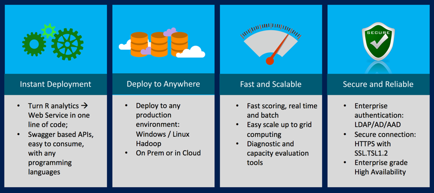
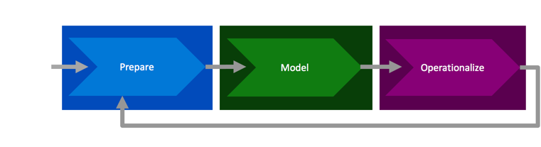
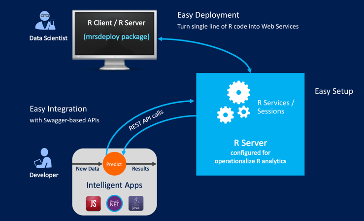

---

# required metadata
title: "Operationalization of R Analytics | Microsoft R Server Docs"
description: "Operationalization of R Analytics with Microsoft R Server"
keywords: ""
author: "j-martens"
manager: "jhubbard"
ms.date: "12/08/2016"
ms.topic: "get-started-article"
ms.prod: "microsoft-r"
ms.service: ""
ms.assetid: ""

# optional metadata
ROBOTS: ""
audience: ""
ms.devlang: ""
ms.reviewer: ""
ms.suite: ""
ms.tgt_pltfrm: ""
ms.technology: 
  - deployr
  - r-server
ms.custom: ""
---

# Operationalization with R Server

**Applies to:  Microsoft R Server 9.0.1**

This release of Microsoft R Server now includes an even better operationalization engine for all your advanced R analytics. Regardless of the source, language or method, you can simplify, deploy, and realize the promise and power of advanced analytics.

>Looking for older "DeployR 8.x" documentation? [Start here](../deployr-about.md).

<iframe src="https://www.youtube.com/embed/InP1UO8BNSo" width="600" height="400" allowFullScreen frameBorder="0"></iframe>

 
 

### What You Get with R Server Operationalization

Once you [configure the operationalization feature](configuration-initial.md) for R Server, you can benefit from: 

+ Instant deployment and [easy consumption of your R analytics](app-developer-get-started.md)

+ "Write once / deploy anywhere" - no more duplication of efforts

+ Speedy real-time and batch scoring

+ [Scalability](configuration-initial.md) for more power and better load balancing

+ [Diagnostic](admin-diagnostics.md) and [capacity evaluation](admin-evaluate-capacity.md) tools

+ Enterprise grade security: [SSL/TLS 1.2](security-https.md) and [authentication with AD LDAP or Azure AD](security-authentication.md)

+ Enable interactive [remote code execution](remote-execution.md) in your own session on the R server.

 

>Want to configure R Server for operationalization? [Start here](configuration-initial.md).

 

### The Predictive Analytics Process

R Server's operationalization feature fits perfectly into the predictive analytics process. The steps in that process (at a high-level) include:
+ **Prepare**:  Assemble, cleanse, profile and transform diverse data relevant to the subject.

+ **Model**:  Use of statistical and machine learning algorithms to build classifiers and predictions

+ **Operationalize**:  Apply predictions and visualizations to support business applications

### Best-in-Class Deployment Experience

The deployment experience for R Server includes:

+ **Easy Deployment**: Turn R into web services in one line of code in your R console.

+ **Easy Integration**: Use easily consumable Swagger-based APIs with any programming languages.

+ **Easy Setup**: In-cloud or on-premise scalable configurations, enterprise grade security, web service management, HA and load balancing, remote execution.

