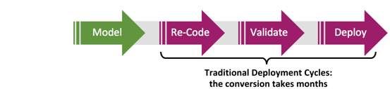
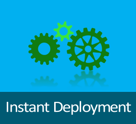
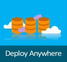

---

# required metadata
title: "Operationalization of R Analytics | Microsoft R Server Docs"
description: "Operationalization of R Analytics with Microsoft R Server"
keywords: ""
author: "j-martens"
manager: "jhubbard"
ms.date: "12/08/2016"
ms.topic: "get-started-article"
ms.prod: "microsoft-r"
ms.service: ""
ms.assetid: ""

# optional metadata
ROBOTS: ""
audience: ""
ms.devlang: ""
ms.reviewer: ""
ms.suite: ""
ms.tgt_pltfrm: ""
ms.technology: 
  - deployr
  - r-server
ms.custom: ""
---

# Operationalization with R Server

**Applies to:  Microsoft R Server 9.0.1**  &nbsp;&nbsp;&nbsp;&nbsp;&nbsp; (Find archived "DeployR 8.x" docs [here](../deployr-about.md).)

Today, more and more businesses are adopting advanced analytics for mission critical decision making in areas such as fraud detection, healthcare and manufacturing. Typically, the data scientists first build out the predictive models and only then can businesses deploy those models in a production environment and consume them for predictive actions. 

## Solving Long Development Lifecycles

R is a great modeling tool, but **the challenge lies in how to effectively operationalize R**. Traditionally, this has not been an easy process (slow innovation and error-prone) and it can take months to rewrite these models before you can use them. 

 

Introducing Microsoft R Server, the operationalization engine for your advanced R analytics. Regardless of the source, language or method, you can simplify, deploy, and realize the promise and power of advanced analytics.

## What You Get with R Server Operationalization

After you [configure R Server for operationalization](configuration-initial.md) for R Server, you can: 

||Key Operationalization Features|
|-|-|
||● Data scientists turn R analytics into Web services in one line of code ● Developers use Swagger-based [REST APIs](api.md) that are [easy to consume](app-developer-get-started.md)  &nbsp; &nbsp; with any programming languages including R|
||● Model in one platform, then deploy and score web services in other platform: &nbsp; &nbsp; [Windows, SQL, Linux/Hadoop](configuration-initial.md)  ● Model on-premise, then score your data in the cloud, or vice versa  ● With Microsoft R Server, it is easier/faster to use the power of R in production &nbsp; &nbsp; to unlock insights hidden in your data. |
||● Perform fast scoring: real time & batch  ● Scale to a grid for powerful computing with load balancing ● Use [diagnostic](admin-diagnostics.md) and [capacity evaluation](admin-evaluate-capacity.md) tools|
||● Integrate with [enterprise authentication (AD/LDAP or Azure AD)](security-authentication.md) ● Connect securely: [HTTPS with SSL/TLS 1.2](security-https.md) ● Enterprise grade high availability|

## Operationalization Actors

Microsoft R Server offers the **best-in-class deployment** experience for the administrator, data scientists, and application developers alike. 

### Administrators

The [easy set-up](configuration-initial.md) of Microsoft R Server's operationalization feature includes **enterprise grade security and reliability** on many platforms. It scales for business-critical applications and offers support for production-grade workloads and high availability. [Diagnostic](admin-diagnostics.md) and [capacity evaluation](admin-evaluate-capacity.md) tools are provided to help you tune and manage. 

R Server's operationalization engine seamlessly integrates with popular enterprise security solutions such as [LDAP/Active Directory and Azure Active Directory](security-authentication.md). Connections can also be secured [SSL/TLS 1.2](security-https.md).

&gt;&gt; Learn more in this [Administrator Get Started](admin-get-started.md) guide.

### Data Scientists

In a single line of code, data scientists can deploy  models or any arbitrary R code as analytic web services. 

&gt;&gt; Learn more in this [Data Scientist Get Started](data-scientist-get-started.md) guide.

### Application Developers

Using their favorite development environment, application developers can easily integrate those web services into their apps using Swagger-based [REST APIs](api.md) with any programming languages including R. They can perform fast scoring: real time & batch. 

&gt;&gt; Learn more in this [Application Developer Get Started](app-developer-get-started.md) guide.

 

 

<iframe width="560" height="315" src="https://www.youtube.com/embed/1Nvs6QShWqY" frameborder="0" allowfullscreen></iframe>
