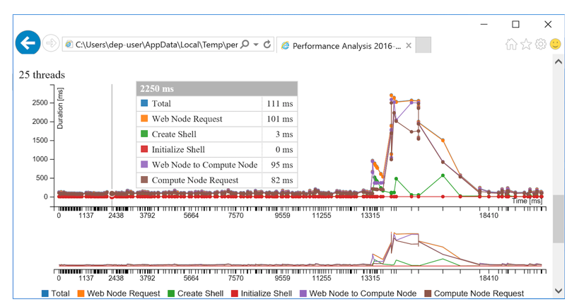

---

# required metadata
title: "Evaluate Operationalization Load Balancing Capacity | Microsoft R Server Docs"
description: "Evaluate Operationalization Load Balancing Capacity | Microsoft R Server Docs"
keywords: ""
author: "j-martens"
manager: "jhubbard"
ms.date: "12/08/2016"
ms.topic: "get-started-article"
ms.prod: "microsoft-r"
ms.service: ""
ms.assetid: ""

# optional metadata
ROBOTS: ""
audience: ""
ms.devlang: ""
ms.reviewer: ""
ms.suite: ""
ms.tgt_pltfrm: ""
ms.technology: 
  - deployr
  - r-server
ms.custom: ""
---

# Evaluate Load Balancing Capacity

To evaluate the load balancing capacity, you can simulate the traffic for the configuration or for a given web service. You can test for maximum latency or maximum thread count.

+ **Maximum Latency:** Define the maximum number of milliseconds for a web node request, the initial thread count, and the thread increments for the test. The test will increase the number of threads by the defined increment until the defined time limit is reached.

+ **Maximum Thread Count:** Define the number of threads against which you want to run, such as 10, 15, or 40.  The test will increase the number of parallel requests by the specified increment until the maximum number of threads is reached. 

 

## Configure Test Parameters

1. On the web node, [launch the administration utility](#launch) with administrator, `root`, or `sudo` privileges.

1. From the main menu, choose the option to **Evaluate Capacity** and review the current test parameters.

   

1. To choose a different web service:

   1. From the sub-menu, choose the option for **Change the service for simulation**.
   1. Specify the new service:
      + To use an existing service, enter `Yes` and provide the service's name and version as `<name>/<version>`. For example, `my-service/1.1`.
      + To use the generated [default service], enter `No`.
   1. When prompted, enter the required input parameters for the service in a JSON format.  For example, for a vector/matrix, follow the JSON format such as `[1,2,3]` for vector, `[[…]]` for matrix. A data.frame is a map where each key is a column name, and each value is represented by a vector of the column values.

1. To test for the maximum latency:

   1. From the sub-menu, choose the option for **Change thread/latency limits**.
   1. When prompted, enter `Time` to define the number of threads against which you want to test.
   1. Specify the maximum latency in milliseconds after which the test will stop.
   1. Specify the minimum thread count at which the test will start.
   1. Specify the increment by which the number of threads will increase for each iteration until the maximum latency is reached.
     
1. To test for the maximum number of parallel requests that can be supported:

   1. From the sub-menu, choose the option for **Change thread/latency limits**.
   1. When prompted, enter `Threads` to define the maximal threshold for the duration of a web node request.
   1. Specify the maximum thread count after which the test will stop running.
   1. Specify the minimum thread count at which the test will start.
   1. Specify the increment by which the number of threads will increase for each iteration.
 
 

## Run Simulation Tests

1. On the web node, [launch the administration utility](#launch).
1. From the main menu, choose the option to **Evaluate Capacity**. The current test parameters appears.
1. From the sub menu, choose the option to **Run capacity simulation** to start the simulation.
1. Review the results onscreen.

   
1. Paste the URL printed onto the screen into your browser for a visual representation of the results (see below).

 

## Understanding the Results

After the tool is run, the results are printed to the console. The test results are divided into request processing stages to enable you to see if any configuration changes are warranted, such as adding more web or compute nodes, increase the pool size, and so on. 

You can also explore the results visually using the URL that is returned to the console. 

|Stage|Time Measured|
|------|-----------|
|Web Node Request|Time for the request from the web node's controller to go all the way to RServe and back|
|Create Shell|Time to create a shell or take it from the pool|
|Initialize Shell|Time to load the data (model or snapshot) into the shell prior to execution|
|Web Node to Compute Node|Time for a request from the web node to reach the compute node|
|Compute Node Request|Time for a request from the compute node to reach RServe and return to the node|
 

