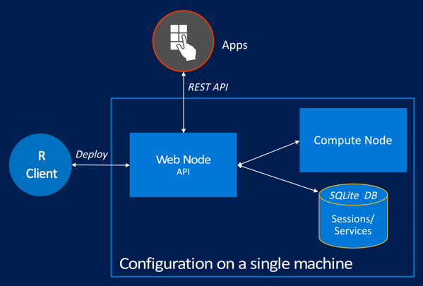

---

# required metadata
title: "Configure R Server for Operationalization | Microsoft R Server Docs"
description: "Configuration Operationalization for Microsoft R Server"
keywords: ""
author: "j-martens"
manager: "jhubbard"
ms.date: "12/08/2016"
ms.topic: "article"
ms.prod: "microsoft-r"
ms.service: ""
ms.assetid: ""

# optional metadata
ROBOTS: ""
audience: ""
ms.devlang: ""
ms.reviewer: ""
ms.suite: ""
ms.tgt_pltfrm: ""
ms.technology:
  - deployr
  - r-server
ms.custom: ""
---

# Configuring R Server for Operationalization (One-Box Configuration)

**Applies to:  Microsoft R Server 9.x**

To benefit from Microsoft R Server’s deployment and operationalization features, you can configure R Server after installation to act as a deployment server and host analytic web services.

## One-box vs enterprise configurations

All configurations have at least a single web node and single compute node. **Web nodes** act as HTTP REST endpoints with which users can interact directly to make API calls. Web nodes also access the data in the database and send requests to the compute node for processing. **Compute nodes** are used to execute R code as a session or service. Each compute node has its own pool of R shells. By default, a SQLite 3.7+ database is installed, but you can, and in some cases must, install and [use a SQL Server (Windows) or PostgreSQL (Linux)](configure-remote-database.md) database instead.

R Server offers two types of configuration for operationalization/deployment:
1. **One-box configuration**: the simplest configuration is a single web node and compute node on a single machine, which is described in this article.

1. **Enterprise configuration**: a configuration where multiple nodes are configured on multiple machines along with other enterprise features. This configuration is described in detail in the **[Enterprise configuration](configure-enterprise.md)** article.

## Supported platforms for Operationalization

The operationalization feature for Microsoft R Server is supported on:
- Windows Server 2012 R2, Windows Server 2016
- Ubuntu 14.04, Ubuntu 16.04,
- CentOS/RHEL 7.x

<a name="onebox"></a>

## How to configure on one box

With one-box configurations, as the name suggests, everything runs on a single machine and set-up is a breeze. This configuration includes an operationalization web node and compute node on the same machine. It also relies on the default local SQLite database.

This configuration is useful when you want to explore what it is to operationalize R analytics using R Server. It is perfect for testing, proof-of-concepts, and small-scale prototyping, but might not be appropriate for production usage.



**To configure on a single machine:**

1. On each machine, install Microsoft R Server:

     + On Windows, install [R Server for windows](../rserver-install-windows.md).

     + On Linux, install [R Server for Linux](../rserver-install-linux-server.md).  

1. If on the following Linux flavors, then add a few symlinks:  (If on Windows, skip to the next step)

   + On CentOS 7.1, CentOS 7.2:
     ```
      cd /usr/lib64
      sudo ln -s libpcre.so.1   libpcre.so.0
      sudo ln -s libicui18n.so.50   libicui18n.so.36
      sudo ln -s libicuuc.so.50 libicuuc.so.36
      sudo ln -s libicudata.so.50 libicudata.so.36
     ```

   + On Ubuntu 14.04:
     ```
      sudo apt-get install libicu-dev

      cd /lib/x86_64-linux-gnu
      ln -s libpcre.so.3 libpcre.so.0
      ln -s liblzma.so.5 liblzma.so.0

      cd /usr/lib/x86_64-linux-gnu
      ln -s libicui18n.so.52 libicui18n.so.36
      ln -s libicuuc.so.52 libicuuc.so.36
      ln -s libicudata.so.52 libicudata.so.36
     ```

   + On Ubuntu 16.04:
     ```
      cd /lib/x86_64-linux-gnu
      ln -s libpcre.so.3 libpcre.so.0
      ln -s liblzma.so.5 liblzma.so.0

      cd /usr/lib/x86_64-linux-gnu
      ln -s libicui18n.so.55 libicui18n.so.36
      ln -s libicuuc.so.55 libicuuc.so.36
      ln -s libicudata.so.55 libicudata.so.36
     ```

   >**Note:** If there are issues with starting the compute node, see [here](admin-diagnostics.md).

1. [Launch the administration utility](admin-utility.md#launch) with administrator privileges (Windows) or `root`/ `sudo` privileges (Linux).

1. Choose the option to **Configure R Server for Operationalization**.

1. Choose the option to **Configure for one box** to set up the web node and compute node onto the same machine.

   >[!IMPORTANT]
   > Do not choose the sub-options **Configure a web node** or **Configure a compute node** unless you intend to have them on separate machines, which is described below as an **Enterprise** configuration.

1. When prompted, provide a password for the built-in, local operationalization administrator account called `admin`.

1. Return to the main menu of the utility when the configuration ends.

1. [Run a diagnostic test of the configuration](admin-diagnostics.md).

1. If on Linux and using the IPTABLES firewall or equivalent service, then use the `iptables` command (or the equivalent) to open port 12800 to the public IP of the web node so that remote machines can access it.

>[!Important]
>R Server uses Kestrel as the web server for its operationalization web nodes. Consequently, if you expose your application to the Internet, we recommend that you review the [guidelines for Kestrel](https://docs.microsoft.com/en-us/aspnet/core/fundamentals/servers/kestrel) regarding reverse proxy set up.

You are now ready to begin operationalizating your R analytics with R Server.