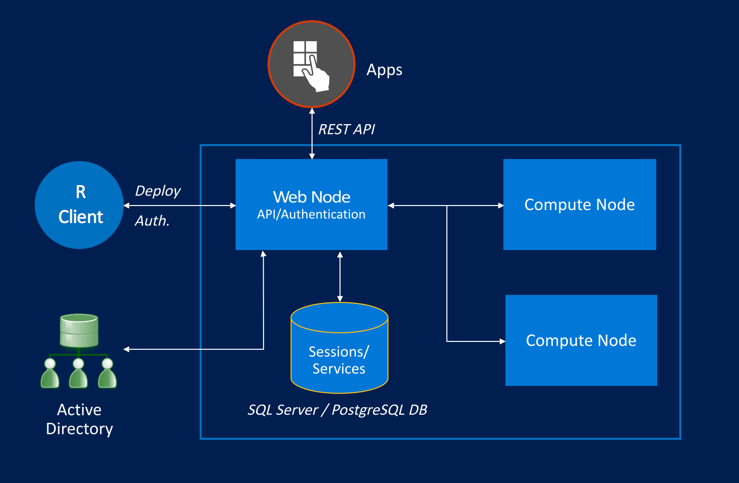

---

# required metadata
title: "Configuration Operationalization for R Server | Microsoft R Server Docs"
description: "Configuration Operationalization for Microsoft R Server"
keywords: ""
author: "j-martens"
manager: "jhubbard"
ms.date: "12/08/2016"
ms.topic: "article"
ms.prod: "microsoft-r"
ms.service: ""
ms.assetid: ""

# optional metadata
ROBOTS: ""
audience: ""
ms.devlang: ""
ms.reviewer: ""
ms.suite: ""
ms.tgt_pltfrm: ""
ms.technology: 
  - deployr
  - r-server
ms.custom: ""
---

# Configuring R Server for Operationalization

**Applies to:  Microsoft R Server 9.0.1**

To benefit from Microsoft R Server’s deployment and operationalization features, you can configure R Server after installation to act as a deployment server and host analytic web services.

All configurations have at least a single web node and single compute node:

+ A **web node** acts as an HTTP REST endpoint with which users can interact directly to make API calls. The web node accesses data in the database, and send jobs to the compute node. 

+ A **compute node** is used to execute R code as a session or service. Each compute node has its own pool of R shells.
 
The simplest configuration is a single web node and compute node on a single machine, called a **one-box configuration**.  You can also install multiple components on multiple machines, which is referred to as an  **enterprise configuration**. 

>[!Important]
>The operationalization feature for Microsoft R Server is supported on:
>- Windows Server 2012, Windows Server 2016
>- Ubuntu 14.04, Ubuntu 16.04, 
>- CentOS/RHEL 7.x
 


<a name="onebox"></a>
## The Basic One-Box Configuration

With one-box configurations, as the name suggests, everything runs on a single machine and set-up is a breeze. This configuration includes an operationalization web node and compute node on the same machine. It also relies on the default local SQLite database.

This configuration is useful when you want to explore what it is to operationalize R analytics using R Server. It is perfect for testing, proof-of-concepts, and small-scale prototyping, but might not be appropriate for production usage. 


**To configure on a single machine:**

1. On each machine, install Microsoft R Server:

     + On Windows, install [R Server (Standalone)](../rserver-install-windows.md).

     + On Linux, install [Microsoft R Server](../rserver-install-linux-server.md).  

1. On the following Linux flavors, add a few symlinks:

   + On CentOS 7.1, CentOS 7.2:
     ```
      cd /usr/lib64
      sudo ln -s libpcre.so.1   libpcre.so.0
      sudo ln -s libicui18n.so.50   libicui18n.so.36
      sudo ln -s libicuuc.so.50 libicuuc.so.36
      sudo ln -s libicudata.so.50 libicudata.so.36
     ```

   + On Ubuntu 14.04:
     ```
      sudo apt-get install libicu-dev

      cd /lib/x86_64-linux-gnu
      ln -s libpcre.so.3 libpcre.so.0
      ln -s liblzma.so.5 liblzma.so.0

      cd /usr/lib/x86_64-linux-gnu
      ln -s libicui18n.so.52 libicui18n.so.36
      ln -s libicuuc.so.52 libicuuc.so.36
      ln -s libicudata.so.52 libicudata.so.36
     ```

   + On Ubuntu 16.04:
     ```
      cd /lib/x86_64-linux-gnu
      ln -s libpcre.so.3 libpcre.so.0
      ln -s liblzma.so.5 liblzma.so.0

      cd /usr/lib/x86_64-linux-gnu
      ln -s libicui18n.so.55 libicui18n.so.36
      ln -s libicuuc.so.55 libicuuc.so.36
      ln -s libicudata.so.55 libicudata.so.36
     ```

   >**Note:** If there are issues with starting RServe, check this log file: `tail -f /opt/deployr/9.0.1/rserve/R/log`.

1. [Launch the administration utility](admin-utility.md#launch) with administrator, `root`, or `sudo` privileges.

1. Choose the option to **Configure R Server for Operationalization**.

1. Choose the option to **Configure for one box** to set up the web node and compute node onto the same machine.

1. When prompted, provide a password for the built-in, local operationalization `admin` account. 

1. Return to the main menu of the utility when the configuration ends. 

1. [Run a diagnostic test of the configuration](admin-utility.md#test). 
  
1. On Linux: If using the IPTABLES firewall or equivalent service on Linux, use the `iptables` command (or the equivalent) to open port 12800 to the public IP of the web node so that remote machines can access it. 


You are now ready to begin operationalizating your R analytics with R Server.


<a name="enterprise"></a>
## The Enterprise Configuration

With an enterprise configuration, you can work with your production-grade data within a scalable, multi-machine setup, and benefit from enterprise-grade security. 

This configuration includes one or more web nodes and one or more compute nodes, each of which can scaled independently.  Scaling up compute nodes enables you to have more R execution shells and benefit from load balancing across these compute nodes. Scaling up web nodes enables an active-active configuration that allows you to load balance the incoming API requests.  Additionally, when you have multiple web nodes, you must set up a [remote SQL Server or PostgreSQL database](configure-remote-database.md) so that data can be shared across web node services.
 
For added security, you can [configure SSL](security-https.md) as well as authenticate against [Active Directory (LDAP) or Azure Active Directory](security-authentication.md).
 



**Step 1: Configure Web Node(s)**

>**Note:** It is possible to run the operationalization web node service from within IIS.

  1. On each machine, install Microsoft R Server:

     + On Windows, install [R Server (Standalone)](https://msdn.microsoft.com/en-us/library/mt671127.aspx). 
     + On Linux, install [Microsoft R Server](../rserver-install-linux-server.md).  

  1. [Launch the administration utility](admin-utility.md#launch) with administrator privileges:
     1. From the main menu, choose the option to **Configure R Server for Operationalization**.
     1. From the sub-menu, choose the option to **Configure a web node**.     
     1. When prompted, provide a password for the built-in, local operationalization `admin` account.  
        You can always authenticate against  [Active Directory (LDAP) or Azure Active Directory](security-authentication.md) later.
  
  1. On Linux: If using the IPTABLES firewall or equivalent service on Linux, use the `iptables` command (or the equivalent) to open port 12800 to the public IP of the web node so that remote machines can access it. 

Your web node is now configured. Repeat these steps for each web node you want to add.

**Step 2: Configure a Remote Database** 

By default, the web node configuration sets up a SQLite database. If you want to use a remote database, follow these instructions to [configure remote database](configure-remote-database.md) (SQL Server or PostgreSQL).

If you plan to configure multiple web nodes, then you **must** set up a [remote SQL Server or PostgreSQL database](configure-remote-database.md) so that data can be shared across web node services.

> Create this database and register it in the configuration file below BEFORE the service for the control node is started.

<a name="add-compute-nodes"></a>

**Step 3: Configure Compute Node(s)**

>**Note:** A compute node can be configured on its own machine or on the same machine as the web node.

1. On each machine, install the same R Server version you installed on the web node.

1. On the following Linux flavors, add a few symlinks:

   + On CentOS 7.1, CentOS 7.2:
     ```
      cd /usr/lib64
      sudo ln -s libpcre.so.1   libpcre.so.0
      sudo ln -s libicui18n.so.50   libicui18n.so.36
      sudo ln -s libicuuc.so.50 libicuuc.so.36
      sudo ln -s libicudata.so.50 libicudata.so.36
     ```

   + On Ubuntu 14.04:
     ```
      sudo apt-get install libicu-dev

      cd /lib/x86_64-linux-gnu
      ln -s libpcre.so.3 libpcre.so.0
      ln -s liblzma.so.5 liblzma.so.0

      cd /usr/lib/x86_64-linux-gnu
      ln -s libicui18n.so.52 libicui18n.so.36
      ln -s libicuuc.so.52 libicuuc.so.36
      ln -s libicudata.so.52 libicudata.so.36
     ```

   + On Ubuntu 16.04:
     ```
      cd /lib/x86_64-linux-gnu
      ln -s libpcre.so.3 libpcre.so.0
      ln -s liblzma.so.5 liblzma.so.0

      cd /usr/lib/x86_64-linux-gnu
      ln -s libicui18n.so.55 libicui18n.so.36
      ln -s libicuuc.so.55 libicuuc.so.36
      ln -s libicudata.so.55 libicudata.so.36
     ```


1. [Launch the administration utility](admin-utility.md#launch) with administrator privileges.

1. From the main menu, choose the option to **Configure R Server for Operationalization**.

1. From the sub-menu, choose the option to **Configure a compute node**.

   >**Note:** If there are issues when starting RServe, check this log file: `tail -f /opt/deployr/9.0.1/rserve/R/log`.
  
Your compute node is now configured. Repeat these steps for each compute node you want to add.

**Step 4: Configure Enterprise-Grade Security**

In production environments, we strongly recommend the following approaches:

1. [Configure SSL/TLS](security-https.md) and install the necessary certificates. 

1. Authenticate against [Active Directory (LDAP) or Azure Active Directory](security-authentication.md).  

1. For added security, restrict the list of IPs that can access the machine hosting the compute node.

**Step 5: Provision on the Cloud**

If provisioning on a cloud service, then you must also [create inbound security rule for port 12800 in Azure](https://azure.microsoft.com/en-us/documentation/articles/virtual-machines-windows-classic-setup-endpoints/) or open the port through the AWS console.

**Step 6: Declare all Compute Nodes**

Once all web nodes and compute nodes are configured, you must declare the IP addresses of each compute node with each web node.

On each web node:

   1. Open the external configuration file, `appsettings.json` file. 

       + On Windows, this file is under `<MRS_home>\deployr\Microsoft.DeployR.Server.WebAPI\` where `<MRS_home>` is the path to the Microsoft R Server installation directory. To find this path, enter `normalizePath(R.home())` in your R console.

       + On Linux, this file is under `/usr/lib64/microsoft-deployr/9.0.1/Microsoft.DeployR.Server.WebAPI/`.

   1. In the file, search for the section starting with `"BackEndConfiguration": {` .

   1. Update the `"Uris": {` properties to declare each compute node:
      ```
      "Uris": {
         "Values": [
           "http://<IP-ADDRESS-OF-COMPUTE-NODE-1>:12805",
           "http://<IP-ADDRESS-OF-COMPUTE-NODE-2>:12805",
           "http://<IP-ADDRESS-OF-COMPUTE-NODE-3>:12805"       
         ]
       }
       ```

   1. Close and save the file.

   1. Launch the administrator's utility and [restart the compute node](admin-utility.md#startstop).

   1. Verify the configuration by running [diagnostic test](admin-utility.md#test) on each web node. 

   1. Repeat these steps on each web node to declare all the compute node.

**Step 7: Post Configuration**

1. [Update service ports](admin-utility.md#ports), if needed.

1. [Run diagnostic tests](admin-utility.md#test). 

1. [Evaluate](admin-evaluate-capacity.md) the configuration's capacity.