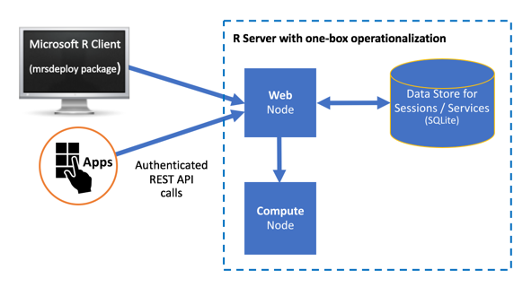

---

# required metadata
title: "Configure R Server for Operationalization | Microsoft R Server Docs"
description: "Configuration Operationalization for Microsoft R Server"
keywords: ""
author: "j-martens"
manager: "jhubbard"
ms.date: "12/08/2016"
ms.topic: "article"
ms.prod: "microsoft-r"
ms.service: ""
ms.assetid: ""

# optional metadata
ROBOTS: ""
audience: ""
ms.devlang: ""
ms.reviewer: ""
ms.suite: ""
ms.tgt_pltfrm: ""
ms.technology:
  - deployr
  - r-server
ms.custom: ""
---

# Configuring R Server to operationalize analytics (One-Box Configuration)

**Applies to:  Microsoft R Server 9.x**

To benefit from Microsoft R Server’s deployment and operationalization features, you can configure R Server after installation to act as a deployment server and host analytic web services.


## One-box vs enterprise architectures

All configurations have at least a single web node, single compute node, and a database.

+ Web nodes act as HTTP REST endpoints with which users can interact directly to make API calls. These nodes also access the data in the database and send requests to the compute node for processing. 

+ Compute nodes are used to execute R code as a session or service. Each compute node has its own pool of R shells. Scaling up compute nodes enables you to have more R execution shells and benefit from load balancing across these compute nodes. 

+ The database. An SQLite 3.7+ database is installed by default, but you can, and in some cases must, [use a SQL Server (Windows) or PostgreSQL (Linux)](configure-remote-database.md) database instead.

R Server offers two types of configuration for operationalizing analytics and remote execution:
1. **One-box configuration**: as the name suggests, one web node and one compute node run on a single machine. Set-up is a breeze. This configuration is useful when you want to explore what it is to operationalize R analytics using R Server. It is perfect for testing, proof-of-concepts, and small-scale prototyping, but might not be appropriate for production usage. This configuration is covered in this article.

   

1. **Enterprise configuration**: a configuration where multiple nodes are configured on multiple machines along with other enterprise features. This configuration can be scaled up or down by adding or removing nodes. Learn more about this setup in the [enterprise configuration](configure-enterprise.md) article.

For added security, you can [configure SSL](security-https.md) as well as authenticate against [Active Directory (LDAP) or Azure Active Directory](security-authentication.md).


## Supported platforms 

The web nodes and compute nodes are supported on:
- Windows Server 2012 R2, Windows Server 2016
- Ubuntu 14.04, Ubuntu 16.04,
- CentOS/RHEL 7.x


## How to upgrade a one-box configuration from 9.0 to 9.1 

To replace an older version of a one-box configuration, you can uninstall the older distribution before installing the new version (there is no in-place upgrade). **Carefully review the steps below.** 

>[!IMPORTANT]
>Before you begin, please back up the `appsettings.json` file on each node in case of an issue during the upgrade process.

1. If you used the default SQLite database, `deployrdb_9.0.0.db` in R Server 9.0 and want to persist the data, then you must **back up the SQLite database before uninstalling Microsoft R Server**. Make a copy of the database file and put it outside of the Microsoft R Server directory structure. 

   (If you are using a SQL Server or PostgreSQL database, you can skip this step.)

   >[!Warning]
   >If you skip this SQLite database backup step and uninstall Microsoft R Server 9.0 first, you will not be able to retrieve your database data.

1. Uninstall Microsoft R Server 9.0 using the instructions in the article [Uninstall Microsoft R Server to upgrade to a newer version](../rserver-install-uninstall-upgrade.md). The uninstall process stashes away a copy of your 9.0 configuration files under this directory so you can seamlessly upgrade to R Server 9.1 in the next step:
   + On Windows: `C:\Users\Default\AppData\Local\DeployR\current`

   + On Linux: `/etc/deployr/current`

1. If you backed up a SQLite database in Step 1, manually move `deployrdb_9.0.0.db` under this directory so it can be found during the upgrade:
   + Windows: `C:\Users\Default\AppData\Local\DeployR\current\frontend`
   + Linux: `/etc/deployr/current/frontend`

   (If you are using a SQL Server or PostgreSQL database, you can skip this step.)

1. Install Microsoft R Server:
   + On Windows: follow these instructions [Installation steps](../rserver-install-windows.md) | [Offline steps](../rserver-install-windows-offline.md)
     >[!IMPORTANT]
     >For SQL Server Machine Learning Services, you must also:
     >1. Add a new registry key called `H_KEY_LOCAL_MACHINE\SOFTWARE\R Server\Path` with a value of the parent path to the `R_SERVER` folder (for example, `C:\Program Files\Microsoft SQL Server\140`).
     >1. Manually install .NET Core 1.1.

   + On Linux: follow these instructions [Installation steps](../rserver-install-linux-server.md) | [Offline steps](../rserver-install-linux-offline.md)

1. [Launch the administration utility](admin-utility.md#launch) with administrator privileges. The utility checks to see if any 9.0 configuration files are present under the `current` folder mentioned above.

1. From the menus, choose **Configure R Server for Operationalization** and then choose **Configure for one box**. The configuration script begins.

1. When the script asks you if you'd like to upgrade, enter `y`. The nodes are automatically setup using the configuration you had for R Server 9.0. Note: You can safely ignore the Python warning during upgrade.

1. From the main menu, choose the option to **Run Diagnostic Tests** to [test the configuration](admin-diagnostics.md).

1. Exit the utility. Your web and compute nodes are now upgraded and configured as they were in version 9.0.

1. Repeat these steps for each node.

   >[!WARNING]
   >The entities created by the users, specifically web services and snapshots, are tied to their usernames. For this reason, you must be very careful to prevent changes to the user identifier over time. Otherwise, pre-existing web services and snapshots cannot be mapped to the users who created them. For this reason, we strongly recommend that you DO NOT change the unique LDAP identifier in appsettings.json once users start publishing service or creating snapshots. 


<a name="onebox"></a>

## How to perform a one-box configuration

**To configure on a single machine:**

1. Install Microsoft R Server:
      + On Windows, follow these instructions: [Installation steps](../rserver-install-windows.md) | [Offline steps](../rserver-install-windows-offline.md)
      + On Linux, follow these instructions: [Installation steps](../rserver-install-linux-server.md) | [Offline steps](../rserver-install-linux-offline.md)

1. If on the following Linux flavors, then add a few symlinks:  (If on Windows, skip to the next step)

   + On CentOS 7.1, CentOS 7.2:
     ```
      cd /usr/lib64
      sudo ln -s libpcre.so.1   libpcre.so.0
      sudo ln -s libicui18n.so.50   libicui18n.so.36
      sudo ln -s libicuuc.so.50 libicuuc.so.36
      sudo ln -s libicudata.so.50 libicudata.so.36
     ```

   + On Ubuntu 14.04:
     ```
      sudo apt-get install libicu-dev

      cd /lib/x86_64-linux-gnu
      ln -s libpcre.so.3 libpcre.so.0
      ln -s liblzma.so.5 liblzma.so.0

      cd /usr/lib/x86_64-linux-gnu
      ln -s libicui18n.so.52 libicui18n.so.36
      ln -s libicuuc.so.52 libicuuc.so.36
      ln -s libicudata.so.52 libicudata.so.36
     ```

   + On Ubuntu 16.04:
     ```
      cd /lib/x86_64-linux-gnu
      ln -s libpcre.so.3 libpcre.so.0
      ln -s liblzma.so.5 liblzma.so.0

      cd /usr/lib/x86_64-linux-gnu
      ln -s libicui18n.so.55 libicui18n.so.36
      ln -s libicuuc.so.55 libicuuc.so.36
      ln -s libicudata.so.55 libicudata.so.36
     ```

   >**Note:** If there are issues with starting the compute node, see [here](admin-diagnostics.md).

1. [Launch the administration utility](admin-utility.md#launch) with administrator privileges (Windows) or `root`/ `sudo` privileges (Linux).

    >[!NOTE]
    >You can bypass the interactive configuration steps of the node using the argument `-silentoneboxinstall` and by defining a password for [the local `admin` account](security-authentication.md#local) when you launch the administration utility. If you choose this method, you can skip the next 3 steps. For R Server 9.1 on Windows, for example, the syntax might be: 
    `dotnet Microsoft.RServer.Utils.AdminUtil\Microsoft.RServer.Utils.AdminUtil.dll -silentoneboxinstall my-password`.

1. Choose the option to **Configure R Server for Operationalization**.

1. Choose the option to **Configure for one box** to set up the web node and compute node onto the same machine.

   >[!IMPORTANT]
   > Do not choose the sub-options **Configure a web node** or **Configure a compute node** unless you intend to have them on separate machines, which is described below as an **Enterprise** configuration.

1. When prompted, provide a password for the built-in, local operationalization administrator account called `admin`.

1. Return to the main menu of the utility when the configuration ends.

1. [Run a diagnostic test of the configuration](admin-diagnostics.md).

1. If on Linux and using the IPTABLES firewall or equivalent service, then use the `iptables` command (or the equivalent) to open port 12800 to the public IP of the web node so that remote machines can access it.

>[!Important]
>R Server uses Kestrel as the web server for its operationalization web nodes. Consequently, if you expose your application to the Internet, we recommend that you review the [guidelines for Kestrel](https://docs.microsoft.com/en-us/aspnet/core/fundamentals/servers/kestrel) regarding reverse proxy set up.

You are now ready to begin operationalizating your R analytics with R Server.