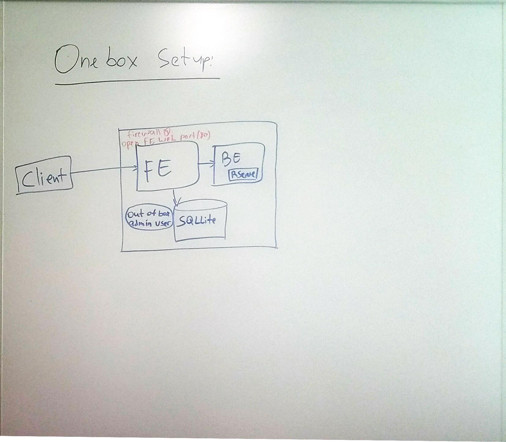

---

# required metadata
title: "Operationalization with R Server"
description: "Operationalization of R Analytics with Microsoft R Server"
keywords: ""
author: "j-martens"
manager: "jhubbard"
ms.date: "05/06/2016"
ms.topic: "get-started-article"
ms.prod: "microsoft-r"
ms.service: ""
ms.assetid: ""

# optional metadata
ROBOTS: ""
audience: ""
ms.devlang: ""
ms.reviewer: ""
ms.suite: ""
ms.tgt_pltfrm: ""
ms.technology: 
  - deployr
  - r-server
ms.custom: ""
---

# Deployment Server Configuration Scenarios

If you want to operationalize your R analytics, you must configure Microsoft R Server after installation to act as a deployment server that hosts analytic web services.

There are essentially two types of configurations:

1. **One-box configuration** (common for testing)

1. **Enterprise-ready configuration** (essential for production)

## The One-Box Basic Configuration

With one-box configurations, as the name suggests, everything runs on a single machine and set-up is a breeze. This configuration is useful when you want to explore what it is to operationalize R analytics using R Server. It is perfect for testing, proof-of-concepts, and small-scale prototyping, but is not appropriate for production usage. 

This configuration includes an operationalization front-end and back-end on the same machine. It relies on the default local SQLite database. The front-end owns stateless business logic and can communicate with the back-ends and the database. The back-end manages stateful R Shells, which are????

Setup R Server for operationalization with an R Server with a _one-box configuration_:
 + [How to configure on Windows]()
 + [How to configure on Linux]()

## The Enterprise-Ready Configuration

With enterprise-ready configurations, you can work with your production-grade data within a scalable, multi-machine setup, and benefit from enterprise-grade security and even a remote SQL or PostgreSQL database.

This configuration includes one or more operationalization front-ends and back-ends on a group of machines. The front-end owns stateless business logic and can communicate with the back-ends and the database. The back-end manages stateful R Shells, which are????

While it is configured, by default, to use the default local SQLite database, you must define a remote SQL Server or PostgreSQL database if you plan on using multiple front-ends.

Front-ends and back-ends can be scaled independently. There are n

Setup R Server for operationalization with an _enterprise-ready configuration_:
 + [How to configure on Windows]()
 + [How to configure on Linux]()

