---

# required metadata
title: "LDAP AD and Azure Active Directory authentication for Machine Learning Server "
description: "Authenticate Machine Learning Server users against LDAP AD or Azure Active Directory"
keywords: "Machine Learning Server LDAP-S, LDAP, AD, Azure Active Directory, AAD, Azure AD, Authentication, Microsoft R Server"
author: "j-martens"
ms.author: "jmartens"
manager: "cgronlun"
ms.date: "2/16/2018"
ms.topic: "article"
ms.prod: "mlserver"

# optional metadata
#ROBOTS: ""
#audience: ""
#ms.devlang: ""
#ms.reviewer: ""
#ms.suite: ""
#ms.tgt_pltfrm: ""
#ms.technology: ""
#ms.custom: ""
---

# Authenticate Machine Learning Server users against LDAP AD or Azure Active Directory

**Applies to:  Machine Learning Server, Microsoft R Server 9.x**

Machine Learning Server's offers seamless integration with authentication solutions when configured to operationalize analytics.


To secure connections and communications, you have several options:

|Authentication Method|When to Use|
|----------------------------------|----------------------------------|
|[Local 'admin' account](#local)|For [one-box](configure-machine-learning-server-one-box.md) configurations|
|[Active Directory / LDAP](#ldap)|For [enterprise](configure-machine-learning-server-enterprise.md) on-premises configurations|
|[Active Directory / LDAP-S](#ldap)|For [enterprise](configure-machine-learning-server-enterprise.md) on-premises configurations with SSL/TLS enabled|
|[Azure Active Directory](#aad)|For [enterprise](configure-machine-learning-server-enterprise.md) cloud configurations|

<a name="local"></a>

## Local Administrator Account Authentication

During configuration, a default administrator account, 'admin', is created to manage the web and compute nodes for In Machine Learning Server (and R Server). This account allows you to use the [CLI or administration utility](configure-admin-cli-launch.md) to configure this feature, edit ports, restart nodes, and so on. 

This account might be sufficient when trying to operationalize with a [one-box configuration](configure-machine-learning-server-one-box.md) since everything is running within the trust boundary. However, it is insufficient for [enterprise configurations](configure-machine-learning-server-enterprise.md).

To set or change the password for the local administrator account after the configuration script has been run, [follow these steps](configure-admin-cli-local-password.md).

To log in to Machine Learning Server with this user for remote execution or web service functionalities, use remoteLogin() as described in the article "[Connecting to Machine Learning Server with mrsdeploy](how-to-connect-log-in-with-mrsdeploy.md)."


>[!WARNING]
> If you enable Azure Active Directory or Active Directory/LDAP authentication, this 'admin' account can no longer be used to authenticate with Machine Learning Server.


<a name="ldap"></a>

## Active Directory and LDAP/LDAP-S

Active Directory (AD) and LDAP are a great authentication option for on-premises configurations to ensure that domain users have access to the APIs.  

LDAP is the standard protocol for reading data from and writing data to Active Directory (AD) domain controllers. AD LDAP traffic is unsecured by default, which makes it possible to use network-monitoring software to view the LDAP traffic between clients and domain controllers.  

By default, the LDAP security provider is not configured. To enable LDAP authentication support, update the relevant properties in your configuration file. The values you assign to these properties must match the configuration of your LDAP Directory Information Tree (DIT).

You can make LDAP traffic confidential and secure using Secure Sockets Layer (SSL) / Transport Layer Security (TLS) technology. This combination is referred to as LDAP over SSL (or LDAP-S). To ensure that no one else can read the traffic, SSL/TLS establishes an encrypted tunnel between an LDAP client and a domain controller. [Learn more about enabling SSL/TLS.](configure-https.md) Reasons for enabling LDAP-S include:

+ Organizational security policies typically require that all client/server communication is encrypted.
+ Applications use simple BIND to transport credentials and authenticate against a Domain Controller. As simple BIND exposes the users’ credentials in clear text, using SSL/TLS to encrypt the authentication session is recommended.
+ Use of proxy binding or password change over LDAP, which requires LDAP-S. Bind to an AD LDS instance Through a Proxy Object
+ Applications that integrate with LDAP servers (such as Active Directory or Active Directory Domain Controllers) might require encrypted LDAP communications.

>[!WARNING]
> You cannot have both Azure Active Directory and Active Directory/LDAP enabled at the same time. If one is set to `"Enabled": true`, then the other must be set to `"Enabled": false`.

**On each web node:**

1. Enable LDAP/LDAP-S in the external JSON configuration file, appsettings.json:
 
   1. Open the configuration file, [\<web-node-install-path>](../operationalize/configure-find-admin-configuration-file.md)/appsettings.json. 

   1. Search for the section starting with `"LDAP": {`
   
   1. <a name="encrypt"></a>Enable this section and update the properties so that they match the values in your Active Directory Service Interfaces Editor.  

      > For better security, we recommend you [encrypt the password](configure-admin-cli-encrypt-credentials.md) before adding the information to appsettings.json.

   |LDAP Properties|Definition|
   |---------------|-------------------------------|
   |Host|Address of the Active Directory server|
   |Port|(version 9.1+) Used to override the default LDAP port. By default, the LDAP port is 389 and the LDAP-S port is 636.|      
   |UseLDAPS|Set 'true' for LDAP-S or 'false' for LDAP<br>**Note:** If LDAP-S is configured, an installed LDAP service certificate is assumed so that the tokens produced by Active Directory/LDAP can be signed and accepted by Machine Learning Server. |
   |BindFilter|(version 9.0.1 only) The template used to do the Bind operation. For example, "CN={0},CN=DeployR,DC=TEST,DC=COM". {0} is the user's DN.|
   |QueryUserDn|Distinguished name of user with read-only query capabilities with which to authenticate|
   |QueryUserPassword|Password for that user with which to authenticate (value must be encrypted).  We highly recommend that you [encrypt LDAP login credentials](configure-admin-cli-encrypt-credentials.md) before adding the information to this file.|
   |QueryUserPasswordEncrypted|True/False. If 'True', it means the value of QueryUserPassword is an encrypted string.|
   |SearchBase|Context name to search in, relative to the base of the configured ContextSource, for example, 'ou=users,dc=example,dc=com'.| 
   |SearchFilter|The pattern to be used for the user search. "SearchFilter": "cn={0}" is for each user's DN. In legacy systems, some use "SearchFilter": "sAMAccountName={0}"|
   |UniqueUserIdentifierAttributeName|(Version 9.1) The attribute name that stores the unique user id for each user. If you are configuring roles, you must ensure that the username returned for this value matches the username returned by SearchFilter. For example, if "SearchFilter": "cn={0}" and "UniqueUserIdentifierAttributeName": "userPrincipalName", then the values for cn and userPrincipalName must match.|
   |DisplayNameAttributeName|(Version 9.1) The attribute name that stores the display name for each user.|
   |EmailAttributeName|(Version 9.1) The attribute name that stores the email address for each user.|

   >[!IMPORTANT]
   >The entities created by the users, specifically web services and [session snapshots](../r/how-to-execute-code-remotely.md#snapshot), are tied to their usernames. For this reason, you must be careful to prevent changes to the user identifier over time. Otherwise, pre-existing web services and snapshots cannot be mapped to the users who created them.
   >
   >For this reason, we strongly recommend that you DO NOT change the unique LDAP identifier in appsettings.json once users start publishing service or creating snapshots. 
   >
   >Similarly, if your organization changes its usernames, those users can no longer access the web services and snapshots they created unless they are [assigned to the `Owner` role](configure-roles.md).  

   <br>

   >[!WARNING]
   >For 9.0.1 Users! The unique identifier is always set to the `userPrincipalName` in version 9.0.1. Therefore, make sure that a value is defined for the `userPrincipalName` in the Active Directory Service Interfaces Editor or the authentication may fail.  In the Explorer, connect to the domain controller, find the user to authorize, and then make sure that the value for the  UserPrincipalName (UPN) property is not null.

   For example, with R Server 9.1:
   ```
   "LDAP": {
           "Enabled": true,
           "Host": "<host_ip>",
           "Port": "<port_number>"
           "UseLDAPS": "True",
           "QueryUserDn": "CN=deployradmin,CN=DeployR,DC=TEST,DC=COM",
           "QueryUserPasswordEncrypted": true,
           "QueryUserPassword": "ABCD00000123400000000000mnop00000000WXYZ",
           "SearchBase": "CN=DeployR,DC=TEST,DC=COM",
           "SearchFilter": "cn={0}"  
           "UniqueUserIdentifierAttributeName": "userPrincipalName",
           "DisplayNameAttributeName": "name",
           "EmailAttributeName": "mail"     
   }
   ```
   
   <br>
      
   >[!NOTE]
   >Need help figuring out your Active Directory/LDAP settings? Check out your LDAP settings using the `ldp.exe` tool and compare them to what you’ve declared in appsettings.json.  You can also consult with any Active Directory experts in your organization to identify the correct parameters.

1. To set different levels of permissions for users interacting with web services, [assign them roles](configure-roles.md). <a name="ldap-jwt"></a>

1. If using a certificate for access token signing, you must: 

   >[!Important]
   >You must use a certificate for access token signing whenever you have multiple web nodes so the tokens are signed consistently by every web node in your configuration. 
   >
   >In production environments, we recommend that you use a certificate with a private key to sign the user access tokens between the web node and the LDAP server.
   >
   >Tokens are useful to the application developers who use them to identify and authenticate users who are sending API calls within their application. [Learn more...](how-to-manage-access-tokens.md)
   >
   >**Every web node must have the same values**.
    
   1. On each machine hosting the Web node, install the trusted, signed **access token signing certificate** with a private key in the certificate store. Take note of the `Subject` name of the certificate as you need this information later.  Read [this blog post](https://blogs.msdn.microsoft.com/rserver/2017/05/19/using-certificates-in-r-server-operationalization-for-linux/) to learn how to use a self-signed certificate in Linux for access token signing. Self-signed certificates are NOT recommended for production usage.

   1. In the appsettings.json file, search for the section starting with `"JWTSigningCertificate": {`

   1. Enable this section and update the properties so that they match the values for your token signing certificate:
      ```
      "JWTSigningCertificate": {
          "Enabled": true,
          "StoreName": "My",
          "StoreLocation": "CurrentUser",
          "SubjectName": "CN=<subject name>"
          "Thumbprint": "<certificate-thumbprint>"
      }
      ```
      >[!NOTE]
      >Use `"Thumbprint"` to ensure that the correct certificate is loaded if there are multiple certificates on the same system with same name used for different purposes such as IPsec, TLS Web Server Authentication, Client Authentication, Server Authentication, and so on.  If you do not have multiple certificates with same name, you can leave the Thumbprint field empty.

1. Save changes to appsettings.json. 

1. [Restart the web node](configure-admin-cli-stop-start.md) using the administration utility so that the changes can take effect. 
 
1. Run the [diagnostic tests](configure-run-diagnostics.md) to ensure all tests are passing in the configuration.

   >[!IMPORTANT]
   >If you run into connection issues when configuring for Active Directory/LDAP, try the ldp.exe tool to search the LDAP settings and compare them to what you declared in appsettings.json.  To identify the correct parameters, consult with any Active Directory experts in your organization.

1. Repeat these steps on each machine hosting the web node.

1. Share the connection details with any users who authenticate with Machine Learning Server either to make [API calls](concept-api.md) directly or indirectly in R [using remoteLogin() function in the mrsdeploy package](how-to-connect-log-in-with-mrsdeploy.md).


<br>

<a name="aad"></a>

## Azure Active Directory 

[Azure Active Directory (AAD)](https://www.microsoft.com/en-us/cloud-platform/azure-active-directory) can be used to securely authenticate  in the cloud when the client application and Web node have access to the internet.

**Step 1: Log in to the Azure portal**

1. Sign in to the [Azure portal](http://portal.azure.com).

1. Select the upper-right hand corner and select the Active Directory account from the list. If the Azure Active Directory has not been set up yet, contact your system administrator. In our example, that directory is `deployrtest`.
 
1. Select **Azure Active Directory** from the left-hand side. 

   

1. Select **App registrations** tab at the top.
   The application list appears. You may not have any applications yet. 

   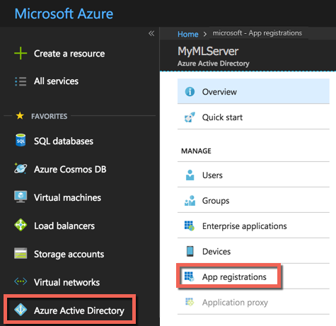

**Step 2: Create a web application**

Now, create a web app that is tied to the Azure Active Directory as follows: 

1. Select **New application registration** at the top.    
   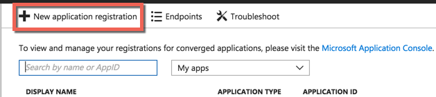

1. Enter a **Name** for your application, such as `Machine Learning Server Web app`.
   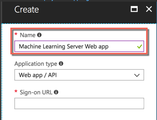

1. For the **Application type**, select the **Web app / API**. 

1. In the **Sign-on URL** box, paste the application URL you copied earlier; or if you expect the R client to be on the same machine as the server, use http://localhost:12800.  

1. Select **Create** to create the new web application.

   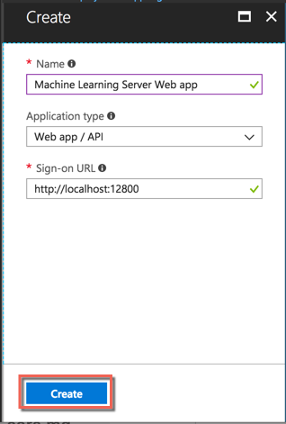

   The application is created and its details appear onscreen.
     
1. Copy the **Application ID** for the web application. You use this later when you configure your Native application and Machine Learning Server using this ID.
   
   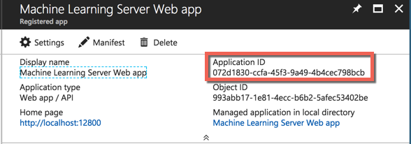

1. Select **Settings** . The **Settings** pane appears on the right.

1. Select **Keys** from the **Settings** pane. The **Keys** pane appears.
   
   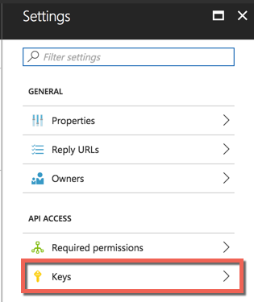

1. In the **Password** area, add a client key. Provide a description of your choosing and select a key duration.

   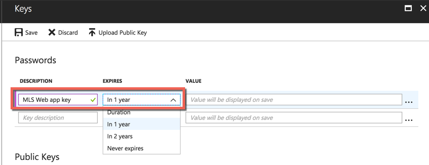

1. Select **Save** to save the key. 

1. Be sure to copy the key.

   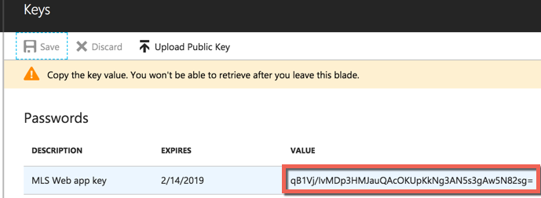

   >[!IMPORTANT] 
   > Take note of this key as it is needed to configure [roles to give web services permissions to certain users](configure-roles.md). 

1. Also, take note of the application's tenant ID.  The tenant ID is the domain of the Azure Active Directory account, for example,  `myMRServer.contoso.com`.


**Step 3: Create a native application**

Now, let's create a native application. This application links the web application to the Machine Learning Server web node.

1. In the Azure portal, select **Azure Active Directory** from the left-hand side. 

1. Select **App registrations**.
   
   

1. Select **New application registration** at the top.    

   

1. Enter a **Name** for your application, such as `Machine Learning Server native app`.

   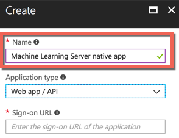

1. For the **Application type**, select the **Native**. 

   

1. In the **Redirect URI** field, enter:
   ```
   urn:ietf:wg:oauth:2.0:oob
   ```  

1. Select **Create** to create the new native application.

   The application is created and its details appear onscreen.
     
1. Copy the **Application ID** for the web application. You use this ID later to enable AAD in Machine Learning Server.
   
   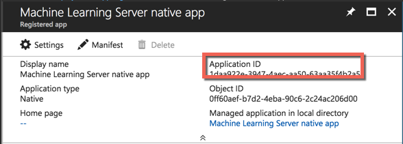

1. Select **Settings** . The **Settings** pane appears on the right.

1. Select **Required permissions**.
   
   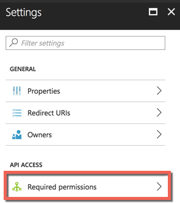

1. Select **Add** at the top. 

1. Select **Select an API**.
   
   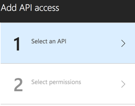

1. In the search field at the top, type the name of the web application you created. In our example, we use the name `Machine Learning Server Web app`. 
   
   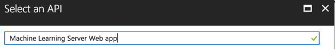

1. Select the web application name.

1. Select the **Select** button. The **Select permissions > Enable Access** fields appear.

1. Select the checkmark next to the name of the web application.
   
   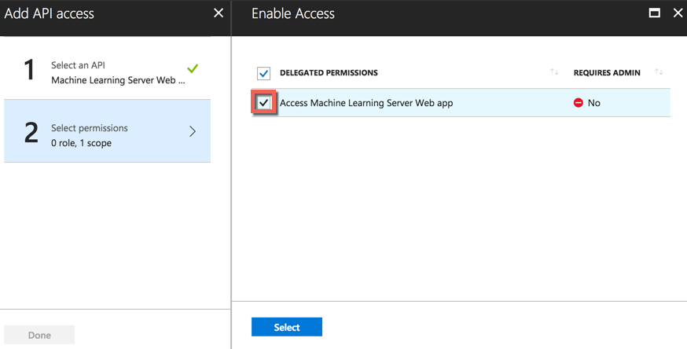

1. Select the **Select** button. The pane closes.

1. Select **Done** at the bottom to finish adding the permissions.

**Step 4: Enable Azure AD on each web node**

1. Open the configuration file, [\<web-node-install-path>](../operationalize/configure-find-admin-configuration-file.md)/appsettings.json.

1. Search for the section starting with:
   ```
   "AzureActiveDirectory": {
      "Enabled": false,
   ```

   >[!WARNING]
   > You cannot have both Azure Active Directory and Active Directory/LDAP enabled at the same time. If one is set to `"Enabled": true`, then the other must be set to `"Enabled": false`.

1. Enable Azure Active Directory as the authentication method:  `"Enabled": true,`

1. Update the other properties in that section so that they match the values in the Azure portal.  Properties include:

   |Azure AD Properties|Definition|
   |----------------|-------------------------------|
   |Enabled|To use AAD for authentication, set to 'true'. Else, set to 'false'.|
   |Authority|Use 'https://login.windows.net/<URL to AAD login>' where <URL to AAD login> is the URL to the AAD login. For example, if the AAD account domain is myMRServer.contoso.com, then the Authority would be 'https://login.windows.net/myMRSServer.contoso.com'|
   |Audience|Use the CLIENT ID value for the WEB app you created in the Azure portal.|
   |ClientId|Use the CLIENT ID value for the NATIVE app you created in the Azure portal.|
   |Key|This is the key for the WEB application you took note of before.  |
   |KeyEncrypted|We highly recommend that you [encrypt login credentials](configure-admin-cli-encrypt-credentials.md) before adding the information to this file. Set KeyEncrypted to 'true' if using encrypted information. For plain text, set to 'false'.|

   For example:
   ```
   "AzureActiveDirectory": {
      "Enabled": true,
      "Authority": "https://login.windows.net/myMRServer.contoso.com",
      "Audience": "00000000-0000-0000-0000-000000000000",
      "ClientId": "00000000-0000-0000-0000-000000000000",
      "Key": "ABCD000000000000000000000000WXYZ", 
      "KeyEncrypted": true
    }
   ```

1. To set different levels of permissions for users interacting with web services, [assign them roles](configure-roles.md).

1. [Restart the web node](configure-admin-cli-stop-start.md) for the changes to take effect.
 
1. Authorize this machine for Azure Active Directory Test by running a [diagnostic test](configure-run-diagnostics.md) of the configuration.

   >[!IMPORTANT]
   >You must run the diagnostic tests once on each web node to authorize this device for Azure Active Directory. You will not be able to log in using AAD until this has been done.

1. Repeat these steps on each machine hosting a web node.

**Step 5: Share the required AAD connection details with your users**

Share the connection details, such as the Authority and Audience, with any users who need to authenticate with Machine Learning Server to make [API calls](concept-api.md) directly or indirectly in R [using remoteLoginAAD() function in the mrsdeploy package](how-to-connect-log-in-with-mrsdeploy.md#aad-arguments). 

If you do not specify a username and password as arguments to the login call or R functions, you are prompted for your AAD username (<username>@<AAD-account-domain>) and password. 

>[!IMPORTANT]
>Learn how to authenticate with AAD using the remoteLoginAAD() function in the mrsdeploy R package as described in this article: "[Connecting to Machine Learning Server with mrsdeploy](how-to-connect-log-in-with-mrsdeploy.md)."

## See also

* [Blog article: Step-by-step setup for LDAPS on Windows Server](https://blogs.msdn.microsoft.com/rserver/2017/04/10/step-by-step-guide-to-setup-ldaps-on-windows-server/)