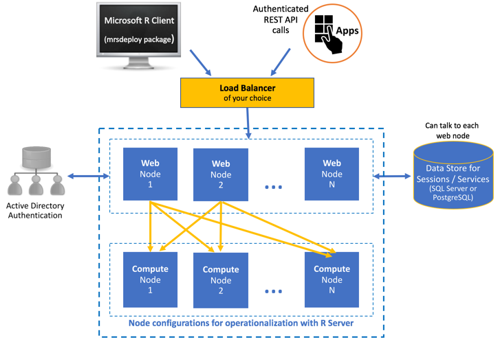

---

# required metadata
title: "Enterprise Configuration of Operationalization for R Server | Microsoft R Server Docs"
description: "Enterprise Configuration of Operationalization for Microsoft R Server"
keywords: ""
author: "j-martens"
manager: "jhubbard"
ms.date: "3/20/2017"
ms.topic: "article"
ms.prod: "microsoft-r"
ms.service: ""
ms.assetid: ""

# optional metadata
ROBOTS: ""
audience: ""
ms.devlang: ""
ms.reviewer: ""
ms.suite: ""
ms.tgt_pltfrm: ""
ms.technology:
  - deployr
  - r-server
ms.custom: ""
---

# Configuring R Server for Operationalization (Enterprise Configuration)

**Applies to:  Microsoft R Server 9.x**

To benefit from Microsoft R Server’s deployment and operationalization features, you can configure R Server after installation to act as a deployment server and host analytic web services. This article describes how to perform an enterprise configuration of these features. 

With an enterprise configuration, you can work with your production-grade data within a scalable, multi-machine setup, and benefit from enterprise-grade security.

## Architecture

This configuration includes one or more web nodes and one or more compute nodes, each of which can scaled independently.  

+ **Web nodes** act as HTTP REST endpoints with which users can interact directly to make API calls. Web nodes also access the data in the database and send requests to the compute node for processing.

+ **Compute nodes** are used to execute R code as a session or service. Each compute node has its own pool of R shells.  Scaling up compute nodes enables you to have more R execution shells and benefit from load balancing across these compute nodes. 

Scaling up web nodes enables an active-active configuration that allows you to load balance the incoming API requests.  Additionally, when you have multiple web nodes, you'll need to use a [SQL Server or PostgreSQL database](configure-remote-database.md) so that data and web services can be shared and available for all requests across web node services.   

For added security, you can [configure SSL](security-https.md) as well as authenticate against [Active Directory (LDAP) or Azure Active Directory](security-authentication.md).

Another configuration, referred to as "one-box", consists of a single web node and a single compute node installed on the same machine. Learn more about this configuration, [here](configuration-initial.md). 




## Supported platforms

The web nodes and compute nodes are supported on:
- Windows Server 2012 R2, Windows Server 2016
- Ubuntu 14.04, Ubuntu 16.04,
- CentOS/RHEL 7.x

## How to upgrade from 9.0  to 9.1 

To replace an older version, you can uninstall the older distribution before installing the new version (there is no in-place upgrade). **Carefully review the steps below. ** 

1. If you used the default SQLite database, `deployrdb_9.0.0.db` in R Server 9.0 and want to persist the data, then you must **back up the SQLite database before uninstalling Microsoft R Server**. Make a copy of the database file and put it outside of the Microsoft R Server directory structure. 

   If you are using SQL Server or PostgreSQL, you do not need to do this step.

   >[!Warning]
   >If you skip this SQLite database backup step and uninstall Microsoft R Server 9.0 first, you will not be able to retrieve your database data.
   
1. Uninstall Microsoft R Server 9.0 as described in the article [Uninstall Microsoft R Server to upgrade to a newer version](rserver-install-uninstall-upgrade.md). 
   
   The uninstall process stashes away a copy of your 9.0 configuration files under this directory so you can seamlessly upgrade to R Server 9.1 in the next step:
   + Windows: `C:\Users\Default\AppData\Local\DeployR\current`
   + Linux: `/etc/deployr/current`

1. If you had SQLite before and backed it up in Step 1, now you must manually move `deployrdb_9.0.0.db` under:
   + Windows: `C:\Users\Default\AppData\Local\DeployR\current\frontend`
   + Linux: `/etc/deployr/current/frontend`

   If you are using a SQL Server or PostgreSQL database, you can skip this step.

1. Follow the instructions below to install Microsoft R Server 9.1 and set up your web and compute nodes. When you launch the Administration utility to configure web and compute nodes, the utility checks to see if any configuration files or SQLite database files are present in the folders mentioned above. 

   If found, you will be asked if you want to upgrade. If you answer `y`, the node will be installed and the prior edits you made to the configuration in 9.0 are automatically available in 9.1. You can safely ignore the Python warning during upgrade. 


## Unattended installs


IGNORE THIS SECTION: STILL NEEDS TO BE WRITTEN

You can bypass the interactive install steps of the Microsoft R Server install script with the -y flag ("yes" or "accept default" to all prompts except that you also agree to the license agreement). Additional flags can be used to specify which of the usual install options you want, as follows:

flag | Option | Description
-----|--------|------------
 -a | --accept-eula | Accept all end user license agreements.
 -d | --download-mro |  Download microsoft r open for distribution to an offline system.
 -p | --hadoop-components | Install Hadoop components.
 -s | --silent | Perform a silent, unattended install.
 -u | --unattended | Perform an unattended install.
 -h | --help | Print this help text.

For a standard unattended install, run the following script:

	./install.sh –a –s


**Silent configurations**
One box offline installation:
`dotnet Microsoft.RServer.Utils.AdminUtil\Microsoft.RServer.Utils.AdminUtil.dll -silentinstall <password>`
`-silentoneboxinstall` argument to launching adminutil
Set the local admin password (you can define another authentication method later such as AAD)

Enterprise offline installation:

`-silentwebnodeinstall`  argument to launching adminutil
Prompted for admin password (what if AAD)

`-silentcomputenodeinstall`  argument to launching adminutil
@@No prompt for password????


## How to perform an enterprise configuration

### 1. Configure a database

By default, the web node configuration sets up a local SQLite database. By default, the web node configuration sets up a local SQLite database.  If you want to use a different or remote database, follow these instructions to [configure that database](configure-remote-database.md) (SQL Server or PostgreSQL).

If you plan to configure multiple web nodes, then you **must** set up a [remote SQL Server or PostgreSQL database](configure-remote-database.md) so that data can be shared across web node services.

>[!NOTE] 
> Create this database and register it in the configuration file below BEFORE the service for the control node is started.

<a name="add-compute-nodes"></a>

### 2. Configure compute nodes

>[!Note]
>Side-by-side installations of R Server web nodes and compute nodes are not supported at this time.

In an enterprise configuration, you can set up one or more compute nodes. 

>[!IMPORTANT]
>We highly recommend that you configure each node (compute or web) on its own machine for higher availability. 

1. On each machine, install Microsoft R Server:
   + On Windows, install R Server for Windows: [Installation steps](../rserver-install-windows.md) | [Offline steps](../rserver-install-windows-offline.md)
   + On Linux, install R Server for Linux: [Installation steps](../rserver-install-linux-server.md) | [Offline steps](../rserver-install-linux-offline.md)

1. If on the following Linux flavors, then add a few symlinks:  (If on Windows, skip to the next step)

   + On CentOS 7.1, CentOS 7.2:
     ```
      cd /usr/lib64
      sudo ln -s libpcre.so.1   libpcre.so.0
      sudo ln -s libicui18n.so.50   libicui18n.so.36
      sudo ln -s libicuuc.so.50 libicuuc.so.36
      sudo ln -s libicudata.so.50 libicudata.so.36
     ```

   + On Ubuntu 14.04:
     ```
      sudo apt-get install libicu-dev

      cd /lib/x86_64-linux-gnu
      ln -s libpcre.so.3 libpcre.so.0
      ln -s liblzma.so.5 liblzma.so.0

      cd /usr/lib/x86_64-linux-gnu
      ln -s libicui18n.so.52 libicui18n.so.36
      ln -s libicuuc.so.52 libicuuc.so.36
      ln -s libicudata.so.52 libicudata.so.36
     ```

   + On Ubuntu 16.04:
     ```
      cd /lib/x86_64-linux-gnu
      ln -s libpcre.so.3 libpcre.so.0
      ln -s liblzma.so.5 liblzma.so.0

      cd /usr/lib/x86_64-linux-gnu
      ln -s libicui18n.so.55 libicui18n.so.36
      ln -s libicuuc.so.55 libicuuc.so.36
      ln -s libicudata.so.55 libicudata.so.36
     ```

1. [Launch the administration utility](admin-utility.md#launch) with administrator privileges.

1. From the main menu, choose the option to **Configure R Server for Operationalization**.

1. From the sub-menu, choose the option to **Configure a compute node**.

1. When the configuration  utility is finished, open port 12805: 
   + On Windows: Add an exception to your firewall to open port 12805. And, for additional security, you can also restrict communication for a private network or domain using a profile.

   + On Linux: If using the IPTABLES firewall or equivalent service on Linux, then use the `iptables` command (or the equivalent) to open port 12805.

1. From the main utility menu, choose the option **Stop and start services** and restart the compute node to define it as a service.


Your compute node is now configured. Repeat these steps for each compute node you want to add.


<a name="webnode"></a>

### 3. Configure web nodes

In an enterprise configuration, you can set up one or more web nodes. Please note that it is possible to run the web node service from within IIS.

>[!IMPORTANT]
>We highly recommend that you configure each node (compute or web) on its own machine for higher availability. 

1. On each machine, install the same R Server version you installed on the compute node.

1. Declare the IP addresses of every compute node with each web node.
   1. [Open the `appsettings.json` configuration file](admin-configuration-file.md).

   1. In the file, search for the section starting with `"BackEndConfiguration": {` .

   1. Update the `"Uris": {` properties to declare each compute node. 
   
      + In R Server 9.1, you must specify the Uri for each compute node individually using the `Values` property and/or specify port ranges (or IP octets) using the `Ranges` property.

        For example, both of the following snippets result in the same specification of four compute nodes:
        ```
        "Uris": {
           "Values": [
             “http://10.1.1.1:12805”, 
             “http://10.0.0.1:12805”, 
             “http://10.0.0.2:12805”, 
             “http://10.0.0.3:12805”
           ]
        }
        ```

        ```
        "Uris": {
           "Values": [“http://10.0.0.1:12805”],
           "Ranges": [“http://10.0.0.1-3:12805”]
        }
        ```
   
      + In R Server 9.0, you must specify the Uri for each compute node individually using the `Values` property. For example, this snippet results in four compute nodes:
        ```
        "Uris": {
           "Values": [
             “http://10.1.1.1:12805”, 
             “http://10.0.0.1:12805”, 
             “http://10.0.0.2:12805”, 
             “http://10.0.0.3:12805”
           ]
        }
        ```
 
      > Do not update any other properties in this file at this point. It will be updated during the compute node configuration.

   1. Close and save the file.

   1. Repeat these steps on each web node to declare each and every compute node.

1. [Launch the administration utility](admin-utility.md#launch) with administrator privileges:
   1. From the main menu, choose the option to **Configure R Server for Operationalization**.

   1. From the sub-menu, choose the option to **Configure a web node**.     

   1. When prompted, provide a password for the built-in, local operationalization administrator account called `admin`.
        Later, you can configure R Server to authenticate against  [Active Directory (LDAP) or Azure Active Directory](security-authentication.md).

   1. From the main menu, choose the option to **Run Diagnostic Tests**. Verify the configuration by running [diagnostic test](admin-diagnostics.md) on each web node.

   1. From the main utility menu, choose the option **Stop and start services** and restart the web node to define it as a service.

   1. Exit the utility.

1. If on Linux and using the IPTABLES firewall or equivalent service, then use the `iptables` command (or the equivalent) to open port 12800 to the public IP of the web node so that remote machines can access it.

Your web node is now configured. Repeat these steps for each web node you want to add.

>[!Important]
>R Server uses Kestrel as the web server for its operationalization web nodes. Consequently, if you expose your application to the Internet, we recommend that you review the [guidelines for Kestrel](https://docs.microsoft.com/en-us/aspnet/core/fundamentals/servers/kestrel) regarding reverse proxy set up.

### 4. Setup enterprise-grade security

In production environments, we strongly recommend the following approaches:

1. [Configure SSL/TLS](security-https.md) and install the necessary certificates.

1. Authenticate against [Active Directory (LDAP) or Azure Active Directory](security-authentication.md).  

1. For added security, restrict the list of IPs that can access the machine hosting the compute node.


### 5. Provision on the cloud

If you are provisioning on a cloud service, then you must also [create inbound security rule for port 12800 in Azure](https://azure.microsoft.com/en-us/documentation/articles/virtual-machines-windows-classic-setup-endpoints/) or open the port through the AWS console. This endpoint allows clients to communicate with the R Server's operationalization server.


### 6. Post configuration steps

1. [Update service ports](admin-utility.md#ports), if needed.

1. [Run diagnostic tests](admin-diagnostics.md).

1. [Evaluate](admin-evaluate-capacity.md) the configuration's capacity.

1. Set up the load balance of your choosing. 