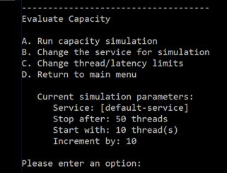

---

# required metadata
title: "Evaluate the load balancing of your configuration - Machine Learning Server | Microsoft Docs"
description: "Load Balancing Capacity and simulation tests for latency and thread counts"
keywords: ""
author: "j-martens"
ms.author: "jmartens"
manager: "jhubbard"
ms.date: "9/25/2017"
ms.topic: "article"
ms.prod: "microsoft-r"

# optional metadata
#ROBOTS: ""
#audience: ""
#ms.devlang: ""
#ms.reviewer: ""
#ms.suite: ""
#ms.tgt_pltfrm: ""
ms.technology: 
  - deployr
  - r-server
#ms.custom: ""
---

# Evaluate the load balancing capacity of your configuration

**Applies to: Machine Learning Server, Microsoft R Server 9.x**

The Evaluate Capacity tool allows you to test your own R and Python code deployed as a web service in your own setup. The tool outputs an accurate evaluation of the latency/thread count for the simulation parameters you define and a break-down graph.

You can define the parameters for the traffic simulation for a given configuration or for a given web service. You can test for maximum latency or maximum thread count.

+ **Maximum Latency:** Define the maximum number of milliseconds for a web node request, the initial thread count, and the thread increments for the test. The test increases the number of threads by the defined increment until the defined time limit is reached.

+ **Maximum Thread Count:** Define the number of threads against which you want to run, such as 10, 15, or 40.  The test increases the number of parallel requests by the specified increment until the maximum number of threads is reached.

> [!Important]
> Web nodes are stateless, and therefore, session persistence ("stickiness") is not required. For proper access token signing and verification across your configuration, ensure that the JWT certificate settings are exactly the same for every web node.  These JWT settings are defined on each web node in the configuration file, appsetting.json. [Learn more...](../operationalize/configure-authentication.md#ldap-jwt)
<br>

## Configure Test Parameters

1. On the web node, [launch the administration utility](configure-use-admin-utility.md#launch) with administrator privileges (Windows) or root/sudo privileges (Linux).

1. From the main menu, choose the option to **Evaluate Capacity** and review the current test parameters.

   

1. To choose a different web service:

   1. From the submenu, choose the option for **Change the service for simulation**.
   1. Specify the new service:
      + To use an existing service, enter 'Yes' and provide the service's name and version as '\<name>/\<version>'. For example, `my-service/1.1`.
      + To use the generated [default service], enter 'No'.
   1. When prompted, enter the required input parameters for the service in a JSON format. <br>For example, for a vector/matrix, follow the JSON format such as '[1,2,3]' for vector, '[[…]]' for matrix. A data.frame is a map where each key is a column name, and each value is represented by a vector of the column values.

1. To test for the maximum latency:

   1. From the submenu, choose the option for **Change thread/latency limits**.
   1. When prompted, enter 'Time' to define the number of threads against which you want to test.
   1. Specify the maximum latency in milliseconds after which the test stops.
   1. Specify the minimum thread count at which the test starts.
   1. Specify the increment by which the number of threads increases for each iteration until the maximum latency is reached.

1. To test for the maximum number of parallel requests that can be supported:

   1. From the submenu, choose the option for **Change thread/latency limits**.
   1. When prompted, enter 'Threads' to define the maximal threshold for the duration of a web node request.
   1. Specify the maximum thread count after which the test stops running.
   1. Specify the minimum thread count at which the test starts.
   1. Specify the increment by which the number of threads increases for each iteration.

<br>

## Run Simulation Tests

1. On the web node, [launch the administration utility](configure-use-admin-utility.md#launch).
1. From the main menu, choose the option to **Evaluate Capacity**. The current test parameters appear.
1. From the sub menu, choose the option to **Run capacity simulation** to start the simulation.
1. Review the results onscreen.

   
1. Paste the URL printed onto the screen into your browser for a visual representation of the results (see below).

<br>

## Understanding the Results

It is important to understand the results of these simulations to determine whether any configuration changes are warranted, such as adding more web or compute nodes, increasing the pool size, and so on.

### Console Results

After the tool is run, the results are printed to the console. 


### Chart Report

The test results are divided into request processing stages to enable you to see if any configuration changes are warranted, such as adding more web or compute nodes, increase the pool size, and so on.


|Stage|Time Measured|
|------|-----------|
|Web Node Request|Time for the request from the web node's controller to go all the way to [deployr-rserve](https://github.com/Microsoft/deployr-rserve)/JupyterKernel and back.|
|Create Shell|Time to create a shell or take it from the pool|
|Initialize Shell|Time to load the data (model or snapshot) into the shell prior to execution|
|Web Node to Compute Node|Time for a request from the web node to reach the compute node|
|Compute Node Request|Time for a request from the compute node to reach deployr-rserve/JupyterKernel and return to the node|

<br>
You can also explore the results visually in a break-down graph using the URL that is returned to the console. 


<a name="pool"></a>

## Shell Pools 

When using Machine Learning Server for operationalization, code is executed in a session or as a service on a compute node. In order to optimize load-balancing performance, Machine Learning Server is capable of establishing and maintaining a pool of R and Python shells for code execution. 

There is a cost to creating a shell both in time and memory. So having a pool of existing shells awaiting code execution requests means no time is lost on shell creation at runtime thereby shortening the processing time. Instead, the time needed to create shells for the pool occurs whenever the compute node is restarted. For this reason, the larger the defined initial pool size (InitialSize), the longer it takes to start up the compute node. New shells are added to the pool as needed to execute in parallel. However, after a request is handled and the session is idle, the shell is closed if the number of shells exceeds the maximum pool size (MaxSize). 

However, during simulation test, the test continues until the test threshold is met (maximum threads or latency). If the number of shells needed to run the test exceeds the number of shells in the pool, a new shell is created on-demand when the request is made and the time it takes to execute the code is longer since time is spent creating the shell itself. 

The size of this pool can be adjusted in the external configuration file, appsettings.json, found on each compute node.

```
"Pool": {
    "InitialSize": 5,
    "MaxSize": 80
  },
```

Since each compute node has its own thread pool for shells, configuring multiple compute nodes means that more pooled shells are available to your users. 

>[!Important]
>If Machine Learning Server is configured for Python only, then only a pool of Python shells is created. If the server is configured only for R, then only a pool of R shells is created. And if it configured for both R and Python, then two separate pools are created, each with the same initial size and maximum size. 

**To update the thread pool:**

   1. On each compute nodes, open the configuration file, \<compute-node-install-path>/appsettings.json. (Find the [install path](../operationalize/configure-find-admin-configuration-file.md) for your version.) 

   1. Search for the section starting with `"Pool": {`

   1. Set the InitialSize. This value is the number of R and/or Python shells that are pre-created for your users each time the compute node is restarted.

   1. Set the MaxSize. This is the maximum number of R and/or Python shells that can be pre-created and held in memory for processing code execution requests. 

   1. Save the file.

   1. [Restart](configure-use-admin-utility.md#startstop) the compute node services. 

   1. Repeat these changes on every compute node.


>[!Note]
>Each compute node should have the same appsettings.json properties.

