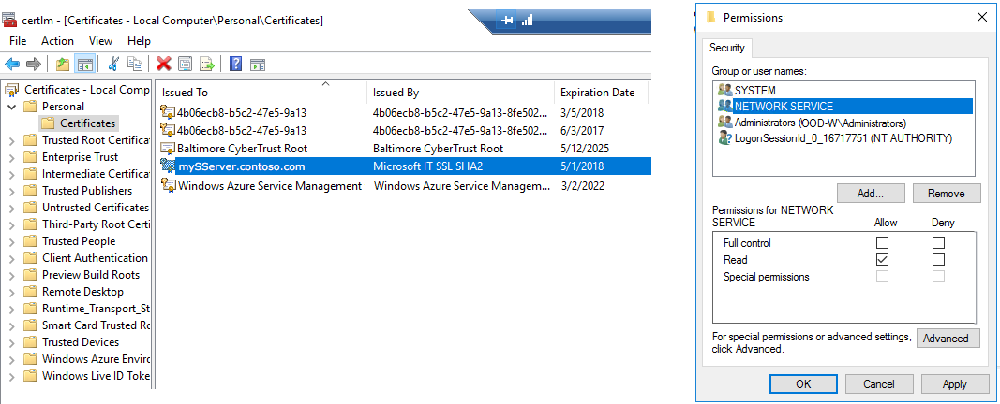

---

# required metadata
title: "HTTPS SSL / TLS 1.2 connection security for Microsoft R Server | Microsoft Docs"
description: "Enterprise-Grade Security: Configure SSL / TLS 1.2 with Microsoft R Server"
keywords: ""
author: "j-martens"
manager: "jhubbard"
ms.date: "6/21/2017"
ms.topic: "article"
ms.prod: "microsoft-r"
ms.service: ""
ms.assetid: ""

# optional metadata
ROBOTS: ""
audience: ""
ms.devlang: ""
ms.reviewer: ""
ms.suite: ""
ms.tgt_pltfrm: ""
ms.technology: 
  - deployr
  - r-server
ms.custom: ""
---

# Enable SSL or TLS for Connection Security in R Server

**Applies to:  Microsoft R Server 9.x**

>For security reasons, we strongly recommend that SSL/TLS 1.2 be enabled in **all production environments.**  Since we cannot ship certificates for you, these protocols are disabled by default.

You can use HTTPS within a connection encrypted by SSL/TLS 1.2.  To enable SSL/TLS, you'll need some or all of these certificates.

|HTTPS Certificates|Description|Web Node|Compute Node|
|------------------------------------|------------------------------------------------------------------------|--------------|---------------|
|API certificate|Secures communication between client applications and web node.|Yes, with private key|No|
|Compute node certificate|Encrypts the traffic between the web node and compute node. You can use a unique certificate for each compute node, or you can use one common Multi-Domain (SAN) certificate for all compute nodes.<br>_Note: If a compute node is inside the web node's trust boundary, then this certificate isn't needed._ |No|Yes, with private key|
|Authentication certificate|Authenticates the web node with the compute node so that only the web node can communicate with the compute node.<br>_Note: If a compute node is inside the web node's trust boundary, then this certificate isn't needed._|Yes, with private and a public key|No|

<br />

## Encrypt the Traffic between Client Applications and R Server

>[!IMPORTANT] 
>We strongly recommend that SSL/TLS 1.2 be enabled in **all production environments.**  

This section walks you through the steps for securing the connections between the client application and the web node. Doing so encrypts the communication between client and web node to prevent traffic from being modified or read.


#### Windows: Using Your Default ASP .NET Core Web Server to Encrypt Traffic

1. On each machine hosting the web node, install and configure the certificate in the certificate store. For example, if you launch "Manage Computer Certificates" from your Windows Start menu, you can:

   1. Install the trusted, signed **API HTTPS certificate** with a private key in the certificate store.
   1. Make sure the name of the certificate matches the domain name of the web node URL. 
   1. Set the private key permissions. 
      1. Right click on the certificate and choose Manage private certificate from the menu.
      1. Add a group called NETWORK SERVICE and give that group `Read` access. 
       
       
   1. Take note of the `Subject` name of the certificate as you'll need this info later.

1. [Open the appsettings.json configuration file](configure-find-admin-configuration-file.md) to configure the HTTPS port for the web node.

1. In that file, search for the section starting with `"Kestrel": {` .

1. Update and add properties in the Kestrel section to match the values for the API certificate. The Subject name can be found as a property of your certificate in the certificate store.
   ```
   {
       "Kestrel": {
           "Port": 443,
           "HttpsEnabled": true,
           "HttpsCertificate": {
               "StoreName": "My",        
               "StoreLocation": "LocalMachine",
               "SubjectName": "CN=<certificate-subject-name>"
           }
       },
   ```

1. Close and save the file.

1. Create a firewall rule to open port 443 to the public IP of the web node so that remote machines can access it.

1. Launch the administrator's utility and [restart the web node](admin-utility.md#startstop).

1. In the same utility, run the [diagnostic tool](configure-run-diagnostics.md) to send a test HTTPs request.

#### Windows: Using IIS to Encrypt

> Make sure the name of the certificate matches the domain name of the web node URL. 

On each machine hosting a web node:
1. Open the certificate store:

   1. Install the trusted, signed **API HTTPS certificate** with a private key in the certificate store.
   1. Make sure the name of the certificate matches the domain name of the web node URL. 
   1. Set the private key permissions. 
      1. Right click on the certificate and choose Manage private certificate from the menu.
      1. Add a group called `NETWORK SERVICE` and give that group `Read` access. 
       
<a name="iis"></a>

1. Launch IIS.

   1. In the **Connections** pane on the left, expand the **Sites** folder and select the website.
   1. Click on **Bindings** under the **Actions** pane on the right.
   1. Click on **Add**.
   1. Choose **HTTPS** as the type and enter the **Port**, which is 443 by default. Take note of the port number. 
   1. Select the SSL certificate you installed previously. 
   1. Click **OK** to create the new HTTPS binding.
   1. Back in the **Connections** pane, select the website name.
   1. Click the **SSL Settings** icon in the center of the screen to open the dialog. 
   1. Select the checkbox to **Require SSL** and require a client certificate.

1. Create a firewall rule to open port 443 to the public IP of the web node so that remote machines can access it.

1. Run the [diagnostic tool](configure-run-diagnostics.md) to send a test HTTPs request.

1. Repeat on every web node.

> If satisfied with the new HTTPS binding, consider removing the "HTTP" binding to prevent any access via HTTP.
<br />

#### Linux: Encrypting Traffic

> Make sure the name of the certificate matches the domain name of the web node URL. 

On each Linux machine hosting a web node:

1. Install the trusted, signed **API HTTPS certificate** with a private key in the certificate store.

1. Install NGINX version 1.11.6 or later.

1. Enable HTTPS on NGINX as described in these articles:
   - http://nginx.org/en/docs/http/ngx_http_ssl_module.html 
   - http://nginx.org/en/docs/http/configuring_https_servers.html

1. Declare the certificate in the NGINX configuration file `nginx.conf`.  Find the `server` code block and update the following values:
   + `server_name` with the name of web node
   + `ssl_certificate` with full path to the  **API HTTPS certificate**  
   + `ssl_certificate_key` with the private key for that certificate

   ```
   server
   {
       listen 443;
       ssl     on;
       server_name <webnode-server-name>;
       ssl_certificate <certificate-location>;
       ssl_certificate_key <certificate-key-location>;
   ```

1. In the same `server` code block, forward the traffic from port 443 to the web node's port 12800 (or another port if you changed it). Add the following lines after `ssl_certificate_key`.
   ```
       location /
       {
       proxy_pass http://127.0.0.1:<web-node-port>;
       }
   }
   ```

1. Close and save `nginx.conf`.

1. Restart NGINX service.

1. If using IPTABLES firewall, add the HTTPS port, which is 443 by default, to the firewall settings to allow communications between the client application and R Server. 

1. Launch the administrator's utility and [restart the web node](admin-utility.md#startstop).

1. Repeat on each web node.

1. Run the [diagnostic tool](configure-run-diagnostics.md) to send a test HTTPs request.

Now, you can access R Server to operationalize analytics securely on https://<webnode-server-name> from your client applications.
 

<br />


## Encrypt Communication between the Web Node and Compute Node

This section walks you through the steps for encrypting the traffic between the web node and each of its compute nodes. 

> If a compute node is inside the web node's trust boundary, then encryption of this piece isn't needed. However, if the compute node resides outside of the trust boundary, consider using the compute node certificate to encrypt the traffic between the web node and compute node. 

When encrypting, you have the choice of using one of the following **compute node HTTPS certificates**:
+ One unique certificate per machine hosting a compute node.
+ One common Multi-Domain (SAN) certificate with all compute node names declared in the single certificate


#### Windows: Using Your Default ASP .NET Core Web Server to Encrypt

1. On each machine hosting a compute node, install the trusted, signed **compute node HTTPS certificate** with a private key in the certificate store.
   > Make sure the name of the certificate matches the domain name of the compute node URL. 
   >
   > Also, take note of the `Subject` name of the certificate as you'll need this info later.

1. Update the external JSON configuration file, `appsettings.json` to configure the HTTPS port for the compute node:
   1. [Open the `appsettings.json` configuration file](configure-find-admin-configuration-file.md).

   1. In that file, search for the section starting with `"Kestrel": {` .

   1. Update and add properties in that section to match the values for the compute node certificate. The `Subject` name can be found as a property of your certificate in the certificate store.
      ```
      {
          "Kestrel": {
              "Port": <https-port-number>,
              "HttpsEnabled": true,
              "HttpsCertificate": {
                  "StoreName": "My",        
                  "StoreLocation": "LocalMachine",
                  "SubjectName": "CN=<certificate-subject-name>"
              }
          },
      ```

   1. Close and save the file.

1. Launch the administrator's utility and [restart the compute node](admin-utility.md#startstop).

1. In the same utility, run the [diagnostic tool](configure-run-diagnostics.md) to send a test HTTPs request.


<br>

#### Windows: Using IIS to Encrypt

1. On each machine hosting a compute node, install the trusted, signed **compute node HTTPS certificate** with a private key in the certificate store.
   > Make sure the name of the certificate matches the domain name of the compute node URL. 

1. Launch IIS and follow the [instructions above](#iis).


#### Linux: Encrypting Traffic between Web Node and Compute Node

> Make sure the name of the certificate matches the domain name of the web node URL. 

1. On each Linux machine hosting a compute node:

   1. Install the trusted, signed **compute node HTTPS certificate** with a private key in the certificate store.

   1. Install NGINX version 1.11.6 or later.

   1. Enable HTTPS on NGINX as described in these articles:
      - http://nginx.org/en/docs/http/ngx_http_ssl_module.html 
      - http://nginx.org/en/docs/http/configuring_https_servers.html

   1. Declare the certificate in the NGINX configuration file `nginx.conf`.  Find the `server` code block and update the following values:
      + `server_name` with the name of web node
      + `ssl_certificate` with full path to the  **compute node HTTPS certificate**  
      + `ssl_certificate_key` with the private key for that certificate

      ```
      server
      {
          listen 443;
          ssl     on;
          server_name <compute-node-server-name>;
          ssl_certificate <certificate-location>;
          ssl_certificate_key <certificate-key-location>;
      ```

   1. In the same `server` code block, forward all the traffic (`location /`) from port 443 to the compute node's port 12805 (or another port if you changed it). Add the following lines after `ssl_certificate_key`.
      ```
          location /
          {
          proxy_pass http://127.0.0.1:<web-node-port>;
          }
      }
      ```

   1. Close and save `nginx.conf`.

   1. Restart NGINX service.

   1. Launch the administrator's utility and [restart the compute node](admin-utility.md#startstop).

   1. Repeat on each compute node.

1. On each web node, update the configuration file `appsettings.json` to reflect the secure URL for each compute node.

   1. Log into each web node machine.

   1. [Open the `appsettings.json` configuration file](configure-find-admin-configuration-file.md).

   1. Update the `"Uris": {` properties so that declared compute node now points to `https://<compute-node-ip>` (without the port number):
      ```
      "Uris": {
         "Values": [
           "https://<IP-ADDRESS-OF-COMPUTE-NODE-1>",
           "https://<IP-ADDRESS-OF-COMPUTE-NODE-2>",
           "https://<IP-ADDRESS-OF-COMPUTE-NODE-3>"       
         ]
       }
       ```

   1. Close and save the file.

   1. Launch the administrator's utility and [restart the web node](admin-utility.md#startstop).

   1. Verify the configuration by running [diagnostic test](configure-run-diagnostics.md) on the web node.

   1. Repeat on each web node.  
<br>

## Authenticate the Web Node with the Compute Node

This section walks you through the steps for authenticating the web node with the compute node so that only the web node can communicate with the compute node.

> If a compute node is inside the web node's trust boundary, then this certificate isn't needed. However, if the compute node resides outside of the trust boundary, consider using the compute node certificate to encrypt the traffic between the web node and compute node. 


1. **On each web node:**

   1. Install the trusted, signed **HTTPS authentication certificate** with both private and public keys in the certificate store.
       > Take note of the `Subject` name of the certificate as you'll need this info later.

   1. [Open the `appsettings.json` configuration file](configure-find-admin-configuration-file.md) to configure the HTTPS port for the web node.

   1. In the file, search for the section starting with `"BackEndConfiguration": {` .

   1. Enable this section with `"Enabled": true` and update the properties to match the values for the **Authentication certificate**:
       ```
       "BackEndConfiguration": {
           "ClientCertificate": {
               "Enabled": false,
               "StoreName": "My",
               "StoreLocation": "LocalMachine",
               "SubjectName": "<name-of-certificate-subject>"
       ```

   1. Close and save the file.

   1. Launch the administrator's utility and [restart the web node](admin-utility.md#startstop).
    
   1. Repeat on each web node.

1. **On each compute node:**
    > These steps assume the trusted, signed HTTPS authentication certificate is already installed on the machine hosting the web node with a _private_ key.

   1. [Open the `appsettings.json` configuration file](configure-find-admin-configuration-file.md).

   1. In the file, search for the section starting with `"BackEndConfiguration": {` .

   1. Enable this section with `"Enabled": true` and update the properties to match the values for the **Authentication certificate**:
       ```
       "ClientCertificate": {
           "Enabled": false,
           "Issuer": "<certificate issuer name>",
           "Subject": "<certificate subject name>"
       },   
       ```

   1. Close and save the file.

   1. Launch the administrator's utility and [restart the compute node](admin-utility.md#startstop).

   1. Repeat on each compute node.