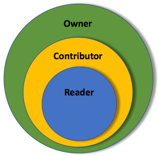
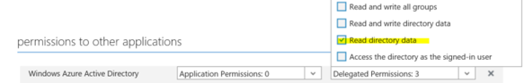

---

# required metadata
title: "Control web services permissions with roles - Machine Learning Server | Microsoft Docs"
description: "Owner, contributor, reader authentication roles with Machine Learning Server"
keywords: ""
author: "j-martens"
ms.author: "jmartens"
manager: "jhubbard"
ms.date: "9/20/2017"
ms.topic: "article"
ms.prod: "microsoft-r"

# optional metadata
#ROBOTS: ""
#audience: ""
#ms.devlang: ""
#ms.reviewer: ""
#ms.suite: ""
#ms.tgt_pltfrm: ""
ms.technology: 
  - deployr
  - r-server
#ms.custom: ""
---

# Roles to control web service permissions

**Applies to:  Machine Learning Server, Microsoft R Server 9.1**

In Machine Learning Server (and R Server), Role-Based Access Control (RBAC) enables fine-grained access management for the operationalization APIs. Using RBAC, you can grant only the amount of access that users need to perform their jobs. This article helps you get up and running with RBAC. 

By default, all authenticated users can publish/deploy, list, and get any web services as well as call all APIs. Additionally, users can also update and delete the web services they have deployed. Use the roles defined in this article to further control who can call the APIs and publish/deploy, update, and delete web services. 

How users are put assigned to roles depends on what authentication method is configured for Machine Learning Server. For more on configuring authentication, read the article, ["Authentication options."](configure-authentication.md)

>[!IMPORTANT]
>**These roles are not the same as RBAC in Azure Active Directory.** While the default roles described here-in bear the same names as the roles you can define in Azure, it is not possible to inherit the Azure roles. If you want role-based access control over web services and APIs, you must set up roles again.

## What do I need?

To assign groups of users in your Active Directory to Machine Learning Server roles, you must have:

+ An instance of Machine Learning Server that is [configured to operationalize analytics](../install/operationalize-r-server-enterprise-config.md)

+ Authentication for this instance must be via Active Directory/LDAP (AD/LADP) or Azure Active Directory (AAD) and [already configured](configure-authentication.md)

+ The names of the groups that contain the users to whom you want to give special permissions

## Groups versus roles for access

In AD/LDAP and AAD, security groups are used to collect user accounts, computer accounts, and other groups into manageable units. Working with groups instead of with individual users helps simplify network maintenance and administration. Your organization might have groups like "Admin", "Engineering", "Level3", and so on. And, users might belong to more than one group.
You can leverage the AD groups you have already defined in your organization to assign a collection of users to roles for web services. 

In Machine Learning Server, the administrator can assign one or more Active Directory groups to one or more of the following roles: "Owner", "Contributor", and "Reader". Roles give specific permissions related to deploying and interacting with web services and other APIs. When a user attempts to authenticate with Machine Learning Server, the server checks to see whether any roles were declared. If there are roles, then Machine Learning Server checks to see to which group the user belongs based on the action you are trying to perform. 

|||
|-------------|------------| 
|- Owner (highest permissions) <br>-&nbsp;Contributor&nbsp;&nbsp;&nbsp;&nbsp;&nbsp;&nbsp;&nbsp;&nbsp;&nbsp;&nbsp;&nbsp;&nbsp;&nbsp;&nbsp;<br>- Reader||


If the user belongs to one of the AD/LDAP or AAD groups declared in Machine Learning Server, then that user is authenticated and given permissions according to the role to which their group is assigned.  If the user belongs to multiple groups that are assigned to multiple roles, then that user is automatically assigned to the role with the highest permissions. 

Here is an example of different LDAP group configurations and the resulting roles assigned to the persona.

|Persona|LDAP Group Memberships|RBAC Configuration|Role Assignment|
|:-------------:|------------|------------|:------------:| 
|<br>Administrator|sysadmins<br>engineering<br>FTE-northwest|"Owner":&nbsp;[&nbsp;"sysadmins",&nbsp;"eng-mgrs"&nbsp;],<br>"Contributor": [ "datascientists" ]|Owner|
|<br>Lead data scientist|eng-mgrs<br>datascientists<br>FTE-northwest|"Owner": [ "sysadmins", "eng-mgrs" ],<br>"Contributor": [ "datascientists" ]<br>"Reader": [ "app-devs" ]|Owner|
|<br>R programmer|datascientists<br>FTE-northwest|"Owner": [ "sysadmins", "eng-mgrs" ],<br>"Contributor": [ "datascientists" ]<br>"Reader": [ "app-devs" ]|Contributor|
|<br>Application Developer|app-devs<br>FTE-northwest|"Owner": [ "sysadmins", "eng-mgrs" ],<br>"Contributor": [ "datascientists" ]<br>"Reader": [ "app-devs" ]|Reader|
|<br>Application Developer|vendor2|"Owner": [ "sysadmins", "eng-mgrs" ],<br>"Contributor": [ "datascientists" ]|Reader|


## Roles and their permissions

When roles are declared in the configuration file, the administrator has the choices of putting groups (of users) into these roles.

|Role |Description|Permitted|Prohibited|
|-------------|------------|-----------------|---------------------|
|Owner|These users can manage any service and call any API, including centralized configuration APIs.|Web service APIs:<br>&nbsp;&#x2714; Publish **any** service<br>&nbsp;&#x2714; Update **any** service <br>&nbsp;&#x2714; Delete **any** service <br>&nbsp;&#x2714; List **any** service <br>&nbsp;&#x2714; Consume **any** service<br>&nbsp;&nbsp;&nbsp;&nbsp;&nbsp;&nbsp;&nbsp;&nbsp;&nbsp;&nbsp;&nbsp;&nbsp;&nbsp;&nbsp;&nbsp;&nbsp;&nbsp;&nbsp;&nbsp;&nbsp;&nbsp;&nbsp;&nbsp;&nbsp;&nbsp;&nbsp;&nbsp;&nbsp;&nbsp;&nbsp;&nbsp;&nbsp;&nbsp;&nbsp;&nbsp;&nbsp;&nbsp;&nbsp;&nbsp;&nbsp;&nbsp;&nbsp;&nbsp;&nbsp;&nbsp;&nbsp;&nbsp;<br>Other APIs:<br>&nbsp;&#x2714; Call **any** other API|No API restrictions<br>&nbsp;&nbsp;&nbsp;&nbsp;&nbsp;&nbsp;&nbsp;&nbsp;&nbsp;&nbsp;&nbsp;&nbsp;&nbsp;&nbsp;&nbsp;&nbsp;&nbsp;&nbsp;&nbsp;&nbsp;&nbsp;&nbsp;&nbsp;&nbsp;&nbsp;&nbsp;&nbsp;&nbsp;&nbsp;&nbsp;&nbsp;&nbsp;&nbsp;&nbsp;&nbsp;&nbsp;&nbsp;<br>&nbsp;<br>&nbsp;<br>&nbsp;<br>&nbsp;<br>&nbsp;<br>&nbsp;<br>&nbsp;| 
|Contributor|These users can publish/deploy services and manage the services they publish. They can also call most other APIs. |Web service APIs:<br>&nbsp;&#x2714; Publish **any** service <br>&nbsp;&#x2714; Update their services <br>&nbsp;&#x2714; Delete their services <br>&nbsp;&#x2714; List **any** service <br>&nbsp;&#x2714; Consume **any** service<br><br>Other APIs:<br>&nbsp;&#x2714; Call almost any other API|<br>&nbsp;&#x2716; Update service published by another<br>&nbsp;&#x2716; Delete service published by another<br>&nbsp;<br>&nbsp;<br>&nbsp;&#x2716; Centralized node configuration (v9.2+)| 
|Reader|In Machine Learning Server 9.2+, these users can list and consume any service and call most other APIs.<br><br>In R Server 9.1, this catchall role is implicitly given to any authenticated user  not assigned a role. Users can list and consume services. Never explicitly declared. |Web service APIs:<br>&nbsp;&#x2714; List **any** service<br>&nbsp;&#x2714; Consume **any** service<br><br>Other APIs:<br>&nbsp;&#x2714; Call almost any other APIs|<br>&nbsp;&#x2716; Publish **any** service <br>&nbsp;&#x2716; Update **any** service <br>&nbsp;&#x2716; Delete **any** service<br>&nbsp;<br>&nbsp;&#x2716; Centralized node configuration (v9.2+)|

## Role configuration states

Keep in mind that the permissions assigned to users are influenced not only by the roles you define, but also by the roles you do not define. When one or more roles is not defined, then certain permissions are implicitly assumed. By default, no roles are declared. 

The following table explains which permissions are assigned to any authenticated user that is not explicitly assigned a role. 
<br>

|Possible configurations|Users without a role are implicitly assigned to|
|-----|:--------------------:|
|- No roles: RBAC not configured|Contributor|
|- Owner only|Contributor|
|- Contributor + Owner &nbsp;_-or-_<br>- Contributor only|Reader|
|- Reader + Contributor + Owner &nbsp;_-or-_<br>- Reader + Owner &nbsp;_-or-_<br>- Reader only|v9.2+:  all API access denied<br>v9.1: not applicable since Reader is never declared|

## Assign roles to AD/LDAP & AAD users

If you configure Machine Learning Server (or R Server) to [use Active Directory/LDAP or Azure Active Directory authentication](configure-authentication.md), then you can assign roles using Active Directory groups as follows:

#### Step 1. Define desired roles

On each web node, edit the appsettings.json configuration file in order to declare the roles and the groups that belong to them. 

1. Open the configuration file, \<web-node-install-path>/appsettings.json. (Find the [install path](../operationalize/configure-find-admin-configuration-file.md) for your version.) 

1. Search for the following section: `"Authorization": {`

1. In that section, add the roles you need. Then, map one or more security groups to each role such as:
   ```
   "Authorization": {
     "Owner": [ "Administrators" ],
     "Contributor": [ "RProgrammers", "Quality" ]
   }
   ``` 

   >[!WARNING]
   >For AD/LDAP authentications:
   >1. Be careful not to use the 'CN=' portion of the distinguished names. For example, if the distinguished name appears as 'CN=Administrators', enter only 'Administrators' here.
   
   >2. Ensure that the username returned for the value of 'UniqueUserIdentifierAttributeName' matches the username returned by 'SearchFilter'. For example, if `"SearchFilter": "cn={0}"` and `"UniqueUserIdentifierAttributeName": "userPrincipalName"`, then the values for `cn` and `userPrincipalName` must match.
   
<!--#### Step 2. Allow R Server to check groups in Azure Active Directory

R Server must be given the ability to verify the groups you declare against those in AAD or and AD/LDAP.  For AAD, you have an extra step to make that possible. For AD/LDAP, the default settings when you [set up R Server for AD/LDAP](configure-authentication.md#ldap) as sufficient.

1. Sign in to the [Azure classic portal](https://manage.windowsazure.com/) and update the configuration to allow R Server to match a user with his or her groups and authenticate with AAD as follows:

1. In the left menu, choose **Active Directory**.

1. Select the active directory you want to open.

1. After open, click the **Applications** tab at the top.

1. Open the web application you created when you [configured R Server for AAD authentication](configure-authentication.md#aad).

1. With the application open, go to the bottom of the page and click the **Manage Manifest > Download Manifest**. A popup menu appears.
   

1. Open the manifest file in a text editor and ensure that the property `"groupMembershipClaims"` looks like this:

   ```"groupMembershipClaims": "SecurityGroup"```

1. Save the manifest file.

1. Back in the portal, click the **Manage Manifest > Upload Manifest** on the toolbar at the bottom of the window. Upload the edited file back into the portal.

1. In the **Configure** tab, scroll to the **Keys** section. Take note of the key as you must add this to the `"AzureActiveDirectory"` section of the appsettings.json configuration file. This enables R Server to validate the group names at authentication time.  

1. In the same tab, scroll to the **Permissions to other applications** section and click the **Delegated Permissions** listbox. and make sure that the **Read directory data** checkbox is enabled.

    -->

#### Step 2. Validate groups against AD/LDAP or AAD

Return to [the appsetting.json file](configure-find-admin-configuration-file.md) on each web node and do the following:

+ **For Azure Active Directory:** In appsettings.json, find the "AzureActiveDirectory" section. Make sure the alphanumeric client key you created in the portal **for the web app** is used for "Key": property. This key allows Machine Learning Server to verify that the groups you've declared are valid in AAD. See following example. Learn more about [configuring Machine Learning Server to authenticate with Azure Active Directory](configure-authentication.md#aad).

  >[!IMPORTANT]
  > For more security, we recommend you [encrypt the key](configure-use-admin-utility.md#encrypt) before adding the information to appsettings.json.

  >[!NOTE]
  > If a given user belongs to more than groups that allowed in AAD (overage limit), AAD provides an overage claim in the token it returns. This claim along with the key you provide here allows Machine Learning Server to retrieve the group memberships for the user.

+ **For Active Directory/LDAP:** In appsettings.json, find the "LDAP" section.  In order for the server to verify that the groups you have declared are valid in AD/LDAP, you must provide the QueryUserDn and QueryUserPassword in the "LDAP" section. See the following example. This allows Machine Learning Server to verify that each declared group is, in fact, a valid, existing group in AD. Learn more about [configuring Machine Learning Server  to authenticate with Active Directory/LDAP](configure-authentication.md#ldap).

  With AD/LDAP, you can **further restrict which users can log in and call APIs** by declaring those groups that are allowed with the ['SearchFilter' LDAP property](configure-authentication.md#encrypt).  Then, users in other groups are not able to call any APIs. In this example, only members of the mrsreaders, mrsowners, and mrscontributors groups can call APIs after logging in.

  ```
  "SearchFilter": "(&(sAMAccountName={0})(|(memberOf=CN=mrsreaders,OU=Readers,OU=AA,DC=pseudorandom,DC=cloud)(memberOf=CN=mrsowners,OU=Owner,OU=AA,DC=pseudorandom,DC=cloud)(memberOf=CN=mrscontributors,OU=Contributor,OU=AA,DC=pseudorandom,DC=cloud)))",         
  "UniqueUserIdentifierAttributeName": "sAMAccountName",
  ```


#### Step 3. Apply the changes to Machine Learning Server / R Server

1. [Restart the web node](configure-use-admin-utility.md#startstop) for the changes to take effect. Log in  using [the local 'admin' account](configure-authentication.md#local) in the administration utility.

1. Repeat these changes in every web node you have configured.  The configuration must be the same across all web nodes.

### Example

Here is an example of roles declared for AD/LDAP in appsettings.json on the web node:

```
Authentication: {
       "AzureActiveDirectory": {
              "Enabled": false,
              "Authority": "https://login.windows.net/rserver.contoso.com",
              "Audience": "00000000-0000-0000-0000-000000000000",
              "Key": "ABCD000000000000000000000000WXYZ"  
       },
       "LDAP": {
              "Enabled": true,
              "Host": "<host_ip>",
              "UseLDAPS": "True",
              "BindFilter": "CN={0},CN=DeployR,DC=TEST,DC=COM",
              "QueryUserDn": "CN=deployradmin,CN=DeployR,DC=TEST,DC=COM",
              "QueryUserPasswordEncrypted": true,
              "QueryUserPassword":
"abcdefghijklmnopqrstuvwxyz1234567890ABCDEFGHIJKLMNOPQRSTUVWXYZabcdefghijklmnopqrstuvwxyz1234567890ABCDEFGHIJKLMNOPQRSTUVWXYZabcdefghijklmnopqrstuvwxyz1234567890ABCDEFGHIJKLMNOPQR",
              "SearchBase": "CN=DeployR,DC=TEST,DC=COM",
              "SearchFilter": "cn={0}"       
       }
}
 
"Authorization": {
   "Owner": [ "Administrators" ],
   "Contributor": [ "RProgrammers", "Quality" ]      
}
```

## Assign roles to the 'admin' account

If only the default local administrator account is defined for Machine Learning Server (or R Server), then roles are not needed. In this case, the 'admin' user is implicitly assigned to the Contributor role.

## Web service permissions after role change

A user might change roles because they no longer belong to the same security group in AD/LDAP or AAD, or perhaps that security group is no longer mapped to an Machine Learning Server (or R Server) role in the appsettings.json file anymore. 

Whenever a user's role changes, that user may not longer be able to perform the same tasks on their web services. If you publish a web service while assigned to the "Owner" role, then you can continue to update, delete and interact with that web service version as long as you are assigned this role. However, if you are reassigned to the "Contributor" role, then you still are allowed to interact with that web service version as you did before, but you cannot update or delete the services published by others. Now, if roles are defined for users, but you are no longer assigned to one of those roles, you become part of the "Reader" role implicitly and can no longer manage any services, including those that you published previously when you had another role. 

## See Also

+ [How to publish and manage web services in R](how-to-deploy-web-service-publish-manage-in-r.md)

+ [How to interact with and consume web services in R](how-to-consume-web-service-interact-in-r.md)

+ [Authentication options for Machine Learning Server when operationalizing analytics](configure-authentication.md)

+ [Blog article: Role Based Access Control With MRS 9.1.0](https://blogs.msdn.microsoft.com/rserver/2017/04/10/role-based-access-control-with-mrs-9-1-0/)
