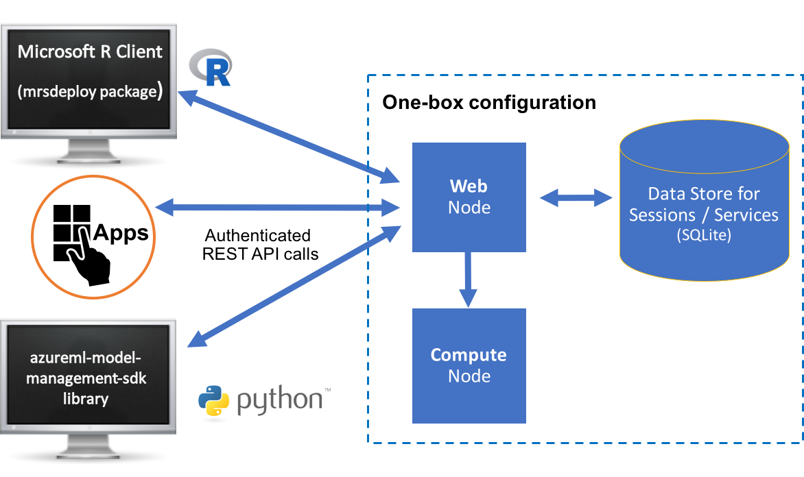
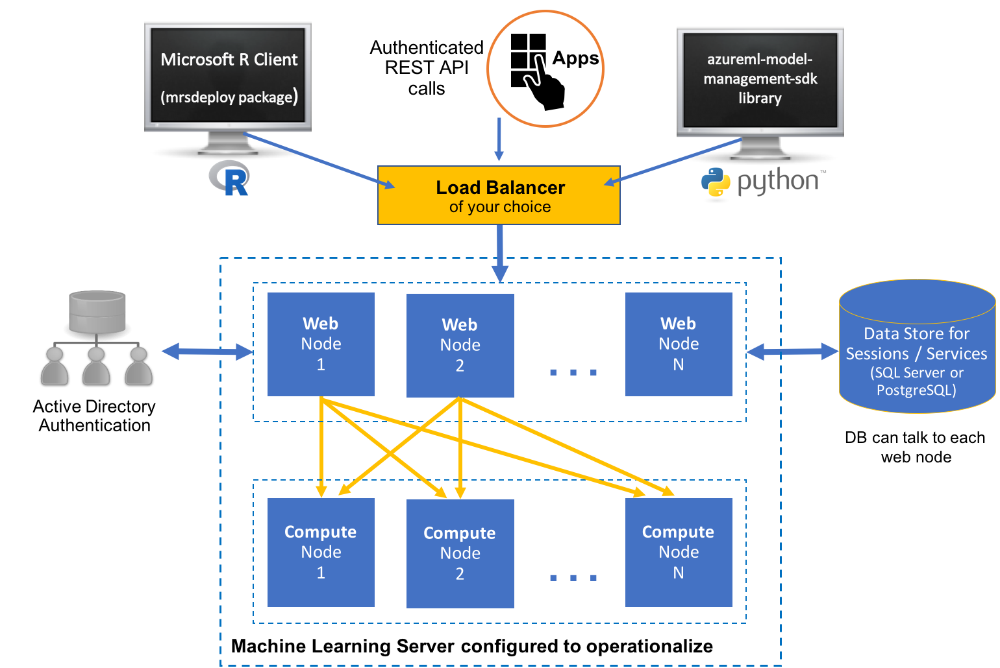

---

# required metadata
title: "Quickstart for Administrators configuring for operationalization - Machine Learning Server "
description: "Getting started for Administrators"
keywords: ""
author: "j-martens"
ms.author: "jmartens"
manager: "jhubbard"
ms.date: "9/25/2017"
ms.topic: "article"
ms.prod: "microsoft-r"

# optional metadata
#ROBOTS: ""
#audience: ""
#ms.devlang: ""
#ms.reviewer: ""
#ms.suite: ""
#ms.tgt_pltfrm: ""
ms.technology: 
  - deployr
  - r-server
#ms.custom: ""
---

# Manage and configure Machine Learning Server for operationalization

**Applies to:  Machine Learning Server, Microsoft R Server 9.x**

>You can configure Machine Learning Server after installation to act as a deployment server and host analytic web services as well as to execute code remotely. For a general introduction to  operationalization, read the [About](../what-is-operationalization.md) topic.

This guide is for system administrators. If you are responsible for configuring or maintaining Machine Learning Server, then this guide is for you.

As an administrator, your key responsibilities are to ensure Machine Learning Server is properly provisioned and configured to meet the demands of your user community. In this context, the following policies are of central importance:

-   Server [security policies](#security-policies), which include user authentication and authorization
-   Server [R package management policies](#r-package-policies)
-   Server [runtime policies](#runtime-policies), which affect availability, scalability, and throughput

Whenever your policies fail to deliver the expected runtime behavior or performance, you need to troubleshoot your deployment. For that we provide [diagnostic tools](configure-run-diagnostics.md) and numerous recommendations.

## Configure web & compute nodes for analytic deployment and remote execution

To benefit from Machine Learning Server’s web service deployment and remote execution features, you must first configure the server after installation to act as a deployment server and host analytic web services. 

### Configuration components

All configurations have at least a single web node, single compute node, and a database.

+ **Web nodes** act as HTTP REST endpoints with which users can interact directly to make API calls. These nodes also access the data in the database and send requests to the compute node for processing. Web nodes are stateless, and therefore, session persistence ("stickiness") is not required. A single web node can route multiple requests simultaneously. However, you must have more than one web node to ensure high availability and avoid a single point of failure. 

+ **Compute nodes** are used to execute R and Python code as a session or service. Each compute node has its own [pool of R and python shells](../operationalize/configure-evaluate-capacity.md#pool) and can therefore execute multiple requests at the same time. Scaling out compute nodes enables you to have more R and Python execution shells and benefit from load balancing across these compute nodes. 

+ The **database**. An SQLite 3.7+ database is installed by default, but you can, and in some cases must, [use a SQL Server (Windows) or PostgreSQL (Linux)](../operationalize/configure-remote-database-to-operationalize.md) database instead.

### One-box vs. Enterprise configurations

These nodes can be installed in one of two configurations:

#### One-box

As the name suggests, a [one-box configuration](../operationalize/configure-machine-learning-server-one-box.md) involves one web node and one compute node run on a single machine. Set-up is a breeze. This configuration is useful when you want to explore what it is to operationalize R and Python analytics using Machine Learning Server. It is perfect for testing, proof-of-concepts, and small-scale prototyping, but might not be appropriate for production usage. This configuration is covered in this article. Learn more in this [One-box configuration](../operationalize/configure-machine-learning-server-one-box.md) article.

#### Enterprise

A [enterprise configuration](../operationalize/configure-machine-learning-server-enterprise.md) where multiple nodes are configured on multiple machines along with other enterprise features. This configuration can be scaled out or in by adding or removing nodes. Learn more about this setup in the [enterprise configuration](../operationalize/configure-machine-learning-server-enterprise.md) article. For added security, you can [configure SSL](../operationalize/configure-https.md) and authenticate against [Active Directory (LDAP) or Azure Active Directory](../operationalize/configure-authentication.md) in this configuration.

### Supported platforms

The web nodes and compute nodes are supported on these operating systems

|Windows|Linux|
|----|----|
|Windows&nbsp;Server&nbsp;2012&nbsp;R2&nbsp;&nbsp;&nbsp;&nbsp;&nbsp;&nbsp;&nbsp;|Ubuntu 14.04, Ubuntu 16.04|
|Windows Server 2016|CentOS/RHEL 7.x|

## Security policies

Machine Learning Server has many features that support the creation of secure applications. Common security considerations, such as data theft or vandalism, apply regardless of the version of Machine Learning Server you are using. Data integrity should also be considered as a security issue. If data is not protected, it is possible that it could become worthless if improvised data manipulation is permitted and the data is inadvertently or maliciously modified. In addition, there are often legal requirements that must be adhered to, such as the correct storage of confidential information. 

User access to the Machine Learning Server and the operationalization services offered on its [API](concept-api.md) are entirely under your control as the server administrator. Machine Learning Server offers seamless integration with popular enterprise security solutions like Active Directory LDAP or Azure Active Directory. You can configure Machine Learning Server to [authenticate](configure-authentication.md) using these methods to establish a trust relationship between your user community and the operationalization engine for Machine Learning Server. Your users can then supply simple `username` and `password` credentials in order to verify their identity. [A token is issued to an authenticated user.](how-to-manage-access-tokens.md)

In addition to authentication, you can add other enterprise security around Machine Learning Server such as:

+ Secured connections using [SSL/TLS 1.2](configure-https.md). For security reasons, we strongly recommend that you enable SSL/TLS 1.2 in **all production environments.** 

+ [Cross-Origin Resource Sharing](configure-cors.md) to allow restricted resources on a web page to be requested from another domain outside the originating domain.

+ [Role-based access control](configure-roles.md) over web services in Machine Learning Server.

Additionally, we recommend that you review the following Security Considerations:

## R package policies

The primary function of the operationalization feature is to support the execution of R code on behalf of client applications. One of your key objectives as an administrator is to ensure a reliable, consistent execution environment for that code.

The R code developed and deployed by data scientists within your community  frequently depends on one or more R packages. Those R packages may be hosted on [CRAN](http://cran.r-project.org/), [MRAN](http://mran.microsoft.com), [github](https://github.com/), in your own local CRAN repository or elsewhere.

Making sure that these R package dependencies are available to the code executing on Machine Learning Server's operationalization feature requires active participation from you, the administrator. There are several R package management policies you can adopt for your deployment, which are detailed in this [R Package Management guide](configure-manage-r-packages.md).

## Runtime policies

The operationalization feature supports a wide range of runtime policies that affect many aspects of the server runtime environment. As an administrator, you can select the preferred policies that best reflect the needs of your user community.

### General

The external configuration file, \<node-install-path>\appsettings.json defines a number of policies used when deploying and operationalizing web services with Machine Learning Server. There is one appsettings.json file on each web node and on each compute node. This file contains a wide range of policy configuration options for each node. 

The location of this file depends on the server version, operating system, and the node. Learn more in this article: ["Default installation paths for compute and web nodes"](configure-find-admin-configuration-file.md).

+ On the web node, this configuration file governs authentication, SSL, CORS support, service logging, database connections, token signing, and more.

+ On the compute node, this configuration file governs SSL, logging, [shell pool size](configure-evaluate-capacity.md#pool), execution ports, and more.

### Asynchronous batch sizes

Your users can perform speedy realtime and batch scoring. To reduce the risk of resource exhaustion by a single user, you can set the maximum number of operations that a single caller can execute in parallel during a specific asynchronous batch job. 

This value is defined in `"MaxNumberOfThreadsPerBatchExecution"`  property in the appsettings.json on the web node. If you have multiple web nodes, we recommend you set the same values on every machine. 

### Availability

Machine Learning Server consists of web and compute nodes that combine to deliver the full capabilities of this R and Python operationalization server. Each component can be configured for Active-Active High Availability to deliver a robust, reliable runtime environment.

You can configure Machine Learning Server to use multiple Web Nodes for Active-Active backup / recovery using a load balancer.

For data storage high availability, you can leverage the high availability capabilities found in enterprise grade databases (SQL Server or PostgreSQL). Learn how to use one of those databases, [here](configure-remote-database-to-operationalize.md).

<!--For a discussion of the available server, grid, and database HA policy options, see the [DeployR High Availability Guide](../deployr/deployr-admin-configure-high-availability.md).-->

### Scalability & throughput

In the context of a discussion on runtime policies, the topics of scalability and throughput are closely related. Some of the most common questions that arise when planning the configuration and provisioning of Machine Learning Server for operationalization are:

-   How many users can I support?
-   How web nodes and compute nodes do I need?
-   What throughput can I expect?

The answer to these questions ultimately depends on the configuration and node resources allocated to your deployment.

To evaluate and simulate the capacity of a configuration, use the [Evaluate Capacity tool](configure-evaluate-capacity.md). You can also [adjust the pool size](configure-evaluate-capacity.md#pool) of available R shells for concurrent operations.

## Troubleshooting

There is no doubt that, as an administrator, you have experienced failures with servers, networks, and systems. Likewise, your chosen runtime policies may sometime fail to deliver the runtime behavior or performance needed by your community of users.

When those failures occur in the operationalization environment, we recommend you first turn to the [diagnostic testing tool](configure-run-diagnostics.md) to attempt to identify the underlying cause of the problem.

Beyond the diagnostics tool, the [Troubleshooting](configure-run-diagnostics.md#troubleshooting) documentation offers suggestions and recommendations for common problems with known solutions.

## More resources

This section provides a quick summary of useful links for administrators working with Machine Learning Server's operationalization feature.

>Use the table of contents to find all of the guides and documentation needed by the administrator.

**Key Documents**
-   [About Operationalization](../what-is-operationalization.md)
-   [Configuration](configure-start-for-administrators.md#configure-server-for-operationalization)
-   [R Package Management](configure-manage-r-packages.md)
-   [What are web services?](concept-what-are-web-services.md)
-   [Diagnostic Testing & Troubleshooting](configure-run-diagnostics.md)
-   [Capacity Evaluation](configure-evaluate-capacity.md)
-   [Comparison between 8.x and 9.x](../whats-new-in-r-server.md)

**Other Getting Started Guides**
-   [How to integrate web services and authentication into your application](how-to-build-api-clients-from-swagger-for-app-integration.md)

**Support Channel**
-   [Forum](https://social.msdn.microsoft.com/Forums/en-US/home?forum=microsoftr)
