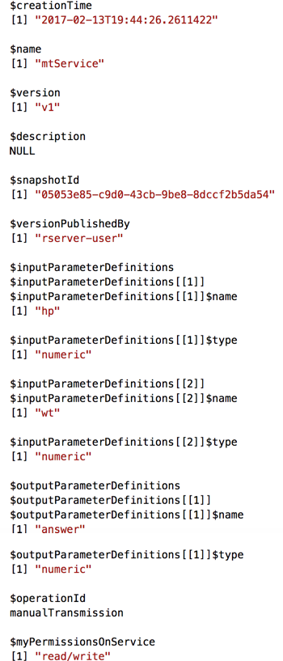
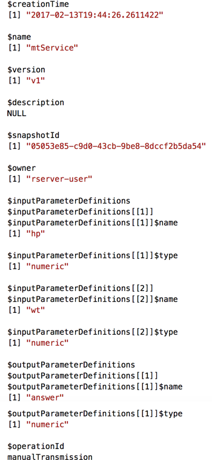

---

# required metadata
title: "Working with web services in R"
description: "Web service deployment functions in the mrsdeploy package in Microsoft R can be used for any arbitrary R code block. A web service runs on R Server 9.0 instances."
keywords: "mrsdeploy package"
author: "j-martens"
manager: "jhubbard"
ms.date: "4/19/2017"
ms.topic: "article"
ms.prod: "microsoft-r"
ms.service: ""
ms.assetid: ""

# optional metadata
ROBOTS: ""
audience: ""
ms.devlang: ""
ms.reviewer: ""
ms.suite: ""
ms.tgt_pltfrm: ""
ms.technology: "r-server"
ms.custom: ""

---

# How to publish, manage, and consume web services in R

**Applies to:  Microsoft R Server 9.x**

Learn how to interact with and manage your analytic web services in R using the functions in the [mrsdeploy R package](../mrsdeploy/mrsdeploy.md) installed with both Microsoft R Server and Microsoft R Client. 

To use the `mrsdeploy` R package, R Server must be [properly configured](../mrsdeploy/mrsdeploy.md#configure) to host web services. Then, you can use the `mrsdeploy` functions to publish R models, scripts, arbitrary code exposed as **analytic web services**. These web services are discoverable by other authenticated users who can then [consume them in R](data-scientist-get-started.md) or in the [language of their choice via Swagger](app-developer-get-started.md).

Tasks you can perform with web services in R include:
+ [Log into R Server](#auth) as an authenticated user so you can publish or access web services
+ [Publish](#publishService) an R script, model, or arbitrary R code as a web service on R Server
+ [Update](#updateService) an existing web service
+ [Delete](#deleteService) an existing web service
+ [Get a list](#listServices) of all web services
+ [Get the web service object](#getService) for consumption
+ [Share](#consume-service) the service with others

Note that a set of [RESTful APIs](api.md) are also available to provide direct programmatic access to a service's lifecycle directly.

## Permissions for managing web services

By default, any authenticated user can publish a web service, retrieve a list of the available web services, and retrieve any web service object for consumption regardless of whether he or she published that service.  Additionally, users can update and delete the web services they've published.
 
Beginning in version 9.1, your administrator can also **[assign role-based authorization](security-roles.md)** to further restrict the permissions around web services to give some users more control over web services than others. Ask your administrator for details on your role.

<a name="auth"></a>

## Authenticate

Before you can use the web service management functions in the `mrsdeploy` R package, you must log into R Server using the `remoteLogin` or `remoteLoginAAD`. After authentication, you can use the other functions in the package. 

Learn about the login and logout functions available with the `mrsdeploy` package and their arguments in the article "[Connecting to R Server to use mrsdeploy](../operationalize/mrsdeploy-connection.md)".

<a name="publishService"></a>

## Publish standard and realtime web services

To deploy your analytics, you must publish them as web services in R Server. Once hosted on R Server, they can be consumed by other users. There are several types of web services described in this section, including standard R web services and  [realtime web services](#realtime).

After you've authenticated, use the `publishService` function in the `mrsdeploy` package to publish a web service.

Each web service is uniquely defined by a `name` and `version` and several other arguments. See the [package reference help page for publishService()](../mrsdeploy/packagehelp/publishService.md) for the full description of all arguments.  

|Function|Response|R Help|
|----|----|:----:|
|`publishService(...)`|Returns an [API instance](#api-client) (`client stub` for consuming that service and viewing its service holdings) as an [R6](https://cran.r-project.org/web/packages/R6/index.html) class.|[View](../mrsdeploy/packagehelp/publishService.md)

You can publish web services to a local R Server from your commandline. You can also publish a web service to a remote R Server from your local commandline if you [create a remote session](../operationalize/remote-execution.md#publish-remote-session).  


**Standard web services**

A standard web service offers fast execution and scoring of arbitrary R code and R models. 

In addition to a name and version, a standard web service is also defined by the R code and any necessary model assets. When publishing a standard web service, you must also define the inputs required by the service as well as the output that application developers will use to integrate the service in their applications.

The R code in a standard web service can come from: 
  + A filepath to a local R script, such as:<br>
    &nbsp;&nbsp;  `code = "/path/to/R/script.R"`
  + A block of R code as a character string, such as:<br>
    &nbsp;&nbsp;  `code = "result <- x + y"`
  + A function handle, such as:<br> 
    &nbsp;&nbsp;  `code = function(hp, wt) {`<br> 
    &nbsp;&nbsp;  &nbsp;&nbsp;  &nbsp;&nbsp;  &nbsp;&nbsp; `newdata <- data.frame(hp = hp, wt = wt)`<br> 
    &nbsp;&nbsp;  &nbsp;&nbsp;  &nbsp;&nbsp;  &nbsp;&nbsp; `predict(model, newdata, type = "response")`<br>
    &nbsp;&nbsp;  `}`

The R model in a standard web service can come from an `object` or a file-path to an external representation of R objects to be loaded and used with `code`, including: 
  + A filepath to an `.RData` file holding the external R objects to be loaded and used with the code, such as:<br>
    &nbsp;&nbsp;  `model = "/path/to/glm-model.RData"`
  + A filepath to an `.R` file that is evaluated into an environment and loaded, such as:<br>
    &nbsp;&nbsp;  `model = "/path/to/glm-model.R"`
  + A model object, such as:<br>
    &nbsp;&nbsp;  `model = am.glm`

Example: 
```R
# Publish a standard service 'mtService' version 'v1.0.0'
# Assign service to 'api' variable
api <- publishService(
     "mtService",
     code = manualTransmission,
     model = carsModel,
     inputs = list(hp = "numeric", wt = "numeric"),
     outputs = list(answer = "numeric"),
     v = "v1.0.0"
)
```

For a more detailed example, see the ["Workflow" examples](#workflow) at the end of this article.

You can also follow this quickstart article, [Deploying an R model as a web service](../operationalize/quickstart-publish-web-service.md).

<a name="realtime"></a>

**Realtime web services**

Starting in R Server 9.1 another web service type was added called `Realtime`.  `Realtime` web services offer lower latency and better load so you can get results faster and score more models in parallel. The improved performance boost upon consumption is due to the fact that there is no need to create an R session when consuming these supported model types. Therefore, no additional resources or time is spent spinning up an R session for each call. Additionally, since the model is cached in memory, it is only loaded once.

To publish a `Realtime` R web service, specify the [argument `serviceType = Realtime`](../mrsdeploy/packagehelp/publishService.md) and use a model object  created with a supported functions, such as:
+ These [`RevoScaleR` package](../scaler/scaler.md) functions: `rxLogit`, `rxLinMod`, `rxBTrees`, `rxDTree`, and `rxDForest`.
    
+ These machine learning and transform task functions from the [`MicrosoftML` package](../microsoftml/microsoftml.md): `rxFastTrees`, `rxFastForest`, `rxLogisticRegression`, `rxOneClassSvm`, `rxNeuralNet`, `rxFastLinear`, `featurizeText`, `concat`, `categorical`, `categoricalHash`, `selectFeatures`, `featurizeImage`, `getSentiment`, `loadimage`, `resizeImage`, `extractPixels`, `selectColumns`, and `dropColumns`.

Only a model is accepted, and no other R code is supported with `Realtime` web services.

`Realtime` web services are supported only on Windows platforms only for R Server 9.1. However, the resulting web service can be consumed on any platform.

Example: 

```R
# Publish a realtime service 'kyphosisService' version 'v1.0'
# Assign service to 'realtimeApi' variable
realtimeApi <- publishService(
     serviceType = "Realtime",
     name = "kyphosisService",
     code = NULL,
     model = kyphosisModel,
     v = "v1.0",
    alias = "kyphosisService"
)
```

See an [end-to-end realtime example](#realtime-example) and learn how to use `publishService` to create Realtime and standard script web services in the next section.


<a name="updateService"></a>

## Update web services

To change a web service after you've published it, while retaining the same name and version, use the `updateService` function. For arguments, specify what needs to change, such as the R code, model, inputs, and so on. When you update a service, it overwrites that named version.

After you've authenticated, use the `updateService` function in the `mrsdeploy` package to update a web service.

See the [package reference help page for updateService()](../mrsdeploy/packagehelp/updateService.md) for the full description of all arguments. 

|Function|Response|R Help|
|----|----|:----:|
|`updateService(...)`|Returns an [API instance](#api-client) (`client stub` for consuming that service and viewing its service holdings) as an [R6](https://cran.r-project.org/web/packages/R6/index.html) class.|[View](../mrsdeploy/packagehelp/updateService.md)


>[!NOTE]
>If you want to change the name or version number, use the `publishService` function instead and specify the new name or version number. 


Example: 

```R
# For web service called mtService with version number v1.0.0,
# update the model carsModel, code, inputs, and description. 
# Assign it to a variable called api.
api <- updateService(
     "mtService",
     "v1.0.0",
     code = manualTransmission,
     mode = carsModel,
     inputs = list(wt = "numeric", dist = "numeric")
     descr = "Updated after March data refresh."
)
```


<a name="data-types"></a>

## Supported I/O data types

The following table lists the supported data types for the [publishService](#publishservice) and [updateService](#updateService) function input and output schemas.

|I/O data types|Full support?|
|--------|:----------:|
|`numeric`|Yes| 
|`integer`|Yes|
|`logical`|Yes|
|`character`|Yes|
|`vector`|Yes|
|`matrix`|Partial<br>(Not for logical & character matrices)|
|`data.frame`|Yes<br>Note: Coercing an object during <br>I/O is a user-defined task|

<a name="versioning"></a>

## Versioning for web services

Every time a web service is published, a version is assigned to the web service. Versioning enables users to better manage the release of their web services. It also helps those consuming a given service to  easily identify the service. 

When specifying a version at publish time, use any alphanumeric string that is meaningful to those who will consume the service in your organization. For example, you could use `2.0`, `v1.0.0`, `v1.0.0-alpha`, or `test-1`. 

Meaningful versions are very helpful when you are ready to share your services with others. We highly recommend that everyone in your organization use a **consistent and meaningful versioning convention** such as [semantic versioning](http://semver.org/) when publishing services. 

If you do not specify a version when you publish, a globally unique identifier (GUID) is automatically assigned by R Server as a unique reference number for that  service. These GUID version numbers are harder to remember for those consuming your services and are therefore less desirable. 

<a name="deleteService"></a>

## Delete web services

When you no longer want to keep a web service, you can delete it. Only the user who initially created the web service can use this function.

After you've authenticated, use the `deleteService` function in the `mrsdeploy` package to delete a web service.

Each web service is uniquely defined by a `name` and `version`. See the [package reference help page for deleteService()](../mrsdeploy/packagehelp/deleteService.md) for the full description of all arguments. 

|Function|Response|R Help|
|----|----|:----:|
|`deleteService(...)`|If it is successful, it returns a success status and message such as `"Service mtService version v1.0.0 deleted."`. If it fails for any reason, then it stops execution with error message.|[View](../mrsdeploy/packagehelp/deleteService.md)

Example: 

```R
result <- deleteService("mtService", "v1.0.0")
print(result)
```

## Interact with services in R

<a name="listServices"></a>

### List web services

Any authenticated user can retrieve a list of web services using the `listServices` function in the `mrsdeploy` package.  

You can use function arguments to filter the list to return a specific web service or all labeled versions of a given web service. See the [package reference help page for listServices()](../mrsdeploy/packagehelp/listServices.md) for the full description of all arguments.

If you published the web service or have the "Owner" role, you will also be able to see the R code inside that web service. If you are not the user who published the service or you are not assigned to the "Owner" role, then you will not be able see the actual R code used to create the web service. Ask your administrator about roles.

|Function|Response|R Help|
|----|----|:----:|
|`listServices(...)`| R `list` containing service metadata.|[View](../mrsdeploy/packagehelp/listServices.md)|


Example code:

```R
# Return metadata for all services hosted on this R Server
allServices <- listServices()

# Return metadata for every version of the 
# service "mtService" hosted on this R Server
mtServiceAll <- listServices("mtService")

# Return metadata for version v1.0.0 of the 
# service "mtService" hosted on this R Server
mtServiceV1 <- listServices("mtService", "v1")

# View service capabilities/schema. 
# For example, the input schema:
#   list(name = "wt", type = "numeric")
#   list(name = "dist", type = "numeric")
print(mtService)
```

Example output:

|R Server 9.1+|R Server 9.0|
|--------|--------|
|||

<a name="getService"></a>

### Retrieve and examine service objects

Any authenticated user can retrieve a web service object for consumption. After the object is returned, you can look at its capabilities to see what the service can do and how it should be consumed.

After you've authenticated, use the `getService` function in the `mrsdeploy` package to retrieve a service object. See the [package reference help page for getService()](../mrsdeploy/packagehelp/getService.md) for the full description of all arguments. 


|Function|Response|R Help|
|----|----|:----:|
|`getService(...)`|Returns an [API instance](#api-client) (`client stub` for consuming that service and viewing its service holdings) as an [R6](https://cran.r-project.org/web/packages/R6/index.html) class.|[View](../mrsdeploy/packagehelp/getService.md)|


Example:

```R
# Get service using `getService()` function from `mrsdeploy` package.
# Assign service to the variable `api`.
api <- getService("mtService", "v1.0.0")

# Print capabilities to see what service can do.
print(api$capabilities())
     
# Start interacting with the service, for example:
# Calling the function, `manualTransmission`
# contained in this service.
result <- api$manualTransmission(120, 2.8)
```

<a name="api-client"></a>

### Interact with API clients

When you publish, update, or get a web service, an API instance is returned as an [R6](https://cran.r-project.org/web/packages/R6/index.html) class. This instance is a `client stub` you can use to consumethat service and view its service holdings. 

You can use the following supported public functions to interact with the API client instance.

| Function      | Description                                            |
| ------------- |--------------------------------------------------------|
| `print`       |	Print method that lists all members of the object      |
| `capabilities` | Report on the service features such as I/O schema, `name`, `version`	   |
| `consume`     |	Consume the service based on I/O schema                |
| consume _alias_ | Alias to the `consume` function for convenience (see `alias` argument for the [`publishService` function](../mrsdeploy/packagehelp/publishService.md)). |
| `swagger`     |	Displays the service's `swagger` specification         |
| `batch` |Define the data records to be batched. There are additional publish functions used to [consume a service asynchronously via batch execution](data-scientist-batch-mode.md#public-fx-batch).|


Example:

```R
# Get service using `getService()` function from `mrsdeploy`.
# Assign service to the variable `api`
api <- getService("mtService", "v1.0.0")

# Print capabilities to see what service can do.
print(api)

# Print the service name, version, inputs, outputs, and the
# Swagger-based JSON file used to consume the service 
cap <- api$capabilities()
print(cap$name)
print(cap$version)
print(cap$inputs)
print(cap$outputs)
print(cap$swagger)

# Start interacting with the service by calling it with the
# generic name `consume` based on I/O schema
result <- api$consume(120, 2.8)

# Or, start interacting with the service using the alias argument
# that was defined at publication time.
result <- api$manualTransmission(120, 2.8)

# Since you're authenticated, get this service's `swagger.json`.
swagger <- api$swagger(json = FALSE)
cat(swagger)
```

<a name="consume-service"></a>

### Consume web services 

After a web service has been published, it can be consumed. Whenever the web service is published or updated, a Swagger-based JSON file is generated automatically to define the service to facilitate consumption and integration.

When you publish a service, you should let people know that is ready for them to try out. Users can get the Swagger file they need to consume the service directly in R or via the API.  If you do not provide them with a service name or version, they can discover the service on their own using the `listServices` function described earlier in this article.

Users can consume the service directly using a single consumption call. This approach is referred to as a "Request Response" approach and is described below. Another approach is the [asynchronous "Batch" consumption approach](data-scientist-batch-mode.md), where users send as a single request to R Server, which then makes multiple asynchronous API calls on your behalf.
  
<a name="data-scientists-share"></a>

#### Collaborate with data scientists

Other data scientist may want to explore, test, and consume Web services directly in R using the functions in the `mrsdeploy` package installed with Microsoft R Server and R Client. Quality engineers might want to bring the models in these web services into validation and monitoring cycles.

As the owner of the service, you can share the name and version number for the service with fellow data scientists so they can call the service in R using the functions in the `mrsdeploy` package.  After authenticating, data scientists can use the `getService` function in R to call the service. Then, they can get details about the service and start consuming it.

>[!NOTE]
> It is also possible to perform batch consumption as [described here](data-scientist-batch-mode.md).


In this example, replace the `remoteLogin()` function below with the correct login details for your configuration. Connecting to R Server using the `mrsdeploy` package is covered [in this article](mrsdeploy-connection.md).

```R
##########################################################################
#      Perform Request-Response Consumption & Get Swagger Back in R      #
##########################################################################

# Use `remoteLogin` to authenticate with R Server using the local admin 
# account. Use session = false so no remote R session started
remoteLogin("http://localhost:12800", 
            username = “admin”, 
            password = “{{YOUR_PASSWORD}}”,
            session = FALSE)
   
# Get service using `getService()` function from `mrsdeploy`
# Assign service to the variable `api`.
api <- getService("mtService", "v1.0.0")

# Print capabilities to see what service can do.
print(api$capabilities())

# Start interacting with the service, for example:
# Calling the function, `manualTransmission` contained in this service.
result <- api$manualTransmission(120, 2.8)

# Print response output named `answer`
print(result$output("answer")) # 0.6418125  

# Since you're authenticated now, get `swagger.json`.
swagger <- api$swagger()
cat(swagger, file = "swagger.json", append = FALSE)
```

<a name="swagger-app-dev"></a>

#### Collaborate with application developers

Application developers can call and integrate a web service into their applications using the service-specific Swagger-based JSON file and by providing any required inputs to that service. 

Using the Swagger-based JSON file, application developers can generate client libraries for integration. Read "[Application Developer Get Started Guide](app-developer-get-started.md)" for more details.  
   
Application developers can get the Swagger-based JSON file in one of these ways:

+ A data scientist, probably the one who published the service, can send you the Swagger-based JSON file. This is often the faster approach. They can get the file in R with the following code and send it to the application developer:
   ```R
   api <- getService("<name>", "<version>")
   swagger <- api$swagger()
   cat(swagger, file = "swagger.json", append = FALSE) 
   ```

+ Or, the application developer can request the file  **as an authenticated user with an [active bearer token](app-developer-get-started.md#authentication) in the request header** (since all API calls must be authenticated). The URL is formed as follows:
  ```
  GET /api/<service-name>/<service-version>/swagger.json
  ```

<a name="workflow"></a>

## Workflow examples 

The following workflow examples demonstrate how to publish a web service, interact with it, and then consume it. 

### Before you begin

>[!IMPORTANT]
>Be sure to replace the `remoteLogin()` function in each of the examples below with the correct login details for your configuration. Connecting to R Server using the `mrsdeploy` package is covered [in this article](mrsdeploy-connection.md).

The base path for files is set to your working directory, but you can change that as follows:

+ To specify a different base path for `code` and `model` arguments, use:  
  ```R
  opts <- serviceOption()
  opts$set("data-dir", "/base/path/to/some-other/location"))
  ```

+ To clear the path and specify full paths, use:
  ```R
  opts <- serviceOption() s
  opts$set("data-dir", NULL))
  ```

### Standard web service examples

Each standard web service example uses the same code and models and returns the same results. However, in each example, that code and model are represented in different ways such as R scripts, objects, files, and so on.  

For standard web services, keep in mind that:
+ R code can come from: 
  + A filepath to a local R script
  + A block of R code as a character string
  + A function handle

+ R models can come:
  + A filepath to an `.RData` file holding the external R objects to be loaded and used with the code
  + A filepath to an `.R` file that is evaluated into an environment and loaded
  + A model object

#### 1. R code and model are objects

In this example, the code comes from an object (`code = manualTransmission`) and the model comes from a model object (`model = carsModel`).


```R
##########################################################
#       Create & Test a Logistic Regression Model        #
##########################################################

# For R Server 9.0, load mrsdeploy package on R Server     
library(mrsdeploy)

# Use logistic regression equation of vehicle transmission 
# in the data set mtcars to estimate the probability of 
# a vehicle being fitted with a manual transmission 
# based on horsepower (hp) and weight (wt)


# Create glm model with `mtcars` dataset
carsModel <- glm(formula = am ~ hp + wt, data = mtcars, family = binomial)

# Produce a prediction function that can use the model
manualTransmission <- function(hp, wt) {
     newdata <- data.frame(hp = hp, wt = wt)
     predict(carsModel, newdata, type = "response")
}
   
# test function locally by printing results
print(manualTransmission(120, 2.8)) # 0.6418125

##########################################################
#            Log into Microsoft R Server                 #
##########################################################
   
# Use `remoteLogin` to authenticate with R Server using 
# the local admin account. Use session = false so no 
# remote R session started
# REMEMBER: Replace with your login details
remoteLogin("http://localhost:12800", 
            username = “admin”, 
            password = “{{YOUR_PASSWORD}}”,
            session = FALSE)

##########################################################
#             Publish Model as a Service                 #
##########################################################

# Generate a unique serviceName for demos 
# and assign to variable serviceName
serviceName <- paste0("mtService", round(as.numeric(Sys.time()), 0))

# Publish as service using `publishService()` function from 
# `mrsdeploy` package. Use the service name variable and provide
# unique version number. Assign service to the variable `api`
api <- publishService(
     serviceName,
     code = manualTransmission,
     model = carsModel,
     inputs = list(hp = "numeric", wt = "numeric"),
     outputs = list(answer = "numeric"),
     v = "v1.0.0"
)

##########################################################
#                 Consume Service in R                   #
##########################################################
   
# Print capabilities that define the service holdings: service 
# name, version, descriptions, inputs, outputs, and the 
# name of the function to be consumed
print(api$capabilities())
   
# Consume service by calling function, `manualTransmission`
# contained in this service
result <- api$manualTransmission(120, 2.8)

# Print response output named `answer`
print(result$output("answer")) # 0.6418125   

##########################################################
#       Get Swagger File for this Service in R Now       #
##########################################################
   
# During this authenticated session, download the  
# Swagger-based JSON file that defines this service
swagger <- api$swagger()
cat(swagger, file = "swagger.json", append = FALSE)

# Now you can share Swagger-based JSON so others can consume it

##########################################################
#          Delete service version when finished          #
##########################################################

# User who published service or user with owner role can
# remove the service when it is no longer needed
status <- deleteService(serviceName, "v1.0.0")
status

##########################################################
#                   Log off of R Server                  #
##########################################################

# Log off of R Server
remoteLogout()
```


#### 2. R code as object and `.RData` as file 

In this example, the code is still an object (`code = manualTransmission`), but the model now comes from an .Rdata file (`model = "transmission.RData"`). The result is still the same as in the first example.

```R
# For R Server 9.0, load mrsdeploy package on R Server     
library(mrsdeploy)

# --- AAD login ----------------------------------------------------------------

# Use `remoteLogin` to authenticate with R Server using 
# the local admin account. Use session = false so no 
# remote R session started
# REMEMBER: Replace with your login details
remoteLogin("http://localhost:12800", 
            username = “admin”, 
            password = “{{YOUR_PASSWORD}}”,
            session = FALSE)

model <- glm(formula = am ~ hp + wt, data = mtcars, family = binomial)
save(model, file = "transmission.RData")

manualTransmission <- function(hp, wt) {
  newdata <- data.frame(hp = hp, wt = wt)
  predict(model, newdata, type = "response")
}

# test locally: 0.6418125
print(manualTransmission(120, 2.8))

# Generate a unique serviceName for demos 
# and assign to variable serviceName
serviceName <- paste0("mtService", round(as.numeric(Sys.time()), 0))

api <- publishService(
   serviceName,
   code = manualTransmission,
   model = "transmission.RData",
   inputs = list(hp = "numeric", wt = "numeric"),
   outputs = list(answer = "numeric"),
   v = "v1.0.2"
)

api

result <- api$manualTransmission(120, 2.8)
print(result$output("answer")) # 0.6418125

swagger <- api$swagger()
cat(swagger)

swagger <- api$swagger(json = FALSE)
swagger

services <- listServices(serviceName)
services

serviceName <- services[[1]]
serviceName

api <- getService(serviceName$name, serviceName$version)
api
result <- api$manualTransmission(120, 2.8)
print(result$output("answer")) # 0.6418125

cap <- api$capabilities()
cap
cap$swagger

status <- deleteService(cap$name, cap$version)
status

remoteLogout()
```


#### 3. Code and model as .R scripts 

In this example, the code (`code = transmission-code.R,`) and the model comes from R scripts (`model = "transmission.R"`). The result is still the same as in the first example.


```R
# For R Server 9.0, load mrsdeploy package on R Server     
library(mrsdeploy)

# --- AAD login ----------------------------------------------------------------

# Use `remoteLogin` to authenticate with R Server using 
# the local admin account. Use session = false so no 
# remote R session started
# REMEMBER: Replace with your login details
remoteLogin("http://localhost:12800", 
            username = “admin”, 
            password = “{{YOUR_PASSWORD}}”,
            session = FALSE)

# Information can come from a file
model <- "model <- glm(formula = am ~ hp + wt, data = mtcars, family = binomial)"
code <- "newdata <- data.frame(hp = hp, wt = wt)\n
         answer <- predict(model, newdata, type = "response")"

cat(model, file = "transmission.R", append = FALSE)
cat(code, file = "transmission-code.R", append = FALSE)

# Generate a unique serviceName for demos 
# and assign to variable serviceName
serviceName <- paste0("mtService", round(as.numeric(Sys.time()), 0))

api <- publishService(
   serviceName,
   code = "transmission-code.R",
   model = "transmission.R",
   inputs = list(hp = "numeric", wt = "numeric"),
   outputs = list(answer = "numeric"),
   v = "v1.0.3",
   alias = "manualTransmission"
)

api

result <- api$manualTransmission(120, 2.8)
result
print(result$output("answer")) # 0.6418125

swagger <- api$swagger()
cat(swagger)

swagger <- api$swagger(json = FALSE)
swagger

services <- listServices(serviceName)
services

serviceName <- services[[1]]
serviceName

api <- getService(serviceName$name, serviceName$version)
api
result <- api$manualTransmission(120, 2.8)
print(result$output("answer")) # 0.6418125

cap <- api$capabilities()
cap
cap$swagger

status <- deleteService(cap$name, cap$version)
status

remoteLogout()
```

#### 4. Code as script and model as .RData file

In this example, the code (`code = transmission-code.R,`) comes from an R script, and the model from an .RData file (`model = "transmission.RData"`). The result is still the same as in the first example.

```R
# For R Server 9.0, load mrsdeploy package on R Server     
library(mrsdeploy)

# --- AAD login ----------------------------------------------------------------

# Use `remoteLogin` to authenticate with R Server using 
# the local admin account. Use session = false so no 
# remote R session started
# REMEMBER: Replace with your login details
remoteLogin("http://localhost:12800", 
            username = “admin”, 
            password = “{{YOUR_PASSWORD}}”,
            session = FALSE)

# model
model <- glm(formula = am ~ hp + wt, data = mtcars, family = binomial)
save(model, file = "transmission.RData")

# R code
code <- "newdata <- data.frame(hp = hp, wt = wt)\n
         answer <- predict(model, newdata, type = "response")"
cat(code, file = "transmission-code.R", sep="n", append = TRUE)

# Generate a unique serviceName for demos 
# and assign to variable serviceName
serviceName <- paste0("mtService", round(as.numeric(Sys.time()), 0))

api <- publishService(
   serviceName,
   code = "transmission-code.R",
   model = "transmission.RData",
   inputs = list(hp = "numeric", wt = "numeric"),
   outputs = list(answer = "numeric"),
   v = "v1.0.4",
   alias = "manualTransmission"
)

api

result <- api$manualTransmission(120, 2.8)
print(result$output("answer")) # 0.6418125

swagger <- api$swagger()
cat(swagger)

swagger <- api$swagger(json = FALSE)
swagger

services <- listServices(serviceName)
services

serviceName <- services[[1]]
serviceName

api <- getService(serviceName$name, serviceName$version)
api
result <- api$manualTransmission(120, 2.8)
print(result$output("answer")) # 0.6418125

cap <- api$capabilities()
cap
cap$swagger

status <- deleteService(cap$name, cap$version)
status

remoteLogout()
```

<a name="realtime-example"></a>

### Realtime web service example

In this example, the local model object (`model = kyphosisModel`) is generated using the `rxLogit` modeling function in the RevoScaleR package. Please note that the Rpart `kyphosis` dataset is available to all R users by default.

When publishing [a `Realtime` web service](#realtime), keep in mind that:
+ R code is not supported
+ The model must be a model object of a supported model format

To learn more about the supported model formats, supported product versions, and supported platforms for realtime web services, [see here](#realtime).

```R
##          REALTIME WEB SERVICE EXAMPLE                ##
 
##########################################################
#   Create/Test Logistic Regression Model with rxLogit   #
##########################################################
    
# Create logistic regression model 
# using rxLogit modeling function from RevoScaleR package
# and the standard `kyphosis` dataset
kyphosisModel <- rxLogit(Kyphosis ~ Age, data=kyphosis)
 
# Test the model locally
testData <- data.frame(Kyphosis=c("absent"), Age=c(71), Number=c(3), Start=c(5))
rxPredict(kyphosisModel, data = testData)  # Kyphosis_Pred: 0.1941938
 
##########################################################
#            Log into Microsoft R Server                 #
##########################################################
   
# Use `remoteLogin` to authenticate with R Server using 
# the local admin account. Use session = false so no 
# remote R session started
# REMEMBER: replace with the login info for your organization
remoteLogin("http://localhost:12800", 
            username = "admin", 
            password = “{{YOUR_PASSWORD}}”,
            session = FALSE)

##########################################################
#    Publish Kyphosis Model as a Realtime Service        #
##########################################################

# Generate a unique serviceName for demos 
# and assign to variable serviceName
serviceName <- paste0("kyphosis", round(as.numeric(Sys.time()), 0))
 
# Publish as service using `publishService()` function. 
# Use the variable name for the service and version `v1.0`
# Assign service to the variable `realtimeApi`.
realtimeApi <- publishService(
     serviceType = "Realtime",
     name = serviceName,
     code = NULL,
     model = kyphosisModel,
     v = "v1.0",
     alias = "kyphosisService"
)
 
##########################################################
#           Consume Realtime Service in R                #
##########################################################
   
# Print capabilities that define the service holdings: service 
# name, version, descriptions, inputs, outputs, and the 
# name of the function to be consumed
print(realtimeApi$capabilities())
   
# Consume service by calling function contained in this service
realtimeResult <- realtimeApi$kyphosisService(testData)

# Print response output
print(realtimeResult$outputParameters) # 0.1941938   
 
##########################################################
#         Get Service-specific Swagger File in R         #
##########################################################
   
# During this authenticated session, download the  
# Swagger-based JSON file that defines this service
rtSwagger <- realtimeApi$swagger()
cat(rtSwagger, file = "realtimeSwagger.json", append = FALSE)
 
# Share Swagger-based JSON with those who need to consume it
```

## See also

+ [mrsdeploy function overview](../mrsdeploy/mrsdeploy.md)
+ [Quickstart: Deploying an R model as a web service](quickstart-publish-web-service.md)
+ [Connecting to R Server from mrsdeploy](mrsdeploy-connection.md).
+ [Data scientist get started guide](data-scientist-get-started.md)
+ [Asynchronous batch execution of web services in R](data-scientist-batch-mode.md)
+ [Execute on a remote Microsoft R Server](remote-execution.md)
+ [Application developer get started guide](app-developer-get-started.md)