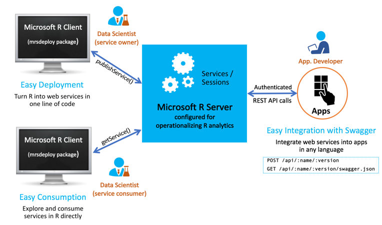

---

# required metadata
title: "Get Started for Data Scientists: Operationalize Your Analytics | Microsoft R Docs"
description: "Operationalize Your Analytics with Microsoft R Server Get Started"
keywords: ""
author: "j-martens"
manager: "jhubbard"
ms.date: "4/19/2017"
ms.topic: "get-started-article"
ms.prod: "microsoft-r"
ms.service: ""
ms.assetid: ""

# optional metadata
ROBOTS: ""
audience: ""
ms.devlang: ""
ms.reviewer: ""
ms.suite: ""
ms.tgt_pltfrm: ""
ms.technology: 
  - deployr
  - r-server
ms.custom: ""
---

# Get Started for Data Scientists

**Applies to:  Microsoft R Server 9.x**

Now that you've learned about [R Server's operationalization feature](about.md), we can dig into how data scientists can deploy and consume web services in order to operationalize their R analytics.

Data scientists work locally with [Microsoft R Client](../r-client-get-started.md) in their preferred R IDE and favorite version control tools to build scripts and models. Using the `mrsdeploy` package that ships with Microsoft R Client and R Server, the data scientist can develop, test, and ultimately deploy these R analytics as web services in your production environment. 

An R Server web service is an R code execution on the [operationalization compute node](configuration-initial.md). Each web service is uniquely defined by a `name` and `version`. You can use the functions in [the `mrsdeploy` package](../mrsdeploy/mrsdeploy.md) to gain access a service's lifecycle from an R script. This package is installed with Microsoft R Client as well as Microsoft R Server.  The `mrsdeploy` package provides functions for publishing and managing a web service that is backed by the R code block or script you provided. The package also provides functions for establishing a [remote execution](remote-execution.md) session in a console application.  [Learn more about this package](../mrsdeploy/mrsdeploy.md). Similarly, a set of [RESTful APIs](https://microsoft.github.io/deployr-api-docs/#services-management-apis) are available to provide direct programmatic access to a service's lifecycle directly. 

After it has been deployed, the web service can be: 
+ [Consumed directly in R by another data scientist](data-scientist-manage-services.md#data-scientists-share), for testing purposes for example 
+ [Integrated into an application by an application developer](app-developer-get-started.md)  using the  Swagger-based .JSON file produced when the web service was published. 

 

## What you'll need

You'll develop your R analytics locally with R Client, deploy them to Microsoft R Server as web services, and then consume or share them.

**On the local client**, you'll need to [install R Client](../r-client-get-started.md) first.  You'll also need to [configure the R IDE](https://msdn.microsoft.com/en-us/microsoft-r/r-client-get-started#step-2-configure-your-ide) of your choice, such as R Tools for Visual Studio, to run Microsoft R Client.  After you have this set up, you can develop your R analytics in your local R IDE using the functions in [the `mrsdeploy` package](../mrsdeploy/mrsdeploy.md) that was installed with Microsoft R Client (and R Server). 

**On the remote server**, you'll need the connection details and access to an instance of [Microsoft R Server](../rserver.md) with its [operationalization feature configured](configuration-initial.md). After R Server is configured for operationalization, you'll be able to [connect to it from your local machine](../operationalize/mrsdeploy-connection.md), deploy your models and other analytics to Microsoft R Server as web services, and finally consume or share those services. Please contact your administrator for any missing connection details.

## Deploy R code and models as web services

You can publish your R code and models as standard or realtime web services. Once you publish, they are deployed and hosted in R Server. You can use the APIs directly or [the `publishService()` function](../operationalize/data-scientist-manage-services.md) from the `mrsdeploy` R package. 

We recommend that you follow [this publish quickstart] to publish an R model as a service yourself. 

## Share services with others for consumption 

>[!IMPORTANT]
> Anyone who wishes to consume the service must have [authenticated access](security-authentication.md) to an instance of Microsoft R Server with its [operationalization feature configured](configuration-initial.md).

When the web service is published, a Swagger-based JSON file is generated automatically to define the service. You can now hand off this file to share the predictive web service with **other authenticated users of R Server**, such as:

Services can be consumed in multiple ways: 
1. Direct consumption in R using the `mrsdeploy` package, which installed with Microsoft R Server and R Client. Approaches include "Request - Response" and "Asynchronous Batch Execution".
2. Application developers can integrate web services into their applications using the APIs defined in a service specific Swagger-based JSON file. 

Learn more about sharing the Swagger-based JSON file with others in the article ["Working with web services in R"](data-scientist-manage-services.md) and the article [Asynchronous batch execution of web services in R](../operationalize/data-scientist-batch-mode.md).

## Execute R code remotely

You can use Microsoft R Client to run your R code locally and from R Client you can connect remotely to R Server to run your code there. You can easily switch between the local context and the remote context using `pause()` and `resume()` functions.  Learn more in this article, [Remote Execution in Microsoft R Server](remote-execution.md).

Requirements for remote execution include:

+ You must configure an R Integrated Development Environment (IDE) to work with [Microsoft R Client](../r-client-get-started.md). 
+ You must also have [authenticated access](security-authentication.md) to an instance of Microsoft R Server with its [operationalization feature configured](configuration-initial.md).

## More resources

This section provides a quick summary of useful links for data scientists operationalizing R analytics with R Server.

>Use the table of contents to find all of the guides and documentation needed by the administrator.

**Key Documents**
+ [About Operationalization](about.md)
+ [Quickstart: Deploying an R model as a web service](../operationalize/quickstart-publish-web-service.md)
+ [Functions in mrsdeploy package](../mrsdeploy/mrsdeploy.md)
+ [Connecting to R Server from mrsdeploy](../operationalize/mrsdeploy-connection.md)
+ [Working with web services in R](../operationalize/data-scientist-manage-services.md)
+ [Asynchronous batch execution of web services in R](../operationalize/data-scientist-batch-mode.md)
+ [Execute on a remote Microsoft R Server](remote-execution.md)
+ [Comparison between 8.x and 9.x](./rserver-whats-new.md#8vs9)

**Other Getting Started Guides**
+ [Application Developers](app-developer-get-started.md)
+ [Administrators](admin-get-started.md)

**Support Channel**
+ [Microsoft R Server Forum](https://social.msdn.microsoft.com/Forums/en-US/home?forum=microsoftr)