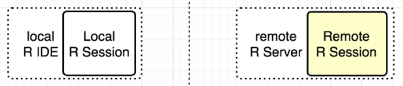
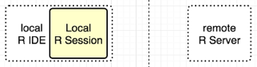
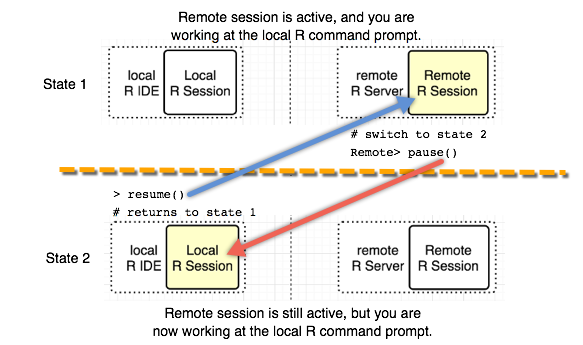

---

# required metadata
title: "Connect remotely using mrsdeploy - Machine Learning Server "
description: "Logging into Machine Learning Server and connecting with mrsdeploy"
keywords: "Machine Learning Server, remote login to r server, connect to r server, mrsdeploy connection, log into r server"
author: "j-martens"
ms.author: "jmartens"
manager: "cgronlun"
ms.date: "9/25/2017"
ms.topic: "reference"
ms.prod: "microsoft-r"

# optional metadata
#ROBOTS: ""
#audience: ""
#ms.devlang: ""
#ms.reviewer: ""
#ms.suite: ""
#ms.tgt_pltfrm: ""
ms.technology: 
  - deployr
  - r-server
#ms.custom: ""

---

# Log in to Machine Learning Server or R Server with mrsdeploy and open a remote session

**Applies to:  Machine Learning Server, Microsoft R Server 9.x**

The mrsdeploy package, delivered with Microsoft R Client and Machine Learning Server (formerly known as R Server), provides functions for:
+ Establishing a remote session in an R console application for the purposes of executing code on that server
+ Publishing and managing an R web service that is backed by the R code block or script you provided.  

Each feature can be used independently, but the greatest value is achieved when you use both.

This article explains the authentication functions, the arguments they accept, and how to switch between remote and local sessions. 

## Authentication

This section describes how to authenticate to Machine Learning Server on-premises or in the cloud using the functions in `mrsdeploy`.

In Machine Learning Server, every API call between the Web server and client must be authenticated. The mrsdeploy functions, which place API calls on your behalf, are no different. Authentication of user identity is handled via Active Directory. Machine Learning Server never stores or manages usernames and passwords.

By default, all `mrsdeploy` operations are available to authenticated users. Destructive tasks, such as deleting a web service from a remote execution command line, are available only to the user who initially created the service.  However, your administrator can also [assign role-based authorization](configure-roles.md) to further control the permissions around web services. 

`mrsdeploy` provides two functions for authentication against Machine Learning Server: [remoteLogin()](../r-reference/mrsdeploy/remotelogin.md) and [remoteLoginAAD()](../r-reference/mrsdeploy/remoteloginaad.md). These functions support not just authentication, but creation of a remote R session on the Machine Learning Server. By default, the remoteLogin() and remoteLoginAAD() functions log you in, create a remote R session on the Machine Learning Server instance, and open a remote command prompt.
 The function you use depends on the [type of authentication and deployment in your organization](configure-authentication.md). 

### On premises authentication

Use the remoteLogin function in these scenarios:
+ you are authenticating using Active Directory server on your network
+ you are using the [default administrator account](configure-authentication.md#local) for an on-premises instance of Machine Learning Server

This function calls `/user/login` API, which requires a username and password. For example:

```R
> remoteLogin(
          https://YourHostEndpoint, 
          session = TRUE, 
          diff = TRUE,
          commandline = TRUE
          username = NULL,
          password = NULL,
  )
```

For example, here is an AD authentication that creates a remote R session, but prompts for a username and password. That username can be the Active DIrectory/LDAP username and password, or the local admin account and its password.

```R
>  remoteLogin("http://localhost:12800", 
            session = FALSE)
```

In another example, we authenticate using the local 'admin' account and password and create a remote R session. Then, upon login, we are placed at the remote session's command prompt. A report of the differences between local and remote environments is returned.

```R
>  remoteLogin("http://localhost:12800", 
            username = "admin", 
            password = "{{YOUR_PASSWORD}}",
            diff = TRUE,
            session = TRUE,
            commandline = TRUE)
```

>[!NOTE]
>Unless you specify otherwise using the arguments below, this function not only logs you in, but also creates a remote R session the server instance and put you on the remote command line. If you don't want to be in a remote session, either set session = FALSE or [switch back to the local session](#switch) after login and logout.

|`remoteLogin` Argument|Description|
|--- | --- |
|endpoint|The Machine Learning Server HTTP/HTTPS endpoint, including the port number.  You can find this on the first screen when you [launch the administration utility](configure-use-admin-utility.md#launch).|
|session|If TRUE, create a remote session. **If omitted, creates a remote session.**|
|diff|If TRUE, creates a 'diff' report showing differences between the local and remote sessions. Parameter is only valid if session parameter is TRUE.|
|commandline|If TRUE, creates a "REMOTE' command line in the R console. Parameter is only valid if session parameter is TRUE. **If omitted, it is the same as `= TRUE`.**|
|prompt|The command prompt to be used for the remote session. By default, `REMOTE>` is used.|
|username|If NULL, user is prompted to enter your AD or [local Machine Learning Server](configure-authentication.md#local) username.|
|password|If NULL, user is prompted to enter password.|

>[!IMPORTANT]
>If you do not specify a username and password as arguments to the login function, you are prompted for your AD or [local Machine Learning Server](configure-authentication.md#local) username and password when you run this command. 


### Cloud authentication

<a name="aad-arguments"></a>

To authenticate with Azure Active Directory, use the `remoteLoginAAD` function. 

This function takes several arguments as follows:  

```R
> remoteLoginAAD(
       endpoint, 
       authuri = https://login.windows.net,
       tenantid = "<AAD_DOMAIN>", 
       clientid = "<NATIVE_APP_CLIENT_ID>", 
       resource = "<WEB_APP_CLIENT_ID>",
       username = "NameOfUser", 
       password = "UserPassword", 
       session = TRUE,
       diff = TRUE,
       commandline = TRUE
  )
```  

Unless you specify otherwise, this function:
1. Logs the user in
1. Creates a remote R session on the server instance
1. Puts the user on the remote command line in that remote session. 

If you do not want to be in a remote session, either set session = FALSE or [switch back to the local session](#switch) after login and logout.

For example, here is another AAD authentication that **does not create a remote R session**. It also prompts for a username and password at runtime.

If you do not specify the username and password as arguments to the login function, you are prompted for your AAD username and password at runtime.

```R
>  remoteLoginAAD(
       "https://mlserver.contoso.com:12800", 
       authuri = "https://login.windows.net", 
       tenantid = "microsoft.com", 
       clientid = "00000000-0000-0000-0000-000000000000", 
       resource = "00000000-0000-0000-0000-000000000000", 
       session = FALSE 
)
```

>[!WARNING]
>If do not specify a username or password, you are prompted for your credentials at runtime. If you have issues with the AAD login pop-up, you may need to include the username and password as command arguments directly. 


|remoteLoginAAD argument|Description|
|--- | --- |
|endpoint|The Machine Learning Server HTTP/HTTPS endpoint, including the port number.  This endpoint is the SIGN-ON URL value from the web application|
|authuri|The URI of the authentication service for Azure Active Directory.|
|tenantid|The tenant ID of the Azure Active Directory account being used to authenticate is the domain of AAD account.|
|clientid|The numeric CLIENT ID of the AAD "native" application for the Azure Active Directory account.|
|resource|The numeric CLIENT ID from the AAD "Web" application for the Azure Active Directory account, also known by the `Audience` in the configuration file.|
|session|If TRUE, create a remote session. **If omitted, creates a remote session.**|
|diff|If TRUE, creates a 'diff' report showing differences between the local and remote sessions. Parameter is only valid if session parameter is TRUE.|
|commandline|If TRUE, creates a "REMOTE' command line in the R console. Parameter is only valid if session parameter is TRUE.|
|prompt|The command prompt to be used for the remote session. By default, `REMOTE>` is used.  **If omitted, it is the same as `= TRUE`.**|
|username|If NULL, user is prompted to enter username `<username>@<AAD-account-domain>`. If you encounter issues with AAD login pop-ups, include the username and password as command arguments. |
|password|If NULL, user is prompted to enter password.|


If you do not know your `tenantid`, `clientid`, or other details, contact your administrator. Or, if you have access to the Azure portal for the relevant Azure subscription, you can find [these authentication details](configure-authentication.md#azure-active-directory). 

<br/>

### Arguments for remote execution 

If you plan to use `mrsdeploy` to start a remote session on the server and execute code remotely, there are two key parts to the command:
1. Create that remote session
2. Indicate whether you'd like to open a local or remote command prompt upon login.

Take special note of the arguments `session` and `commandline` as these influence the state of your command line.

|Argument|Description|
| --- | --- |
|`session`|If TRUE, create a remote session in the server. <br/>If omitted, it still creates a remote session.<br/>If FALSE, does not create any remote R sessions.|
|`commandline`|If TRUE, creates a REMOTE command line in the R console so you can interact with the remote R session. After the authenticated connection is made, the user is executing R commands remotely until they switch back to the local command line or logout. Parameter is only valid if session parameter is TRUE.|

For more information on remote execution, see [this article](../r/how-to-execute-code-remotely.md).

>[!WARNING]
>In the case where you are working with a [remote R session](../r/how-to-execute-code-remotely.md#publish-remote-session), there are several approaches to session management when publishing.  

### Access tokens

After you authenticate with Active Directory or Azure Active Directory, an [access token](how-to-manage-access-tokens.md) is returned. This access token is then passed in the request header of every subsequent `mrsdeploy` request. 

Keep in mind that each API call and every `mrsdeploy` function requires authentication with Machine Learning Server. If the user does not provide a valid login, an `Unauthorized` HTTP `401` status code is returned. 

## Remote connection states                                                                                                                                                        
Depending on how you configure the `session` and `commandline` login parameters are subtle, your execution context can switch between local and remote contexts.

### Create remote R session and go to remote command line (1)

In this state, we authenticate using one of the two aforementioned login functions with the default argument `session = TRUE` to create a remote R session, and the default argument `commandline = TRUE` to transition to the remote R command line.

>[!NOTE]
>Unless you specify `session = FALSE`, this function not only logs you in, but also creates a remote R session on the Machine Learning Server instance. And, unless you specify `commandline = FALSE`, you are on the remote command line upon login. If you don't want to be in a remote session, either set session = FALSE or [switch back to the local session](#switch) after login and logout.

|Command|State|
|---|---|
|`> remoteLogin(`<br/>&nbsp;&nbsp;&nbsp;&nbsp;&nbsp;&nbsp;&nbsp;&nbsp;&nbsp;`"http://localhost:12800"`<br/>&nbsp;&nbsp;&nbsp;&nbsp;`)`<br/><br/>`REMOTE>`|<br/>&nbsp;|

When you see the default prompt `REMOTE>` in the command pane, you know that you are now interacting with your remote R session and are no longer in your local R environment:

In this example, we define an interactive authentication workflow that spans both our local and remote environments.

```R
> # EXAMPLE: LOGIN, CREATE REMOTE R SESSION, GO TO REMOTE PROMPT

> remoteLogin("http://localhost:12800") 

REMOTE> x <- 10   # Assign 10 to "x" in remote session

REMOTE> ls()   # List objects in remote session 
[1] "x"

REMOTE> pause()  # Pause remote interaction. Switch to local 

> y <- 10      # Assign 10 to "y" in local session 

> ls()   # List objects in local session 
[1] "y"

> putLocalObject(c("y"))   # Loads local "y" into remote R session's workspace 

> resume()   # Resume remote interaction and move to remote command line 

REMOTE> ls()   # List the objects now in the remote session 
[1] "x" "y"

REMOTE> exit  # Destroy remote session and logout 

>
```

>[!IMPORTANT] 
>You can only manage web services from your local session. Attempting to use the service APIs during a remote interaction results in an error.

### Create remote R session and remain with local command line (2)

In this state, you can authenticate using `remoteLogin`, which is one of the two aforementioned login functions with the argument `session = TRUE` to create a remote R session, and the argument `commandline = FALSE` to remain in your local R environment and command line.

|Command|State|
|---|---|
|`> remoteLogin(`<br/>&nbsp;&nbsp;&nbsp;&nbsp;&nbsp;&nbsp;&nbsp;&nbsp;&nbsp;`"http://localhost:12800",`<br/>&nbsp;&nbsp;&nbsp;&nbsp;&nbsp;&nbsp;&nbsp;&nbsp;&nbsp;`session = TRUE,`<br/>&nbsp;&nbsp;&nbsp;&nbsp;&nbsp;&nbsp;&nbsp;&nbsp;&nbsp;`commandline = FALSE`<br/>&nbsp;&nbsp;&nbsp;&nbsp;`)`<br/><br/>`>`|<br/>&nbsp;|

In this example, we define an interactive authentication workflow that spans both our local and remote environments (just like state 1), but starts out in the local R session, and only then moves to the remote R session.

```R

> # EXAMPLE: LOGIN, CREATE REMOTE R SESSION, STAY LOCAL

> remoteLogin("http://localhost:12800", session = TRUE, commandline = FALSE)

> y <- 10   # Assign 10 to "y" in local session 

> ls()   # List the objects in the local session 
[1] "y"

> putLocalObject(c("y"))   # Loads local "y" into remote R session's workspace 

> resume()   # Switch to remote command line for remote interaction 

REMOTE> x <- 10    # Assign 10 to "x" in remote session 

REMOTE> ls()   # List the objects now in the remote session 
[1] "x" "y"

REMOTE> exit     # Destroy remote session and logout 

>
```

### Remain local without creating a remote R session (3)

In this state, you can authenticate with [remoteLogin()](../r-reference/mrsdeploy/remotelogin.md) and its argument `session = FALSE` so that no remote R session is started. Without a remote R session, you only have the local R environment and command line.

|Command|State|
|---|---|
|`> remoteLogin(`<br/>&nbsp;&nbsp;&nbsp;&nbsp;&nbsp;&nbsp;&nbsp;&nbsp;&nbsp;`"http://localhost:12800",`<br/>&nbsp;&nbsp;&nbsp;&nbsp;&nbsp;&nbsp;&nbsp;&nbsp;&nbsp;`session = FALSE`<br/>&nbsp;&nbsp;&nbsp;&nbsp;`)`<br/><br/>`>`|<br/>&nbsp;|


In this example, we define an interactive authentication workflow without a remote R session (`session = FALSE`). This is useful when working only with the web service functionality of the mrsdeploy package. After authentication, we remain confined within the local R session in order to publish and consume a service.

```R
> # EXAMPLE OF LOGIN WITHOUT REMOTE R SESSION

> remoteLogin("http://localhost:12800", session = FALSE)

> addOne <- function(x) x + 1

> api <- publishService(
            "add-one",
            code = addOne,
            inputs = list(x = "numeric"),
            outputs = list(answer = "numeric") 
         )

> res <- api$addOne(100)

> print(res$output("answer"))
[1] 101
```

>[!IMPORTANT] 
>You can only manage web services from your local session. Attempting to use the service APIs during a remote interaction results in an error.


<a name="switch"></a>

## Switch between remote and local sessions

After you [log in to the remote Machine Learning Server](how-to-connect-log-in-with-mrsdeploy.md)  with the argument `session = TRUE`, a remote R session is created. You can switch between the remote R session and the local R session directly from the command line.  The remote command line allows you to directly interact with an Machine Learning Server 9.x instance on another machine. 

When the `REMOTE>` command line is displayed in the R console, any R commands entered are executed on the remote R session. 



Switching between the local command line and the remote command line is done using these functions: pause() and resume(). To switch back to the local R session, type 'pause()'. If you have switched to the local R session, you can go back to the remote R session by typing 'resume()'.

To terminate the remote R session, type 'exit' at the REMOTE> prompt.  Also, to terminate the remote session from the local R session, type 'remoteLogout()'.

|Convenience Functions|Description|
|---|---|
|pause()|When executed from the remote R session, returns the user to the local '>' command prompt.|
|resume()|When executed from the local R session, returns the user to the 'REMOTE>' command prompt, and sets a remote execution context.|
|exit|Logs you out of the session.|

**Example**

```R
#execute some R commands on the remote session
REMOTE>x<-rnorm(1000)
REMOTE>hist(x)

REMOTE>pause()  #switches the user to the local R session
>resume()  

REMOTE>exit  #logout and terminate the remote R session
> 
```

## Logout of a remote session

To terminate the remote R session while you are on the remote command line, type 'exit' at the REMOTE> prompt.  

To terminate the remote session from the local R session, type ['remoteLogout()'](../r-reference/mrsdeploy/remotelogout.md).


## See also
+ [What is operationalization?](../what-is-operationalization.md)
+ [What are web services?](concept-what-are-web-services.md)
+ [mrsdeploy function overview](../r-reference/mrsdeploy/mrsdeploy-package.md)
+ [Working with web services in R](how-to-deploy-web-service-publish-manage-in-r.md)
+ [Asynchronous batch execution of web services in R](how-to-consume-web-service-asynchronously-batch.md)
+ [Execute on a remote Machine Learning Server](../r/how-to-execute-code-remotely.md)
+ [How to integrate web services and authentication into your application](how-to-build-api-clients-from-swagger-for-app-integration.md)
