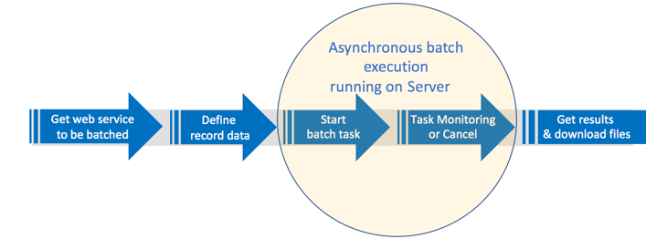

---

# required metadata
title: "Consume web services asynchronously with batch scoring in Python  - Machine Learning Server | Microsoft Docs"
description: "Asynchronous web service consumption via batch processing in Python - Machine Learning Server"
keywords: "batch processing of web services"
author: "j-martens"
ms.author: "jmartens"
manager: "jhubbard"
ms.date: "10/05/2017"
ms.topic: "reference"
ms.prod: "microsoft-r"

# optional metadata
#ROBOTS: ""
#audience: ""
#ms.devlang: ""
#ms.reviewer: ""
#ms.suite: ""
#ms.tgt_pltfrm: ""
ms.technology: "r-server"
#ms.custom: ""

---

# Asynchronous web service consumption via batch processing in Python 

**Applies to:  Machine Learning Server**

In this article, you can learn how to consume a web service asynchronously, which is especially useful with large input data sets and long-running computations. The typical approach to consuming web services in Python, ["Request Response" consumption](how-to-consume-web-services.md#consume-service), involves a single API call to execute the code in that web service once.  The "Asynchronous Batch" approach involves the execution of code without manual intervention using multiple asynchronous API calls on a specific web service sent as a single request to Machine Learning Server. Then, Machine Learning Server immediately executes those operations once for every row of data provided. 

## Asynchronous batch workflow

Generally speaking, the process for asynchronous batch consumption of a web service involves the following:
1. Call the web service on which the batch execution should be run
1. Define the data records for the batch execution task
1. Start (or cancel) the batch execution task
1. Monitor task and interact with results

Use these following [public API functions](#public-fx-batch)  to define, start, and interact with your batch executions.

 

<a name="try-batch"></a>

## Example code

The batch example code is stored in a Jupyter notebook. This notebook format allows you to not only see the code alongside detailed explanations, but also allows you to try out the code.

This example walks through the asynchronous consumption of a Python model as a web service hosted in Machine Learning Server. Consume a simple linear model built using the [rx_lin_mod](../../python-reference/revoscalepy/rx-lin-mod.md) function from the [revoscalepy package](../../python-reference/revoscalepy/revoscalepy-package.md).  

### &#9658; [**Download the Jupyter notebook to try it out**](https://github.com/Microsoft/ML-Server-Python-Samples/blob/master/operationalize/Explore_Batch_Consume_Python_Web_Services.ipynb).

<a name="public-fx-batch"></a>

## Public functions for batch

You can use the following supported public functions to consume a service asynchronously.

**Batch functions performed on the service object**

Once you get the service object, use these public functions on that object.

| Function      |Usage| Description                                            |
| ------------- |:-----:|--------------------------------------------------------|
| `batch` |[view](#batch-function)|Define the data records to be batched and the thread count|
| `get_batch_executions` |[view](#findbatch-fx)|Get the list of batch execution identifiers |
| `get_batch` |[view](#listids-fx)|Get batch object using its unique execution identifier |


**Batch functions performed on the batch object**

Once you have the batch object, use these public functions to interact with it.

| Function      | Description                                            |Usage|
| ------------- |--------------------------------------------------------|:-----:|
| `start` |[view](#start-fx)|Starts the execution of a batch scoring operation |
| `cancel` |[view](#cancel-fx)|Cancel the named batch execution|
| `execution_id` |[view](#id-fx)|Get the execution identifier for the named batch process|
| `state` |[view](#results-fx)|Poll for the state of the batch execution (failed, complete, ...)|
| `results` |[view](#results-fx)|Poll for batch execution results, partial or full results as defined|
| `execution` |[view](#exe-fx)|Get results for a given index row returned as an array  |
| `list_artifacts` |[view](#listartifacts-fx)|List of every artifact files that was generated by this execution index  |
| `artifact` |[view](#artifact-fx)|Print the contents of the named artifact file generated by the batch execution  |
| `download` |[view](#download-fx)|Download one or all artifact files from execution index|


## 1. Get the web service

Once you have authenticated, retrieve the web service from the server, assign it to a variable, and define the inputs to it as record data in a data frame, CSV, or TSV. 

Batching begins by retrieving the web service containing the code against which you score the data records you define next. You can get a service using its name and version with the get_service function from `azureml-model-management-sdk`. The result is a service object.  
The get_service function is covered in detail in the article "[How to interact with and consume web services in R](how-to-consume-web-services.md#get_service)."

<a name="batch-function"></a>

## 2. Define the data records to be batched

Next, use the public api function `batch` to define the input record data for the batch and set the number of concurrent threads for processing. 

**Syntax:** `batch(inputs, parallelCount = 10)`

|Argument|Description|
|----|----|
|`inputs`|Specify the data.frame name directly |
|`parallelCount`|Default value is 10. Specify the number of concurrent threads that can be dedicated to processing records in the batch.  Take care not to set a number so high that it negatively impacts performance.|

**Returns:** The batch object

**Example:**
```Python
# -- Import the dataset from the microsoftml package
from microsoftml.datasets.datasets import get_dataset
mtcars = get_dataset('mtcars')

# -- Represent the dataset as a dataframe.
mtcars = mtcars.as_df()

# -- Define the data for the execution.
records = mtcars[['hp', 'wt']]

# -- Assign the record data to the batch service and set the thread count.
batch = svc.batch(records, parallelCount = 10)
```

## 3. Start, find, or cancel the batch execution

Next, use the public api functions to start the asynchronous batch execution on the batch object, monitor the execution, or even cancel it.

<a name="start-fx"></a>

### Start batch execution task
Start the batch task with `start()`. Machine Learning Server starts the batch execution and assigns an ID to the execution and returns the batch object. 

**Syntax:** `start()`

No arguments.

**Returns:** The batch object

**Example:** `batch = batch.start() `

>[!NOTE]
> We recommend you always use the `id` function after you start the execution so that you can find it easily with this id later such as: 
>`id = batch.execution_id`
>`print("Batch execution_id is: {}".format(id))`

<br>
<a name="id-fx"></a>

### Get batch ID
Get the batch task's identifier from the service object so you can reference it during or after its execution using `id()`. 

**Syntax:** `execution_id`

No arguments.

**Returns:** The ID for the named batch object.

**Example:** `id = batch.execution_id`  


<br>
<a name="findbatch-fx"></a>
### Get batch by ID

Retrieve the `Batch` based on an `execution id`.

**Syntax:** `get_batch(execution_id)`

|Argument|Description|
|----|----|
|`execution_id`|The batch execution identifiers|

**Returns:** The `Batch` object


<br>
<a name="listids-fx"></a>

### List the Batch execution identifiers

Gets all batch executions currently queued for this service.

**Syntax:** `list_batch_executions()`

No arguments

**Returns:** List of batch execution identifiers

**Example:** `list_batch_executions()`

<br>
<a name="cancel-fx"></a>

### Cancel execution
Cancel the batch execution using `cancel()`.

**Syntax:** `cancel()`

No arguments.

**Returns:** The batch object

**Example:** `batch = batch.cancel() `


## 4. Monitor, retrieve, and interact with results

While the batch task is running, you can monitor and poll the results. Once the batch task has completed, you can get the web service consumption output by index from the batch results object, including:
 + Monitor execution results and status     
 + Get results for a given index row returned as an array     
 + Get a list of every file that was generated by this execution index    
 + Print the contents of a specific artifact or all artifacts returned     
 + Download artifacts from execution index      

<br>
<a name="results-fx"></a>

### Monitor execution results and status
There are several public functions you can use to get the results and status of a batch execution.

&ndash; Monitor or get the batch execution results
+ **Syntax:** `results(showPartialResults = TRUE)` 

  |Argument|Description|
  |----|----|
  |`showPartialResults`|This argument returns the already processed results of the batch execution even if it has not been fully completed. If `showPartialResults = FALSE`, then returns only the results if the execution has completed.|

+ **Returns:** A batch result object is returned, which in our example is called `batchRes`. <br>&nbsp;

&ndash; Get the status of the batch execution. 
+ **Syntax:** `state`<br>&nbsp;
  no arguments
+ **Returns:** The status of the batch execution.<br>&nbsp;

**Example:**
In this example, we return partial results every three seconds until the batch execution fails or completes. Then, we return results for a given index row returned as an array.
```Python
batchRes = None
while(True):
    batchRes = batch.results()
    print(batchRes)
    if batchRes.state == "Failed":
        print("Batch execution failed")  
        break
    if batchRes.state == "Complete": 
        print("Batch execution succeeded")  
        break
    print("Polling for asynchronous batch to complete...")
    time.sleep(1)
```

<br>
<a name="listartifacts-fx"></a>

### Get list of generated artifacts

Retrieve a list of every artifact that was generated during the batch execution for a given data record, or index, with `listArtifacts()`. This function can be made part of a loop to get the list of the artifacts for every data record (see workflow example for a loop). 

**Syntax:** `list_artifacts(index)`

|Argument|Description|
|----|----|
|`index`|Index value for a given batch data record|

**Returns:** A list of every artifact that was generated during the batch execution for a given data record

**Example:** 
```Python
# List every artifact generated by this execution index for a specific row.
lst_artifact = batch.list_artifacts(1)
print(lst_artifact)
```

<br>
<a name="artifact-fx"></a>

### Display artifact contents

Display the contents of a named artifact returned in the preceding list with `artifact()`. Machine Learning Server returns the ID for the named batch object. 

**Syntax:** `artifact(index, fileName)`

|Argument|Description|
|----|----|
|`index`|Index value for a given batch data record|
|`fileName`|Name of file artifact created during batch execution|

**Returns:** The ID for the named batch object

**Example:**
```Python
# Then, get the contents of each artifact returned in the previous list.
# The result is a byte string of the corresponding object.
for obj in lst_artifact:
    content = batch.artifact(1, obj)    
```

<br>
<a name="download-fx"></a>

### Download generated artifacts 

Download any artifacts from a specific execution index using `download()`. By default, artifacts are downloaded to the current working directory `getwd()` unless a different `dest = "<path>"` is specified. You can choose to download a specific artifact or all artifacts. 

**Syntax:** `download(index, fileName, dest = "<path>")`

|Argument|Description|
|----|----|
|`index`|Index value for a given batch data record|
|`fileName`|Name of specific artifact generated during batch execution. If omitted, all artifacts are downloaded for that index.|
|`dest`|The download directory on your local machine. The default is the current working directory. The directory must already exist on the local machine.|

**Returns:** The path to each downloaded artifact. 

**Example:**

In this example, we download a named artifact for the first index to the current working directory.

```Python
batch.download(1, "answer.csv")
``` 


## See also

 + [What are web services](../concept-what-are-web-services.md) 
 + [Functions in azureml-model-management-sdk package](../../python-reference/azureml-model-management-sdk/azureml-model-management-sdk.md)    
 + [Connecting to Machine Learning Server in Python](how-to-authenticate-in-python.md)    
 + [Working with web services in Python](how-to-deploy-manage-web-services.md)    
 + [How to consume web services in Python synchronously (request/response)](how-to-consume-web-services.md)    
 + [How to consume web services in Python asynchronously (batch)](how-to-consume-web-services-async.md)    
 + [How to integrate web services and authentication into your application](../how-to-build-api-clients-from-swagger-for-app-integration.md)    
 + [Get started for administrators](../configure-start-for-administrators.md)     
 + [User Forum](https://social.msdn.microsoft.com/Forums/en-US/home?forum=microsoftr)
