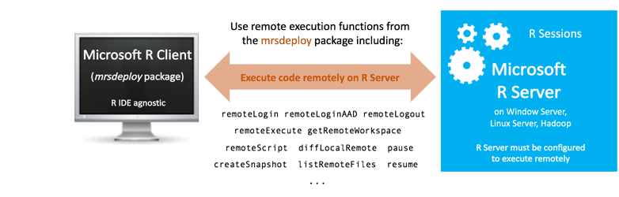

---

# required metadata
title: "Remote Execution | Microsoft R Server Docs"
description: "Remote execution for Microsoft R Server"
keywords: ""
author: "j-martens"
manager: "jhubbard"
ms.date: "02/14/2017"
ms.topic: "article"
ms.prod: "microsoft-r"
ms.service: ""
ms.assetid: ""

# optional metadata
ROBOTS: ""
audience: ""
ms.devlang: ""
ms.reviewer: ""
ms.suite: ""
ms.tgt_pltfrm: ""
ms.technology:
  - deployr
  - r-server
ms.custom: ""
---

# Execute on a remote Microsoft R Server

**Applies to:  Microsoft R Client 3.3.2 and Microsoft R Server 9.0.1**

Remote execution is the ability to issue R commands from either R Server or R Client to a remote session running on another R Server instance. You can use remote execution to offload heavy processing on server as well as test your work.

Remote execution is supported via the command line in console applications, in R scripts that call [functions from the `mrsdeploy` package](../mrsdeploy/mrsdeploy.md), or from code that calls the operationalization APIs. You can enter 'R' code just as you would in a local R console. R code entered at the remote command line executes on the remote server.

With remote execution, you can:
+ [Log into and out of an R Server remotely](../operationalize/mrsdeploy-connection.md)
+ [Generate diff reports of the local and remote environments](#diff) and reconcile any differences
+ [Execute R scripts and code remotely](#run)
+ [Work with R objects/files remotely](#objects)
+ [Create and manage snapshots of the remote environment for reuse](#snapshot)

 

## Supported configurations and mrsdeploy usage

The R functions used for remote execution are provided in the `mrsdeploy` package. However, the `mrsdeploy` package can only be used **After Microsoft R Server has been configured for operationalization**.

Read the introductory article ["`mrsdeploy` functions"](../mrsdeploy/mrsdeploy.md) for the supported R Client and R Server configurations for this package and remote execution as well as for a list of the [remote execution functions](../mrsdeploy/mrsdeploy.md#remote-functions) contained in that package.  In that article, you can also learn how to load the package.

## How to create a remote session

To create a remote session, you must first authenticate with R Server using one of the `mrsdeploy` login functions:  `remoteLogin()` and `remoteLoginAAD()`. With these functions, you can authenticate, set the arguments to create a remote R session on the R Server ( `session = TRUE` ) and even place yourself in the remote command line upon login `commandline = TRUE`. 

Read the article ["Connecting to R Server with mrsdeploy"](../operationalize/mrsdeploy-connection.md) for more on authentication with `mrsdeploy` and syntax. 

<a name="switch"></a>

## How to switch between sessions or logout

After you [log into the remote R server](../operationalize/mrsdeploy-connection.md)  with the argument `session = TRUE`, a remote R session is created. You can switch between the remote R session and the local R session directly from the command line.  The remote command line allows you to directly interact with an R Server 9.0.1 instance on another machine. 

When the `REMOTE>` command line is displayed in the R console, any R commands entered will be executed on the remote R session. 


Switching between the local command line and the remote command line is done using these functions: `pause()` and `resume()`. To switch back to the local R session, type `pause()`. If you have switched to the local R session, you can go back to the remote R session by typing `resume()`.

To terminate the remote R session, type `exit` at the `REMOTE>` prompt.  Also, to terminate the remote session from the local R session, type `remote_logout()`.

|Convenience Functions|Description|
|---|---|
|`pause()`|When executed from the remote R session, returns the user to the local `> ` command prompt.|
|`resume()`|When executed from the local R session, returns the user to the `REMOTE>` command prompt, and sets a remote execution context.|


**Example**

```R
#execute some R commands on the remote session
REMOTE>x<-rnorm(1000)
REMOTE>hist(x)

REMOTE>pause()  #switches the user to the local R session
>resume()  

REMOTE>exit  #logout and terminate the remote R session
> 
```


<a name="diff"></a>

## Create a diff report
A `diff` report is available so you can see and manage differences between the local and remote R environments.
The diff report contains information regarding R versions, R packages installed locally, but not on the remote
session, and differences between R package versions. This report is shown by default when you log in, but can be
run anytime by executing the function: `diffLocalRemote()`.

<a name="run"></a>

## Execute an R script remotely

If you have R scripts on your local machine, you can execute them remotely by using the function `remoteScript()`.
This function takes a path to an R script to be executed remotely. You also have options
to save or display any plots that might have been generated during script execution. The function returns a list
containing the status of the execution (success/failure), the console output generated, and a list of files created.

If your R Script has R Package dependencies, those packages must be installed on the Microsoft R server. You can either have your Administrator install them globally by logging in directly to the server,
or you can install them for the duration of the remote session by using the R function `install.packages()`. Leave the `lib` parameter empty.

If you need more granular control of a remote execution scenario, you can use the `remoteExecute()` function.

**Example**

```R
#install a package for the life of the session
REMOTE>install.packages("bitops")

#switch to the local R session
REMOTE>pause()
#execute an R script remotely
>remoteScript("c/myScript.R")    
```

<a name="objects"></a>

## Work with R objects and files remotely

After you have executed an R code remotely, you may want to retrieve certain R objects and load them into your local R session. For example, if you have an R script that creates a linear model (i.e. `m<-lm(x~y)` ), and you want to work with that model in your local R session, you can retrieve the object `m` by using the function `getRemoteObject()`.

Conversely, if you have a local R object that you want to make available to your remote R session, you can use the function `putLocalObject()`. If you want to sync your local and remote workspaces, the functions `putLocalWorkspace()` and `getRemoteWorkspace()` can be used.

Similar capabilities are available for files that need to be moved between the local and remote R sessions.

The following functions are available for working with files:  `putLocalFile()`, `getRemoteFile()`, `listRemoteFiles()` and `deleteRemoteFile()`.

**Example**

```R
#execute a script remotely that generated 2 R objects we are interested in retrieving
>remoteExecute("C:/myScript.R")
#retrieve the R objects from the remote R session and load them into our local R session
>getRemoteObject(c("model","out"))

#an R script depends upon an R object named `data` to be available. Move the local
#instance of `data` to the remote R session
>putLocalObject("data")
#execute an R script remotely
>remoteScript("c/myScript2.R")

#push a data file to the remote R session
>putLocalFile("C:/data/survey.csv")
#execute an R script remotely
>remoteScript("c/myScript2.R")
```
## A word on plots

When you plot remotely, the default plot size is 400 x 400 pixels. If you desire higher-resolution output, you must tell the remote session the size of plot to create. On a local session, you might do the following:

```R
> png(filename="myplot.png", width=1440, height=900)
> ggplot(aes(x=value, group=am, colour=factor(am)), data=mtcarsmelt) + geom_density() + facet_wrap(~variable, scales="free")
> dev.off()
```

When working on the REMOTE command line, you need to combine these 3 statements together:

```R
REMOTE> png(filename="myplot.png", width=1440, height=900);ggplot(aes(x=value, group=am, colour=factor(am)), data=mtcarsmelt) + geom_density() + facet_wrap(~variable, scales="free");dev.off()
```

As an alternative you can use the remoteScript function. Do the following:

```R
#Open a new script window in your IDE
#Enter the commands on separate lines

png(filename="myplot.png", width=1440, height=900)
ggplot(aes(x=value, group=am, colour=factor(am)), data=mtcarsmelt) + geom_density() + facet_wrap(~variable, scales="free")
dev.off()
```

```R
#Save the script to a file (i.e. myscript.R )
#Switch from the remote session to the local session by typing pause() on the REMOTE command line
REMOTE> pause()
>
```

```R
#From the local command prompt, execute your remote script
> remote_script("myscript.R")
```

<a name="snapshot"></a>

## Snapshots and why they are useful

Snapshot functions are very useful for remote execution scenarios. It can save the whole workspace and working directory so that you can pick up from exactly where you left last time. Thank about saving and loading a game.


If you need a prepared environment for remote script execution that includes any of the following: R packages, R objects and data files, consider creating a **snapshot**. A snapshot is an image of a remote R session saved to Microsoft R Server, which includes:

+ The session's workspace along with the installed R packages
+ Any files and artifacts in the working directory

A snapshot can be loaded into any subsequent remote R session for the user who created it. For example, suppose you want to execute a script that needs three R packages, a reference data file, and a model object.  Instead of loading these items each time you want to execute the script, create a snapshot of an R session containing them. Then, you can save time later by retrieving this snapshot using its ID to get the session contents exactly as they were at the time the snapshot was created.

Snapshots are only accessible to the user who creates them and cannot be shared across users.

The following functions are available for working with snapshots:  
`listSnapshots()`, `createSnapshot()`, `loadSnapshot()`, `downloadSnapshot()` and `deleteSnapshot()`.

> [!IMPORTANT] 
> While snapshots can also be used when publishing a web service for environment dependencies, it may have an impact on the performance of the Request-Response time.  For optimal performance, consider the size of the snapshot carefully especially when publishing a service. Before creating a snapshot, ensure that you keep only those workspace objects you need and purge the rest.  And, in the event that you only need a single object, consider passing that object alone itself instead of using a snapshot.


**Example**

```R
#configure our remote session
REMOTE>install.packages(c("arules","bitops","caTools"))
>putLocalFile("C:/data/survey_reference.csv")
>putLocalObject("model")
>snapshot_id<-<-createSnapshot("my modeling environment")

#whenever I need the modeling environment, reload the snapshot
>loadSnapshot(snapshot_id)  
#execute an R script remotely
>remoteScript("c/myScript2.R")
```


## Publishing web services

After you understand the mechanics of remote execution, consider incorporating web service capabilities. You can publish an R web service composed of arbitrary R code block that runs on the remote R Server. For more information, begin with the [Data scientist get started](data-scientist-get-started.md)  guide.

If you intend to publish a web service while you have a remote R session, you should never do so from the remote command line or you'll get a message such as `Error in curl::curl_fetch_memory(uri, handle = h) : URL using bad/illegal format or missing URL`. Instead, use the `pause()` function to return the R command line in your local session, publish your service, and then `resume()` if you want to continue running R code from the remote command line in the remote R session.


## See also

+ [mrsdeploy function overview](../mrsdeploy/mrsdeploy.md)
+ [Connecting to R Server from mrsdeploy](../operationalize/mrsdeploy-connection.md).
+ [Data scientist get started guide](data-scientist-get-started.md)
+ [Working with web services in R](../operationalize/data-scientist-manage-services.md)