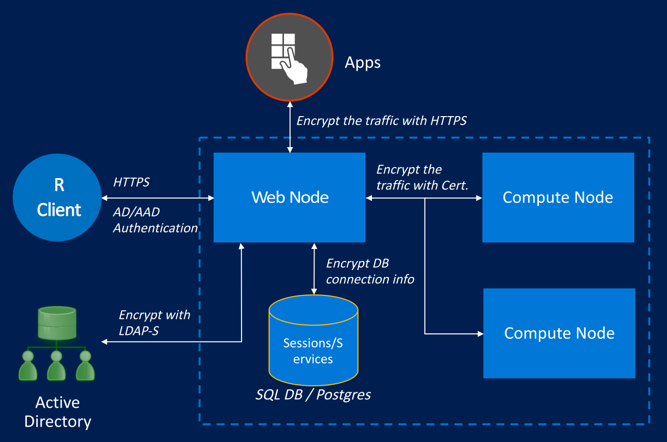
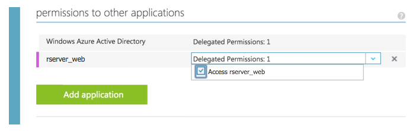

---

# required metadata
title: "Enterprise-Grade Security: Authentication | Microsoft R Server Docs"
description: "Enterprise-Grade Security: Authentication for Operationalization with Microsoft R Server"
keywords: ""
author: "j-martens"
manager: "jhubbard"
ms.date: "02/08/2017"
ms.topic: "article"
ms.prod: "microsoft-r"
ms.service: ""
ms.assetid: ""

# optional metadata
ROBOTS: ""
audience: ""
ms.devlang: ""
ms.reviewer: ""
ms.suite: ""
ms.tgt_pltfrm: ""
ms.technology: 
  - deployr
  - r-server
ms.custom: ""
---

# Authentication options for operationalization

**Applies to:  Microsoft R Server 9.0.1**

R Server's offers seamless integration with authentication solutions for operationalization. To secure connections and communications, you have several options:

|Authentication Method|When to Use|
|----------------------------------|----------------------------------|
|[Local `admin` account](#local)|For [one-box](configuration-initial.md) configurations|
|[Active Directory / LDAP](#ldap)|For [enterprise](configuration-initial.md) on-premise configurations|
|[Active Directory / LDAP-S](#ldap)|For [enterprise](configuration-initial.md) on-premise configurations with SSL/TLS enabled|
|[Azure Active Directory](#aad)|For [enterprise](configuration-initial.md) cloud configurations|

<br>



<br>

<a name="local"></a>

## Local Administrator Account Authentication

During configuration, a default administrator account, `admin`, is created for R Server's operationalization feature. This account allows you to use the [administration utility](admin-utility.md) to configure this feature, edit ports, restart nodes, and so on. 

While this might be sufficient when trying this feature out with a [one-box configuration](configuration-initial.md#onebox) since everything is running within the trust boundary, it is not sufficient for [enterprise configurations](configuration-initial.md#enterprise).

To set or change the password for the local administrator account after the configuration script has been run, [follow these steps](admin-utility.md#admin-password).

To log into Microsoft R Server with this user for remote execution or web service functionalities, use `remoteLogin()` as described in the article "[Connecting to R Server with mrsdeploy](../operationalize/mrsdeploy-connection.md)".

<a name="ldap"></a>

## Active Directory and LDAP/LDAP-S

Active Directory (AD) and LDAP are a great authentication option for on-premise configurations to ensure that domain users have access to the APIs.  

The standard protocol for reading data from and writing data to Active Directory (AD) domain controllers (DCs) is LDAP. AD LDAP traffic is unsecured by default, which makes it possible to use network-monitoring software to view the LDAP traffic between clients and DCs.  

By default, the LDAP security provider is not configured. To enable LDAP authentication support, update the relevant properties in your configuration file. The values you assign to these properties should match the configuration of your LDAP Directory Information Tree (DIT).

You can make LDAP traffic confidential and secure using Secure Sockets Layer (SSL) / Transport Layer Security (TLS) technology. This combination is referred to as LDAP over SSL (or LDAP-S). To ensure that no one else can read the traffic, SSL/TLS establishes an encrypted tunnel between an LDAP client and a DC. [Learn more about enabling SSL/TLS.](security-https.md) Reasons for enabling LDAP-S include:

+ Organizational security policies typically require that all client/server communication is encrypted.
+ Applications use simple BIND to transport credentials and authenticate against a Domain Controller. As simple BIND exposes the users’ credentials in clear text, using SSL/TLS to encrypt the authentication session is strongly recommended.
+ Use of proxy binding or password change over LDAP, which requires LDAP-S. Bind to an AD LDS instance Through a Proxy Object
+ Applications that integrate with LDAP servers (such as Active Directory or Active Directory Domain Controllers) might require encrypted LDAP communications.

>[!WARNING]
> You cannot have both Azure Active Directory and Active Directory/LDAP enabled at the same time. If one is set to `"Enabled": true`, then the other must be set to `"Enabled": false`.

**On each web node, do the following:**

1. Enable LDAP/LDAP-S in the external JSON configuration file, `appsettings.json`:

   1. Open the `appsettings.json` configuration file.

      + On Windows, this file is under `<MRS_home>\deployr\Microsoft.DeployR.Server.WebAPI\` where `<MRS_home>` is the path to the Microsoft R Server installation directory. To find this path, enter `normalizePath(R.home())` in your R console.

      + On Linux, this file is under `/usr/lib64/microsoft-deployr/9.0.1/Microsoft.DeployR.Server.WebAPI/`.
   
   1. Search for the section starting with `"LDAP": {`
   
   1. <a name="encrypt"></a>Enable this section and update the properties so that they match the values in your Active Directory Service Interfaces Editor.  Properties include:

      > For better security, we recommend you [encrypt the password](admin-utility.md#encrypt) before adding the information to `appsettings.json`.

      |LDAP Properties|Definition|
      |---------------|-------------------------------|
      |`Host`|Address of the Active Directory server|
      |`UseLDAPS`|Set `true` for LDAP-S or `false` for LDAP<br>**Note:** If LDAP-S is configured, an installed LDAP service certificate is assumed so that the tokens produced by Active Directory/LDAP can be signed and accepted by R Server. |
      |`BindFilter`|The template used to do the Bind operation. For example, `"CN={0},CN=DeployR,DC=TEST,DC=COM"`. {0} is the user's DN.|
      |`QueryUserDn`|Distinguished name of user with read-only query capabilities with which to authenticate|
      |`QueryUserPasswordEncrypted`|`True/False`. If `True`, it means the value of `QueryUserPassword` is an encrypted string.|
      |`QueryUserPassword`|Password for that user with which to authenticate (value must be encrypted).  We highly recommend that you [encrypt LDAP login credentials](admin-utility.md#encrypt) before adding the information to this file.|
      |`SearchBase`|Context name to search in, relative to the base of the configured ContextSource, e.g. `'ou=users,dc=example,dc=com'`.| 
      |`SearchFilter`|The pattern to be used for the user search. {0} is the user's DN.|

      >[!IMPORTANT]
      >Make sure that a value is defined for the `userPrincipalName` in the Active Directory Service Interfaces Editor or  the authentication fails.

      <br>
      
      >[!IMPORTANT]
      >Need help figuring out your Active Directory/LDAP settings? Check out your LDAP settings using the `ldp.exe` tool and compare them to what you’ve declared in `appsettings.json`.  You can also consult with any Active Directory experts in your organization to identify the correct parameters.

      For example:
      ```
      "LDAP": {
              "Enabled": true,
              "Host": "<host_ip>",
              "UseLDAPS": "True",
              "BindFilter": "CN={0},CN=DeployR,DC=TEST,DC=COM",
              "QueryUserDn": "CN=deployradmin,CN=DeployR,DC=TEST,DC=COM",
              "QueryUserPasswordEncrypted": true,
              "QueryUserPassword": "abcdefghijklmnopqrstuvwxyz1234567890ABCDEFGHIJKLMNOPQRSTUVWXYZabcdefghijklmnopqrstuvwxyz1234567890ABCDEFGHIJKLMNOPQRSTUVWXYZabcdefghijklmnopqrstuvwxyz1234567890ABCDEFGHIJKLMNOPQR",
              "SearchBase": "CN=DeployR,DC=TEST,DC=COM",
              "SearchFilter": "cn={0}"       
      }
      ```

1. If using a certificate for access token signing, do the following: 

   >You must use a certificate for access token signing whenever you have multiple web nodes so the tokens are signed consistently by every web node in your configuration. 
   >
   >In production environments, we recommend that you use a certificate with a private key to sign the user access tokens between the web node and the LDAP server.
   >
   >Tokens are particularly useful to the application developer who can use them to identify and authenticate the user who is sending the API call within his or her application. [Learn more...](security-access-tokens.md)
    
   1. On each machine hosting the Web node, install the trusted, signed **access token signing certificate** with a private key in the certificate store. Take note of the `Subject` name of the certificate as you'll need this info later.

   1. In the `appsettings.json` file, search for the section starting with `"JWTSigningCertificate": {`

   1. Enable this section and update the properties so that they match the values for your token signing certificate:
      ```
      "JWTSigningCertificate": {
          "Enabled": true,
          "StoreName": "My",
          "StoreLocation": "CurrentUser",
          "SubjectName": "CN=<subject name>"
      }
      ```
1. Save changes to `appsettings.json`.

1. [Restart the web node](admin-utility.md#startstop) using the administration utility so that the changes can take effect.
 
1. Run the [diagnostic tests](admin-diagnostics.md) to ensure all tests are passing in the configuration.

   >[!IMPORTANT]
   >In the event that you run into any connection issues when configuring R Server for Active Directory/LDAP, we recommend that you try the `ldp.exe` tool to search the LDAP settings and compare them to what you’ve declared in `appsettings.json`.  You can also consult with any Active Directory experts in your organization to identify the correct parameters.

1. Repeat these steps on each machine hosting the web node.

1. Share the connection details with any users who authenticates with R Server either to make [API calls](api.md) directly or indirectly in R [using `remoteLogin()` function in the `mrsdeploy` package](../operationalize/mrsdeploy-connection.md).


<br>

<a name="aad"></a>

## Azure Active Directory 

[Azure Active Directory (AAD)](https://www.microsoft.com/en-us/cloud-platform/azure-active-directory) can be used to securely authenticate  in the cloud when the client application and Web node have access to the internet.

**In the Azure Classic Portal, do the following:**

1. Sign in to the [Azure classic portal](https://manage.windowsazure.com/) and navigate to **Active Directory** in the left hand pane. Copy the URL in your browser address bar. You will use this to configure your Azure Active Directory app.

1. Select your directory. If the Azure Active Directory has not been set up yet, contact your system administrator.  

1. Select the **Applications** tab at the top. 

1. Now, create a web app that is tied to the Azure Active Directory as follows: 

   1. In the **Applications** tab, click **ADD** at the bottom to create a new app registration. A dialog appears.
 
   1. Click **Add an application my organization is developing**. The **Add Application** wizard appears.

   1. In the wizard, enter a **Name** for your application, such as `rserver_web`.

   1. For the **Type**, click the **Web Application And/Or Web API**. 

   1. Click the arrow to continue.

   1. Enter the App properties. In the **SIGN-ON URL** box, paste the application URL you copied earlier; or if you expect the R client to be on the same machine as the server, use `http://localhost:12800`. Then, enter that same URL in the **App ID URI** box. 

   1. Click the checkmark to continue and add the application.

   1. After the application has been added, click the **Configure** tab. 

   1. Copy the **Client ID** for the web app. You will configure your Native application and Microsoft R Server to use this later.

   1. Add a client **Keys** by selecting a key duration and take note of the key. 
   
      >[!IMPORTANT] 
      > Take note of this key as your application developers and data scientists will need it later to authenticate. See example below.

   1. Also, take note of the application's tenant id.  The tenant ID is the domain of the Azure Active Directory account, for example,  `myMRServer.contoso.com`.

   1. Click **Save**. The application is created.

1. Now, create a native app, which links the web app to the Microsoft R Server operationalization server as follows:

   1. In the **Applications** tab, click **ADD** at the bottom to create a new app registration. A dialog appears.

   1. Click **Add an application my organization is developing**. The **Add Application** wizard appears.

   1. In the wizard, enter a **Name** for your native application, such as `rserver_native`.

   1. For the **Type**, click the **Native Client Application**. 

   1. Click the arrow to continue.

   1. In the **Application Information** dialog, enter `urn:ietf:wg:oauth:2.0:oob` for the **Redirect URI**.

   1. Click the checkmark to continue and add the application.

   1. After the application has been added, click the **Configure** tab. 

   1. Copy the **Client ID** for the native app. You will use it when enabling AAD in Microsoft R Server in a later step.

   1. Scroll down and click **Add Application** button. A dialog opens in which you can define which apps will have access to the native app.

   1. In the **Permissions to other applications** dialog, enter the name of the web app you created above in the **Starting With** field.

   1. Click the checkmark next to this field to filter the list of apps using the string you entered.

   1. In the list, click the + symbol next to the name of the web app.

   1. Click the checkmark in the bottom right to give the native app permissions to the web application.

   1. Add **Delegated Permissions** to the web app.
     

   1. Click **Save**. 

<br>

**On each Web node, enable Azure AD by doing the following:**

1. Open the `appsettings.json` configuration file.

   + On Windows, this file is under `<MRS_home>\deployr\Microsoft.DeployR.Server.WebAPI\` where `<MRS_home>` is the path to the Microsoft R Server installation directory. To find this path, enter `normalizePath(R.home())` in your R console.

   + On Linux, this file is under `/usr/lib64/microsoft-deployr/9.0.1/Microsoft.DeployR.Server.WebAPI/`.

1. Search for the section starting with:
   ```
   "AzureActiveDirectory": {
      "Enabled": false,
   ```

   >[!WARNING]
   > You cannot have both Azure Active Directory and Active Directory/LDAP enabled at the same time. If one is set to `"Enabled": true`, then the other must be set to `"Enabled": false`.

1. Enable Azure Active Directory as the authentication method:  `"Enabled": true,`

1. Update the other properties in that section so that they match the values in the Azure Management portal.  Properties include:

   |Azure AD Properties|Definition|
   |----------------|-------------------------------|
   |`Authority`|Use `https://login.windows.net/<URL to AAD login>` where `<URL to AAD login>` is the URL to the AAD login. For example, if the AAD account domain is `myMRServer.contoso.com`, then the `Authority` would be `https://login.windows.net/myMRSServer.contoso.com`|
   |`Audience`|Use the `CLIENT ID` value for the web app you copied from the Azure management portal.|

   ```
   "AzureActiveDirectory": {
        "Enabled": false,
        "Authority": "https://login.windows.net/rserver.contoso.com",
        "Audience": "00000000-0000-0000-0000-000000000000",
        "Key": "ABCD000000000000000000000000WXYZ"  
   },   
   ```

1. Launch the administrator's utility and:
   1. [Restart the web node](admin-utility.md#startstop) for the changes to take effect.
 
   1. Run the [diagnostic tests](admin-diagnostics.md) to ensure all tests are passing in the configuration.

1. Repeat these steps on each machine hosting the web node.

1. Share the connection details with any users who will authenticate with R Server either to make [API calls](api.md) directly or indirectly in R [using `remoteLoginAAD()` function in the `mrsdeploy` package](../operationalize/mrsdeploy-connection.md). Note that if you do not specify a username and password as arguments to the login functions, you'll be prompted for your AAD username (`<username>@<AAD-account-domain>`) and password. 

<br>

**When authenticating with the `mrsdeploy` package, do the following:**

Learn how to authenticate with Azure Active Directory from your R script using  the `remoteLoginAAD` function in [the  `mrsdeploy` package](../operationalize/mrsdeploy-connection.md).
