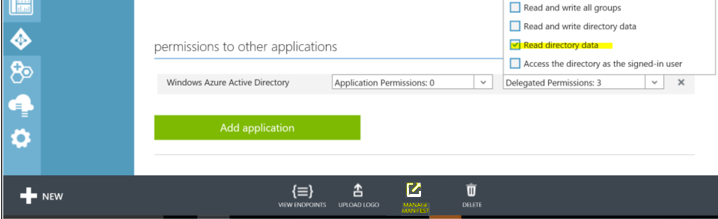

---

# required metadata
title: "Roles and Groups | Microsoft R Server Docs"
description: "Enterprise-Grade Security: Authentication Roles for Operationalization with Microsoft R Server"
keywords: ""
author: "j-martens"
manager: "jhubbard"
ms.date: "02/14/2017"
ms.topic: "article"
ms.prod: "microsoft-r"
ms.service: ""
ms.assetid: ""

# optional metadata
ROBOTS: ""
audience: ""
ms.devlang: ""
ms.reviewer: ""
ms.suite: ""
ms.tgt_pltfrm: ""
ms.technology: 
  - deployr
  - r-server
ms.custom: ""
---

# Roles to control web service permissions

**Applies to:  Microsoft R Server 9.1**

By default, when you configure Microsoft R Server for operationalization, authenticated users can publish, list, and get any web services. Additionally, users can also update and delete the web services they've published.

You can use roles to further control who can publish, update and delete web services in R Server. There are several standard roles, each of which has different permissions. How users are put assigned to roles depends on what authentication method has been configured for R Server. For more on configuring authentication for R Server, read the article, ["Authentication options for operationalization"](security-authentication.md).

## What do I need?

To assign groups of users in your Active Directory to R Server roles for web services, you must have:

+ An instance of Microsoft R Server that is [configured for operationalization](../operationalize/configuration-initial.md)

+ Authentication for this instance must be via Active Directory/LDAP (AD/LADP) or Azure Active Directory (AAD) and [already configured](../operationalize/security-authentication.md)
   >[!NOTE]
   > You cannot have both Azure Active Directory and Active Directory/LDAP enabled at the same time. If one is set to `"Enabled": true`, then the other must be set to `"Enabled": false`.
  
+ The names of the groups that contain the users to whom you want to give special permissions

## Groups versus roles for web services

In AD/LDAP and AAD, security groups are used to collect user accounts, computer accounts, and other groups into manageable units. Working with groups instead of with individual users helps simplify network maintenance and administration. Your organization might have groups like "Admin", "Engineering", "Level3", and so on. And, users might belong to more than one group.
You can leverage the AD groups you've already defined in your organization to assign a collection of users to roles for web services. 

In R Server, the administrator can assign one or more Active Directory groups to either the "Owner" or "Contributor" roles or both. These roles give specific permissions related to publishing and interacting with web services. When a user attempts to authenticate, R Server will check to see whether you've declared roles for web service interactions. If you have, then R Server checks to see to which group the user belongs based on the action you are trying to perform. If the user belongs to one of the AD/LDAP or AAD groups that you declare in R Server, then the user is authenticated and given permissions according to the role to which their group is assigned. See the following section on **"Role declaration states"** for more information.

A user can belong to multiple groups, and therefore it is possible to be assigned multiple roles and all of their permissions.

## Roles for web service interactions

When roles are declared in the configuration file, the administrator has the choices of putting groups (of users) into these roles.

|Role |Definition|Can do with<br>web services |Cannot do with<br>web services|
|-------------|------------|-----------------|---------------------|
|`Owner` |When declared, these users can manage any service.|● Publish any service <br>● Update any service <br>● Delete any service <br>● List all services <br>● Consume any service |N/A| 
|`Contributor` |When declared, these users can publish and <br>manage their services, but no one else's.|● Publish any service <br>● Update their services <br>● Delete their services <br>● List all services <br>● Consume any service|● Update service published by someone else<br>● Delete service published by someone else| 
|`Reader`|Never declared, this is a catchall role is given to any<br>authenticated user that is not assigned another role (see below) <br>These users can only list and consume services.|● List all services<br>● Consume any service|● Publish any service <br>● Update any service <br>● Delete any service|

## Role declaration states

You can choose from the following states:

1. No roles are explicitly declared (default state after install)
1. Only one role is explicitly declared
1. "Contributor" and "Owner" are explicitly declared

<br>

|When these roles are declared|Everyone else is implicitly assigned to:|
|-----|:--------------------:|
|_no roles (default state)_|"Contributor"|
|"Owner" only|"Contributor"|
|"Contributor" only|"Reader"|
|"Contributor" and "Owner"|"Reader"|


## Declaring roles for the local `admin` account

If you only have the default local administrator account, `admin`, set up for R Server's operationalization, then this is the only user and the `admin` user is implicitly assigned to the "Contributor" role.


## Declaring roles for AD/LDAP users

If you configure R Server to [use Active Directory/LDAP authentication](security-authentication.md#ldap), then you can configure it to assign roles using Active Directory groups as follows:

#### Step 1. Add the roles to R Server on each web node

On each R Server web node, edit the `appsettings.json` configuration file in order to declare the roles and the groups that belong them. 

1. Open [the `appsetting.json` file](admin-configuration-file.md).

1. Search for the following section: `"Authorization": {`

1. In that section, add one or both roles ("Owner" and "Contributor"). Then, map one or more security groups to each R Server role such as:

   ```"Authorization": {```<br>&nbsp; &nbsp; &nbsp; &nbsp; &nbsp;```"Owner": [ "Administrators" ],```<br>&nbsp; &nbsp; &nbsp; &nbsp; &nbsp;```"Contributor": [ "RProgrammers", "Quality" ]```<br>```}``` 
   
#### Step 2. Allow R Server to check groups in Azure Active Directory

R Server must be given the ability to verify the groups you declare against those in AAD or and AD/LDAP.  For AAD, you have an extra step to make that possible. For AD/LDAP, the default settings when you [set up R Server for AD/LDAP](security-authentication.md#ldap) as sufficient.

1. Sign in to the [Azure classic portal](https://manage.windowsazure.com/) and update the configuration to allow R Server to match a user with his or her groups and authenticate with AAD as follows:

1. In the left menu, choose **Active Directory**.

1. Select the active directory you want to open.

1. After open, click the **Applications** tab at the top.

1. Open the web application you created when you [configured R Server for AAD authentication](security-authentication.md#aad).

1. With the application open, go to the bottom of the page and click the **Manage Manifest > Download Manifest**. A popup menu appears.
   

1. Open the manifest file in a text editor and ensure that the property `"groupMembershipClaims"` looks like this:

   ```"groupMembershipClaims": "SecurityGroup"```

1. Save the manifest file.

1. Back in the portal, click the **Manage Manifest > Upload Manifest** on the toolbar at the bottom of the window. Upload the edited file back into the portal.

1. In the **Configure** tab, scroll to the **Keys** section. Take note of the key as you must add this to the `"AzureActiveDirectory"` section of the `appsettings.json` configuration file. This will enable R Server to validate the group names at authentication time.  

1. In the same tab, scroll to the **Permissions to other applications** section and click the **Delegated Permissions** listbox. and make sure that the **Read directory data** checkbox is enabled.

    

#### Step 3. Validate the groups against AD/LDAP or AAD.

Return to [the `appsetting.json` file](admin-configuration-file.md) and do the following:

+ **(Azure Active Directory ONLY)**. In `appsettings.json`, find the `"AzureActiveDirectory"` section. Make sure the alphanumberic client key created in the portal is used for `"Key": ` property. This key allows R Server to verify that the groups you've declared are valid in AAD. See example below. Learn more about [configuring R Server user to authenticate with Azure Active Directory](security-authentication.md#aad).

  >[!IMPORTANT]
  > For more security, we recommend you [encrypt the key](admin-utility.md#encrypt) before adding the information to `appsettings.json`.

  >[!NOTE]
  > If a given user belongs to more than groups that allowed in AAD (overage limit), AAD will provide an overage claim in the token it returns. This claim along with the key you provide here allows R Server to retrieve the group memberships for the user.

+ **(Active Directory/LDAP ONLY)**. In `appsettings.json`, find the `"LDAP"` section.  In order for R Server to verify that the groups you've declared are valid in AD/LDAP, you must provide the `QueryUserDn` and `QueryUserPassword` in the `"LDAP"` section. See the example below. This allows R Server to verify that each declared group is, in fact, a valid, existing group in AD. Learn more about [configuring R Server user to authenticate with Active Directory/LDAP](security-authentication.md#ldap).


#### Step 4. Apply the changes to R Server

1. [Restart the web node](admin-utility.md#startstop) for the changes to take effect. You'll need to log in  using [the local `admin` account](../operationalize/security-authentication.md#local) in the administration utility.

1. Repeat these changes in every web node you've configured.  The configuration must be the same across all web nodes.

### Example

Here is an example of roles declared for AD/LDAP in `appsettings.json` on the web node:

```
Authentication: {
       "AzureActiveDirectory": {
              "Enabled": false,
              "Authority": "https://login.windows.net/rserver.contoso.com",
              "Audience": "00000000-0000-0000-0000-000000000000",
              "Key": "ABCD000000000000000000000000WXYZ"  
       },
       "LDAP": {
              "Enabled": true,
              "Host": "<host_ip>",
              "UseLDAPS": "True",
              "SkipCertificateValidation": "True",
              "BindFilter": "CN={0},CN=DeployR,DC=TEST,DC=COM",
              "QueryUserDn": "CN=deployradmin,CN=DeployR,DC=TEST,DC=COM",
              "QueryUserPasswordEncrypted": true,
              "QueryUserPassword":
"abcdefghijklmnopqrstuvwxyz1234567890ABCDEFGHIJKLMNOPQRSTUVWXYZabcdefghijklmnopqrstuvwxyz1234567890ABCDEFGHIJKLMNOPQRSTUVWXYZabcdefghijklmnopqrstuvwxyz1234567890ABCDEFGHIJKLMNOPQR",
              "SearchBase": "CN=DeployR,DC=TEST,DC=COM",
              "SearchFilter": "cn={0}"       
       }
}
 
"Authorization": {
   "Owner": [ "Administrators" ],
   "Contributor": [ "RProgrammers", "Quality" ]      
}
```