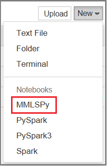

---

# required metadata
title: "Configure Jupyter Notebooks for revoscalepy in Machine Learning Server | Microsoft Docs "
description: "How to configure a Jupyter notebook to call Python functions from revoscalepay and microsofml modules in Machine learning Server."
keywords: ""
author: "HeidiSteen"
ms.author: "heidist"
manager: "jhubbard"
ms.date: "09/22/2017"
ms.topic: "article"
ms.prod: "microsoft-r"

# optional metadata
#ROBOTS: ""
#audience: ""
#ms.devlang: ""
#ms.reviewer: ""
#ms.suite: ""
#ms.tgt_pltfrm: ""
ms.technology: ""
#ms.custom: ""

---

# How to use Jupyter notebooks in single-user and multi-user servers

This article explains how to load sample Python notebooks for Machine Learning samples on Github. It also explains how to add our libraries to a remote Jupyter server acting as central hub for multi-user notebooks on your network.

Jupyter Notebooks is distributed with Anaconda, which is the Python distribution used by Machine Learning Server. If you installed Machine Learning Server, you have the components necessary for running notebooks as a single user on localhost.

Both Machine Learning Server and Jupyter Notebooks must be on the same computer.

> [!Note]
> Jupyter Notebooks are a presentation concept, integrating script and text on the same page. Script is interactive on the page, often Python or R, but could be any one of the 40 languages supported by Jupyter. The text is user-provided content that describes the script. Notebooks are executed on a server, accessed over http, and rendered as HTML in a browser to the person requesting the notebook. For more information, see [Jupyter documentation](https://jupyter.readthedocs.io/atest/content-quickstart.html).

## On Windows

1. Download just the .ipynb files from the Github repo [https://github.com/Microsoft/ML-Server-Python-Samples](https://github.com/Microsoft/ML-Server-Python-Samples):

  + Go to the source page [ML-Server-Python-Samples/microsoftml/quickstarts/binary-classification/Binary+Classification+Quickstart.ipynb](https://github.com/Microsoft/ML-Server-Python-Samples/blob/master/microsoftml/quickstarts/binary-classification/Binary%2BClassification%2BQuickstart.ipynb)
  + In the Github page for this sample, click **Raw** to view the Python script for this notebook.
  + Use the browser save-as command to save a local copy of the file. Apply an **.ipynb** file extension.

  > [!Note]
  > Some browsers append a .txt file extension automatically. Remove the extraneous .txt extension if you see it in the file name.

2. Upload the .ipynb to your local server:

  + Open the Notebook Dashboard by navigating to the Jupyter-notebook executable on your computer: `C:\Program Files\Microsoft\ML Server\PYTHON_SERVER\Scripts`, and then type this at the command line: `jupyter-notebook`
  + The Notebook Dashboard opens in your default browser at `http://localhost:8888/tree`. 
  + Click **Upload** on the top right corner.
  + Navigate to the folder where you saved the .ipynb file. By default, it's in the Downloads folder: `\Downloads\ML-Server-Python-Samples-master\microsoftml\quickstarts\binary-classification\Binary+Classification+Quickstart.ipynb`
   + Select the file and click **Open** to add the notebook to your server.

3. Click the notebook to load it, then click **Run** to step through the content. For this particular notebook, no additional configuration is required. For the azureml notebooks, read the readme for configuration requirements.

## Configure for multi-user access

This procedure applies to Linux or Spark edge node upon which you are hosting a JupyterHub or multi-user server. It does not apply to single-user localhost servers. 

For a multi-user server, add our custom kernel **MMLSPy** to the data directory of your server. Machine Learning Server provides this kernel for notebooks and scripts that make calls to [revoscalepy](../python-reference/revoscalepy/revoscalepy-package.md), [microsoftml](../python-reference/microsoftml/microsoftml-package.md), and [azureml](../python-reference/azureml-model-management-sdk/azureml-model-management-sdk.md).

Run the following command to install the kernel:

```
sudo /usr/bin/anaconda/bin/jupyter kernelspec install /opt/microsoft/mlserver/9.2.1/libraries/jupyter/kernels/MMLSPy
```

## Check kernel installation

Verify the file is in the expected location.

1. Run `jupyter –data-dir` from the node on which Jupyter Notebook Server is installed.
2. Note the path returned by `-data-dir`. This is where Jupyter stores its data directories, including kernels.
3. Navigate to the folder. You should see **MMLSPy** listed.

If the installation command did not succeed, you can manually copy the **MMLSPy** directory from `/opt/microsoft/mlserver/9.2.1/libraries/kernels/` to the kernels subdirectory under the data directory.

You might need to restart your server in order for the server to pick up the kernel.

## Use the MMLSPy notebook option

In Jupyter dashboard, click **New** to create a new notebook. You should see the new kernel (MMLSPy) in the drop down.




## See Also

+ [microsoftml function reference](../python-reference/microsoftml/microsoftml-package.md)
+ [revoscalepy function reference](../python-reference/revoscalepy/revoscalepy-package.md)
+ [Jupyter/IPython Notebook Quick Start Guide](https://jupyter-notebook-beginner-guide.readthedocs.io)
