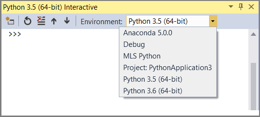
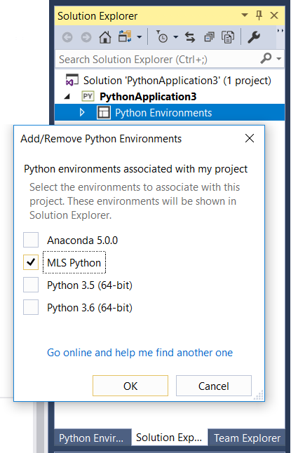

---

# required metadata
title: "Link to Machine Learning Server from Python tools"
description: "Link Python tools like PyCharm, Jupyter notebooks, and Visual Studio to Machine Learning Server Python executable and libraries"
keywords: "Machine Learning Server, python tools"
author: "HeidiSteen"
ms.author: "heidist"
manager: "cgronlun"
ms.date: "03/12/2018"
ms.topic: "conceptual"
ms.prod: "mlserver"

# optional metadata
#ROBOTS: ""
#audience: ""
#ms.devlang: "r"
#ms.reviewer: ""
#ms.suite: ""
#ms.tgt_pltfrm: ""
#ms.custom: ""

---
# Link Python tools and IDEs to the Python interpreter installed with Machine Learning Server

**Applies to: Machine Learning Server 9.x**

Machine Learning Server installs a local, folder-only install of Anaconda to avoid interfering with other Python distributions on your system. As such, packages providing the Python modules in Machine Learning Server (revoscalepy, microsoftml, azureml-model-management-sdk) are not available system-wide. In this article, learn how to load the Python interpreter installed with Machine Learning Server in your Python IDE of choice.

## Prerequisites

Before you begin, have the following ready:

> [!div class="checklist"]
> * An instance of [Machine Learning Server ](../what-is-machine-learning-server.md) installed with the Python option.
> * A Python IDE, such as [Visual Studio 2017 Community Edition](https://www.visualstudio.com/downloads/) with Python.

> [!Tip]
> Need help learning Python? [Here's a video tutorial](https://mva.microsoft.com/en-us/training-courses/introduction-to-programming-with-python-8360?l=lqhuMxFz_8904984382).

## Python.exe (built-in)

To use the Python modules interactively, start the Python executable from the installation path.

On Windows, go to \Program Files\Microsoft\ML Server\PYTHON_SERVER and run Python.exe to open an interactive command-line window.

As a validation step, load the revoscalepy module and run the example code for [rx_summary](../python-reference/revoscalepy/rx-summary.md#example) to print out summary statistics using an embedded sample data set: 

```python
import os
from revoscalepy import rx_summary, RxOptions, RxXdfData
sample_data_path = RxOptions.get_option("sampleDataDir")
ds = RxXdfData(os.path.join(sample_data_path, "AirlineDemoSmall.xdf"))
summary = rx_summary("ArrDelay+DayOfWeek", ds)
print(summary)
```

## Visual Studio 2017 with Python

The setup program for Machine Learning Server 9.3 adds Python distribution information to the registry, which makes loading Python modules more straightforward than in previous releases. 

However, when using an earlier release or to confirm settings, follow these steps to add Machine Learning Server's Python distribution information to an environment. For more information, see [Python environments (Visual Studio docs)](https://docs.microsoft.com/visualstudio/python/managing-python-environments-in-visual-studio).

1. In **Tools** > **Python** > **Python environments**, click **+ Custom** to create a new environment.

2. In **Description**, give the environment name, and then fill in the following fields.

3. In **Prefix path**, enter `C:\Program Files\Microsoft\ML Server\PYTHON_SERVER`. 
 
4. Click **Auto Detect** in the top right to auto-fill the remaining fields:

   + **Interpreter path** should be `C:\Program Files\Microsoft\ML Server\PYTHON_SERVER\python.exe`.
   + **Windowed interpreter** should be `C:\Program Files\Microsoft\ML Server\PYTHON_SERVER\pythonw.exe`.
   + **Language version** should be `3.5` for Python 3.5.
   + **Path** should be read-only. 

5. Click **Apply** in the top right to save the environment.

You can use the environment you just created by selecting it in an interactive window. As a verification step, run the example from the [rx_summary function](../python-reference/revoscalepy/rx-summary.md#example) in revoscalepy.



For new projects, you can also add an environment to your project in **Solution Explorer** > **Python Environments** > **Add/Remove Environments**. 



## Jupyter Notebooks (local)

Jupyter Notebooks is distributed with Anaconda, which is the Python distribution used by Machine Learning Server. A local executable is installed with Machine Learning Server. 

+ On Windows, go to **\Program Files\Microsoft\ML Server\PYTHON_SERVER\Scripts\\** and double-click **jupyter-notebook.exe** to start a Jupyter Notebook session in the default browser window.

+ On Linux, go to **/opt/microsoft/mlserver/9.3.0/runtime/python/bin/** and type `./jupyter notebook`. You should get a series of messages that includes the server endpoint and a URL that you can copy into a browser, assuming one is available on your computer.

For additional instructions on configuring a multi-user server, see [How to add Machine Learning Server modules to single and multi-user Jupyter Notebook instances](how-to-revoscalepy-jupyter-nb-config.md).

> [!Note]
> Jupyter Notebooks are a presentation concept, integrating script and text on the same page. Script is interactive on the page, often Python or R, but could be any one of the 40 languages supported by Jupyter. The text is user-provided content that describes the script. Notebooks are executed on a server, accessed over http, and rendered as HTML in a browser to the person requesting the notebook. For more information, see [Jupyter documentation](https://jupyter.readthedocs.io/en/latest/content-quickstart.html).

### How to load Python samples on Windows

1. Download just the .ipynb files from the Github repo [https://github.com/Microsoft/ML-Server-Python-Samples](https://github.com/Microsoft/ML-Server-Python-Samples):

   + Go to the source page: [ML-Server-Python-Samples/microsoftml/quickstarts/binary-classification/Binary+Classification+Quickstart.ipynb](https://github.com/Microsoft/ML-Server-Python-Samples/blob/master/microsoftml/quickstarts/binary-classification/Binary%2BClassification%2BQuickstart.ipynb)
   + In the Github page for this notebook, click **Raw** to show the Python script.
   + Use the browser save-as command to save a local copy of the file. Apply an **.ipynb** file extension.

   > [!Note]
   > Some browsers append a .txt file extension automatically. Remove the extraneous .txt extension if you see it in the file name.

2. Upload the .ipynb to your local server:

   + Navigate to the Jupyter-notebook executable on your computer: `C:\Program Files\Microsoft\ML Server\PYTHON_SERVER\Scripts`
   + Right-click **Run as administrator** on `jupyter-notebook.exe`
   + The Notebook Dashboard opens in your default browser at `http://localhost:8888/tree`. 
   + Click **Upload** on the top right corner.
   + Navigate to the folder where you saved the .ipynb file. Most likely, it's in the Downloads folder: `\Downloads\ML-Server-Python-Samples-master\microsoftml\quickstarts\binary-classification\Binary+Classification+Quickstart.ipynb`
   + Select the file and click **Open** to add the notebook to your server.

3. Click the notebook to load it, then click **Run** to step through the content and script. For this particular notebook, no additional configuration is required. For the web service notebook, read the readme for configuration requirements.

## PyCharm

In PyCharm, set the interpreter to the Python executable installed by Machine Learning Server.

1. In a new project, in Settings, click **Add Local**.

2. Enter `C:\Program Files\Microsoft\ML Server\PYTHON_SERVER`.

You can now import revoscalepy, microsoftml, or azureml-model-management-sdk modules.

You can also choose **Tools** > **Python Console** to open an interactive window.

## Next steps

Now that you know how to load the Python libraries, you might want to explore them in-depth:

- [revoscalepy Python package functions](../python-reference/revoscalepy/revoscalepy-package.md)
- [microsoftml Python package functions](../python-reference/microsoftml/microsoftml-package.md)
- [azureml-model-management-sdk](../python-reference/azureml-model-management-sdk/azureml-model-management-sdk.md)


## See also

For more about Machine Learning Sever in general, see [Overview of Machine Learning Server](../what-is-machine-learning-server.md) 
