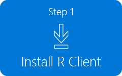
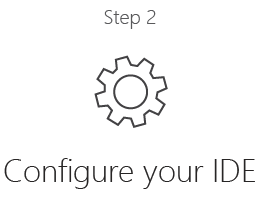
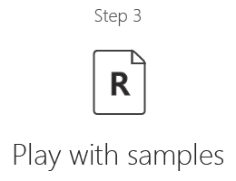

---

# required metadata
title: "Install Microsoft R Client on Windows"
description: "Microsoft R Client Install Guide Windows"
keywords: "R Client, R IDE configuration, RTVS, R Tools for Visual Studio, Microsoft R Client"
author: "j-martens"
manager: "jhubbard"
ms.date: "4/19/2017"
ms.topic: "get-started-article"
ms.prod: "microsoft-r"
ms.service: ""
ms.assetid: ""

# optional metadata
ROBOTS: ""
audience: ""
ms.devlang: ""
ms.reviewer: ""
ms.suite: ""
ms.tgt_pltfrm: ""
ms.technology: "r-client"
ms.custom: ""

---

# Install Microsoft R Client on Windows

Microsoft R Client is a free, data science tool for high performance analytics.  R Client is built on top of Microsoft R Open so you can use any open source R packages to build your analytics. Additionally, R Client introduces the [powerful ScaleR technology](scaler-getting-started.md) and its proprietary functions to benefit from parallelization and remote computing. 

R Client allows you to work with production data locally using the full set of ScaleR functions, but there are some constraints.  On its own, the data to be processed must fit in local memory, and processing is capped at two threads for RevoScaleR functions. 

To benefit from disk scalability, performance and speed, you can push the compute context using rxSetComputeContext() to a production instance of Microsoft R Server such as [SQL Server R Services](https://msdn.microsoft.com/en-us/library/mt604845.aspx) and R Server for Hadoop. [Learn more about its compatibility.](r-client-compatibility.md)

**Getting started with Microsoft R Client is as easy as 1-2-3.**

&nbsp;&nbsp;&nbsp;&nbsp;&nbsp;&nbsp;&nbsp;&nbsp;&nbsp;Click a step to get started:
<br>
<div align=center>
<a href="#installrclient" title="Click Step 1"></a>&nbsp;&nbsp;
<a href="#configure-ide" title="Click Step 2"></a>&nbsp;&nbsp;
<a href="#try-r-client" title="Click Step 3"></a>&nbsp;&nbsp;
</div>

<!--
1. First [download](http://aka.ms/rclient/download) and [install R Client](#installrclient).
1. Then, [configure your favorite R IDE](#configure-ide) to point to the R engine for R Client.
1. And, finally, start running your R scripts in your IDE using the R Client’s engine. 
-->

<br>

**Check out this video introduction to Microsoft R Client.**

<br>

<div align=center><iframe src="https://channel9.msdn.com/blogs/MicrosoftR/Microsoft-Introduces-new-free-Microsoft-R-Client/player" width="600" height="400" allowFullScreen frameBorder="0"></iframe></div>
 
<br><a name="installrclient"></a>

## Step 1: Install Microsoft R Client

[Download Microsoft R Client](http://aka.ms/rclient/download) and install it today. 

**System Requirements:**

&nbsp;&nbsp;&nbsp;&nbsp;Operating Systems: &nbsp;&nbsp;&nbsp;  64-bit versions of **Microsoft Windows 7, 8.1, and 10**<br>
&nbsp;&nbsp;&nbsp;&nbsp;Free disk space: &nbsp;&nbsp;&nbsp;&nbsp;&nbsp;&nbsp;&nbsp;&nbsp; 1.2 GN recommended, after installation of all prerequisites <br>
&nbsp;&nbsp;&nbsp;&nbsp;Available RAM: &nbsp;&nbsp;&nbsp;&nbsp;&nbsp;&nbsp;&nbsp;&nbsp;&nbsp;&nbsp; 4+ GB recommended <br>
&nbsp;&nbsp;&nbsp;&nbsp;Internet access: &nbsp;&nbsp;&nbsp;&nbsp;&nbsp;&nbsp;&nbsp;&nbsp;&nbsp; Needed to download R Client and any dependencies   


   >You must install Microsoft R Client to a local drive on your computer.
   >
   >You may need to disable your antivirus software. If you do, please turn it back on as soon as you are finished.

**Setup Requirements:**

Setup provides a download link. The [.NET Framework 4.5.2](https://www.microsoft.com/download/details.aspx?id=42642) component is required before setup can continue. Installing this component requires a computer restart.

**How to Install (with Internet Access):**

1. Log in to the machine with administrator privileges.

1. [Download Microsoft R Client](http://aka.ms/rclient/download).

1. Close any other programs running on the system.

1. Run the Microsoft R Client setup and follow the prompts:

    + Accept the default installation path for Microsoft R Client or choose another location.

    + Review the components that will be installed as part of Microsoft R Client. While most are required, you can choose to add additional components such as pretrained models. 

    + Accept the Microsoft R Client license terms.

    + Accept the Microsoft R Open license term. Microsoft R Client is built on [Microsoft R Open](r-open.md), Microsoft's enhanced distribution of R. Setup installs it for you automatically.

    + Optionally, install [R Tools for Visual Studio](https://msdn.microsoft.com/en-us/library/mt721271.aspx#Anchor_1), an integrated development environment available as a free add-in for any edition of Visual Studio 2015. This option is only available if the supported version of Visual Studio is already installed.  If you've selected to install it as well, accept the terms for R Tools for Visual Studio.


    + Click **Finish** when installation is finished. A welcome screen opens to introduce you to the product and documentation.

**How to Install (without Internet Access):**

1. On a machine with _**unrestricted**_ internet access:

   + Download Microsoft R Client from the following link: http://aka.ms/rclient/download

   + Download the Microsoft R Open ( *.cab) needed to install R Client from the following link: https://go.microsoft.com/fwlink/?LinkId=834568&clcid=1033

   + Download the prerequisites, including the .NET Framework and other components previously listed.

   + Copy the .cab file, component executables, and R Client installer to a network share or portable drive.

1. On the machine with _**restricted**_ internet access:

   + Log in with administrator privileges.

   + Copy the .cab file, component executables, and R Client installer from the network share/portable drive on the first machine to the machine that has restricted internet access. Put those files under `%temp%`. 

   + Install the prerequisites first. 
   
   + Restart your computer is you installed the .NET Framework.

   + Run `RClientSetup.exe`, which then finds the cab file in the temp folder.
   
   + Follow the onscreen prompts.

1. Without internet access, we recommend disabling the _auto-update check_ feature so that R Client can launch more quickly. Do so in the `Rprofile.site` file by adding a comment character (#) at the start of the line: `mrupdate::mrCheckForUpdates()`
 
**What's Installed with R Client**<br>

The Microsoft R Client setup installs the R base packages and a set of enhanced and proprietary R packages that support parallel processing, improved performance, and connectivity to data sources including SQL Server and Hadoop. The R libraries are installed under the R Client installation directory, `C:\Program Files\Microsoft\R Client\R_SERVER`. Additionally, in this directory you will find documentation for the R base packages, sample data, and the R library.

All of tools for the standard base R (RTerm, Rgui.exe, and RScript) are also included with Microsoft R Client under `<install-directory>\bin`. Documentation for these tools can be found in the setup folder: `<install-directory>\doc` and in `<install-directory>\doc\manual`. One easy way to open these files is to open `RGui`, click **Help**, and select one of the options.


<br>
<br>

> [!NOTE]
> By default, telemetry data is collected during your usage of R Client. To turn this feature off, use the RevoScaleR package function `rxPrivacyControl(FALSE)`. To turn it back on, change the setting to `TRUE`.

<a name="configure-ide"></a>

## Step 2: Configure Your IDE

After you've [installed R Client](#installrclient), the next step is to configure your favorite R integrated development environment (IDE) to point to the R Client R executable. This way, whenever you execute your R code, you'll do so using R Client and benefit from the proprietary packages installed with R Client.  R IDE options include [R Tools for Visual Studio](https://msdn.microsoft.com/en-us/library/mt721271.aspx#Anchor_1) (Recommended), RStudio, or any other R development environment.<br>

#### Set Up RTVS for R Client

[R Tools for Visual Studio](https://msdn.microsoft.com/en-us/library/mt721271.aspx#Anchor_1) (RTVS) is an integrated development environment available as a free add-in for any edition of Visual Studio.  

  >If you don't have RTVS installed yet, [follow these steps](https://msdn.microsoft.com/en-us/library/mt721271.aspx#Anchor_1). RTVS is only available if the supported version of Visual Studio is already installed.

  1. Launch RTVS.
  1. From the **R Tools** menu, choose **Change R to Microsoft R Client**.
  1. When you launch RTVS, R Client is now the default R engine.

<br> 

#### Set Up RStudio for R Client

  >If you don't have RStudio installed yet, [get it here](https://www.rstudio.com/products/rstudio/download2/).

  1. Launch RStudio.
  1. [Update the path to R](https://support.rstudio.com/hc/en-us/articles/200486138-Using-Different-Versions-of-R).
     1. From the **Tools** menu, choose **Global Options**.
     1. In the  **General** tab, update the path to R to point to `C:\Program Files\Microsoft\R Client\R_SERVER\bin\x64`.
  1. When you launch RStudio, R Client is now the default R engine.
   
<br><a name="try-r-client"></a>

## Step 3: Try Out R Client

Now that you've installed R Client and set up your IDE to use R Client, you can start building and running your R code. Launch your IDE now and you'll see that Microsoft R Client is running in the console window. 

### Try Your Own
Start developing your own solutions using the [`RevoScaleR` package functions](https://msdn.microsoft.com/en-us/microsoft-r/scaler/scaler) and APIs. When ready, you can run that R code using R Client in your IDE or even send those R commands to a remote R Server for execution. 

### Try Our Flight Data Tutorial

In this example, we use historical on-time performance and weather data to predict whether the arrival of a scheduled passenger flight will be delayed by more than 15 minutes.  We approach this problem as a classification problem, predicting two classes -- whether the flight will be delayed, or whether it will be on time.

Broadly speaking, in machine learning and statistics, classification
is the task of identifying the class or category to which a 
new observation belongs, on the basis of a training set of data
containing observations with known categories. 
Classification is generally a supervised learning problem. 
Since this is a binary classification task, there are only two classes.

In this example, we train a model using a large number of examples 
from historic flight data, along with an outcome measure that 
indicates the appropriate category or class for each example. 
The two classes are labeled 1 if a flight was delayed, and labeled 0 
if the flight was on time.

The following scripts include five basic steps of building 
this example using Microsoft R Client.
This execution might require several minutes.

#### Step 1: Get Started

1. Launch your R IDE.

1. To verify that Microsoft R Client is installed, check for the proprietary package, `RevoScaleR`, in the R Console of your R IDE.  This package is installed with R Client.
   ```
   if (!require("RevoScaleR")) {
     cat("RevoScaleR package does not seem to exist. 
         \nThis means that the functions starting with 'rx' cannot run. 
         \nIf you have Microsoft R Client installed, please switch the R engine.
         \nFor example, in R Tools for Visual Studio: 
         \nR Tools -> Options -> R Engine. 
         \nIf missing, download R Client from http://aka.ms/rclient/download. 
         \n")
     quit()
   }
   ```

1. Initialize some variables to specify the data sets.
   ```
   github <- "https://raw.githubusercontent.com/brohrer-ms/RTVS-docs/master/examples/MRS_and_Machine_Learning/Datasets/"
   inputFileFlightURL <- paste0(github, "Flight_Delays_Sample.csv")
   inputFileWeatherURL <- paste0(github, "Weather_Sample.csv")
   ```

1. Create a temporary directory to store the intermediate XDF files. The External Data Frame (XDF) file format is a high-performance, binary file format for storing big data sets for use with RevoScaleR. This file format has an R interface and optimizes rows and columns for faster processing and analysis.  <a href="https://msdn.microsoft.com/en-us/microsoft-r/scaler-user-guide-introduction">Learn more…</a>
   ```
   td <- tempdir()
   outFileFlight <- paste0(td, "/flight.xdf")
   outFileWeather <- paste0(td, "/weather.xdf")
   outFileOrigin <- paste0(td, "/originData.xdf")
   outFileDest <- paste0(td, "/destData.xdf")
   outFileFinal <- paste0(td, "/finalData.xdf")
   ```

#### Step 2: Import Data

1. Import the flight data.
    ```
    flight_mrs <- rxImport(
      inData = inputFileFlightURL, outFile = outFileFlight,
      missingValueString = "M", stringsAsFactors = FALSE,
      # Remove columns that are possible target leakers from the flight data.
      varsToDrop = c("DepDelay", "DepDel15", "ArrDelay", "Cancelled", "Year"),
      # Define "Carrier" as categorical.
      colInfo = list(Carrier = list(type = "factor")),
      # Round down scheduled departure time to full hour.
      transforms = list(CRSDepTime = floor(CRSDepTime/100)),  
      overwrite = TRUE
    )
    ```

1. Review the first 6 rows of flight data.
    ```
    head(flight_mrs)
    ```

1. Summarize the flight data.
    ```
    rxSummary(~., data = flight_mrs, blocksPerRead = 2)
    ```

1. Import the weather data.
    ```
    xform <- function(dataList) {
      # Create a function to normalize some numerical features.
      featureNames <- c(
        "Visibility", 
        "DryBulbCelsius", 
        "DewPointCelsius", 
        "RelativeHumidity", 
        "WindSpeed", 
        "Altimeter"
      )
      dataList[featureNames] <- lapply(dataList[featureNames], scale)
      return(dataList)
    }

    weather_mrs <- rxImport(
      inData = inputFileWeatherURL, outFile = outFileWeather,
      missingValueString = "M", stringsAsFactors = FALSE,
      # Eliminate some features due to redundance.
      varsToDrop = c("Year", "Timezone", 
                     "DryBulbFarenheit", "DewPointFarenheit"),
      # Create a new column "DestAirportID" in weather data.
      transforms = list(DestAirportID = AirportID),
      # Apply the normalization function.
      transformFunc = xform,  
      transformVars = c(
        "Visibility", 
        "DryBulbCelsius", 
        "DewPointCelsius", 
        "RelativeHumidity", 
        "WindSpeed", 
        "Altimeter"
      ),
      overwrite = TRUE
    )
    ```
1. Review the variable information for the weather data.
    ```
    rxGetVarInfo(weather_mrs)
    ```

#### Step 3: Pre-process Data

1. Rename some column names in the weather data to prepare it for merging.
    ```
    newVarInfo <- list(
      AdjustedMonth = list(newName = "Month"),
      AdjustedDay = list(newName = "DayofMonth"),
      AirportID = list(newName = "OriginAirportID"),
      AdjustedHour = list(newName = "CRSDepTime")
    )
    rxSetVarInfo(varInfo = newVarInfo, data = weather_mrs)
    ```

1. Concatenate/Merge flight records and weather data.
   1. Join flight records and weather data at origin of the flight `OriginAirportID`.
      ```
      originData_mrs <- rxMerge(
        inData1 = flight_mrs, inData2 = weather_mrs, outFile = outFileOrigin,
        type = "inner", autoSort = TRUE, 
        matchVars = c("Month", "DayofMonth", "OriginAirportID", "CRSDepTime"),
        varsToDrop2 = "DestAirportID",
        overwrite = TRUE
      )
      ```                

   1. Join flight records and weather data using the destination of the flight `DestAirportID`.
      ```
      destData_mrs <- rxMerge(
        inData1 = originData_mrs, inData2 = weather_mrs, outFile = outFileDest,
        type = "inner", autoSort = TRUE, 
        matchVars = c("Month", "DayofMonth", "DestAirportID", "CRSDepTime"),
        varsToDrop2 = c("OriginAirportID"),
        duplicateVarExt = c("Origin", "Destination"),
        overwrite = TRUE
      )
      ```

   1. Call `rxFactors()` function to convert `OriginAirportID` and `DestAirportID` as categorical.
      ```
      rxFactors(inData = destData_mrs, outFile = outFileFinal, sortLevels = TRUE,
                factorInfo = c("OriginAirportID", "DestAirportID"),
                overwrite = TRUE)
      ```

#### Step 4: Prepare Training and Test Datasets

1. Randomly split data (80% for training, 20% for testing).
   ```
   rxSplit(inData = outFileFinal,
           outFilesBase = paste0(td, "/modelData"),
           outFileSuffixes = c("Train", "Test"),
           splitByFactor = "splitVar",
           overwrite = TRUE,
           transforms = list(
             splitVar = factor(sample(c("Train", "Test"),
                                       size = .rxNumRows,
                                       replace = TRUE,
                                       prob = c(.80, .20)),
                                levels = c("Train", "Test"))),
            rngSeed = 17,
            consoleOutput = TRUE)
   ```

1. Point to the XDF files for each set.
   ```
   train <- RxXdfData(paste0(td, "/modelData.splitVar.Train.xdf"))
   test <- RxXdfData(paste0(td, "/modelData.splitVar.Test.xdf"))
   ```

#### Step 5: Predict using Logistic Regression

1. Choose and apply the Logistic Regression learning algorithm.
   ```
   # Build the formula.
   modelFormula <- formula(train, depVars = "ArrDel15",
                           varsToDrop = c("RowNum", "splitVar"))

   # Fit a Logistic Regression model.
   logitModel_mrs <- rxLogit(modelFormula, data = train)

   # Review the model results.
   summary(logitModel_mrs)
   ```

1. Predict using new data.
    ```
    # Predict the probability on the test dataset.
    rxPredict(logitModel_mrs, data = test,
              type = "response",
              predVarNames = "ArrDel15_Pred_Logit",
              overwrite = TRUE)

    # Calculate Area Under the Curve (AUC).
    paste0("AUC of Logistic Regression Model:",
           rxAuc(rxRoc("ArrDel15", "ArrDel15_Pred_Logit", test)))

    # Plot the ROC curve.
    rxRocCurve("ArrDel15", "ArrDel15_Pred_Logit", data = test,
               title = "ROC curve - Logistic regression")
    ```

#### Step 6: Predict using Decision Tree
1. Choose and apply the Decision Tree learning algorithm.
    ```
    # Build a decision tree model.
    dTree1_mrs <- rxDTree(modelFormula, data = train, reportProgress = 1)

    # Find the Best Value of cp for Pruning rxDTree Object.
    treeCp_mrs <- rxDTreeBestCp(dTree1_mrs)

    # Prune a decision tree created by rxDTree and return the smaller tree.
    dTree2_mrs <- prune.rxDTree(dTree1_mrs, cp = treeCp_mrs)
    ```

1. Predict using new data.
    ```
    # Predict the probability on the test dataset.
    rxPredict(dTree2_mrs, data = test,
              predVarNames = "ArrDel15_Pred_Tree",
              overwrite = TRUE)

    # Calculate Area Under the Curve (AUC).
    paste0("AUC of Decision Tree Model:",
           rxAuc(rxRoc(" ArrDel15 ", " ArrDel15_Pred_Tree ", test)))

    # Plot the ROC curve.
    rxRocCurve("ArrDel15",
               predVarNames = c("ArrDel15_Pred_Tree", "ArrDel15_Pred_Logit"),
               data = test,
               title = "ROC curve - Logistic regression")
    ```

<br>

## Learn More

You can learn more with these guides:

+ [Microsoft R Getting Started](microsoft-r-getting-started.md) 

+ [Diving into Data Analysis with Microsoft R](data-analysis-in-microsoft-r.md)

+ [RevoScaleR Getting Started](scaler-getting-started.md)
