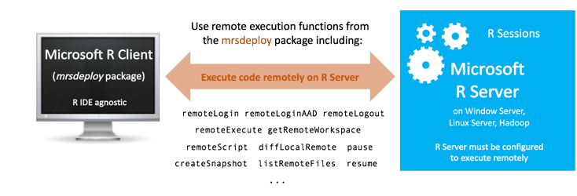

---

# required metadata
title: "Remote Execution with mrsdeploy - Machine Learning Server "
description: "Execute on a remote server using the mrsdeploy package on Machine Learning Server"
keywords: ""
author: "j-martens"
ms.author: "jmartens"
manager: "jhubbard"
ms.date: "2/16/2018"
ms.topic: "article"
ms.prod: "mlserver"

# optional metadata
#ROBOTS: ""
#audience: ""
#ms.devlang: ""
#ms.reviewer: ""
#ms.suite: ""
#ms.tgt_pltfrm: ""
#ms.technology: ""
#ms.custom: ""
---

# Execute on a remote server using the mrsdeploy package

**Applies to:  Machine Learning Server, Microsoft R Server 9.x, Microsoft R Client 3.x**

Remote execution is the ability to issue R commands from either Machine Learning Server (or R Server) or R Client to a remote session running on another Machine Learning Server instance. You can use remote execution to offload heavy processing on server and test your work.  It is especially useful while developing and testing your analytics.

Remote execution is supported in several ways:
+ From the command line in console applications
+ In R scripts that call [functions from the mrsdeploy package](../r-reference/mrsdeploy/mrsdeploy-package.md)
+ From code that calls the APIs. 

You can enter 'R' code just as you would in a local R console. R code entered at the remote command line executes on the remote server.

With remote execution, you can:
 + [Log in and out of Machine Learning Server](../operationalize/how-to-connect-log-in-with-mrsdeploy.md)
 + [Generate diff reports of the local and remote environments](#diff) and reconcile any differences    
 + [Execute R scripts and code remotely](#run)    
 + [Work with R objects/files remotely](#objects)    
 + [Create and manage snapshots of the remote environment for reuse](#snapshot)    

 

## Supported configurations and mrsdeploy usage

The R functions used for remote execution are provided in the mrsdeploy package, which is  installed with Machine Learning Server on almost every platform. Your administrator must [configure the server for the deployment and consumption of analytics](../operationalize/configure-start-for-administrators.md#configure-server-for-operationalization)** before you can use the functions in the package.  Read the article ["`mrsdeploy` functions"](../r-reference/mrsdeploy/mrsdeploy-package.md) for the list of [remote execution functions](../r-reference/mrsdeploy/mrsdeploy-package.md#remote-functions) in that package. 

 


## How to create a remote session

To create a remote session, you must first authenticate with Machine Learning Server using one of the mrsdeploy login functions:  remoteLogin() and remoteLoginAAD(). With these functions, you can authenticate, set the arguments to create a remote R session on the Machine Learning Server (`session = TRUE`) and even place yourself in the remote command line upon login `commandline = TRUE`. 

Read the article ["Connecting to Machine Learning Server with mrsdeploy"](../operationalize/how-to-connect-log-in-with-mrsdeploy.md) for more on authentication with `mrsdeploy` and syntax. 

<a name="switch"></a>

## How to switch between sessions or logout

After you [log in to the remote R server](../operationalize/how-to-connect-log-in-with-mrsdeploy.md)  with the argument `session = TRUE`, a remote R session is created. You can switch between the remote R session and the local R session directly from the command line.  The remote command line allows you to directly interact with an R Server 9.x instance on another machine. 

When the `REMOTE>` command line is displayed in the R console, any R commands entered are executed on the remote R session. 


Switching between the local command line and the remote command line is done using these functions: pause() and resume(). To switch back to the local R session, type 'pause()'. If you have switched to the local R session, you can go back to the remote R session by typing 'resume()'.

To terminate the remote R session, type 'exit' at the `REMOTE>` prompt.  Also, to terminate the remote session from the local R session, type 'remoteLogout()'.

|Convenience Functions|Description|
|---|---|
|pause()|When executed from the remote R session, returns the user to the local `> ` command prompt.|
|resume()|When executed from the local R session, returns the user to the `REMOTE>` command prompt, and sets a remote execution context.|

```R
#EXAMPLE: SESSION SWITCHING 

#execute some R commands on the remote session
REMOTE>x<-rnorm(1000)
REMOTE>hist(x)

REMOTE>pause()  #switches the user to the local R session
>resume()  

REMOTE>exit  #logout and terminate the remote R session
> 
```


<a name="diff"></a>

## Create a diff report
A `diff` report is available so you can see and manage differences between the local and remote R environments.
The diff report contains details on:
+ The R versions running on the server and locally
+ The R packages installed locally, but not on the remote session
+ The differences between R package versions. 

This report appears whenever you log in, and you can also get the report using the diffLocalRemote() function.

<a name="run"></a>

## Execute an R script remotely

If you have R scripts on your local machine, you can execute them remotely by using the function remoteScript().
This function takes a path to an R script to be executed remotely. You also have options to save or display any plots that might have been generated during script execution. The function returns a list containing the status of the execution (success/failure), the console output generated, and a list of files created.

>[!NOTE]
>If you need more granular control of a remote execution scenario, use the remoteExecute() function.

### Package dependencies
If your R script has R package dependencies, those packages must be installed on the Microsoft R Server. Your administrator can install them globally on the server or you can install them yourself for the duration of your remote session using the install.packages() function. Leave the `lib` parameter empty.

### Limitations in a remote context

Certain functions are masked from execution, such as 'help', 'browser', 'q' and 'quit'.   

In a remote context, you cannot display vignettes or get help at your command line prompt.  

In most cases, “system” commands work.  However, system commands that write to stdout/stderr may not display their output nor wait until the entire system command has completed before displaying output.   `install.packages` is the only exception for which we explicitly handle stdout and stderr in a remote context. 

<a name="async"></a>

### Asynchronous remote execution

To continue working in your development environment during the remote script execution, you can execute your R script asynchronously. Asynchronous script execution is useful when you are running scripts that have long execution times. 

To execute an R script asynchronously, set the async parameter for remoteScript() to TRUE. When remoteScript() is executed, the script is run asynchronously in a new remote R console window. All R console output and any plots from that execution are returned to the same window.

>[!WARNING]
>**R Server 9.0 users!** When loading a library for the REMOTE session, set lib.loc=getwd() as such: 
`library("<packagename>", lib.loc=getwd())`

**Example**

```R
#EXAMPLE: REMOTE SCRIPT EXECUTION 

#install a package for the life of the session
REMOTE>install.packages("bitops")

#switch to the local R session
REMOTE>pause()

#execute an R script remotely
>remoteScript("C:/myScript.R")    

#execute that script again in another window asynchronously
>remoteScript("C:/myScript.R", async=TRUE)  
```

<a name="objects"></a>

## Work with R objects and files remotely

After you have executed an R code remotely, you may want to retrieve certain R objects and load them into your local R session. For example, if you have an R script that creates a linear model `m<-lm(x~y)`, use the function getRemoteObject() to retrieve the object `m` in your local R session.

Conversely, if you have a local R object that you want to make available to your remote R session, you can use the function putLocalObject(). If you want to sync your local and remote workspaces, the functions putLocalWorkspace() and getRemoteWorkspace() can be used.

Similar capabilities are available for files that need to be moved between the local and remote R sessions.

The following functions are available for working with files:  putLocalFile(), getRemoteFile(), listRemoteFiles() and deleteRemoteFile().


```R
#EXAMPLE: REMOTE R OBJECTS AND FILES 

#execute a script remotely that generated 2 R objects we are interested in retrieving
>remoteExecute("C:/myScript.R")
#retrieve the R objects from the remote R session and load them into our local R session
>getRemoteObject(c("model","out"))

#an R script depends upon an R object named `data` to be available. Move the local
#instance of `data` to the remote R session
>putLocalObject("data")
#execute an R script remotely
>remoteScript("C:/myScript2.R")

#push a data file to the remote R session
>putLocalFile("C:/data/survey.csv")
#execute an R script remotely
>remoteScript("C:/myScript2.R")
```

## A word on plots

When you plot remotely, the default plot size is 400 x 400 pixels. If you desire higher-resolution output, you must tell the remote session the size of plot to create. 

On a local session, you might change the width and height as follows:

```R
> png(filename="myplot.png", width=1440, height=900)
> ggplot(aes(x=value, group=am, colour=factor(am)), data=mtcarsmelt) + geom_density() + facet_wrap(~variable, scales="free")
> dev.off()
```

When working on the REMOTE command line, you need to combine these three statements together:

```R
REMOTE> png(filename="myplot.png", width=1440, height=900);ggplot(aes(x=value, group=am, colour=factor(am)), data=mtcarsmelt) + geom_density() + facet_wrap(~variable, scales="free");dev.off()
```

As an alternative, you can use the remoteScript() function as follows:

```R
#Open a new script window in your IDE
#Enter the commands on separate lines

png(filename="myplot.png", width=1440, height=900)
ggplot(aes(x=value, group=am, colour=factor(am)), data=mtcarsmelt) + geom_density() + facet_wrap(~variable, scales="free")
dev.off()
```

```R
#Save the script to a file such as myscript.R 
#Switch from the remote session to the local session by typing pause() on the REMOTE command line
REMOTE> pause()
>
```

```R
#From the local command prompt, execute your remote script
> remoteScript("myscript.R")
```

<a name="snapshot"></a>

## R session snapshots

Session snapshot functions are useful for remote execution scenarios. It can save the whole workspace and working directory so that you can pick up from exactly where you left last time. Think of it as similar to saving and loading a game.

### What's in a session snapshot 
If you need a prepared environment for remote script execution that includes R packages, R objects, or  data files, consider creating a **snapshot**. A snapshot is an image of a remote R session saved to Microsoft R Server, which includes:

+ The session's workspace along with the installed R packages
+ Any files and artifacts in the working directory

A session snapshot can be loaded into any subsequent remote R session for the user who created it. For example, suppose you want to execute a script that needs three R packages, a reference data file, and a model object.  Instead of loading the data file and object each time you want to execute the script, create a session snapshot of an R session containing them. Then, you can save time later by retrieving this snapshot using its ID to get the session contents exactly as they were at the time the snapshot was created. However, any necessary packages must be reloaded as described in the next section.

Snapshots are only accessible to the user who creates them and cannot be shared across users.

The following functions are available for working with snapshots:  
listSnapshots(), createSnapshot(), loadSnapshot(), downloadSnapshot(), and deleteSnapshot().

### Snapshot guidance and warnings

Take note of the following tips and recommendations around using session snapshots:
+ One caveat is that while the workspace is saved inside the session snapshot, it does not save loaded packages.  If your code depends on certain R packages, use the require() function to include those packages directly in the R code that is part of the web service. The require() function loads packages from within other functions. For example, you can write the following code to load the RevoScaleR package:
 
  ```R 
  delayPrediction <- function(depTime, dayOfWeek) {
    require(RevoScaleR)
    test <- data.frame(CRSDepTime=depTime, DayOfWeek=factor(dayOfWeek, levels = c("Monday", "Tuesday", "Wednesday", "Thursday", "Friday", "Saturday", "Sunday")))
    rxPredict(modelObject = modelInfo$predictiveModel, data = test, outData = test, verbose = 1, type = "response")
  }
  ```

+ While you can use snapshots when publishing a web service for environment dependencies, it can have an impact on performance at consumption time.  For optimal performance, consider the size of the snapshot carefully especially when publishing a service. Before creating a snapshot, ensure that you keep only those workspace objects you need and purge the rest.  And, if you only need a single object, consider passing that object alone itself instead of using a snapshot.

+ **R Server 9.0 users** When loading a library for the REMOTE session, set lib.loc=getwd() as such: 
`library("<packagename>", lib.loc=getwd())`

### Example of snapshot usage

```R
#EXAMPLE: USING SNAPSHOTS

#configure our remote session
REMOTE>install.packages(c("arules","bitops","caTools"))
>putLocalFile("C:/data/survey_reference.csv")
>putLocalObject("model")
>snapshot_id<-<-createSnapshot("my modeling environment")

#whenever I need the modeling environment, reload the snapshot
>loadSnapshot(snapshot_id)  
#execute an R script remotely
>remoteScript("C:/myScript2.R")
```

<a name="publish-remote-session"></a>

## Publishing web services in a remote session

After you understand the mechanics of remote execution, consider incorporating web service capabilities. You can publish an R web service composed of arbitrary R code block that runs on the remote R Server. For more information on publishing services, begin with the [Working with web services in R](../operationalize/how-to-deploy-web-service-publish-manage-in-r.md#publishService)  guide. 

To publish a web service after you create a remote session (argument `session = TRUE` with remoteLogin() or remoteLoginAAD()), you have two approaches:

+ Publish from your local session:  At the `REMOTE>` prompt, use pause() to return the R command line in your local session. Then, publish your service. Use resume() from your local prompt to return to the command line in the remote R session.

+ Authenticate again from within the remote session to enable connections from that remote session to the web node API. At the `REMOTE>` prompt, authenticate with remoteLogin() or remoteLoginAAD(). However, explicitly set the argument `session = FALSE` this time so that a second remote session is NOT created **and** provide your username and password directly in the function. When attempting to log in from a remote session, you are not prompted for user credentials. Instead, pass valid values for `username` and `password` to this function. Then, you are authenticated and able to publish from the `REMOTE>` prompt.

>[!WARNING]
>If you try to publish a web service from the remote R session without authenticating from that session, you get a message such as `Error in curl::curl_fetch_memory(uri, handle = h) : URL using bad/illegal format or missing URL`.  

Learn more about authenticating with remoteLogin() or remoteLoginAAD() in this article "[Logging in to R Server with mrsdeploy](../operationalize/how-to-connect-log-in-with-mrsdeploy.md)."

```R
> ## AAD AUTHENTICATION TO PUBLISH FROM REMOTE SESSION ##

> remoteLoginAAD(
       "https://rserver.contoso.com:12800", 
       authuri = "https://login.windows.net", 
       tenantid = "microsoft.com", 
       clientid = "00000000-0000-0000-0000-000000000000", 
       resource = "00000000-0000-0000-0000-000000000000", 
       session = TRUE 
)

Your REMOTE R session is now active.
Commands: 
        - pause() to switch to local session & leave remote session on hold.
        - resume() to return to remote session.
        - exit to leave (and terminate) remote session.

REMOTE> remoteLoginAAD(
       "https://rserver.contoso.com:12800", 
       authuri = "https://login.windows.net", 
       tenantid = "microsoft.com", 
       clientid = "00000000-0000-0000-0000-000000000000", 
       resource = "00000000-0000-0000-0000-000000000000", 
       session = FALSE
       username = “{{YOUR_USERNAME}}”
       password = “{{YOUR_PASSWORD}}” 
)

REMOTE>api <- publishService(
     serviceName,
     code = manualTransmission,
     model = carsModel,
     inputs = list(hp = "numeric", wt = "numeric"),
     outputs = list(answer = "numeric"),
     v = "v1.0.0"
)
```


## See also

+ [mrsdeploy function overview](../r-reference/mrsdeploy/mrsdeploy-package.md)
+ [Connecting to R Server from mrsdeploy](../operationalize/how-to-connect-log-in-with-mrsdeploy.md)
+ [Get started guide for Data scientists](../what-is-operationalization.md)
+ [Working with web services in R](../operationalize/how-to-deploy-web-service-publish-manage-in-r.md)