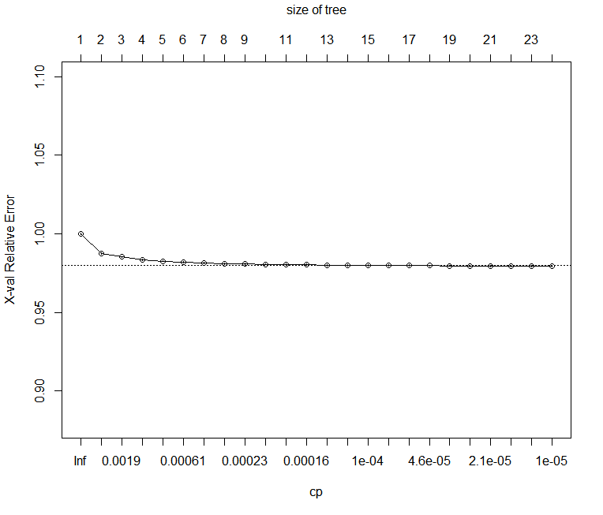
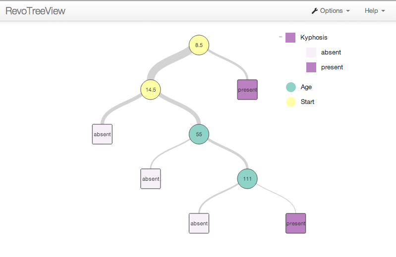

---

# required metadata
title: "Estimate Decision Tree Models using RevoScaleR (Machine Learning Server) "
description: "Decision Trees with RevoScaleR in Machine Learning Server."
keywords: ""
author: "HeidiSteen"
ms.author: "heidist"
manager: "jhubbard"
ms.date: "03/17/2016"
ms.topic: "get-started-article"
ms.prod: "microsoft-r"

# optional metadata
#ROBOTS: ""
#audience: ""
#ms.devlang: ""
#ms.reviewer: ""
#ms.suite: ""
#ms.tgt_pltfrm: ""
ms.technology: "r-server"
#ms.custom: ""

---

# Estimating Decision Tree Models

The *rxDTree* function in RevoScaleR fits tree-based models using a binning-based recursive partitioning algorithm. The resulting model is similar to that produced by the recommended R package *rpart*. Both classification-type trees and regression-type trees are supported; as with *rpart*, the difference is determined by the nature of the response variable: a factor response generates a classification tree; a numeric response generates a regression tree.

### The rxDTree Algorithm

Decision trees are effective algorithms widely used for classification and regression. Building a decision tree generally requires that all continuous variables be sorted in order to decide where to split the data. This sorting step becomes time and memory prohibitive when dealing with large data. Various techniques have been proposed to overcome the sorting obstacle, which can be roughly classified into two groups: performing data pre-sorting or using approximate summary statistic of the data. While pre-sorting techniques follow standard decision tree algorithms more closely, they cannot accommodate very large data sets. These big data decision trees are normally parallelized in various ways to enable large scale learning: data parallelism partitions the data either horizontally or vertically so that different processors see different observations or variables and task parallelism builds different tree nodes on different processors.

The *rxDTree* algorithm is an approximate decision tree algorithm with horizontal data parallelism, especially designed for handling very large data sets. It uses histograms as the approximate compact representation of the data and builds the decision tree in a breadth-first fashion. The algorithm can be executed in parallel settings such as a multicore machine or a distributed environment with a master-worker architecture. Each worker gets only a subset of the observations of the data, but has a view of the complete tree built so far. It builds a histogram from the observations it sees, which essentially compresses the data to a fixed amount of memory. This approximate description of the data is then sent to a master with constant low communication complexity independent of the size of the data set. The master integrates the information received from each of the workers and determines which terminal tree nodes to split and how. Since the histogram is built in parallel, it can be quickly constructed even for extremely large data sets.

With *rxDTree*, you can control the balance between time complexity and prediction accuracy by specifying the maximum number of bins for the histogram. The algorithm builds the histogram with roughly equal number of observations in each bin and takes the boundaries of the bins as the candidate splits for the terminal tree nodes. Since only a limited number of split locations are examined, it is possible that a suboptimal split point is chosen causing the entire tree to be different from the one constructed by a standard algorithm. However, it has been shown analytically that the error rate of the parallel tree approaches the error rate of the serial tree, even though the trees are not identical. You can set the number of bins in the histograms to control the tradeoff between accuracy and speed: a large number of bins allows a more accurate description of the data and thus more accurate results, whereas a small number of bins reduces time complexity and memory usage.

When integer predictors for which the number of bins equals or exceeds the number of observations, the rxDTree algorithm produces the same results as the standard sorting algorithms.

### A Simple Classification Tree

In a [previous article](how-to-revoscaler-logistic-regression.md), we fit a simple logistic regression model to rpart’s kyphosis data. That model is easily recast as a classification tree using *rxDTree* as follows:
		  
	data("kyphosis", package="rpart")
	kyphTree <- rxDTree(Kyphosis ~ Age + Start + Number, data = kyphosis, 
		cp=0.01)
	kyphTree
	
	  Call: 
	  rxDTree(formula = Kyphosis ~ Age + Start + Number, data = kyphosis, 
	      cp = 0.01)
	  Data:  kyphosis 
	  Number of valid observations:  81 
	  Number of missing observations:  0 
	  
	  Tree representation: 
	  n= 81 
	  
	  node), split, n, loss, yval, (yprob)
	        * denotes terminal node
	  
	   1) root 81 17 absent (0.79012346 0.20987654)  
	     2) Start>=8.5 62  6 absent (0.90322581 0.09677419)  
	       4) Start>=14.5 29  0 absent (1.00000000 0.00000000) *
	       5) Start< 14.5 33  6 absent (0.81818182 0.18181818)  
	        10) Age< 55 12  0 absent (1.00000000 0.00000000) *
	        11) Age>=55 21  6 absent (0.71428571 0.28571429)  
	          22) Age>=111 14  2 absent (0.85714286 0.14285714) *
	          23) Age< 111 7  3 present (0.42857143 0.57142857) *
	     3) Start< 8.5 19  8 present (0.42105263 0.57894737) *

Recall our conclusions from fitting this model earlier with rxCube: the probability of the post-operative complication Kyphosis seems to be greater if the Start is a cervical vertebra and as more vertebrae are involved in the surgery. Similarly, it appears that the dependence on age is non-linear: it first increases with age, peaks in the range 5-9, and then decreases again.

The rxDTree model seems to confirm these earlier conclusions—for Start \< 8.5, 11 of 19 observed subjects developed Kyphosis, while none of the 29 subjects with Start \>= 14.5 did. For the remaining 33 subjects, Age was the primary splitting factor, and as we observed earlier, ages 5 to 9 had the highest probability of developing Kyphosis.

The returned object *kyphTree* is an object of class *rxDTree*. The *rxDTree* class is modeled closely on the *rpart* class, so that objects of class *rxDTree* have most essential components of an *rpart* object: frame, cptable, splits, etc. By default, however, *rxDTree* objects do not inherit from class *rpart*. You can, however, use the *rxAddInheritance* function to add *rpart* inheritance to *rxDTree* objects.

### A Simple Regression Tree

As a simple example of a regression tree, consider the *mtcars* data set and let’s fit gas mileage (*mpg*) using displacement (*disp*) as a predictor:

	#  A Simple Regression Tree
	  
	mtcarTree <- rxDTree(mpg ~ disp, data=mtcars)
	mtcarTree

	  Call: 
	  rxDTree(formula = mpg ~ disp, data = mtcars)
	  Data:  mtcars 
	  Number of valid observations:  32 
	  Number of missing observations:  0 
	  
	  Tree representation: 
	  n= 32 
	  
	  node), split, n, deviance, yval
			* denotes terminal node
	  
	  1) root 32 1126.0470 20.09063  
		2) disp>=163.5 18  143.5894 15.99444 *
		3) disp< 163.5 14  292.1343 25.35714 *
	  
There’s a clear split between larger cars (those with engine displacement greater than 163.5 cubic inches) and smaller cars.

### A Larger Regression Tree Model

As a more complex example, we return to the censusWorkers data. We create a regression tree predicting wage income from age, sex, and weeks worked, using the perwt variable as probability weights:

	#  A Larger Regression Tree Model
	  
	censusWorkers <- file.path(rxGetOption("sampleDataDir"),
		"CensusWorkers.xdf")
	rxGetInfo(censusWorkers, getVarInfo=TRUE)
	incomeTree <- rxDTree(incwage ~ age + sex + wkswork1, pweights = "perwt", 
		maxDepth = 3, minBucket = 30000, data = censusWorkers)
	incomeTree

	  Call: 
	  rxDTree(formula = incwage ~ age + sex + wkswork1, data = censusWorkers, 
	  	pweights = "perwt", minBucket = 30000, maxDepth = 3)
	  File:  C:\Program Files\Microsoft\MRO-for-RRE\8.0\R-3.2.2\ library\RevoScaleR\SampleData\CensusWorkers.xdf 
	  Number of valid observations:  351121 
	  Number of missing observations:  0 
      
	  Tree representation: 
	  n= 351121 
      
	  node), split, n, deviance, yval
	  	  * denotes terminal node
      
	   1) root 351121 1.177765e+16 35788.47  
	     2) sex=Female 161777 2.271425e+15 26721.09  
	  	   4) wkswork1< 51.5 56874 5.757587e+14 19717.74 *
	  	   5) wkswork1>=51.5 104903 1.608813e+15 30505.87  
	  	    10) age< 34.5 31511 2.500078e+14 25836.32 *
	  	    11) age>=34.5 73392 1.338235e+15 32576.74 *
	     3) sex=Male 189344 9.008506e+15 43472.71  
	  	   6) age< 31.5 48449 6.445334e+14 27577.80 *
	  	   7) age>=31.5 140895 8.010642e+15 49221.82  
	  	    14) wkswork1< 51.5 34359 1.550839e+15 37096.62 *
	  	    15) wkswork1>=51.5 106536 6.326896e+15 53082.08 *

The primary split here (not surprising given our analysis of this data set in the *Getting Started Guide*) is sex; women on average earn substantially less than men. The additional splits are also not surprising; older workers earn more than younger workers, and those who work more hours tend to earn more than those who work fewer hours.

### Controlling the Model Fit

The *rxDTree* function has a number of options for controlling the model fit. Most of these control parameters are familiar to *rpart* users, but the defaults have been modified in some cases to better support large data tree models. A full listing of these options can be found in the *rxDTree* help file, but the following have been found in our testing to be the most useful at controlling the time required to fit a model with *rxDTree*:

-   *xVal*: controls the number of folds used to perform cross-validation. The default of 2 allows for some pruning; once you have closed in a model you may want to increase the value for final fitting and pruning.
-   *maxDepth*: sets the maximum depth of any node of the tree. Computations grow rapidly more expensive as the depth increases, so we recommend a maxDepth of 10 to 15.
-   *maxCompete*: specifies the number of “competitor splits” retained in the output. By default, *rxDTree* sets this to 0, but a setting of 3 or 4 can be useful for diagnostic purposes in determining why a particular split was chosen.
-   *maxSurrogate*: specifies the number of surrogate splits retained in the output. Again, by default *rxDTree* sets this to 0. Surrogate splits are used to assign an observation when the primary split variable is missing for that observation.
-   *maxNumBins*: controls the maximum number of bins used for each variable. Managing the number of bins is important in controlling memory usage. The default is to use the larger of 101 and the square root of the number of observations for small to moderate size data sets (up to about one million observations), but for larger sets to use 1001 bins. For small data sets with continuous predictors, you may find that you need to increase the *maxNumBins* to obtain models that resemble those from rpart.

For large data sets (100000 or more observations), you may need to adjust the following parameters to obtain meaningful models:

-   *cp*: a complexity parameter and sets the bar for how much a split must reduce the complexity before being accepted. We have set the default to 0 and recommend using *maxDepth* and *minBucket* to control your tree sizes. If you want to specify a *cp* value, start with a conservative value, such as rpart’s 0.01; if you don’t see an adequate number of splits, decrease the *cp* by powers of 10 until you do. For our large airline data, we have found interesting models begin with a *cp* of about 1e-4.
-   *minSplit*, *minBucket*: determine how many observations must be in a node before a split is attempted (*minSplit*) and how many must remain in a terminal node (*minBucket*).

### Large Data Tree Models

Scaling decision trees to very large data sets is possible with *rxDTree* but should be done with caution—the wrong choice of model parameters can easily lead to models that take hours or longer to estimate, even in a distributed computing environment. For example, in the *Getting Started Guide*, we estimated linear models using the large airline data and used the variable *Origin* as a predictor in several models. The *Origin* variable is a factor variable with 373 levels with no obvious ordering. Incorporating this variable into an *rxDTree* model that is performing more than two level classification can easily consume hours of computation time. To prevent such unintended consequences, *rxDTree* has a parameter *maxUnorderedLevels*, which defaults to 32; in the case of *Origin*, this parameter would flag an error. However, a factor variable of “Region” which groups the airports of *Origin* by location may well be a useful proxy, and can be constructed to have only a limited number of levels. Numeric and ordered factor predictors are much more easily incorporated into the model.

As an example of a large data classification tree, consider the following simple model using the 7% subsample of the full airline data (uses the variable *ArrDel15* indicating flights with an arrival delay of 15 minutes or more):

	#  Large Data Tree Models
	  
	bigDataDir <- "C:/MRS/Data"
	sampleAirData <- file.path(bigDataDir, "AirOnTime7Pct.xdf")	
	airlineTree <- rxDTree(ArrDel15 ~ CRSDepTime + DayOfWeek, data = sampleAirData,
	    blocksPerRead = 30, maxDepth = 5, cp = 1e-5)

>The `blocksPerRead` argument is ignored if run locally using R Client. [Learn more...](tutorial-revoscaler-data-import-transform.md#chunking)

The default cp of 0 produces a very large number of splits; specifying *cp* = 1e-5 produces a more manageable set of splits in this model:

	airlineTree

	  Call: 
	  rxDTree(formula = ArrDel15 ~ CRSDepTime + DayOfWeek, data = sampleAirData, 
	  	maxDepth = 5, cp = 1e-05, blocksPerRead = 30)
	  File:  C:\MRS\Data\AirOnTime7Pct.xdf 
	  Number of valid observations:  10186272 
	  Number of missing observations:  213483 
      
	  Tree representation: 
	  n= 10186272 
      
	  node), split, n, deviance, yval
	  	  * denotes terminal node
      
	   1) root 10186272 1630331.000 0.20008640  
	     2) CRSDepTime< 13.1745 4941190  642452.000 0.15361830  
	  	 4) CRSDepTime< 8.3415 1777685  189395.700 0.12123970  
	  	   8) CRSDepTime>=0.658 1717573  178594.900 0.11787560  
	  		16) CRSDepTime< 6.7665 599548   52711.450 0.09740671  
	  		  32) CRSDepTime>=1.625 578762   49884.260 0.09526714 *
	  		  33) CRSDepTime< 1.625 20786    2750.772 0.15698070 *
	  		17) CRSDepTime>=6.7665 1118025  125497.500 0.12885220  
	  		  34) DayOfWeek=Sun 134589   11722.540 0.09638975 *
	  		  35) DayOfWeek=Mon,Tues,Wed,Thur,Fri,Sat 983436 113613.80 0.13329490 *
	  	   9) CRSDepTime< 0.658 60112   10225.960 0.21736090  
	  		18) CRSDepTime>=0.2415 9777    1429.046 0.17776410 *
	  		19) CRSDepTime< 0.2415 50335    8778.609 0.22505220 *
	  	 5) CRSDepTime>=8.3415 3163505  450145.400 0.17181290  
	  	  10) CRSDepTime< 11.3415 1964400  268472.400 0.16335320  
	  		20) DayOfWeek=Sun 271900   30839.160 0.13043400  
	  		  40) CRSDepTime< 9.7415 126700   13381.800 0.12002370 *
	  		  41) CRSDepTime>=9.7415 145200   17431.650 0.13951790 *
	  		21) DayOfWeek=Mon,Tues,Wed,Thur,Fri,Sat 1692500  237291.300 0.16864170  
	  		  42) DayOfWeek=Tues,Wed,Sat 835355  113384.500 0.16196470 *
	  		  43) DayOfWeek=Mon,Thur,Fri 857145  123833.200 0.17514890 *
	  	  11) CRSDepTime>=11.3415 1199105  181302.000 0.18567180  
	  		22) DayOfWeek=Mon,Tues,Wed,Sat,Sun 852016  124610.900 0.17790390  
	  		  44) DayOfWeek=Tues,Sun 342691   48917.520 0.17250230 *
	  		  45) DayOfWeek=Mon,Wed,Sat 509325   75676.600 0.18153830 *
	  		23) DayOfWeek=Thur,Fri 347089   56513.560 0.20474000 *
	     3) CRSDepTime>=13.1745 5245082  967158.500 0.24386220  
	  	 6) DayOfWeek=Mon,Tues,Wed,Sat,Sun 3708992  651771.300 0.22746990  
	  	  12) DayOfWeek=Sat 635207   96495.570 0.18681000  
	  		24) CRSDepTime>=20.2745 87013   12025.600 0.16564190 *
	  		25) CRSDepTime< 20.2745 548194   84424.790 0.19016990 *
	  	  13) DayOfWeek=Mon,Tues,Wed,Sun 3073785  554008.600 0.23587240  
	  		26) CRSDepTime< 16.508 1214018  203375.700 0.21281150  
	  		  52) CRSDepTime< 15.1325 709846  114523.300 0.20223400 *
	  		  53) CRSDepTime>=15.1325 504172   88661.120 0.22770400 *
	  		27) CRSDepTime>=16.508 1859767  349565.800 0.25092610  
	  		  54) DayOfWeek=Mon,Tues 928523  168050.900 0.23729730 *
	  		  55) DayOfWeek=Wed,Sun 931244  181170.600 0.26451500 *
	  	 7) DayOfWeek=Thur,Fri 1536090  311984.200 0.28344240  
	  	  14) CRSDepTime< 15.608 445085   82373.020 0.24519140  
	  		28) CRSDepTime< 14.6825 273682   49360.240 0.23609880 *
	  		29) CRSDepTime>=14.6825 171403   32954.030 0.25970960 *
	  	  15) CRSDepTime>=15.608 1091005  228694.300 0.29904720  
	  		30) CRSDepTime>=21.9915 64127   11932.930 0.24718140 *
	  		31) CRSDepTime< 21.9915 1026878  216578.100 0.30228620  
	  		  62) CRSDepTime< 17.0745 264085   53451.260 0.28182970 *
	  		  63) CRSDepTime>=17.0745 762793  162978.000 0.30936830 *
      
Looking at the fitted objects cptable component, we can look at whether we have overfitted the model:

	airlineTree$cptable
	
	  			 CP nsplit rel error    xerror         xstd
	  1  1.270950e-02      0 1.0000000 1.0000002 0.0004697734
	  2  2.087342e-03      1 0.9872905 0.9873043 0.0004629111
	  3  1.785488e-03      2 0.9852032 0.9852215 0.0004625035
	  4  7.772395e-04      3 0.9834177 0.9834381 0.0004608330
	  5  6.545095e-04      4 0.9826404 0.9826606 0.0004605065
	  6  5.623968e-04      5 0.9819859 0.9820200 0.0004602950
	  7  3.525848e-04      6 0.9814235 0.9814584 0.0004602578
	  8  2.367018e-04      7 0.9810709 0.9811071 0.0004600062
	  9  2.274981e-04      8 0.9808342 0.9808700 0.0004597725
	  10 2.112635e-04      9 0.9806067 0.9806567 0.0004596187
	  11 2.097651e-04     10 0.9803955 0.9804365 0.0004595150
	  12 1.173008e-04     11 0.9801857 0.9803311 0.0004594245
	  13 1.124180e-04     12 0.9800684 0.9800354 0.0004592792
	  14 1.089414e-04     13 0.9799560 0.9800354 0.0004592792
	  15 9.890134e-05     14 0.9798471 0.9799851 0.0004592187
	  16 9.125152e-05     15 0.9797482 0.9798766 0.0004591605
	  17 4.687397e-05     16 0.9796569 0.9797504 0.0004591074
	  18 4.510554e-05     17 0.9796100 0.9797292 0.0004590784
	  19 3.603837e-05     18 0.9795649 0.9796812 0.0004590301
	  20 2.771093e-05     19 0.9795289 0.9796383 0.0004590247
	  21 1.577140e-05     20 0.9795012 0.9796013 0.0004590000
	  22 1.122899e-05     21 0.9794854 0.9795671 0.0004589736
	  23 1.025944e-05     22 0.9794742 0.9795560 0.0004589678
	  24 1.000000e-05     23 0.9794639 0.9795455 0.0004589660
      

We see a steady decrease in cross-validation error (xerror) as the number of splits increase, but note that at about nsplit=11 the rate of change slows dramatically. The optimal model is probably very near here. (The total number of passes through the data is equal to a base of *maxDepth* + 3, plus *xVal* times (*maxDepth* + 2), where *xVal* is the number of folds for cross-validation and *maxDepth* is the maximum tree depth. Thus a depth 10 tree with 4-fold cross-validation requires 13 + 48, or 61, passes through the data.)

To prune the tree back, use the *prune.rxDTree* function:

	airlineTree4 <- prune.rxDTree(airlineTree, cp=1e-4)
	airlineTree4

	  Call: 
	  rxDTree(formula = ArrDel15 ~ CRSDepTime + DayOfWeek, data = sampleAirData, 
	  	maxDepth = 5, cp = 1e-05, blocksPerRead = 30)
	  File:  C:\MRS\Data\AirOnTime7Pct.xdf 
	  Number of valid observations:  10186272 
	  Number of missing observations:  213483 
      
	  Tree representation: 
	  n= 10186272 
      
	  node), split, n, deviance, yval
	  	  * denotes terminal node
      
	   1) root 10186272 1630331.00 0.20008640  
	     2) CRSDepTime< 13.1745 4941190  642452.00 0.15361830  
	  	 4) CRSDepTime< 8.3415 1777685  189395.70 0.12123970  
	  	   8) CRSDepTime>=0.658 1717573  178594.90 0.11787560  
	  		16) CRSDepTime< 6.7665 599548   52711.45 0.09740671 *
	  		17) CRSDepTime>=6.7665 1118025  125497.50 0.12885220 *
	  	   9) CRSDepTime< 0.658 60112   10225.96 0.21736090 *
	  	 5) CRSDepTime>=8.3415 3163505  450145.40 0.17181290  
	  	  10) CRSDepTime< 11.3415 1964400  268472.40 0.16335320  
	  		20) DayOfWeek=Sun 271900   30839.16 0.13043400 *
	  		21) DayOfWeek=Mon,Tues,Wed,Thur,Fri,Sat 1692500  237291.30 0.16864170 *
	  	  11) CRSDepTime>=11.3415 1199105  181302.00 0.18567180  
	  		22) DayOfWeek=Mon,Tues,Wed,Sat,Sun 852016  124610.90 0.17790390 *
	  		23) DayOfWeek=Thur,Fri 347089   56513.56 0.20474000 *
	     3) CRSDepTime>=13.1745 5245082  967158.50 0.24386220  
	  	 6) DayOfWeek=Mon,Tues,Wed,Sat,Sun 3708992  651771.30 0.22746990  
	  	  12) DayOfWeek=Sat 635207   96495.57 0.18681000 *
	  	  13) DayOfWeek=Mon,Tues,Wed,Sun 3073785  554008.60 0.23587240  
	  		26) CRSDepTime< 16.508 1214018  203375.70 0.21281150  
	  		  52) CRSDepTime< 15.1325 709846  114523.30 0.20223400 *
	  		  53) CRSDepTime>=15.1325 504172   88661.12 0.22770400 *
	  		27) CRSDepTime>=16.508 1859767  349565.80 0.25092610  
	  		  54) DayOfWeek=Mon,Tues 928523  168050.90 0.23729730 *
	  		  55) DayOfWeek=Wed,Sun 931244  181170.60 0.26451500 *
	  	 7) DayOfWeek=Thur,Fri 1536090  311984.20 0.28344240  
	  	  14) CRSDepTime< 15.608 445085   82373.02 0.24519140 *
	  	  15) CRSDepTime>=15.608 1091005  228694.30 0.29904720  
	  		30) CRSDepTime>=21.9915 64127   11932.93 0.24718140 *
	  		31) CRSDepTime< 21.9915 1026878  216578.10 0.30228620 *
      
If rpart is installed, *prune.rxDTree* acts as a method for the *prune* function, so you can call it more simply:

	airlineTree4 <- prune(airlineTree, cp=1e-4)

For models fit with 2-fold or greater cross-validation, it is useful to use the cross-validation standard error (part of the cptable component) as a guide to pruning. The rpart function plotcp can be useful for this:

	plotcp(rxAddInheritance(airlineTree))

This yields the following plot:

From this plot, it appears we can prune even further, to perhaps seven or eight splits. Looking again at the cptable, a cp of 2.5e-4 seems a reasonable pruning choice:

	airlineTreePruned <- prune.rxDTree(airlineTree, cp=2.5e-4)
	airlineTreePruned

	  Call: 
	  rxDTree(formula = ArrDel15 ~ CRSDepTime + DayOfWeek, data = sampleAirData, 
		  maxDepth = 5, cp = 1e-05, blocksPerRead = 30)
	  File:  C:\MRS\Data\AirOnTime7Pct.xdf 
	  Number of valid observations:  10186272 
	  Number of missing observations:  213483 
	  
	  Tree representation: 
	  n= 10186272 
	  
	  node), split, n, deviance, yval
			* denotes terminal node
	  
	   1) root 10186272 1630331.00 0.2000864  
		 2) CRSDepTime< 13.1745 4941190  642452.00 0.1536183  
		   4) CRSDepTime< 8.3415 1777685  189395.70 0.1212397  
			 8) CRSDepTime>=0.658 1717573  178594.90 0.1178756 *
			 9) CRSDepTime< 0.658 60112   10225.96 0.2173609 *
		   5) CRSDepTime>=8.3415 3163505  450145.40 0.1718129 *
		 3) CRSDepTime>=13.1745 5245082  967158.50 0.2438622  
		   6) DayOfWeek=Mon,Tues,Wed,Sat,Sun 3708992  651771.30 0.2274699  
			12) DayOfWeek=Sat 635207   96495.57 0.1868100 *
			13) DayOfWeek=Mon,Tues,Wed,Sun 3073785  554008.60 0.2358724  
			  26) CRSDepTime< 16.508 1214018  203375.70 0.2128115 *
			  27) CRSDepTime>=16.508 1859767  349565.80 0.2509261 *
		   7) DayOfWeek=Thur,Fri 1536090  311984.20 0.2834424  
			14) CRSDepTime< 15.608 445085   82373.02 0.2451914 *
			15) CRSDepTime>=15.608 1091005  228694.30 0.2990472 *
	  
### Handling Missing Values

The *removeMissings* argument to *rxDTree*, as in most RevoScaleR analysis functions, controls how the function deals with missing data in the model fit. If *TRUE*, all rows containing missing values for the response or any predictor variable are removed before model fitting. If *FALSE* (the default), only those rows for which the value of the response or all values of the predictor variables are missing are removed. Using *removeMissings=TRUE* is roughly equivalent to the effect of the *na.omit* function for *rpart*, in that if the file is written out, all rows containing NAs are removed. There is no equivalent for *rxDTree* to the *na.exclude* function, which pads the output with NAs for observations that cannot be predicted. Using *removeMissings=FALSE* is the equivalent of using the *na.rpart* or *na.pass* functions; the data is passed through unchanged, but rows that have no data for either all predictors or the response are excluded from the model.

### Prediction

As with other RevoScaleR analysis functions, prediction is performed using the *rxPredict* function, to which you supply a fitted model object and a set of new data (which may be the original data set, but in any event must contain the variables used in the original model).

The adult data set is a widely used machine learning data set, similar to the censusWorkers data we have already analyzed. The data set is available from the machine learning data repository at UC Irvine (<http://archive.ics.uci.edu/ml/datasets/Adult>) (and comes in two pieces: a training data set (adult.data) and a test data set (adult.test). This makes it ready-made for use in prediction. To run the following examples, download this data and add a .txt extension, so that you have adult.data.txt and adult.test.txt. (A third file, adult.names, gives a description of the variables; we use this in the code below as a source for the variable names, which are not part of the data files):

  
	#  Prediction
	  
	if (bHasAdultData){

	bigDataDir <- "C:/MRS/Data"
	adultDataFile <- file.path(bigDataDir, "adult.data.txt")
	adultTestFile <- file.path(bigDataDir, "adult.test.txt")
	
	newNames <- c("age", "workclass", "fnlwgt", "education", 
		"education_num", "marital_status", "occupation", "relationship", 
		"ethnicity", "sex", "capital_gain", "capital_loss", "hours_per_week", 
		"native_country", "income")
	adultTrain <- rxImport(adultDataFile, stringsAsFactors = TRUE)
	names(adultTrain) <- newNames
	adultTest <- rxImport(adultTestFile, rowsToSkip = 1, 
	    stringsAsFactors=TRUE)
	names(adultTest) <- newNames
	adultTree <- rxDTree(income ~ age + sex + hours_per_week, pweights = "fnlwgt", 
	    data = adultTrain)
	adultPred <- rxPredict(adultTree, data = adultTest, type="vector")
	sum(adultPred == as.integer(adultTest$income))/length(adultTest$income)
	} # End of bHasAdultData

	  [1] 0.7734169

The result shows that the fitted model accurately classifies about 77% of the test data.

When using *rxPredict* with *rxDTree* objects, you should keep in mind how it differs from *predict* with *rpart* objects. First, a *data* argument is always required—this can be either the original data or new data; there is no *newData* argument as in *rpart*. Prediction with the original data provides fitted values, not predictions, but the predicted variable name still defaults to *varname\_Pred*.

### Visualizing Trees

The RevoTreeView package can be used to plot decision trees from *rxDTree* or *rpart* in an HTML page. Both classification and regression trees are supported. By plotting the tree objects returned by RevoTreeView’s *createTreeView* function in a browser, you can interact with your decision tree. The resulting tree’s HTML page can also be shared with other people or displayed on different machines using the package’s *zipTreeView* function.

As an example, consider a classification tree built from the *kyphosis* data that is included in the *rpart* package. It produces the following text output:

	data("kyphosis", package="rpart") 
	kyphTree <- rxDTree(Kyphosis ~ Age + Start + Number, 
	data = kyphosis, cp=0.01) 
	kyphTree 

	  Call: 
	  rxDTree(formula = Kyphosis ~ Age + Start + Number, data = kyphosis, 
		  cp = 0.01) 
	  Data: kyphosis 
	  Number of valid observations: 81 
	  Number of missing observations: 0 
	  
	  Tree representation: 
	  n= 81 
	  
	  node), split, n, loss, yval, (yprob) 
			* denotes terminal node 
	   1) root 81 17 absent (0.79012346 0.20987654) 
		 2) Start>=8.5 62 6 absent (0.90322581 0.09677419) 
		   4) Start>=14.5 29 0 absent (1.00000000 0.00000000) * 
		   5) Start< 14.5 33 6 absent (0.81818182 0.18181818) 
			10) Age< 55 12 0 absent (1.00000000 0.00000000) * 
			11) Age>=55 21 6 absent (0.71428571 0.28571429) 
			  22) Age>=111 14 2 absent (0.85714286 0.14285714) * 
			  23) Age< 111 7 3 present (0.42857143 0.57142857) * 
		 3) Start< 8.5 19 8 present (0.42105263 0.57894737) *

Now, you can display an HTML version of the tree output by plotting the object produced by the *createTreeView* function.  After running the preceding R code, run the following to load the *RevoTreeView* package and display an interactive decision tree in your browser:

	library(RevoTreeView)
	plot(createTreeView(kyphTree))

In this interactive tree, click on the circular split nodes to expand or collapse the tree branch. Clicking a node will expand and collapse the node to the last view of that branch. If you use a *CTRL + Click*, the tree displays only the children of the selected node. If you click *ALT + Click*, the tree displays all levels below the selected node. The square-shaped nodes, called leaf, or terminal nodes, cannot be expanded.

To get additional information, hover over the node to expose the node details such as its name, the next split variable, its value, the *n*, the predicted value, and other details such as loss or deviance.

You can also use the rpart *plot* and *text* methods with *rxDTree* objects, provided you use the *rxAddInheritance* function to provide rpart inheritance:

	# Plotting Trees
	
	plot(rxAddInheritance(airlineTreePruned))
	text(rxAddInheritance(airlineTreePruned))

Provides the following plot:

