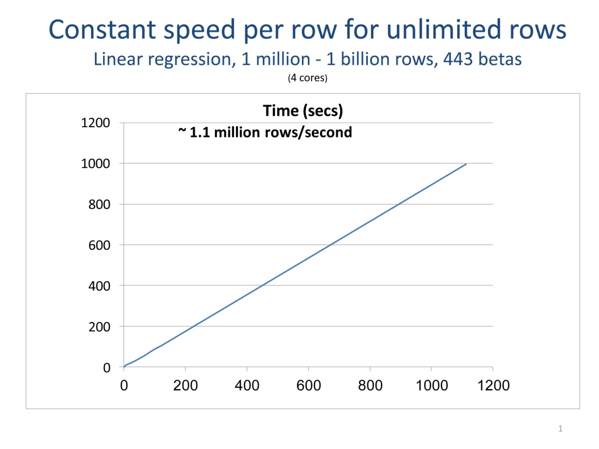

---

# required metadata
title: "Tips on Computing with Big Data in R (Machine Learning Server) | Microsoft Docs"
description: "Tips on Computing with Big Data in R on Machine Learning Server."
keywords: ""
author: "HeidiSteen"
ms.author: "heidist"
manager: "jhubbard"
ms.date: "05/18/2017"
ms.topic: "get-started-article"
ms.prod: "microsoft-r"

# optional metadata
#ROBOTS: ""
#audience: ""
#ms.devlang: ""
#ms.reviewer: ""
#ms.suite: ""
#ms.tgt_pltfrm: ""
ms.technology:
  - r-client
  - r-server
#ms.custom: ""

---

# Tips on Computing with Big Data in R

Big data is ubiquitous. The good news is that it provides great opportunities for the data analyst. With more data comes more information and more insight. You can relax assumptions required with smaller data sets and let the data speak for itself. But big data also presents problems. The size of data sets is now increasing much more rapidly than the speed of single cores, of RAM, and of hard drives. Many tools can't handle this well; when data is too large, the software stops working.

When it comes to big data, R users are faced with two issues related to scale: capacity and speed. In R, data sets typically must fit into memory, but even so, there are limits to what types of analyses can be done. In some cases, computation may be too slow to be useful.

If you are used to working with smaller data sets in R, you want to think differently about how you perform your analyses when using big data. If you are used to working in a High Performance Computing (HPC) environment, you also want to think differently when you add analysis of big data to the picture. High-Performance Computing is CPU-centric, typically focusing on using many cores to perform lots of processing on small amounts of data. High Performance Analytics (HPA) is data-centric. The focus is on feeding data to the cores—on disk I/O, data locality, efficient threading, and data management in RAM.

The **RevoScaleR** package that is included with Machine Learning Server provides tools and examples for addressing the speed and capacity issues involved in High-Performance Analytics. It provides data management and analysis functionality that scales from small, in-memory data sets to huge data sets stored on disk. The analysis functions are threaded to use multiple cores, and computations can be distributed across multiple computers (nodes) on a cluster or in the cloud.

In this article, we review some tips for handling big data with R.

## Upgrade hardware

It is always best to start with the easiest things first, and in some cases getting a better computer, or improving the one you have, can help a great deal. Usually the most important consideration is memory. If you are analyzing data that just about fits in R on your current system, getting more memory will not only let you finish your analysis, it is also likely to speed up things by a lot. This is because your operating system starts to “thrash” when it gets low on memory, removing some things from memory to let others continue to run. This can slow your system to a crawl. Getting more cores can also help, but only up to a point. R itself can generally only use one core at a time internally. In addition, for many data analysis problems the bottlenecks are disk I/O and the speed of RAM, so efficiently using more than 4 or 8 cores on commodity hardware can be difficult.

## Minimize copies of data

When working with small data sets, an extra copy is not a problem. With big data it can slow the analysis, or even bring it to a screeching halt. Be aware of the ‘automatic’ copying that occurs in R. For example, if a data frame is passed into a function, a copy is only made if the data frame is modified. But if a data frame is put into a list, a copy is automatically made. In many of the basic analysis algorithms, such as *lm* and *glm*, multiple copies of the data set are made as the computations progress, resulting in serious limitations in processing big data sets. The RevoScaleR analysis functions (for instance, *rxSummary*, *rxCube*, *rxLinMod*, *rxLogit,* *rxGlm*, *rxKmeans*) are all implemented with a focus on efficient use of memory; data is not copied unless absolutely necessary. The plot below shows an example of how reducing copies of data and tuning algorithms can dramatically increase speed and capacity.

## Process data in chunks

Processing your data a chunk at a time is the key to being able to scale your computations without increasing memory requirements. External memory (or “out-of-core”) algorithms don’t require that all of your data be in RAM at one time. Data is processed a chunk at time, with intermediate results updated for each chunk. When all of the data is processed, final results are computed. The core functions provided with **RevoScaleR** all process data in chunks. So, if the number of rows of your data set doubles, you can still perform the same data analyses—it will just take longer, typically scaling linearly with the number of rows. Your analysis is not bound by memory constraints. The plot following shows how data chunking allows unlimited rows in limited RAM.

The *biglm* package, available on CRAN, also estimates linear and generalized linear models using external memory algorithms, although they are not parallelized.

## Compute in parallel

Using more cores and more computers (nodes) is the key to scaling computations to really big data. Since data analysis algorithms tend to be I/O bound when data cannot fit into memory, the use of multiple hard drives can be even more important than the use of multiple cores.

The **RevoScaleR** analysis functions are written to automatically compute in parallel on available cores, and can also be used to automatically distribute computations across the nodes of a cluster. These functions combine the advantages of external memory algorithms (see [Process Data in Chunks](#process-data-in-chunks) preceding) with the advantages of High-Performance Computing. That is, these are Parallel External Memory Algorithm’s (PEMAs)—external memory algorithms that have been parallelized. Such algorithms process data a chunk at a time in parallel, storing intermediate results from each chunk and combining them at the end. Iterative algorithms repeat this process until convergence is determined. Any external memory algorithm that is not “inherently sequential” can be parallelized; results for one chunk of data cannot depend upon prior results. Dependence on data from a prior chunk is OK, but must be handled specially. The plot following shows an example of how using multiple computers can dramatically increase speed, in this case taking advantage of memory caching on the nodes to achieve super-linear speedups.

Microsofts’ *foreach* package, which is open source and available on CRAN, provides easy-to-use tools for executing R functions in parallel, both on a single computer and on multiple computers. This is useful for “embarrassingly parallel” types of computations such as simulations, which do not involve lots of data and do not involve communication among the parallel tasks.

## Leverage integers

In R the two choices for continuous data are *numeric*, which is an 8 byte (double) floating point number and *integer*, which is a 4-byte integer. If your data can be stored and processed as an integer, it's more efficient to do so. First, it only takes half of the memory. Second, in some cases integers can be processed much faster than doubles. For example, if you have a variable whose values are integral numbers in the range from 1 to 1000 and you want to find the median, it is much faster to count all the occurrences of the integers than it is to sort the variable. A tabulation of all the integers, in fact, can be thought of as a way to compress the data with no loss of information. The resulting tabulation can be converted into an exact empirical distribution of the data by dividing the counts by the sum of the counts, and all of the empirical quantiles including the median can be obtained from this. The R function *tabulate* can be used for this, and is very fast. The following code illustrates this:

	nd = sample(as.numeric(1:1000),size = 1e+8, replace = TRUE)
	system.time(nit <- tabulate(as.integer(nd)))
	system.time(nds <- sort(nd))

A vector of 100 million doubles is created, with randomized integral values in the range from 1 to 1,000. Sorting this vector takes about 15 times longer than converting to integers and tabulating, and 25 times longer if the conversion to integers is not included in the timing (this is relevant if you convert to integers once and then operate multiple times on the resulting vector).

Sometimes decimal numbers can be converted to integers without losing information. An example is temperature measurements of the weather, such as 32.7, which can be multiplied by 10 to convert them into integers.

**RevoScaleR** provides several tools for the fast handling of integral values. For instance, in formulas for linear and generalized linear models and other analysis functions, the “F()” function can be used to virtually convert numeric variables into factors, with the levels represented by integers. The *rxCube* function allows rapid tabulations of factors and their interactions (for example, age by state by income) for arbitrarily large data sets.

## Use efficient file formats and data types

If your data doesn’t easily fit into memory, you want to store it as a .xdf for fast access from disk. If you use appropriate data types, you can save on storage space and access time. Take advantage of integers, and store data in 32-bit floats not 64-bit doubles. A 32-bit float can represent seven decimal digits of precision, which is more than enough for most data, and it takes up half the space of doubles. (Save the 64-bit doubles for computations).

Recognize that relational databases are not always optimal for storing data for analysis. Even with the best indexing they are typically not designed to provide fast sequential reads of blocks of rows for specified columns, which is the key to fast access to data on disk. **RevoScaleR** provides an efficient .xdf file format that provides storage of a wide variety of data types, and is designed for fast sequential reads of blocks of data. There are tools for rapidly accessing data in .xdf files from R and for importing data into this format from SAS, SPSS, and text files and SQL Server, Teradata, and ODBC connections.

## Load only data you need

Even though a data set may have many thousands of variables, typically not all of them are being analyzed at one time. The .xdf file format is designed for easy access to column-based variables. By just reading from disk the actual variables and observations needed for analysis, you can speed up the analysis considerably. For example, when estimating a model, only the variables used in the model are read from the .xdf file.

## Minimize loops

It is well-known that processing data in loops in R can be very slow compared with vector operations. For example, if you compare the timings of adding two vectors, one with a loop and the other with a simple vector operation, you find the vector operation to be orders of magnitude faster:

	n <- 1000000
	x1 <- 1:n
	x2 <- 1:n
	y <- vector()
	system.time( for(i in 1:n){ y[i] <- x1[i] + x2[i] })
	system.time( y <- x1 + x2)

On a good laptop, the loop over the data was timed at about 430 seconds, while the vectorized add is barely timetable. In R the core operations on vectors are typically written in C, C++ or FORTRAN, and these compiled languages can provide much greater speed for this type of code than can the R interpreter.

## Use compiled languages

One of the best features of R is its ability to integrate easily with other languages, including C, C++, and FORTRAN. You can pass R data objects to other languages, do some computations, and return the results in R data objects. It is typically the case that only small portions of an R program can benefit from the speedups that compiled languages like C, C++, and FORTRAN can provide. Indeed, much of the code in the base and recommended packages in R is written in this way—the bulk of the code is in R but a few core pieces of functionality are written in C, C++, or FORTRAN. The type of code that benefits the most from this involves loops over data vectors. The package *Rcpp,* which is available on CRAN, provides tools that make it very easy to convert R code into C++ and to integrate C and C++ code into R. Before writing code in another language, it pays to do some research to see if the type of functionality you want is already available in R, either in the base and recommended packages or in a 3rd party package. For example, all of the core algorithms for the **RevoScaleR** package are written in optimized C++ code. It also pays to do some research to see if there is publically available code in one of these compiled languages that does what you want.

## Use batch processing

When working with small data sets, it is common to perform data transformations one at a time. For instance, one line of code might create a new variable, and the next line might multiply that variable by 10. Each of these lines of code processes all rows of the data. With a big data set that cannot fit into memory, there can be substantial overhead to making a pass through the data. With **RevoScaleR**’s *rxDataStep* function, you can specify multiple data transformations that can be performed in just one pass through the data, processing the data a chunk at a time. A little planning ahead can save a lot of time.

## Use row-oriented data transforms

When data is processed in chunks, basic data transformations for a single row of data should in general not be dependent on values in other rows of data. The key is that your transformation expression should give the same result even if only some of the rows of data are in memory at one time. Data manipulations using lags can be done but require special handling.

## Use factor variables with caution

Categorical or factor variables are extremely useful in visualizing and analyzing big data, but they need to be handled efficiently with big data because they are typically expanded when used in modeling. For example, if you use a factor variable with 100 categories as an independent variable in a linear model with *lm*, behind the scenes 100 dummy variables are created when estimating the model. The analysis modeling functions in **RevoScaleR** use special handling of categorical data to minimize the use of memory when processing them; they do not generally need to explicitly create dummy variable to represent factors.

Creating factor variables also often takes more careful handling with big data sets. This is because not all of the factor levels may be represented in a single chunk of data. For example, if you want to use the *factor* function in a data transformation used on chunks of data, you must explicitly specify the levels or you might end up with incompatible factor levels from chunk to chunk. The *rxImport* and *rxFactors* functions in **RevoScaleR** provide functionality for creating factor variables in big data sets.

## Watch for same-size inputs and outputs

Most analysis functions return a relatively small object of results that can easily be handled in memory. But occasionally, output has the same number of rows as your data, for example, when computing predictions and residuals from a model. In order for this to scale, you want the output written out to a file rather than kept in memory. For this reason, the **RevoScaleR** modeling functions such as *rxLinMod*, *rxLogit*, and *rxGlm* do not automatically compute predictions and residuals. The *rxPredict* function provides this functionality and can add predicted values to an existing .xdf file.

## Sort with caution

When working with small data sets, it is common to sort data at various stages of the analysis process. Although **RevoScaleR**’s *rxSort* function is very efficient for .xdf files and can handle data sets far too large to fit into memory, sorting is by nature a time-intensive operation, especially on big data.

One of the major reasons for sorting is to compute medians and other quantiles. As noted above in the section on taking advantage of integers, when the data consists of integral values, a tabulation of those values is generally much faster than sorting and gives exact values for all empirical quantiles. Even when the data is not integral, scaling the data and converting to integers can give very fast and accurate quantiles. As an example, if the data consists of floating point values in the range from 0 to 1,000, converting to integers and tabulating will bound the median or any other quantile to within two adjacent integers. Interpolation within those values can get you closer, as can a small number of additional iterations. If the original data falls into some other range (for example, 0 to 1), scaling to a larger range (for example, 0 to 1,000) can accomplish the same thing. The *rxQuantile* function uses this approach to rapidly compute approximate quantiles for arbitrarily large data.

Another major reason for sorting is to make it easier to compute aggregate statistics by groups. If the data are sorted by groups, then contiguous observations can be aggregated. However, it is often possible, and much faster, to make a single pass through the original data and to accumulate the desired statistics by group. The *aggregate* function can do this for data that fits into memory, and **RevoScaleR**’s *rxSummary*, *rxCube*, and *rxCrossTabs* provide extremely fast ways to do this on large data.

The **RevoScaleR** functions *rxRoc*, and *rxLorenz* are other examples of ‘big data’ alternatives to functions that traditionally rely on sorting.

In summary, by using the tips and tools outlined above you can have the best of both worlds: the ability to rapidly extract information from big data sets using R and the flexibility and power of the R language to manipulate and graph this information.
