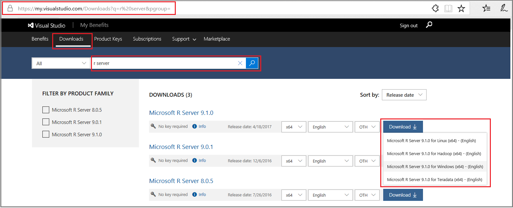

---

# required metadata
title: "What happened to Microsoft R Server - Machine Learning Server "
description: "Microsoft R Server was rebranded as Machine Learning Server in Sept. 2017."
keywords: ""
author: "j-martens"
ms.author: "jmartens"
manager: "cgronlun"
ms.date: "02/16/2018"
ms.topic: "article"
ms.prod: "mlserver"

# optional metadata
#ROBOTS: ""
#audience: ""
#ms.devlang: ""
#ms.reviewer: ""
#ms.suite: ""
#ms.tgt_pltfrm: ""
#ms.technology: ""
#ms.custom: ""

---

# Microsoft R Server is now Microsoft Machine Learning Server

In September 2017, Microsoft R Server was released under the new name of **Microsoft Machine Learning Server**. In version 9.2.1, Machine Learning Server added support for the full data science lifecycle of Python-based analytics to its list of machine learning and AI capabilities enhancements. The R capabilities were also enhanced. In the latest 9.3 version, Machine Learning Server improves operationalization and deployment of web services containing R or Python code.

Read the [What's new in this release](whats-new-in-machine-learning-server.md) to learn more.

## Building on our commitment to R

Microsoft continues its commitment and development in R -- not only in the latest Machine Learning Server release, but also in the newest [Microsoft R Client](r-client/what-is-microsoft-r-client.md) and [Microsoft R Open](https://mran.microsoft.com) releases.

## Upgrade to Machine Learning Server

Moving from R Server to Machine Learning Server is as easy as ever. The R analytics and web services you developed under R Server will continue to work under Machine Learning Server.

1. Follow [these instructions to install Machine Learning Server](install/machine-learning-server-install.md) on Windows, Linux, and Hadoop. 

1. Don't forget to [upgrade your web and compute nodes](operationalize/configure-start-for-administrators.md#configure-server-for-operationalization) if you are operationalizing your analytics.

>[!NOTE]
>Note that _Microsoft R Server 9.1 for Teradata_ was the last release and will not have a Machine Learning Server equivalent.

## Download prior R Server releases

The following table provides links for downloading older versions of Microsoft R Server. [Find the instructions for installing R Server here](install/r-server-install.md). 

Want the new Machine Learning Server? [Learn how to install Machine Learning Server here.](install/machine-learning-server-install.md)

| Site for R Server | Edition | Details |
|------|---------|---------|
| [Visual Studio Dev Essentials](https://go.microsoft.com/fwlink/?LinkId=717968&clcid=0x409) | Developer (free) | This option provides a zipped file, free when you sign up for Visual Studio Dev Essentials. Developer edition has the same features as Enterprise, except it is licensed for development scenarios. |
|[Volume Licensing Service Center (VLSC)](https://go.microsoft.com/fwlink/?LinkId=717966&clcid=0x409) | Enterprise | Sign in, search for R Server. Choose the right version for your OS. |

From [Visual Studio Dev Essentials](https://www.visualstudio.com/dev-essentials/):

1. Click **Join or access now** to sign up for download benefits.
2. Check the URL to verify it changed to *https://my.visualstudio.com/*.
3. Click **Downloads** to search for R Server.
4. Click **Downloads** for a specific version to select the platform.

## Get support for R Server

Microsoft is committed to providing customers with support. Microsoft R Server support continues in these ways: 
+ [Review our servicing support timeline](resources-servicing-support.md)

+ [Post in our user forum](https://social.technet.microsoft.com/Forums/en-US/home?forum=MicrosoftR)  

## The future of Microsoft R Client

[Microsoft R Client](r-client/what-is-microsoft-r-client.md) continues on as an R-only client for Machine Learning Server and R Server. 

A Python interpreter can also be installed locally along with the custom Python packages to gain similar functionality on a Windows machine. [Learn more](install/python-libraries-interpreter.md).
