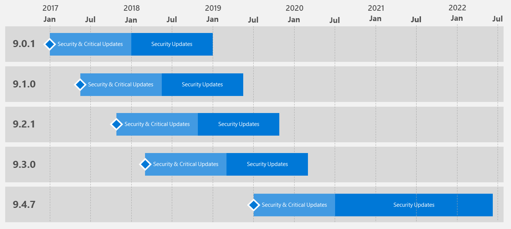

---

# required metadata
title: "Support for Microsoft R Server versions  | Microsoft Docs"
description: "A list of the operating systems supported by editions and versions of Microsoft R Server and Revolution R Enterprise."
keywords: ""
author: "j-martens"
ms.author: "jmartens"
manager: "jhubbard"
ms.date: "12/09/2016"
ms.topic: "article"
ms.prod: "microsoft-r"

# optional metadata
#ROBOTS: ""
#audience: ""
#ms.devlang: ""
#ms.reviewer: ""
#ms.suite: ""
#ms.tgt_pltfrm: ""
ms.technology: "r-server"
#ms.custom: ""

---
# Support Timeline for Microsoft R Server

Microsoft R Server will be released a few times per year with each update version supported for two (2) years from its general availability (GA) release date. Furthermore, customers will also receive critical updates for the first year from general availability (GA) of each release as shown in the diagram below. 

This support policy allows us to deliver innovation to customers at a rapid rate while providing flexibility for customers to adopt the innovation at their pace. 

 _Figure 1. Example of servicing support_

 

|Version History|Availability                       |Support End Date                  |
|:-------------------:|:---------------------------------:|:--------------------------------:|
|Microsoft R Server 8.0.0                |1/1/2016                           |1/1/2018                          |
|Microsoft R Server 8.0.5|7/1/2016|7/1/2018|
|Microsoft R Server 9.0.1|1/1/2017|1/1/2019|
|Microsoft R Server 9.1.0|5/1/2017|5/1/2019|
