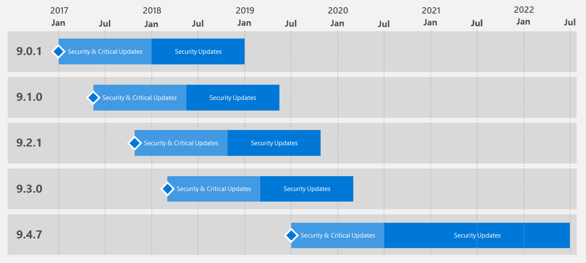

---

# required metadata
title: "Support timeline for Machine Learning Server & Microsoft R Server"
description: "A list of the operating systems supported by editions and versions of Microsoft R Server, Machine Learning Server, and Revolution R Enterprise."
keywords: ""
author: "HeidiSteen"
ms.author: "heidist"
manager: "cgronlun"
ms.date: "07/15/2019"
ms.topic: "conceptual"
ms.prod: "mlserver"

# optional metadata
#ROBOTS: ""
#audience: ""
#ms.devlang: ""
#ms.reviewer: ""
#ms.suite: ""
#ms.tgt_pltfrm: ""
#ms.technology: ""
#ms.custom: ""

---
# Support Timeline for Microsoft R Server & Machine Learning Server

Machine Learning Server ([previously called Microsoft R Server](rebranding-microsoft-r-server.md)) is supported for two (2) years from its general availability (GA) release date. Customers receive critical updates for the first year from general availability (GA) of each release as shown in the diagram.

At the end of a version’s life cycle, the software is removed from the Microsoft download sites and obsolete feature documentation is archived.

 _Figure 1. Example of servicing support_

 

|Version History|Availability                       |Support End Date                  |
|:-------------------:|:---------------------------------:|:--------------------------------:|
|Machine Learning Server 9.4.0|7/2019|7/2021|
|Machine Learning Server 9.3.0|3/1/2018|3/1/2020|
|Machine Learning Server 9.2.1|10/1/2017|10/1/2019|
|Microsoft R Server 9.1.0|5/1/2017|5/1/2019|
|Microsoft R Server 9.0.1|1/1/2017|1/1/2019|
|Microsoft R Server 8.0.5|7/1/2016|7/1/2018|
|Microsoft R Server 8.0.0                |1/1/2016                           |1/1/2018                          |

